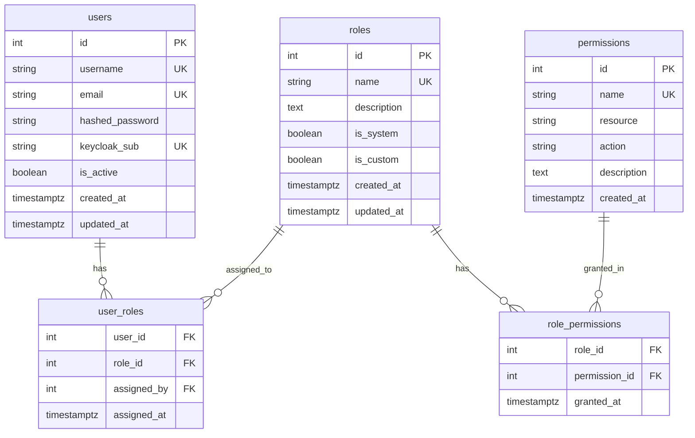
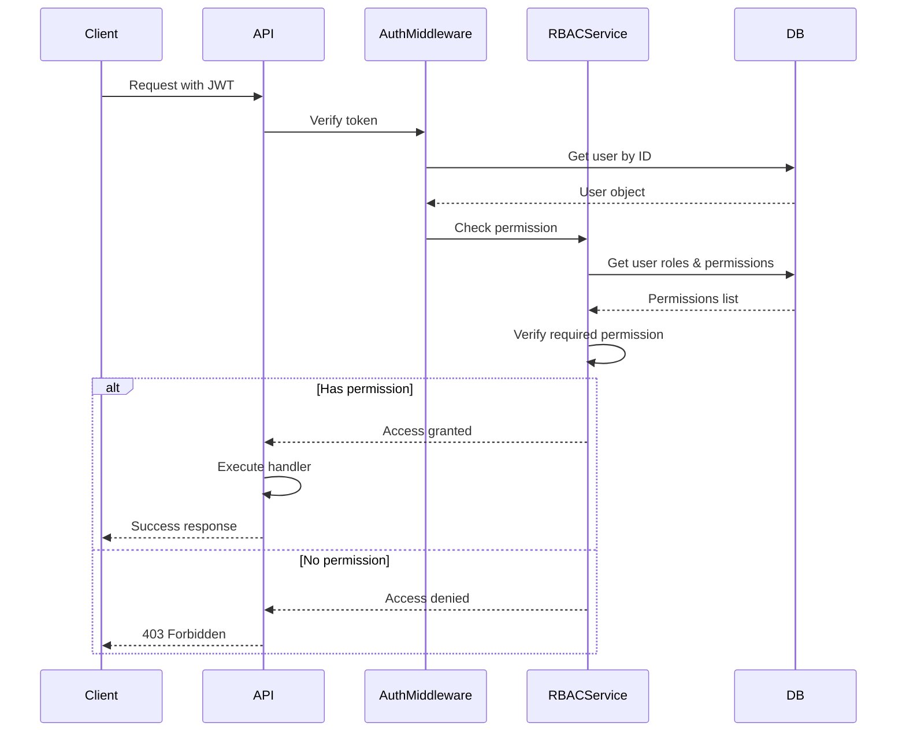

# RBAC Design

## Обзор

Система контроля доступа на основе ролей (RBAC) с поддержкой:
- Предустановленных ролей (Admin, Operator, Viewer)
- Кастомных ролей
- Глобальных permissions (не привязаны к проектам)
- Синхронизации с Keycloak

## Permissions (Глобальные права)

### Структура Permission

```typescript
interface Permission {
  id: number;
  name: string;           // уникальный идентификатор
  resource: string;       // ресурс (integrations, users, pipelines, etc.)
  action: string;         // действие (read, write, delete, execute)
  description: string;
}
```

### Список Permissions

#### User Management
- `users:read` - Просмотр пользователей
- `users:write` - Создание/редактирование пользователей
- `users:delete` - Удаление пользователей
- `roles:read` - Просмотр ролей
- `roles:write` - Создание/редактирование ролей
- `roles:delete` - Удаление ролей
- `roles:assign` - Назначение ролей пользователям

#### Integration Management (только Admin)
- `integrations:read` - Просмотр настроек интеграций
- `integrations:write` - Настройка интеграций
- `integrations:delete` - Удаление интеграций
- `integrations.gitlab:manage` - Управление GitLab интеграциями
- `integrations.harbor:manage` - Управление Harbor интеграциями
- `integrations.github:manage` - Управление GitHub интеграциями
- `integrations.docker:manage` - Управление Docker Registry
- `integrations.helm:manage` - Управление Helm Repository

#### Authentication Settings (только Admin)
- `auth:read` - Просмотр настроек аутентификации
- `auth:write` - Изменение настроек аутентификации
- `auth.oidc:configure` - Настройка OIDC/Keycloak

#### Pipeline Management
- `pipelines:read` - Просмотр пайплайнов
- `pipelines:write` - Создание/редактирование пайплайнов
- `pipelines:delete` - Удаление пайплайнов
- `pipelines:execute` - Запуск пайплайнов
- `components:read` - Просмотр GitLab Components
- `components:write` - Создание/редактирование Components

#### Build Management
- `builds:read` - Просмотр сборок
- `builds:write` - Создание/настройка сборок
- `builds:execute` - Запуск сборок
- `builds:delete` - Удаление сборок
- `images.gold:manage` - Управление Gold Images
- `images.app:manage` - Управление App Images

#### Mirroring Management
- `mirrors:read` - Просмотр зеркал
- `mirrors:write` - Создание/настройка зеркал
- `mirrors:execute` - Запуск синхронизации
- `mirrors:delete` - Удаление зеркал
- `mirrors.git:manage` - Управление Git зеркалами
- `mirrors.docker:manage` - Управление Docker зеркалами
- `mirrors.helm:manage` - Управление Helm зеркалами

#### Project Management
- `projects:read` - Просмотр проектов
- `projects:write` - Создание/редактирование проектов
- `projects:delete` - Удаление проектов

#### System
- `system:read` - Просмотр системной информации
- `system:configure` - Настройка системы
- `audit:read` - Просмотр audit логов

## Предустановленные роли

### Admin
**Описание**: Полный доступ ко всей системе

**Permissions**:
```yaml
users: [read, write, delete]
roles: [read, write, delete, assign]
integrations: [read, write, delete, manage]
auth: [read, write, configure]
pipelines: [read, write, delete, execute]
components: [read, write]
builds: [read, write, execute, delete]
images: [manage]
mirrors: [read, write, execute, delete, manage]
projects: [read, write, delete]
system: [read, configure]
audit: [read]
```

### Operator
**Описание**: Управление операционной деятельностью (пайплайны, сборки, синхронизация)

**Permissions**:
```yaml
users: [read]  # только просмотр
roles: [read]
pipelines: [read, write, delete, execute]
components: [read, write]
builds: [read, write, execute, delete]
images: [manage]
mirrors: [read, write, execute, delete, manage]
projects: [read, write]
system: [read]
```

**Ограничения**: Не может управлять интеграциями, пользователями, ролями, системными настройками.

### Viewer
**Описание**: Только чтение всех ресурсов

**Permissions**:
```yaml
users: [read]
roles: [read]
pipelines: [read]
components: [read]
builds: [read]
images: [read]
mirrors: [read]
projects: [read]
system: [read]
```

**Ограничения**: Никаких изменений, только просмотр.

## Кастомные роли

### Создание кастомной роли

Администратор может создать кастомную роль, выбрав:
1. Имя роли
2. Описание
3. Набор permissions из доступных

**Пример**: Роль "Pipeline Manager"
```yaml
name: pipeline_manager
description: Управление только CI/CD пайплайнами
permissions:
  - pipelines:read
  - pipelines:write
  - pipelines:execute
  - components:read
  - components:write
  - projects:read
```

### UI для создания роли

```typescript
interface RoleForm {
  name: string;
  description: string;
  permissions: Permission[];  // выбор из списка checkboxes
}
```

## Database Schema

### Таблица `permissions`

```sql
CREATE TABLE permissions (
    id SERIAL PRIMARY KEY,
    name VARCHAR(100) UNIQUE NOT NULL,  -- users:read
    resource VARCHAR(50) NOT NULL,      -- users
    action VARCHAR(50) NOT NULL,        -- read
    description TEXT,
    created_at TIMESTAMPTZ DEFAULT NOW()
);

CREATE INDEX idx_permissions_resource ON permissions(resource);
CREATE INDEX idx_permissions_name ON permissions(name);
```

### Таблица `roles` (расширенная)

```sql
CREATE TABLE roles (
    id SERIAL PRIMARY KEY,
    name VARCHAR(50) UNIQUE NOT NULL,
    description TEXT,
    is_system BOOLEAN DEFAULT FALSE,    -- true для Admin/Operator/Viewer
    is_custom BOOLEAN DEFAULT FALSE,    -- true для кастомных ролей
    created_at TIMESTAMPTZ DEFAULT NOW(),
    updated_at TIMESTAMPTZ DEFAULT NOW()
);

CREATE INDEX idx_roles_name ON roles(name);
```

### Таблица `role_permissions` (новая)

```sql
CREATE TABLE role_permissions (
    role_id INTEGER NOT NULL,
    permission_id INTEGER NOT NULL,
    granted_at TIMESTAMPTZ DEFAULT NOW(),
    PRIMARY KEY (role_id, permission_id),
    FOREIGN KEY (role_id) REFERENCES roles(id) ON DELETE CASCADE,
    FOREIGN KEY (permission_id) REFERENCES permissions(id) ON DELETE CASCADE
);

CREATE INDEX idx_role_permissions_role ON role_permissions(role_id);
CREATE INDEX idx_role_permissions_permission ON role_permissions(permission_id);
```

### Таблица `user_roles` (существующая)

```sql
CREATE TABLE user_roles (
    user_id INTEGER NOT NULL,
    role_id INTEGER NOT NULL,
    assigned_at TIMESTAMPTZ DEFAULT NOW(),
    assigned_by INTEGER,  -- user_id кто назначил
    PRIMARY KEY (user_id, role_id),
    FOREIGN KEY (user_id) REFERENCES users(id) ON DELETE CASCADE,
    FOREIGN KEY (role_id) REFERENCES roles(id) ON DELETE CASCADE,
    FOREIGN KEY (assigned_by) REFERENCES users(id) ON DELETE SET NULL
);
```

## ER Диаграмма



## Проверка permissions в коде

### Backend (FastAPI)

```python
from typing import Set
from fastapi import Depends, HTTPException
from app.models import User, Permission

async def require_permission(*required_perms: str):
    """Dependency для проверки permissions."""
    async def dependency(current_user: User = Depends(get_current_user)):
        user_permissions = await get_user_permissions(current_user)
        
        if not any(perm in user_permissions for perm in required_perms):
            raise HTTPException(
                status_code=403,
                detail=f"Required permissions: {required_perms}"
            )
        return current_user
    return dependency

async def get_user_permissions(user: User) -> Set[str]:
    """Получить все permissions пользователя из его ролей."""
    permissions = set()
    for user_role in user.user_roles:
        role = user_role.role
        for role_perm in role.role_permissions:
            permissions.add(role_perm.permission.name)
    return permissions

# Использование
@router.post("/integrations/gitlab")
async def create_gitlab_integration(
    data: GitLabIntegrationCreate,
    current_user: User = Depends(require_permission("integrations.gitlab:manage"))
):
    # только пользователи с правом integrations.gitlab:manage
    pass
```

### Frontend (React)

```typescript
// Hook для проверки permissions
function usePermissions() {
  const user = useSelector(selectCurrentUser);
  
  const hasPermission = (permission: string): boolean => {
    return user?.permissions?.includes(permission) ?? false;
  };
  
  const hasAnyPermission = (permissions: string[]): boolean => {
    return permissions.some(p => hasPermission(p));
  };
  
  return { hasPermission, hasAnyPermission };
}

// Компонент с проверкой
function IntegrationsSettings() {
  const { hasPermission } = usePermissions();
  
  if (!hasPermission('integrations:read')) {
    return <AccessDenied />;
  }
  
  return (
    <div>
      <h1>Integrations</h1>
      {hasPermission('integrations:write') && (
        <Button>Add Integration</Button>
      )}
    </div>
  );
}
```

## Синхронизация с Keycloak

### Маппинг ролей Keycloak → BigBug

При OIDC логине:
1. Получаем роли из токена Keycloak (`realm_access.roles`)
2. Маппим на внутренние роли BigBug
3. Синхронизируем пользователя и его роли

```python
# Маппинг конфигурация
KEYCLOAK_ROLE_MAPPING = {
    "bigbug-admin": "admin",
    "bigbug-operator": "operator",
    "bigbug-viewer": "viewer",
}

async def sync_user_from_oidc(oidc_user_info: dict, db: AsyncSession):
    keycloak_roles = oidc_user_info.get("realm_access", {}).get("roles", [])
    
    # Маппим роли
    bigbug_roles = []
    for kc_role in keycloak_roles:
        if kc_role in KEYCLOAK_ROLE_MAPPING:
            role_name = KEYCLOAK_ROLE_MAPPING[kc_role]
            role = await get_role_by_name(db, role_name)
            if role:
                bigbug_roles.append(role)
    
    # Обновляем пользователя
    user = await get_or_create_user_from_oidc(db, oidc_user_info)
    await update_user_roles(db, user, bigbug_roles)
```

## Миграция данных

### Шаг 1: Создать таблицу permissions

```sql
-- Вставить все permissions
INSERT INTO permissions (name, resource, action, description) VALUES
('users:read', 'users', 'read', 'View users'),
('users:write', 'users', 'write', 'Create/edit users'),
-- ... все остальные
```

### Шаг 2: Создать role_permissions для существующих ролей

```sql
-- Admin получает все permissions
INSERT INTO role_permissions (role_id, permission_id)
SELECT r.id, p.id
FROM roles r
CROSS JOIN permissions p
WHERE r.name = 'admin';

-- Operator получает операционные permissions
INSERT INTO role_permissions (role_id, permission_id)
SELECT r.id, p.id
FROM roles r
JOIN permissions p ON p.name IN (
    'pipelines:read', 'pipelines:write', 'pipelines:execute',
    'builds:read', 'builds:write', 'builds:execute',
    -- ...
)
WHERE r.name = 'operator';
```

### Шаг 3: Пометить системные роли

```sql
UPDATE roles SET is_system = TRUE WHERE name IN ('admin', 'operator', 'viewer');
```

## Best Practices

1. **Principle of Least Privilege**: Давать минимально необходимые права
2. **Audit Logging**: Логировать все изменения ролей и permissions
3. **Permission Caching**: Кешировать permissions пользователя в Redis
4. **Graceful Degradation**: При ошибке проверки прав - запретить доступ
5. **Regular Review**: Регулярный аудит назначенных ролей

## Тестирование RBAC

```python
# pytest примеры
async def test_admin_can_manage_integrations(admin_client):
    response = await admin_client.post("/api/v1/admin/integrations/gitlab", json={...})
    assert response.status_code == 201

async def test_operator_cannot_manage_integrations(operator_client):
    response = await operator_client.post("/api/v1/admin/integrations/gitlab", json={...})
    assert response.status_code == 403

async def test_viewer_can_only_read(viewer_client):
    response = await viewer_client.get("/api/v1/pipelines")
    assert response.status_code == 200
    
    response = await viewer_client.post("/api/v1/pipelines", json={...})
    assert response.status_code == 403
```

## Диаграмма проверки доступа


