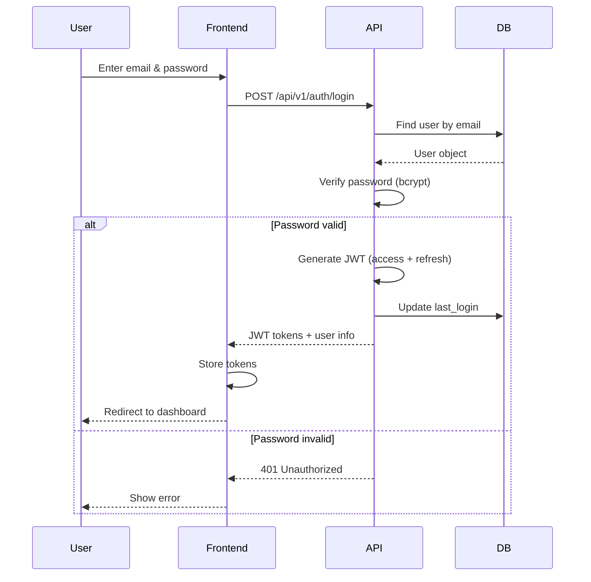
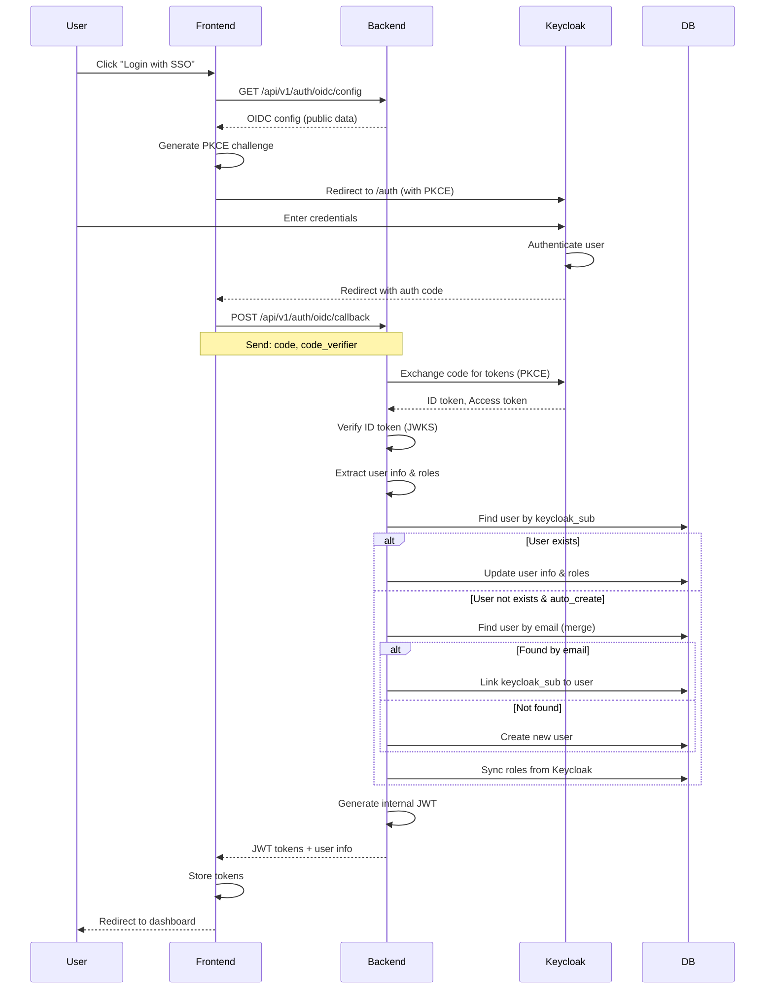
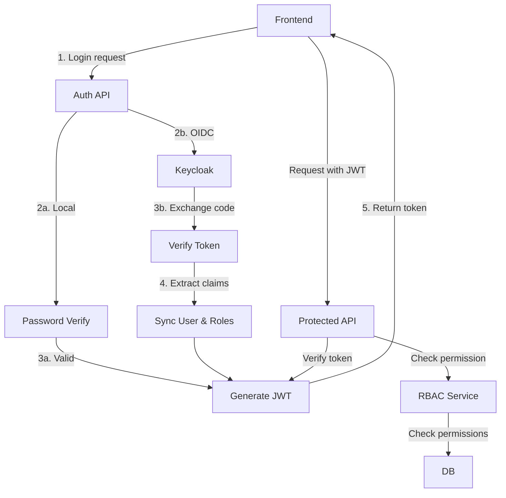

# Authentication Architecture

## Обзор

Двухуровневая система аутентификации:
1. **Локальная аутентификация** (email/password) - по умолчанию
2. **OIDC/Keycloak** - опциональная интеграция через настройки

## Принципы

- **SSO отключено по умолчанию**: система работает с локальной аутентификацией
- **Базовый admin при инициализации**: создаётся автоматически при первом запуске
- **Настройка через UI**: OIDC настраивается в админ-панели
- **Слияние пользователей**: локальные пользователи сливаются с Keycloak по email
- **JWT токены**: единый механизм для обоих типов аутентификации

## Локальная аутентификация

### Инициализация системы

При первом запуске (если таблица `users` пуста):

```python
async def initialize_system(db: AsyncSession):
    """Создать базового admin пользователя и роли."""
    
    # Создать роли
    admin_role = Role(name="admin", description="Administrator", is_system=True)
    operator_role = Role(name="operator", description="Operator", is_system=True)
    viewer_role = Role(name="viewer", description="Viewer", is_system=True)
    db.add_all([admin_role, operator_role, viewer_role])
    await db.flush()
    
    # Создать permissions и role_permissions
    await create_default_permissions(db)
    await assign_permissions_to_roles(db)
    
    # Создать admin пользователя
    admin_user = User(
        username="admin",
        email=settings.initial_admin_email or "admin@bigbug.local",
        hashed_password=hash_password(settings.initial_admin_password or "admin"),
        is_active=True
    )
    db.add(admin_user)
    await db.flush()
    
    # Назначить admin роль
    user_role = UserRole(user_id=admin_user.id, role_id=admin_role.id)
    db.add(user_role)
    
    await db.commit()
    logger.info(f"System initialized with admin user: {admin_user.email}")
```

### Настройки в .env

```bash
# Начальный admin пользователь
INITIAL_ADMIN_EMAIL=admin@example.com
INITIAL_ADMIN_PASSWORD=change-me-on-first-login

# JWT настройки
SECRET_KEY=your-secret-key-here
ALGORITHM=HS256
ACCESS_TOKEN_EXPIRE_MINUTES=60
REFRESH_TOKEN_EXPIRE_DAYS=7
```

### Login Flow (локальная)



### API Endpoints (локальная)

```python
# POST /api/v1/auth/login
{
  "email": "user@example.com",
  "password": "password123"
}
# Response:
{
  "access_token": "eyJ...",
  "refresh_token": "eyJ...",
  "token_type": "bearer",
  "user": {
    "id": 1,
    "username": "user",
    "email": "user@example.com",
    "roles": ["operator"],
    "permissions": ["pipelines:read", "pipelines:write", ...]
  }
}

# POST /api/v1/auth/refresh
{
  "refresh_token": "eyJ..."
}
# Response:
{
  "access_token": "eyJ...",
  "token_type": "bearer"
}

# POST /api/v1/auth/logout
# Headers: Authorization: Bearer <access_token>
# Response: 204 No Content

# GET /api/v1/auth/me
# Headers: Authorization: Bearer <access_token>
# Response: User object with roles and permissions
```

### Password Management

```python
# POST /api/v1/auth/change-password
# Headers: Authorization: Bearer <access_token>
{
  "current_password": "old123",
  "new_password": "new456"
}

# POST /api/v1/auth/reset-password-request (опционально)
{
  "email": "user@example.com"
}
# Отправка email с токеном сброса

# POST /api/v1/auth/reset-password (опционально)
{
  "token": "reset-token",
  "new_password": "new123"
}
```

## OIDC/Keycloak интеграция

### Настройка через UI (Admin only)

#### Таблица `oidc_config`

```sql
CREATE TABLE oidc_config (
    id SERIAL PRIMARY KEY,
    is_enabled BOOLEAN DEFAULT FALSE,
    provider_name VARCHAR(100) DEFAULT 'Keycloak',
    
    -- URLs
    issuer_url VARCHAR(500) NOT NULL,           -- https://keycloak.example.com/realms/bigbug
    authorization_url VARCHAR(500) NOT NULL,     -- /protocol/openid-connect/auth
    token_url VARCHAR(500) NOT NULL,            -- /protocol/openid-connect/token
    userinfo_url VARCHAR(500) NOT NULL,         -- /protocol/openid-connect/userinfo
    jwks_url VARCHAR(500) NOT NULL,             -- /protocol/openid-connect/certs
    end_session_url VARCHAR(500),               -- /protocol/openid-connect/logout
    
    -- Client credentials
    client_id VARCHAR(255) NOT NULL,
    client_secret_encrypted TEXT NOT NULL,       -- зашифрованный Fernet
    
    -- Frontend client (public, для Authorization Code + PKCE)
    frontend_client_id VARCHAR(255) NOT NULL,
    
    -- Public URL для браузера (может отличаться от issuer_url)
    public_issuer_url VARCHAR(500),
    
    -- Settings
    scope VARCHAR(255) DEFAULT 'openid profile email',
    role_claim_path VARCHAR(255) DEFAULT 'realm_access.roles',
    
    -- Role mapping (JSON)
    role_mapping JSONB DEFAULT '{}',  -- {"keycloak-role": "bigbug-role"}
    
    -- Sync settings
    auto_create_users BOOLEAN DEFAULT TRUE,
    auto_sync_roles BOOLEAN DEFAULT TRUE,
    merge_by_email BOOLEAN DEFAULT TRUE,
    
    created_at TIMESTAMPTZ DEFAULT NOW(),
    updated_at TIMESTAMPTZ DEFAULT NOW()
);
```

#### UI форма настройки

```typescript
interface OidcConfigForm {
  isEnabled: boolean;
  
  // Keycloak URLs
  issuerUrl: string;              // https://keycloak.example.com/realms/bigbug
  publicIssuerUrl?: string;       // для Docker: http://localhost:8180/realms/bigbug
  
  // Client credentials
  clientId: string;               // bigbug-backend (confidential)
  clientSecret: string;
  frontendClientId: string;       // bigbug-frontend (public)
  
  // Role mapping
  roleMapping: Record<string, string>;  // {"bigbug-admin": "admin"}
  
  // Sync settings
  autoCreateUsers: boolean;
  autoSyncRoles: boolean;
  mergeByEmail: boolean;
}
```

### OIDC Login Flow



### API Endpoints (OIDC)

```python
# GET /api/v1/auth/oidc/config (public)
# Response:
{
  "enabled": true,
  "issuer_url": "https://keycloak.example.com/realms/bigbug",
  "authorization_url": "https://keycloak.example.com/realms/bigbug/protocol/openid-connect/auth",
  "client_id": "bigbug-frontend",
  "scope": "openid profile email"
}

# POST /api/v1/auth/oidc/callback
{
  "code": "auth-code-from-keycloak",
  "code_verifier": "pkce-verifier"
}
# Response: Same as local login (JWT + user)

# Admin endpoints
# GET /api/v1/admin/auth/oidc/config
# Requires: auth:read permission
# Response: Full OIDC config (with sensitive data masked)

# PUT /api/v1/admin/auth/oidc/config
# Requires: auth:write permission
{
  "is_enabled": true,
  "issuer_url": "https://keycloak.example.com/realms/bigbug",
  "client_id": "bigbug-backend",
  "client_secret": "secret",
  "frontend_client_id": "bigbug-frontend",
  "role_mapping": {
    "bigbug-admin": "admin",
    "bigbug-operator": "operator"
  },
  "auto_create_users": true,
  "auto_sync_roles": true,
  "merge_by_email": true
}

# POST /api/v1/admin/auth/oidc/test
# Тест подключения к Keycloak
# Response: { "status": "ok" } или ошибка
```

### User Merging Strategy

При OIDC логине, если `merge_by_email=true`:

```python
async def get_or_create_oidc_user(
    oidc_user_info: dict,
    config: OidcConfig,
    db: AsyncSession
) -> User:
    """Получить или создать пользователя из OIDC."""
    
    keycloak_sub = oidc_user_info["sub"]
    email = oidc_user_info["email"]
    
    # 1. Поиск по keycloak_sub
    user = await db.execute(
        select(User).where(User.keycloak_sub == keycloak_sub)
    )
    user = user.scalar_one_or_none()
    
    if user:
        # Обновить информацию
        user.email = email
        user.username = oidc_user_info.get("preferred_username", email)
        user.is_active = True
        return user
    
    # 2. Поиск по email (merge)
    if config.merge_by_email:
        user = await db.execute(
            select(User).where(User.email == email)
        )
        user = user.scalar_one_or_none()
        
        if user:
            # Привязать Keycloak
            user.keycloak_sub = keycloak_sub
            user.hashed_password = None  # убрать локальный пароль
            logger.info(f"Merged local user {user.email} with Keycloak")
            return user
    
    # 3. Создать нового пользователя
    if not config.auto_create_users:
        raise UnauthorizedError("Auto user creation is disabled")
    
    user = User(
        username=oidc_user_info.get("preferred_username", email),
        email=email,
        keycloak_sub=keycloak_sub,
        hashed_password=None,
        is_active=True
    )
    db.add(user)
    await db.flush()
    
    logger.info(f"Created new user from OIDC: {user.email}")
    return user
```

### Role Synchronization

```python
async def sync_user_roles_from_oidc(
    user: User,
    oidc_user_info: dict,
    config: OidcConfig,
    db: AsyncSession
):
    """Синхронизировать роли пользователя из Keycloak."""
    
    if not config.auto_sync_roles:
        return
    
    # Извлечь роли из токена
    role_claim_path = config.role_claim_path  # "realm_access.roles"
    keycloak_roles = extract_claim(oidc_user_info, role_claim_path)
    
    # Маппинг ролей
    role_mapping = config.role_mapping or {}
    bigbug_role_names = []
    
    for kc_role in keycloak_roles:
        if kc_role in role_mapping:
            bigbug_role_names.append(role_mapping[kc_role])
    
    # Получить роли из БД
    result = await db.execute(
        select(Role).where(Role.name.in_(bigbug_role_names))
    )
    roles = result.scalars().all()
    
    # Удалить старые связи
    await db.execute(
        delete(UserRole).where(UserRole.user_id == user.id)
    )
    
    # Создать новые
    for role in roles:
        user_role = UserRole(user_id=user.id, role_id=role.id)
        db.add(user_role)
    
    await db.flush()
    logger.info(f"Synced roles for user {user.email}: {bigbug_role_names}")
```

## JWT Token Structure

```json
{
  "sub": "123",              // user.id
  "email": "user@example.com",
  "username": "user",
  "roles": ["operator"],
  "permissions": ["pipelines:read", "pipelines:write"],
  "auth_type": "local",      // or "oidc"
  "exp": 1234567890,
  "iat": 1234567890,
  "iss": "bigbug",
  "aud": "bigbug-api"
}
```

## Безопасность

### Password Hashing

```python
from passlib.context import CryptContext

pwd_context = CryptContext(schemes=["bcrypt"], deprecated="auto")

def hash_password(password: str) -> str:
    return pwd_context.hash(password)

def verify_password(plain: str, hashed: str) -> bool:
    return pwd_context.verify(plain, hashed)
```

### JWT Signing & Verification

```python
from jose import jwt, JWTError

def create_access_token(user: User) -> str:
    permissions = get_user_permissions(user)
    
    payload = {
        "sub": str(user.id),
        "email": user.email,
        "username": user.username,
        "roles": [r.name for r in user.roles],
        "permissions": list(permissions),
        "auth_type": "oidc" if user.keycloak_sub else "local",
        "exp": datetime.utcnow() + timedelta(minutes=settings.access_token_expire_minutes),
        "iat": datetime.utcnow(),
        "iss": "bigbug",
        "aud": "bigbug-api"
    }
    
    return jwt.encode(payload, settings.secret_key, algorithm=settings.algorithm)

def decode_token(token: str) -> dict:
    try:
        return jwt.decode(
            token,
            settings.secret_key,
            algorithms=[settings.algorithm],
            audience="bigbug-api",
            issuer="bigbug"
        )
    except JWTError as e:
        raise UnauthorizedError(f"Invalid token: {e}")
```

### OIDC Token Verification

```python
from authlib.jose import JsonWebKey, jwt as authlib_jwt
from authlib.jose.errors import JoseError

async def verify_oidc_token(id_token: str, config: OidcConfig) -> dict:
    """Проверить ID токен от Keycloak."""
    
    # Получить JWKS (кешировать!)
    jwks = await fetch_jwks(config.jwks_url)
    key_set = JsonWebKey.import_key_set(jwks)
    
    try:
        claims = authlib_jwt.decode(
            id_token,
            key_set,
            claims_options={
                "iss": {"value": config.issuer_url},
                "aud": {"value": config.client_id}
            }
        )
        claims.validate()
        return dict(claims)
    except JoseError as e:
        raise UnauthorizedError(f"Invalid OIDC token: {e}")
```

### Client Secret Encryption

```python
from cryptography.fernet import Fernet

def encrypt_client_secret(secret: str) -> str:
    f = Fernet(settings.encryption_key.encode())
    return f.encrypt(secret.encode()).decode()

def decrypt_client_secret(encrypted: str) -> str:
    f = Fernet(settings.encryption_key.encode())
    return f.decrypt(encrypted.encode()).decode()
```

## Frontend Integration

### Auth Context (React)

```typescript
interface AuthContextType {
  user: User | null;
  login: (email: string, password: string) => Promise<void>;
  loginWithOidc: () => Promise<void>;
  logout: () => Promise<void>;
  refreshToken: () => Promise<void>;
  isAuthenticated: boolean;
  isLoading: boolean;
}

const AuthContext = createContext<AuthContextType>(null!);

export function AuthProvider({ children }: { children: React.ReactNode }) {
  const [user, setUser] = useState<User | null>(null);
  const [isLoading, setIsLoading] = useState(true);
  
  // Проверка токена при загрузке
  useEffect(() => {
    const token = localStorage.getItem('access_token');
    if (token) {
      verifyAndSetUser(token);
    } else {
      setIsLoading(false);
    }
  }, []);
  
  const login = async (email: string, password: string) => {
    const response = await api.post('/auth/login', { email, password });
    localStorage.setItem('access_token', response.data.access_token);
    localStorage.setItem('refresh_token', response.data.refresh_token);
    setUser(response.data.user);
  };
  
  const loginWithOidc = async () => {
    // Redirect to OIDC flow
    const config = await api.get('/auth/oidc/config');
    window.location.href = buildOidcAuthUrl(config.data);
  };
  
  // ...
}
```

## Migration Path

### Существующие пользователи с Keycloak

Если система уже работает с Keycloak:

1. **Создать `oidc_config`** с текущими настройками
2. **Пометить `is_enabled=true`**
3. **Миграция `keycloak_sub`** - уже есть в таблице `users`
4. **Role mapping** - настроить маппинг существующих ролей

### Новые установки

1. **Инициализация** - создать admin пользователя
2. **Локальная работа** - использовать до настройки OIDC
3. **Настройка OIDC** - admin включает в UI при необходимости
4. **Слияние** - admin пользователь может слиться с Keycloak admin

## Тестирование

```python
# Тесты локальной аутентификации
async def test_login_success(client, test_user):
    response = await client.post("/api/v1/auth/login", json={
        "email": test_user.email,
        "password": "password123"
    })
    assert response.status_code == 200
    assert "access_token" in response.json()

async def test_login_wrong_password(client, test_user):
    response = await client.post("/api/v1/auth/login", json={
        "email": test_user.email,
        "password": "wrong"
    })
    assert response.status_code == 401

# Тесты OIDC
async def test_oidc_callback_creates_user(client, mock_keycloak):
    response = await client.post("/api/v1/auth/oidc/callback", json={
        "code": "test-code",
        "code_verifier": "verifier"
    })
    assert response.status_code == 200
    
    user = await get_user_by_email("oidc@example.com")
    assert user is not None
    assert user.keycloak_sub == "keycloak-sub-123"
```

## Диаграмма компонентов


