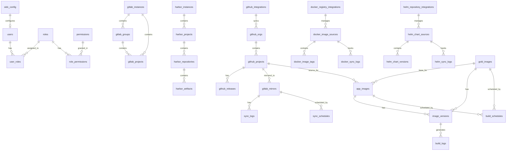

# Database Schema

## Обзор

Полная схема базы данных BigBug с учётом всех новых требований.

## ER Диаграмма (полная)



## Таблицы

### Auth & RBAC

#### users
```sql
CREATE TABLE users (
    id SERIAL PRIMARY KEY,
    username VARCHAR(150) UNIQUE NOT NULL,
    email VARCHAR(255) UNIQUE NOT NULL,
    hashed_password VARCHAR(255),              -- nullable для SSO-only
    keycloak_sub VARCHAR(255) UNIQUE,
    is_active BOOLEAN DEFAULT TRUE NOT NULL,
    last_login TIMESTAMPTZ,
    created_at TIMESTAMPTZ DEFAULT NOW(),
    updated_at TIMESTAMPTZ DEFAULT NOW()
);

CREATE INDEX idx_users_username ON users(username);
CREATE INDEX idx_users_email ON users(email);
CREATE INDEX idx_users_keycloak_sub ON users(keycloak_sub);
```

#### roles
```sql
CREATE TABLE roles (
    id SERIAL PRIMARY KEY,
    name VARCHAR(50) UNIQUE NOT NULL,
    description TEXT,
    is_system BOOLEAN DEFAULT FALSE,       -- admin/operator/viewer
    is_custom BOOLEAN DEFAULT FALSE,
    created_at TIMESTAMPTZ DEFAULT NOW(),
    updated_at TIMESTAMPTZ DEFAULT NOW()
);

CREATE INDEX idx_roles_name ON roles(name);
```

#### permissions
```sql
CREATE TABLE permissions (
    id SERIAL PRIMARY KEY,
    name VARCHAR(100) UNIQUE NOT NULL,     -- "users:read"
    resource VARCHAR(50) NOT NULL,         -- "users"
    action VARCHAR(50) NOT NULL,           -- "read"
    description TEXT,
    created_at TIMESTAMPTZ DEFAULT NOW()
);

CREATE INDEX idx_permissions_name ON permissions(name);
CREATE INDEX idx_permissions_resource ON permissions(resource);
```

#### role_permissions
```sql
CREATE TABLE role_permissions (
    role_id INTEGER NOT NULL REFERENCES roles(id) ON DELETE CASCADE,
    permission_id INTEGER NOT NULL REFERENCES permissions(id) ON DELETE CASCADE,
    granted_at TIMESTAMPTZ DEFAULT NOW(),
    PRIMARY KEY (role_id, permission_id)
);

CREATE INDEX idx_role_permissions_role ON role_permissions(role_id);
CREATE INDEX idx_role_permissions_permission ON role_permissions(permission_id);
```

#### user_roles
```sql
CREATE TABLE user_roles (
    user_id INTEGER NOT NULL REFERENCES users(id) ON DELETE CASCADE,
    role_id INTEGER NOT NULL REFERENCES roles(id) ON DELETE CASCADE,
    assigned_at TIMESTAMPTZ DEFAULT NOW(),
    assigned_by INTEGER REFERENCES users(id) ON DELETE SET NULL,
    PRIMARY KEY (user_id, role_id)
);

CREATE INDEX idx_user_roles_user ON user_roles(user_id);
CREATE INDEX idx_user_roles_role ON user_roles(role_id);
```

### OIDC Configuration

#### oidc_config
```sql
CREATE TABLE oidc_config (
    id SERIAL PRIMARY KEY,
    is_enabled BOOLEAN DEFAULT FALSE,
    provider_name VARCHAR(100) DEFAULT 'Keycloak',
    
    -- URLs
    issuer_url VARCHAR(500) NOT NULL,
    authorization_url VARCHAR(500) NOT NULL,
    token_url VARCHAR(500) NOT NULL,
    userinfo_url VARCHAR(500) NOT NULL,
    jwks_url VARCHAR(500) NOT NULL,
    end_session_url VARCHAR(500),
    
    -- Client
    client_id VARCHAR(255) NOT NULL,
    client_secret_encrypted TEXT NOT NULL,
    frontend_client_id VARCHAR(255) NOT NULL,
    public_issuer_url VARCHAR(500),
    
    -- Settings
    scope VARCHAR(255) DEFAULT 'openid profile email',
    role_claim_path VARCHAR(255) DEFAULT 'realm_access.roles',
    role_mapping JSONB DEFAULT '{}',
    
    -- Sync
    auto_create_users BOOLEAN DEFAULT TRUE,
    auto_sync_roles BOOLEAN DEFAULT TRUE,
    merge_by_email BOOLEAN DEFAULT TRUE,
    
    created_at TIMESTAMPTZ DEFAULT NOW(),
    updated_at TIMESTAMPTZ DEFAULT NOW()
);
```

### GitLab Integration

#### gitlab_instances
```sql
CREATE TABLE gitlab_instances (
    id SERIAL PRIMARY KEY,
    name VARCHAR(100) NOT NULL,
    url VARCHAR(500) NOT NULL,
    token_encrypted TEXT NOT NULL,
    token_type VARCHAR(50) DEFAULT 'personal_access_token',
    version VARCHAR(50),
    is_active BOOLEAN DEFAULT TRUE,
    is_default BOOLEAN DEFAULT FALSE,
    webhook_secret_encrypted TEXT,
    last_health_check TIMESTAMPTZ,
    health_status VARCHAR(50),
    created_at TIMESTAMPTZ DEFAULT NOW(),
    updated_at TIMESTAMPTZ DEFAULT NOW()
);

CREATE UNIQUE INDEX idx_gitlab_instances_default 
    ON gitlab_instances(is_default) WHERE is_default = TRUE;
```

#### gitlab_groups
```sql
CREATE TABLE gitlab_groups (
    id SERIAL PRIMARY KEY,
    instance_id INTEGER NOT NULL REFERENCES gitlab_instances(id) ON DELETE CASCADE,
    gitlab_id INTEGER NOT NULL,
    name VARCHAR(255) NOT NULL,
    full_path VARCHAR(500) NOT NULL,
    description TEXT,
    visibility VARCHAR(50),
    parent_id INTEGER,
    last_synced_at TIMESTAMPTZ,
    created_at TIMESTAMPTZ DEFAULT NOW(),
    updated_at TIMESTAMPTZ DEFAULT NOW(),
    UNIQUE(instance_id, gitlab_id)
);
```

#### gitlab_projects
```sql
CREATE TABLE gitlab_projects (
    id SERIAL PRIMARY KEY,
    instance_id INTEGER NOT NULL REFERENCES gitlab_instances(id) ON DELETE CASCADE,
    group_id INTEGER REFERENCES gitlab_groups(id) ON DELETE SET NULL,
    gitlab_id INTEGER NOT NULL,
    name VARCHAR(255) NOT NULL,
    full_path VARCHAR(500) NOT NULL,
    description TEXT,
    web_url VARCHAR(500),
    default_branch VARCHAR(255) DEFAULT 'main',
    visibility VARCHAR(50),
    project_type VARCHAR(50),  -- mirror, pipeline, component, build
    last_synced_at TIMESTAMPTZ,
    created_at TIMESTAMPTZ DEFAULT NOW(),
    updated_at TIMESTAMPTZ DEFAULT NOW(),
    UNIQUE(instance_id, gitlab_id)
);
```

### Harbor Integration

#### harbor_instances
```sql
CREATE TABLE harbor_instances (
    id SERIAL PRIMARY KEY,
    name VARCHAR(100) NOT NULL,
    url VARCHAR(500) NOT NULL,
    auth_type VARCHAR(50) DEFAULT 'robot',
    username VARCHAR(255),
    password_encrypted TEXT,
    robot_token_encrypted TEXT,
    version VARCHAR(50),
    is_active BOOLEAN DEFAULT TRUE,
    is_default BOOLEAN DEFAULT FALSE,
    webhook_secret_encrypted TEXT,
    last_health_check TIMESTAMPTZ,
    health_status VARCHAR(50),
    created_at TIMESTAMPTZ DEFAULT NOW(),
    updated_at TIMESTAMPTZ DEFAULT NOW()
);
```

#### harbor_projects, harbor_repositories, harbor_artifacts
См. [04-integrations/harbor.md](./04-integrations/harbor.md)

### GitHub Integration

#### github_integrations
```sql
CREATE TABLE github_integrations (
    id SERIAL PRIMARY KEY,
    name VARCHAR(100) NOT NULL,
    token_encrypted TEXT NOT NULL,
    is_active BOOLEAN DEFAULT TRUE,
    is_default BOOLEAN DEFAULT FALSE,
    webhook_secret_encrypted TEXT,
    last_health_check TIMESTAMPTZ,
    health_status VARCHAR(50),
    rate_limit_remaining INTEGER,
    rate_limit_reset TIMESTAMPTZ,
    created_at TIMESTAMPTZ DEFAULT NOW(),
    updated_at TIMESTAMPTZ DEFAULT NOW()
);
```

#### github_orgs, github_projects, github_releases
Существующие таблицы + добавить `integration_id`:
```sql
ALTER TABLE github_orgs ADD COLUMN integration_id INTEGER 
    REFERENCES github_integrations(id) ON DELETE CASCADE;
ALTER TABLE github_projects ADD COLUMN integration_id INTEGER;
```

### Docker Registry Integration

#### docker_registry_integrations
```sql
CREATE TABLE docker_registry_integrations (
    id SERIAL PRIMARY KEY,
    name VARCHAR(100) NOT NULL,
    registry_url VARCHAR(500) NOT NULL,
    auth_type VARCHAR(50) DEFAULT 'basic',
    username VARCHAR(255),
    password_encrypted TEXT,
    token_encrypted TEXT,
    auth_server_url VARCHAR(500),
    registry_type VARCHAR(50),  -- dockerhub, gcr, ecr, acr, generic
    is_active BOOLEAN DEFAULT TRUE,
    is_default BOOLEAN DEFAULT FALSE,
    last_health_check TIMESTAMPTZ,
    health_status VARCHAR(50),
    created_at TIMESTAMPTZ DEFAULT NOW(),
    updated_at TIMESTAMPTZ DEFAULT NOW()
);
```

Существующие таблицы: `docker_image_sources`, `docker_image_tags`, `docker_sync_logs`

### Helm Repository Integration

#### helm_repository_integrations
```sql
CREATE TABLE helm_repository_integrations (
    id SERIAL PRIMARY KEY,
    name VARCHAR(100) NOT NULL,
    repo_url VARCHAR(500) NOT NULL,
    auth_type VARCHAR(50) DEFAULT 'anonymous',
    username VARCHAR(255),
    password_encrypted TEXT,
    token_encrypted TEXT,
    repo_type VARCHAR(50) DEFAULT 'helm',
    has_api BOOLEAN DEFAULT FALSE,
    api_url VARCHAR(500),
    is_active BOOLEAN DEFAULT TRUE,
    is_default BOOLEAN DEFAULT FALSE,
    last_health_check TIMESTAMPTZ,
    health_status VARCHAR(50),
    created_at TIMESTAMPTZ DEFAULT NOW(),
    updated_at TIMESTAMPTZ DEFAULT NOW()
);
```

Существующие таблицы: `helm_chart_sources`, `helm_chart_versions`, `helm_sync_logs`

## Migration Strategy

### Phase 1: RBAC & Auth
1. Создать `permissions` таблицу
2. Создать `role_permissions` таблицу
3. Расширить `roles` (is_system, is_custom)
4. Создать `oidc_config` таблицу
5. Заполнить начальные permissions и role_permissions

### Phase 2: Integration Tables
1. Создать таблицы для всех интеграций
2. Добавить `integration_id` к существующим таблицам
3. Мигрировать существующие данные

### Phase 3: Data Migration
1. Создать default интеграции из текущих настроек
2. Связать существующие записи с интеграциями
3. Обновить foreign keys

## Индексы и Performance

### Стратегия индексирования
- Primary keys на всех таблицах
- Foreign keys indexes
- Уникальные индексы на business keys
- Индексы на поля для фильтрации/поиска
- Partial indexes где нужно (is_default=true)

### Connection Pooling
```python
# SQLAlchemy asyncpg pool
engine = create_async_engine(
    DATABASE_URL,
    pool_size=20,
    max_overflow=10,
    pool_pre_ping=True,
    pool_recycle=3600
)
```

## Backup Strategy

- Daily full backups
- Point-in-time recovery (WAL архивирование)
- Тестирование восстановления
- Encrypted backups

## Constraints

### Важные constraints
1. Один default инстанс на тип интеграции
2. Уникальные комбинации (instance_id + external_id)
3. CASCADE deletes для зависимых данных
4. SET NULL для опциональных связей
