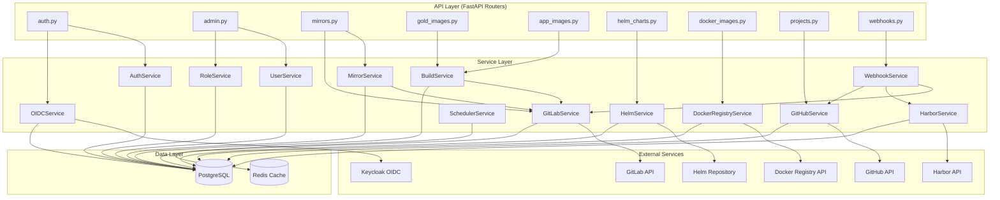
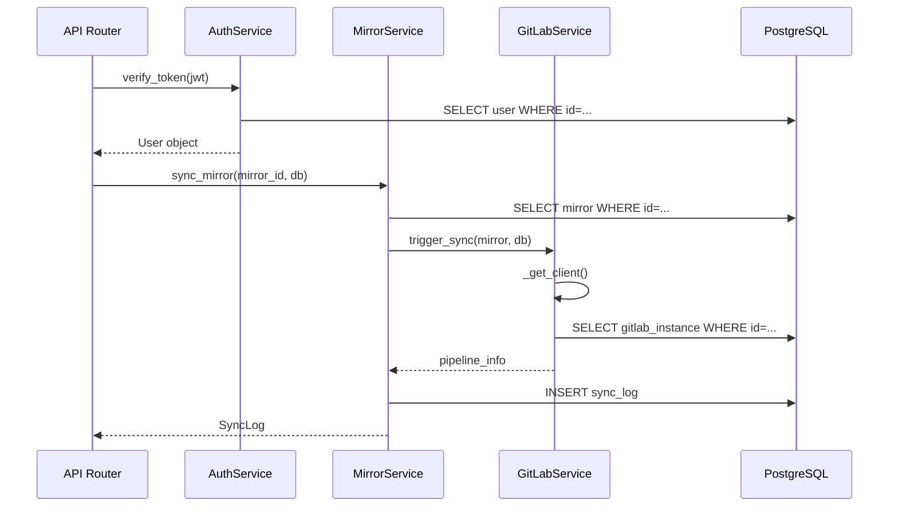

# 7. Service Layer Architecture

## Обзор

Сервисный слой реализует бизнес-логику приложения и является посредником между API роутерами и слоем данных (SQLAlchemy models). Каждый сервис отвечает за одну предметную область (SRP).

## Архитектурная диаграмма



## Описание сервисов

### AuthService (`app/services/auth.py`)

Отвечает за аутентификацию пользователей.

```python
class AuthService:
    async def authenticate_local(
        self, email: str, password: str, db: AsyncSession
    ) -> User | None:
        """Проверка email/password, возврат User или None."""

    async def create_access_token(self, user: User) -> str:
        """Генерация JWT токена с embedded permissions."""

    async def verify_token(self, token: str, db: AsyncSession) -> User:
        """Верификация JWT и загрузка пользователя."""
```

**Зависимости:** `UserService`, `RoleService`, `security.py`

---

### UserService (`app/services/user.py`)

Управление пользователями.

```python
class UserService:
    async def get_by_id(self, user_id: int, db: AsyncSession) -> User | None
    async def get_by_email(self, email: str, db: AsyncSession) -> User | None
    async def get_by_keycloak_sub(self, sub: str, db: AsyncSession) -> User | None
    async def create(self, data: UserCreate, db: AsyncSession) -> User
    async def update(self, user: User, data: UserUpdate, db: AsyncSession) -> User
    async def delete(self, user_id: int, db: AsyncSession) -> None
    async def list_users(
        self, page: int, page_size: int, search: str | None, db: AsyncSession
    ) -> tuple[list[User], int]
    async def assign_roles(
        self, user: User, role_names: list[str], db: AsyncSession
    ) -> None
    async def get_permissions(self, user: User) -> list[str]:
        """Собирает все permissions из всех ролей пользователя."""
```

---

### RoleService (`app/services/role.py`)

Управление ролями и permissions.

```python
class RoleService:
    async def get_all_roles(self, db: AsyncSession) -> list[Role]
    async def get_role_by_name(self, name: str, db: AsyncSession) -> Role | None
    async def create_custom_role(
        self, name: str, description: str, permissions: list[str], db: AsyncSession
    ) -> Role
    async def update_role(
        self, role: Role, data: RoleUpdate, db: AsyncSession
    ) -> Role
    async def delete_role(self, role_id: int, db: AsyncSession) -> None
    async def get_all_permissions(self) -> list[Permission]:
        """Возвращает все доступные permissions из enum."""
```

---

### OIDCService (`app/services/oidc.py`)

Интеграция с Keycloak OIDC.

```python
class OIDCService:
    async def get_config(self, db: AsyncSession) -> OIDCConfig | None
    async def save_config(self, data: OIDCConfigUpdate, db: AsyncSession) -> OIDCConfig
    async def exchange_code(
        self, code: str, redirect_uri: str, db: AsyncSession
    ) -> User:
        """
        1. Обменивает code на tokens через Keycloak
        2. Верифицирует id_token
        3. Извлекает sub, email, roles
        4. Находит или создает пользователя
        5. Синхронизирует роли
        """
    async def get_authorization_url(self, state: str, db: AsyncSession) -> str
    async def _sync_user_roles(
        self, user: User, keycloak_roles: list[str], db: AsyncSession
    ) -> None
```

**Текущая реализация:** [`backend/app/services/oidc.py`](../../backend/app/services/oidc.py)

---

### GitLabService (`app/services/gitlab.py`)

Интеграция с GitLab API.

```python
class GitLabService:
    def _get_client(self) -> gitlab.Gitlab
    async def import_mirror_from_url(
        self, gitlab_url: str, mirror: GitlabMirror, db: AsyncSession
    ) -> GitlabMirror
    async def trigger_sync(
        self, mirror: GitlabMirror, db: AsyncSession
    ) -> dict
    async def get_pipeline_status(
        self, mirror: GitlabMirror, pipeline_id: str
    ) -> dict
```

**Текущая реализация:** [`backend/app/services/gitlab.py`](../../backend/app/services/gitlab.py)

**Планируемые расширения:**
```python
    async def list_instances(self, db: AsyncSession) -> list[GitLabInstance]
    async def add_instance(
        self, data: GitLabInstanceCreate, db: AsyncSession
    ) -> GitLabInstance
    async def list_groups(
        self, instance: GitLabInstance
    ) -> list[dict]
    async def list_projects(
        self, instance: GitLabInstance, group_path: str | None
    ) -> list[dict]
    async def get_pipeline_components(
        self, instance: GitLabInstance, project_path: str
    ) -> list[dict]
```

---

### HarborService (`app/services/harbor.py`)

Интеграция с Harbor Registry API.

```python
class HarborService:
    async def list_instances(self, db: AsyncSession) -> list[HarborInstance]
    async def add_instance(
        self, data: HarborInstanceCreate, db: AsyncSession
    ) -> HarborInstance
    async def list_projects(
        self, instance: HarborInstance
    ) -> list[dict]
    async def list_repositories(
        self, instance: HarborInstance, project_name: str
    ) -> list[dict]
    async def list_artifacts(
        self, instance: HarborInstance, project_name: str, repo_name: str
    ) -> list[dict]
    async def sync_artifacts(
        self, instance: HarborInstance, project_name: str, db: AsyncSession
    ) -> None
    async def trigger_replication(
        self, instance: HarborInstance, policy_id: int
    ) -> dict
```

---

### GitHubService (`app/services/github.py`)

Интеграция с GitHub API.

```python
class GitHubService:
    def _get_client(self) -> Github
    async def import_project_from_url(
        self, github_url: str, db: AsyncSession
    ) -> GithubProject
    async def refresh_project(
        self, project: GithubProject, db: AsyncSession
    ) -> None
    async def _sync_releases(
        self, gh_repo, project: GithubProject, db: AsyncSession
    ) -> None
```

**Текущая реализация:** [`backend/app/services/github.py`](../../backend/app/services/github.py)

---

### DockerRegistryService (`app/services/docker.py`)

Работа с Docker Registry API v2.

```python
class DockerRegistryService:
    async def import_source_from_url(
        self, url: str, db: AsyncSession
    ) -> DockerImageSource
    async def index_source(
        self, source: DockerImageSource, db: AsyncSession
    ) -> None
    async def _fetch_tags(
        self, repo_url: str, auth: dict | None
    ) -> list[dict]
    async def _resolve_manifest_digest(
        self, repo_url: str, tag: str, auth: dict | None
    ) -> str | None
    async def _sync_tags(
        self, source: DockerImageSource, tags_data: list[dict], db: AsyncSession
    ) -> None
    async def refresh_source(
        self, source: DockerImageSource, db: AsyncSession
    ) -> None
```

**Текущая реализация:** [`backend/app/services/docker.py`](../../backend/app/services/docker.py)

---

### HelmService (`app/services/helm.py`)

Работа с Helm Repository (index.yaml).

```python
class HelmService:
    async def import_source_from_url(
        self, url: str, db: AsyncSession
    ) -> HelmChartSource
    async def index_source(
        self, source: HelmChartSource, db: AsyncSession
    ) -> None
    async def _fetch_index(self, repo_url: str) -> dict
    async def _sync_chart_entries(
        self, source: HelmChartSource, entries: dict, db: AsyncSession
    ) -> None
    async def refresh_source(
        self, source: HelmChartSource, db: AsyncSession
    ) -> None
    def trigger_index_pipeline(self, source: HelmChartSource) -> None
```

**Текущая реализация:** [`backend/app/services/helm.py`](../../backend/app/services/helm.py)

---

### BuildService (`app/services/build.py`)

Управление сборками образов.

```python
class BuildService:
    async def trigger_gold_image_build(
        self, image: GoldImage, db: AsyncSession
    ) -> BuildLog
    async def trigger_app_image_build(
        self, image: AppImage, db: AsyncSession
    ) -> BuildLog
    async def get_build_status(
        self, build_log: BuildLog, db: AsyncSession
    ) -> BuildLog
    async def _create_pipeline(
        self, gitlab_instance_id: int, project_path: str, variables: dict
    ) -> dict
```

**Текущая реализация:** [`backend/app/services/build.py`](../../backend/app/services/build.py)

---

### MirrorService (`app/services/mirror.py`)

Управление Git зеркалами.

```python
class MirrorService:
    async def import_mirror(
        self, gitlab_url: str, db: AsyncSession
    ) -> GitlabMirror
    async def sync_mirror(
        self, mirror: GitlabMirror, db: AsyncSession
    ) -> SyncLog
    async def get_sync_status(
        self, mirror: GitlabMirror, db: AsyncSession
    ) -> SyncLog | None
    async def list_mirrors(
        self, page: int, page_size: int, db: AsyncSession
    ) -> tuple[list[GitlabMirror], int]
```

---

### SchedulerService (`app/services/scheduler.py`)

Управление расписаниями синхронизации.

```python
class SchedulerService:
    async def create_schedule(
        self, data: ScheduleCreate, db: AsyncSession
    ) -> SyncSchedule
    async def update_schedule(
        self, schedule: SyncSchedule, data: ScheduleUpdate, db: AsyncSession
    ) -> SyncSchedule
    async def delete_schedule(
        self, schedule_id: int, db: AsyncSession
    ) -> None
    async def get_due_schedules(
        self, db: AsyncSession
    ) -> list[SyncSchedule]:
        """Возвращает расписания, которые нужно выполнить прямо сейчас."""
    async def run_scheduled_tasks(self, db: AsyncSession) -> None:
        """Запускается периодически (APScheduler/Celery)."""
```

**Текущая реализация:** [`backend/app/services/scheduler.py`](../../backend/app/services/scheduler.py)

---

### WebhookService (`app/services/webhook.py`)

Обработка входящих webhook событий.

```python
class WebhookService:
    async def process_gitlab_webhook(
        self, payload: dict, secret: str, db: AsyncSession
    ) -> None:
        """
        Обрабатывает Pipeline Hook от GitLab:
        - Обновляет статус pipeline в SyncLog/BuildLog
        - Отправляет уведомления (если настроены)
        """
    async def process_harbor_webhook(
        self, payload: dict, secret: str, db: AsyncSession
    ) -> None:
        """
        Обрабатывает PUSH_ARTIFACT/SCANNING_COMPLETED от Harbor:
        - Обновляет статус артефакта
        - Запускает повторную синхронизацию если нужно
        """
    async def process_github_webhook(
        self, payload: dict, signature: str, db: AsyncSession
    ) -> None:
        """
        Обрабатывает Push/Release события от GitHub:
        - Обновляет список релизов
        - Запускает синхронизацию
        """
    def _verify_gitlab_token(self, token: str, expected: str) -> bool
    def _verify_harbor_token(self, token: str, expected: str) -> bool
    def _verify_github_signature(self, payload: bytes, signature: str, secret: str) -> bool
```

---

## Паттерны и соглашения

### Dependency Injection

Все сервисы получают `AsyncSession` через параметр, а не создают его сами:

```python
# Правильно
async def create_user(data: UserCreate, db: AsyncSession) -> User:
    user = User(**data.model_dump())
    db.add(user)
    await db.commit()
    return user

# Неправильно — сервис не должен создавать сессию
async def create_user(data: UserCreate) -> User:
    async with get_db() as db:  # ❌
        ...
```

### Обработка ошибок

```python
from app.core.exceptions import NotFoundError, ConflictError, ExternalServiceError

async def get_user(user_id: int, db: AsyncSession) -> User:
    user = await db.get(User, user_id)
    if not user:
        raise NotFoundError(f"User {user_id} not found")
    return user

async def sync_with_gitlab(instance: GitLabInstance) -> dict:
    try:
        gl = gitlab.Gitlab(instance.url, private_token=decrypt(instance.token))
        return gl.projects.get(...)
    except gitlab.exceptions.GitlabError as e:
        raise ExternalServiceError(f"GitLab API error: {e}") from e
```

### Шифрование credentials

Все секреты (токены, пароли) хранятся в зашифрованном виде через [`app/core/secrets.py`](../../backend/app/core/secrets.py):

```python
from app.core.secrets import encrypt, decrypt

# При сохранении
instance.token = encrypt(raw_token)

# При использовании
raw_token = decrypt(instance.token)
```

### Логирование

```python
import logging
logger = logging.getLogger(__name__)

async def sync_mirror(mirror: GitlabMirror, db: AsyncSession) -> SyncLog:
    logger.info(f"Starting sync for mirror {mirror.id}: {mirror.name}")
    try:
        result = await gitlab_service.trigger_sync(mirror, db)
        logger.info(f"Sync triggered for mirror {mirror.id}, pipeline: {result['id']}")
        return result
    except ExternalServiceError as e:
        logger.error(f"Sync failed for mirror {mirror.id}: {e}")
        raise
```

## Взаимодействие сервисов



## Структура файлов

```
backend/app/
├── services/
│   ├── __init__.py
│   ├── auth.py          # AuthService (новый)
│   ├── user.py          # UserService (новый)
│   ├── role.py          # RoleService (новый)
│   ├── oidc.py          # OIDCService (существующий, расширить)
│   ├── gitlab.py        # GitLabService (существующий, расширить)
│   ├── harbor.py        # HarborService (новый)
│   ├── github.py        # GitHubService (существующий)
│   ├── docker.py        # DockerRegistryService (существующий)
│   ├── helm.py          # HelmService (существующий)
│   ├── build.py         # BuildService (существующий)
│   ├── mirror.py        # MirrorService (новый, выделить из gitlab.py)
│   ├── scheduler.py     # SchedulerService (существующий)
│   └── webhook.py       # WebhookService (новый, выделить из webhooks.py)
```

## Тестирование сервисов

Каждый сервис тестируется с mock-объектами для внешних зависимостей:

```python
# tests/test_mirror_service.py
import pytest
from unittest.mock import AsyncMock, patch
from app.services.mirror import MirrorService

@pytest.mark.asyncio
async def test_sync_mirror_success(db_session):
    service = MirrorService()
    mirror = await create_test_mirror(db_session)
    
    with patch("app.services.gitlab.GitLabService.trigger_sync") as mock_sync:
        mock_sync.return_value = {"id": "12345", "status": "running"}
        
        result = await service.sync_mirror(mirror, db_session)
        
        assert result.status == "running"
        assert result.gitlab_pipeline_id == "12345"
        mock_sync.assert_called_once_with(mirror, db_session)
```
