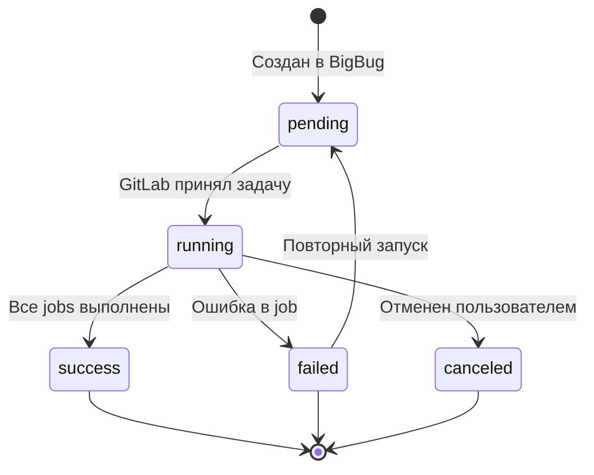
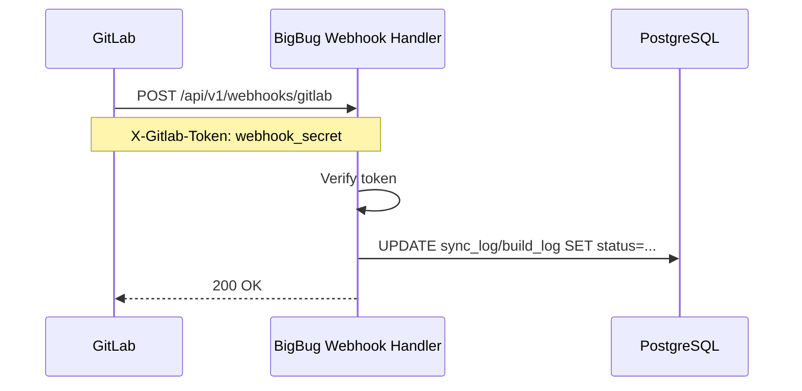

# 8. GitLab Pipelines & Components

## Обзор

BigBug использует GitLab CI/CD как execution engine для всех операций: зеркалирование, сборка образов, синхронизация Helm/Docker. Система управляет GitLab пайплайнами через API и использует GitLab Components для переиспользования CI/CD логики.

## Типы пайплайнов

| Тип | Описание | Триггер |
|-----|----------|---------|
| `mirror` | Синхронизация Git зеркала | Ручной / расписание |
| `gold_image` | Сборка Gold образа | Ручной / webhook |
| `app_image` | Сборка App образа | Ручной / webhook |
| `helm_sync` | Синхронизация Helm чарта | Ручной / расписание |
| `docker_sync` | Синхронизация Docker образа | Ручной / расписание |

## Жизненный цикл пайплайна



## Структура GitLab CI Templates

Все шаблоны хранятся в директории [`gitlab-ci/`](../../gitlab-ci/):

```
gitlab-ci/
├── mirror-template.yml        # Зеркалирование репозитория
├── gold-image-template.yml    # Сборка Gold образа
├── app-image-template.yml     # Сборка App образа
├── helm-sync-template.yml     # Синхронизация Helm чарта
└── docker-sync-template.yml   # Синхронизация Docker образа
```

### mirror-template.yml

```yaml
# Шаблон для зеркалирования Git репозитория
mirror-sync:
  stage: sync
  image: alpine/git:latest
  variables:
    SOURCE_URL: ""        # URL источника (передается через API)
    TARGET_URL: ""        # URL назначения
    MIRROR_DEPTH: "0"     # 0 = полная история
  script:
    - git clone --mirror $SOURCE_URL repo.git
    - cd repo.git
    - git push --mirror $TARGET_URL
  only:
    - triggers
  tags:
    - mirror
```

### gold-image-template.yml

```yaml
# Шаблон для сборки Gold образа
build-gold-image:
  stage: build
  image: docker:24-dind
  services:
    - docker:24-dind
  variables:
    DOCKER_TLS_CERTDIR: "/certs"
    IMAGE_NAME: ""          # Имя образа
    IMAGE_TAG: ""           # Тег образа
    HARBOR_URL: ""          # URL Harbor
    HARBOR_PROJECT: ""      # Проект в Harbor
    DOCKERFILE_PATH: "."    # Путь к Dockerfile
  before_script:
    - docker login -u $HARBOR_USER -p $HARBOR_PASSWORD $HARBOR_URL
  script:
    - docker build -t $HARBOR_URL/$HARBOR_PROJECT/$IMAGE_NAME:$IMAGE_TAG $DOCKERFILE_PATH
    - docker push $HARBOR_URL/$HARBOR_PROJECT/$IMAGE_NAME:$IMAGE_TAG
  after_script:
    - docker logout $HARBOR_URL
  only:
    - triggers
  tags:
    - docker
```

### helm-sync-template.yml

```yaml
# Шаблон для синхронизации Helm чарта
helm-sync:
  stage: sync
  image: alpine/helm:3.14
  variables:
    HELM_REPO_URL: ""       # URL Helm репозитория
    CHART_NAME: ""          # Имя чарта
    CHART_VERSION: ""       # Версия чарта (пусто = все)
    TARGET_REPO_URL: ""     # URL целевого репозитория (ChartMuseum)
  script:
    - helm repo add source $HELM_REPO_URL
    - helm repo update
    - helm pull source/$CHART_NAME --version $CHART_VERSION --destination /tmp/charts
    - |
      for chart in /tmp/charts/*.tgz; do
        curl -u $TARGET_USER:$TARGET_PASSWORD \
          --data-binary "@$chart" \
          $TARGET_REPO_URL/api/charts
      done
  only:
    - triggers
  tags:
    - helm
```

## GitLab Components

GitLab Components — это переиспользуемые CI/CD блоки, хранящиеся в специальных репозиториях. BigBug управляет каталогом компонентов.

### Структура компонента

```
components-repo/
├── README.md
├── templates/
│   ├── mirror/
│   │   └── template.yml
│   ├── build-image/
│   │   └── template.yml
│   └── helm-sync/
│       └── template.yml
```

### Пример компонента `build-image`

```yaml
# templates/build-image/template.yml
spec:
  inputs:
    image_name:
      description: "Docker image name"
    image_tag:
      default: "latest"
    harbor_url:
      description: "Harbor registry URL"
    harbor_project:
      description: "Harbor project name"

---
build-image:
  stage: build
  image: docker:24-dind
  services:
    - docker:24-dind
  variables:
    IMAGE_NAME: $[[ inputs.image_name ]]
    IMAGE_TAG: $[[ inputs.image_tag ]]
    HARBOR_URL: $[[ inputs.harbor_url ]]
    HARBOR_PROJECT: $[[ inputs.harbor_project ]]
  script:
    - docker build -t $HARBOR_URL/$HARBOR_PROJECT/$IMAGE_NAME:$IMAGE_TAG .
    - docker push $HARBOR_URL/$HARBOR_PROJECT/$IMAGE_NAME:$IMAGE_TAG
```

### Использование компонента в pipeline

```yaml
# .gitlab-ci.yml проекта
include:
  - component: gitlab.example.com/bigbug/components/build-image@1.0.0
    inputs:
      image_name: "my-app"
      image_tag: "v1.2.3"
      harbor_url: "harbor.example.com"
      harbor_project: "production"
```

## API для управления пайплайнами

### Запуск пайплайна через GitLab API

```python
# app/services/gitlab.py
async def trigger_pipeline(
    self,
    instance: GitLabInstance,
    project_path: str,
    variables: dict[str, str]
) -> dict:
    """
    POST /api/v4/projects/{id}/trigger/pipeline
    """
    gl = self._get_client(instance)
    project = gl.projects.get(project_path)
    
    pipeline = project.trigger_pipeline(
        ref="main",
        token=instance.trigger_token,
        variables=variables
    )
    
    return {
        "id": str(pipeline.id),
        "status": pipeline.status,
        "web_url": pipeline.web_url
    }
```

### Переменные пайплайна по типу

#### Mirror Pipeline Variables
```python
{
    "PIPELINE_TYPE": "mirror",
    "MIRROR_ID": str(mirror.id),
    "SOURCE_URL": mirror.source_url,
    "TARGET_URL": mirror.target_url,
    "BIGBUG_CALLBACK_URL": f"{settings.base_url}/api/v1/webhooks/gitlab"
}
```

#### Gold Image Build Variables
```python
{
    "PIPELINE_TYPE": "gold_image",
    "IMAGE_ID": str(image.id),
    "IMAGE_NAME": image.name,
    "IMAGE_TAG": image.version,
    "HARBOR_URL": harbor_instance.url,
    "HARBOR_PROJECT": image.harbor_project,
    "BIGBUG_CALLBACK_URL": f"{settings.base_url}/api/v1/webhooks/gitlab"
}
```

#### Helm Sync Variables
```python
{
    "PIPELINE_TYPE": "helm_sync",
    "SOURCE_ID": str(source.id),
    "HELM_REPO_URL": source.url,
    "CHART_NAME": source.chart_name,
    "BIGBUG_CALLBACK_URL": f"{settings.base_url}/api/v1/webhooks/gitlab"
}
```

## Webhook обратная связь

После завершения пайплайна GitLab отправляет webhook на BigBug:



### Payload от GitLab Pipeline Hook

```json
{
  "object_kind": "pipeline",
  "object_attributes": {
    "id": 12345,
    "status": "success",
    "duration": 120,
    "finished_at": "2026-06-06T12:05:00Z"
  },
  "variables": [
    {"key": "PIPELINE_TYPE", "value": "mirror"},
    {"key": "MIRROR_ID", "value": "5"}
  ]
}
```

### Обработчик webhook

```python
# app/services/webhook.py
async def process_gitlab_webhook(
    self, payload: dict, token: str, db: AsyncSession
) -> None:
    if not self._verify_gitlab_token(token, settings.gitlab_webhook_secret):
        raise HTTPException(status_code=401, detail="Invalid webhook token")
    
    if payload.get("object_kind") != "pipeline":
        return  # Игнорируем не-pipeline события
    
    pipeline_attrs = payload["object_attributes"]
    variables = {v["key"]: v["value"] for v in payload.get("variables", [])}
    
    pipeline_type = variables.get("PIPELINE_TYPE")
    status = pipeline_attrs["status"]
    
    if pipeline_type == "mirror":
        mirror_id = int(variables["MIRROR_ID"])
        await self._update_mirror_sync_status(mirror_id, status, db)
    elif pipeline_type == "gold_image":
        image_id = int(variables["IMAGE_ID"])
        await self._update_build_status(image_id, "gold", status, db)
    elif pipeline_type == "app_image":
        image_id = int(variables["IMAGE_ID"])
        await self._update_build_status(image_id, "app", status, db)
```

## Мониторинг пайплайнов

### Polling статуса

Для пайплайнов без webhook (или при недоступности webhook) используется polling:

```python
# app/services/scheduler.py
async def poll_running_pipelines(self, db: AsyncSession) -> None:
    """Запускается каждые 30 секунд."""
    running_logs = await db.execute(
        select(SyncLog).where(SyncLog.status == "running")
    )
    
    for log in running_logs.scalars():
        status = await gitlab_service.get_pipeline_status(
            log.mirror, log.gitlab_pipeline_id
        )
        if status["status"] in ("success", "failed", "canceled"):
            log.status = status["status"]
            log.finished_at = datetime.utcnow()
    
    await db.commit()
```

### Таблица pipeline_runs (новая)

```sql
CREATE TABLE pipeline_runs (
    id          SERIAL PRIMARY KEY,
    type        VARCHAR(50) NOT NULL,  -- mirror, gold_image, app_image, helm_sync, docker_sync
    resource_id INTEGER NOT NULL,      -- ID зеркала/образа/чарта
    gitlab_instance_id INTEGER REFERENCES gitlab_instances(id),
    gitlab_pipeline_id VARCHAR(50),
    status      VARCHAR(20) DEFAULT 'pending',
    variables   JSONB,
    started_at  TIMESTAMPTZ,
    finished_at TIMESTAMPTZ,
    created_at  TIMESTAMPTZ DEFAULT NOW()
);

CREATE INDEX idx_pipeline_runs_type_resource ON pipeline_runs(type, resource_id);
CREATE INDEX idx_pipeline_runs_status ON pipeline_runs(status);
```

## Расписания (Schedules)

Пайплайны могут запускаться по расписанию через APScheduler:

```python
# app/services/scheduler.py
from apscheduler.schedulers.asyncio import AsyncIOScheduler

scheduler = AsyncIOScheduler()

@scheduler.scheduled_job("interval", minutes=5)
async def run_scheduled_syncs():
    async with get_db() as db:
        due_schedules = await scheduler_service.get_due_schedules(db)
        for schedule in due_schedules:
            await trigger_pipeline_for_schedule(schedule, db)
```

### Форматы расписания

| Тип | Пример | Описание |
|-----|--------|----------|
| `interval` | `30m` | Каждые 30 минут |
| `cron` | `0 2 * * *` | Каждый день в 02:00 |
| `manual` | — | Только ручной запуск |
