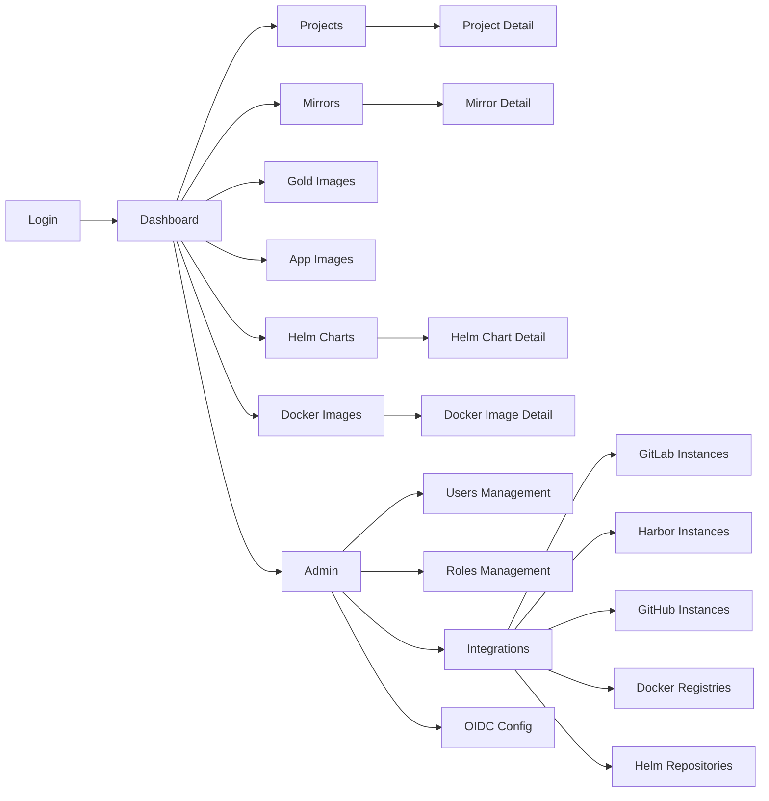

# 9. UI Structure

## Обзор

Frontend построен на **React 18 + TypeScript + MUI (Material UI) + Redux Toolkit**. Маршрутизация через `react-router`. Состояние аутентификации хранится в Redux store.

## Текущая структура страниц

```
frontend/src/
├── pages/
│   ├── Login/              # Страница входа (local + SSO)
│   ├── SsoCallback/        # Обработка OIDC callback
│   ├── Dashboard/          # Главная страница
│   ├── Projects/           # GitHub проекты
│   │   └── ProjectDetail/  # Детали проекта + релизы
│   ├── Mirrors/            # Git зеркала
│   │   └── MirrorDetail/   # Детали зеркала + логи
│   ├── GoldImages/         # Gold образы
│   ├── AppImages/          # App образы
│   ├── HelmCharts/         # Helm чарты
│   │   └── HelmChartDetail/
│   ├── DockerImages/       # Docker образы
│   │   └── DockerImageDetail/
│   └── Admin/              # Администрирование
├── components/
│   ├── Layout/             # Основной layout с sidebar
│   ├── StatusChip/         # Чип статуса (success/failed/running)
│   └── [новые компоненты]
├── router/
│   ├── index.tsx           # Маршруты
│   └── ProtectedRoute.tsx  # Защищённые маршруты
├── store/
│   ├── index.ts            # Redux store
│   ├── authSlice.ts        # Auth state
│   └── api.ts              # RTK Query API
├── hooks/
│   └── useKeycloakAuth.ts  # Keycloak auth hook
├── services/
│   └── keycloak.ts         # Keycloak client
└── types/
    └── index.ts            # TypeScript типы
```

## Навигационная структура



## Маршруты (Router)

### Текущие маршруты ([`frontend/src/router/index.tsx`](../../frontend/src/router/index.tsx))

| Путь | Компонент | Доступ |
|------|-----------|--------|
| `/login` | `LoginPage` | Публичный |
| `/sso/callback` | `SsoCallbackPage` | Публичный |
| `/` | `DashboardPage` | Авторизованные |
| `/projects` | `ProjectsPage` | Авторизованные |
| `/projects/:id` | `ProjectDetailPage` | Авторизованные |
| `/mirrors` | `MirrorsPage` | Авторизованные |
| `/mirrors/:id` | `MirrorDetailPage` | Авторизованные |
| `/gold-images` | `GoldImagesPage` | Авторизованные |
| `/app-images` | `AppImagesPage` | Авторизованные |
| `/helm-charts` | `HelmChartsPage` | Авторизованные |
| `/helm-charts/:id` | `HelmChartDetailPage` | Авторизованные |
| `/docker-images` | `DockerImagesPage` | Авторизованные |
| `/docker-images/:id` | `DockerImageDetailPage` | Авторизованные |
| `/admin` | `AdminPage` | Admin only |

### Новые маршруты (планируемые)

| Путь | Компонент | Permission |
|------|-----------|------------|
| `/admin/users` | `UsersPage` | `users:read` |
| `/admin/users/:id` | `UserDetailPage` | `users:read` |
| `/admin/roles` | `RolesPage` | `roles:read` |
| `/admin/integrations` | `IntegrationsPage` | `integrations:*:read` |
| `/admin/integrations/gitlab` | `GitLabInstancesPage` | `integrations:gitlab:read` |
| `/admin/integrations/harbor` | `HarborInstancesPage` | `integrations:harbor:read` |
| `/admin/integrations/github` | `GitHubInstancesPage` | `integrations:github:read` |
| `/admin/integrations/docker` | `DockerRegistriesPage` | `integrations:docker:read` |
| `/admin/integrations/helm` | `HelmReposPage` | `integrations:helm:read` |
| `/admin/auth/oidc` | `OIDCConfigPage` | `auth:oidc:read` |
| `/pipelines` | `PipelinesPage` | `pipelines:read` |

## Sidebar навигация

### Текущая структура ([`frontend/src/components/Layout/index.tsx`](../../frontend/src/components/Layout/index.tsx))

```typescript
const navItems = [
  { label: 'Dashboard',     path: '/',             icon: <DashboardIcon /> },
  { label: 'Projects',      path: '/projects',     icon: <GitHubIcon /> },
  { label: 'Mirrors',       path: '/mirrors',      icon: <MirrorIcon /> },
  { label: 'Gold Images',   path: '/gold-images',  icon: <GoldImageIcon /> },
  { label: 'App Images',    path: '/app-images',   icon: <AppImageIcon /> },
  { label: 'Helm Charts',   path: '/helm-charts',  icon: <HelmIcon /> },
  { label: 'Docker Images', path: '/docker-images',icon: <DockerIcon /> },
]

const adminItems = [
  { label: 'Admin', path: '/admin', icon: <AdminIcon /> },
]
```

### Планируемая структура с permission-based видимостью

```typescript
interface NavItem {
  label: string
  path: string
  icon: ReactNode
  permission?: string   // Если задан — показывать только при наличии permission
  children?: NavItem[]  // Вложенные пункты
}

const navItems: NavItem[] = [
  { label: 'Dashboard',     path: '/',             icon: <DashboardIcon /> },
  { label: 'Projects',      path: '/projects',     icon: <GitHubIcon />,
    permission: 'projects:read' },
  { label: 'Mirrors',       path: '/mirrors',      icon: <MirrorIcon />,
    permission: 'mirrors:read' },
  { label: 'Gold Images',   path: '/gold-images',  icon: <GoldImageIcon />,
    permission: 'images:gold:read' },
  { label: 'App Images',    path: '/app-images',   icon: <AppImageIcon />,
    permission: 'images:app:read' },
  { label: 'Helm Charts',   path: '/helm-charts',  icon: <HelmIcon />,
    permission: 'helm:read' },
  { label: 'Docker Images', path: '/docker-images',icon: <DockerIcon />,
    permission: 'docker:read' },
  { label: 'Pipelines',     path: '/pipelines',    icon: <PipelineIcon />,
    permission: 'pipelines:read' },
]

const adminNavItems: NavItem[] = [
  {
    label: 'Admin',
    path: '/admin',
    icon: <AdminIcon />,
    permission: 'users:read',
    children: [
      { label: 'Users',         path: '/admin/users',                permission: 'users:read' },
      { label: 'Roles',         path: '/admin/roles',                permission: 'roles:read' },
      { label: 'Integrations',  path: '/admin/integrations',         permission: 'integrations:gitlab:read' },
      { label: 'OIDC Config',   path: '/admin/auth/oidc',            permission: 'auth:oidc:read' },
    ]
  }
]
```

## Permission-based компоненты

### Hook `usePermissions`

```typescript
// frontend/src/hooks/usePermissions.ts
import { useAppSelector } from '../store'

export function usePermissions() {
  const user = useAppSelector((state) => state.auth.user)
  const permissions = user?.permissions ?? []

  const hasPermission = (permission: string): boolean => {
    return permissions.includes(permission)
  }

  const hasAnyPermission = (...perms: string[]): boolean => {
    return perms.some(p => permissions.includes(p))
  }

  const hasAllPermissions = (...perms: string[]): boolean => {
    return perms.every(p => permissions.includes(p))
  }

  return { hasPermission, hasAnyPermission, hasAllPermissions, permissions }
}
```

### Компонент `PermissionGate`

```typescript
// frontend/src/components/PermissionGate/index.tsx
interface PermissionGateProps {
  permission: string
  fallback?: ReactNode
  children: ReactNode
}

export function PermissionGate({ permission, fallback = null, children }: PermissionGateProps) {
  const { hasPermission } = usePermissions()

  if (!hasPermission(permission)) {
    return <>{fallback}</>
  }

  return <>{children}</>
}

// Использование:
<PermissionGate permission="users:write">
  <Button onClick={handleCreateUser}>Create User</Button>
</PermissionGate>
```

### Обновлённый `ProtectedRoute`

```typescript
// frontend/src/router/ProtectedRoute.tsx
interface ProtectedRouteProps {
  children: ReactNode
  permission?: string
  redirectTo?: string
}

export function ProtectedRoute({
  children,
  permission,
  redirectTo = '/login'
}: ProtectedRouteProps) {
  const isAuthenticated = useAppSelector((state) => state.auth.isAuthenticated)
  const { hasPermission } = usePermissions()

  if (!isAuthenticated) {
    return <Navigate to={redirectTo} replace />
  }

  if (permission && !hasPermission(permission)) {
    return <Navigate to="/" replace />
  }

  return <>{children}</>
}
```

## Auth State (Redux)

### Текущий [`authSlice.ts`](../../frontend/src/store/authSlice.ts)

```typescript
interface AuthState {
  isAuthenticated: boolean
  user: {
    id: number
    username: string
    email: string
    roles: string[]
  } | null
  token: string | null
}
```

### Планируемое расширение

```typescript
interface AuthState {
  isAuthenticated: boolean
  user: {
    id: number
    username: string
    email: string
    roles: string[]
    permissions: string[]   // Добавить permissions
    keycloak_sub?: string   // Добавить OIDC sub
  } | null
  token: string | null
  oidcConfig: {             // Добавить OIDC конфигурацию
    enabled: boolean
    authorizationUrl?: string
    clientId?: string
  } | null
}
```

## Страница Admin

### Текущая структура

Текущая [`AdminPage`](../../frontend/src/pages/Admin/index.tsx) — монолитная страница управления пользователями.

### Планируемая структура

```
pages/Admin/
├── index.tsx              # Redirect на /admin/users
├── Users/
│   ├── index.tsx          # Список пользователей
│   └── UserForm.tsx       # Форма создания/редактирования
├── Roles/
│   ├── index.tsx          # Список ролей
│   └── RoleForm.tsx       # Форма создания/редактирования
├── Integrations/
│   ├── index.tsx          # Обзор всех интеграций
│   ├── GitLab/
│   │   ├── index.tsx      # Список GitLab инстансов
│   │   └── InstanceForm.tsx
│   ├── Harbor/
│   │   ├── index.tsx
│   │   └── InstanceForm.tsx
│   ├── GitHub/
│   │   ├── index.tsx
│   │   └── InstanceForm.tsx
│   ├── DockerRegistry/
│   │   ├── index.tsx
│   │   └── InstanceForm.tsx
│   └── HelmRepository/
│       ├── index.tsx
│       └── InstanceForm.tsx
└── OIDCConfig/
    └── index.tsx          # Настройка Keycloak
```

## RTK Query API

### Текущий [`api.ts`](../../frontend/src/store/api.ts)

Использует RTK Query для типизированных API запросов.

### Планируемые endpoints

```typescript
// store/api.ts
export const api = createApi({
  reducerPath: 'api',
  baseQuery: fetchBaseQuery({
    baseUrl: '/api/v1',
    prepareHeaders: (headers, { getState }) => {
      const token = (getState() as RootState).auth.token
      if (token) {
        headers.set('Authorization', `Bearer ${token}`)
      }
      return headers
    },
  }),
  tagTypes: ['User', 'Role', 'GitLabInstance', 'HarborInstance', 'Mirror', 'Pipeline'],
  endpoints: (builder) => ({
    // Auth
    login: builder.mutation<LoginResponse, LoginRequest>({ ... }),
    getMe: builder.query<User, void>({ ... }),
    getOidcConfig: builder.query<OidcConfig, void>({ ... }),

    // Users
    listUsers: builder.query<PaginatedResponse<User>, ListParams>({ ... }),
    createUser: builder.mutation<User, CreateUserRequest>({ ... }),
    updateUser: builder.mutation<User, UpdateUserRequest>({ ... }),
    deleteUser: builder.mutation<void, number>({ ... }),

    // Roles
    listRoles: builder.query<Role[], void>({ ... }),
    createRole: builder.mutation<Role, CreateRoleRequest>({ ... }),

    // GitLab Instances
    listGitLabInstances: builder.query<GitLabInstance[], void>({ ... }),
    createGitLabInstance: builder.mutation<GitLabInstance, CreateGitLabInstanceRequest>({ ... }),

    // Mirrors
    listMirrors: builder.query<PaginatedResponse<Mirror>, ListParams>({ ... }),
    syncMirror: builder.mutation<SyncLog, number>({ ... }),

    // Pipelines
    listPipelines: builder.query<PaginatedResponse<Pipeline>, PipelineListParams>({ ... }),
    triggerPipeline: builder.mutation<Pipeline, TriggerPipelineRequest>({ ... }),
  }),
})
```

## Страница Login

### Текущая реализация

Поддерживает:
- Форму email/password для local auth
- Кнопку "Sign in with SSO" для Keycloak

### Планируемые улучшения

```typescript
// pages/Login/index.tsx
export function LoginPage() {
  const [oidcConfig, setOidcConfig] = useState<OidcConfig | null>(null)

  useEffect(() => {
    // Загружаем OIDC конфигурацию при монтировании
    api.getOidcConfig().then(setOidcConfig)
  }, [])

  return (
    <Box>
      <LocalLoginForm onSuccess={handleLoginSuccess} />

      {oidcConfig?.enabled && (
        <>
          <Divider>OR</Divider>
          <Button
            variant="outlined"
            onClick={() => window.location.href = oidcConfig.authorizationUrl}
            startIcon={<KeycloakIcon />}
          >
            Sign in with {oidcConfig.providerName ?? 'SSO'}
          </Button>
        </>
      )}
    </Box>
  )
}
```

## Типы TypeScript

### Планируемые расширения [`types/index.ts`](../../frontend/src/types/index.ts)

```typescript
// Пользователи и роли
export interface User {
  id: number
  username: string
  email: string
  is_active: boolean
  roles: string[]
  permissions: string[]
  keycloak_sub?: string
  created_at: string
}

export interface Role {
  id: number
  name: string
  description?: string
  is_system: boolean
  permissions: string[]
}

// Интеграции
export interface GitLabInstance {
  id: number
  name: string
  url: string
  is_active: boolean
  created_at: string
}

export interface HarborInstance {
  id: number
  name: string
  url: string
  is_active: boolean
  created_at: string
}

// Пайплайны
export interface Pipeline {
  id: number
  type: 'mirror' | 'gold_image' | 'app_image' | 'helm_sync' | 'docker_sync'
  status: 'pending' | 'running' | 'success' | 'failed' | 'canceled'
  resource_id: number
  gitlab_pipeline_id?: string
  started_at?: string
  finished_at?: string
  created_at: string
}

// OIDC
export interface OidcConfig {
  enabled: boolean
  provider_url?: string
  client_id?: string
  authorization_url?: string
  provider_name?: string
}

// Пагинация
export interface PaginatedResponse<T> {
  items: T[]
  total: number
  page: number
  page_size: number
  pages: number
}
```

## Диаграмма компонентов

```mermaid
graph TB
    subgraph App
        Router[AppRouter]
        Store[Redux Store]
    end

    subgraph Layout
        Sidebar[Sidebar Navigation]
        AppBar[Top AppBar]
        Content[Page Content]
    end

    subgraph Pages
        Dashboard
        Projects
        Mirrors
        GoldImages[Gold Images]
        AppImages[App Images]
        HelmCharts[Helm Charts]
        DockerImages[Docker Images]
        Pipelines
        Admin
    end

    subgraph AdminPages[Admin Pages]
        Users
        Roles
        Integrations
        OIDCConfig[OIDC Config]
    end

    subgraph SharedComponents[Shared Components]
        StatusChip
        PermissionGate
        ConfirmDialog
        DataTable
        FormDialog
    end

    Router --> Layout
    Layout --> Sidebar
    Layout --> Content
    Content --> Pages
    Admin --> AdminPages
    Pages --> SharedComponents
    AdminPages --> SharedComponents
    Store --> Router
    Store --> Sidebar
```


