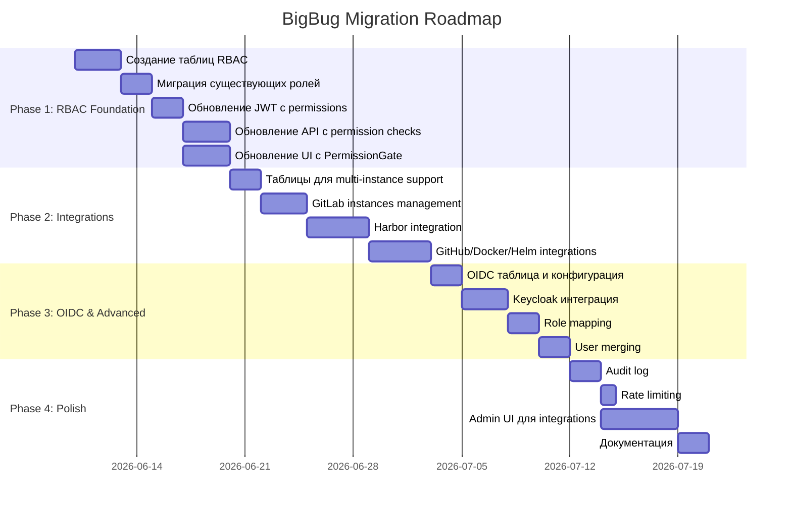

# 11. Migration Strategy

## Обзор

План миграции от текущей простой системы (admin/operator/viewer) к полноценной RBAC системе с интеграциями GitLab, Harbor, GitHub, Docker Registry и Helm Repository.

## Фазы миграции



## Phase 1: RBAC Foundation (10 дней)

### Цель
Внедрить permission-based RBAC с обратной совместимостью.

### 1.1. Database Migration

```python
# alembic/versions/20260610_rbac_tables.py
def upgrade():
    # 1. Создать таблицу permissions
    op.create_table(
        'permissions',
        sa.Column('id', sa.Integer(), primary_key=True),
        sa.Column('name', sa.String(100), unique=True, nullable=False),
        sa.Column('description', sa.String(255)),
        sa.Column('resource', sa.String(50), nullable=False),
        sa.Column('action', sa.String(50), nullable=False)
    )
    
    # 2. Создать таблицу role_permissions
    op.create_table(
        'role_permissions',
        sa.Column('role_id', sa.Integer(), sa.ForeignKey('roles.id', ondelete='CASCADE')),
        sa.Column('permission_id', sa.Integer(), sa.ForeignKey('permissions.id', ondelete='CASCADE')),
        sa.PrimaryKeyConstraint('role_id', 'permission_id')
    )
    
    # 3. Расширить таблицу roles
    op.add_column('roles', sa.Column('description', sa.String(255)))
    op.add_column('roles', sa.Column('is_system', sa.Boolean(), default=True))
    
    # 4. Расширить таблицу users
    op.add_column('users', sa.Column('keycloak_sub', sa.String(255), unique=True))
    
    # 5. Заполнить permissions
    op.execute("""
        INSERT INTO permissions (name, description, resource, action) VALUES
        ('users:read', 'View users', 'users', 'read'),
        ('users:write', 'Create and update users', 'users', 'write'),
        ...
    """)
    
    # 6. Связать существующие роли с permissions
    op.execute("""
        -- admin получает все permissions
        INSERT INTO role_permissions (role_id, permission_id)
        SELECT r.id, p.id FROM roles r, permissions p
        WHERE r.name = 'admin';
        
        -- operator получает операторские permissions
        INSERT INTO role_permissions (role_id, permission_id)
        SELECT r.id, p.id FROM roles r, permissions p
        WHERE r.name = 'operator'
        AND p.name IN ('mirrors:read', 'mirrors:write', 'images:gold:read', ...);
        
        -- viewer получает только read permissions
        INSERT INTO role_permissions (role_id, permission_id)
        SELECT r.id, p.id FROM roles r, permissions p
        WHERE r.name = 'viewer'
        AND p.action = 'read';
    """)

def downgrade():
    op.drop_table('role_permissions')
    op.drop_table('permissions')
    op.drop_column('roles', 'description')
    op.drop_column('roles', 'is_system')
    op.drop_column('users', 'keycloak_sub')
```

### 1.2. Backend изменения

**Обновить JWT токены:**
```python
# app/core/security.py
def create_access_token(user: User) -> str:
    permissions = await get_user_permissions(user)  # Собрать из ролей
    payload = {
        "sub": str(user.id),
        "email": user.email,
        "roles": [r.name for r in user.roles],
        "permissions": permissions,  # Добавить
        "exp": datetime.utcnow() + timedelta(minutes=60),
    }
    return jwt.encode(payload, settings.secret_key, algorithm="HS256")
```

**Обновить все endpoints:**
```python
# Было:
@router.get("/users", dependencies=[Depends(require_admin())])

# Стало:
@router.get("/users", dependencies=[Depends(require_permission("users:read"))])
```

### 1.3. Frontend изменения

**Обновить authSlice:**
```typescript
interface AuthState {
  user: {
    ...
    permissions: string[]  // Добавить
  }
}
```

**Создать `usePermissions` hook и `PermissionGate` компонент** (см. [09-ui-structure.md](./09-ui-structure.md))

**Обновить навигацию:**
```typescript
const navItems = [
  { label: 'Mirrors', path: '/mirrors', icon: <MirrorIcon />, 
    permission: 'mirrors:read' },
  ...
]
```

### Тестирование Phase 1
- [ ] Существующие пользователи могут войти
- [ ] Роли admin/operator/viewer работают как раньше
- [ ] JWT содержит permissions
- [ ] API endpoints проверяют permissions
- [ ] UI скрывает недоступные элементы

---

## Phase 2: Integrations (13 дней)

### Цель
Добавить поддержку множественных инстансов GitLab, Harbor, GitHub, Docker Registry, Helm Repository.

### 2.1. Database Migration

```python
# alembic/versions/20260625_integration_tables.py
def upgrade():
    # GitLab instances
    op.create_table(
        'gitlab_instances',
        sa.Column('id', sa.Integer(), primary_key=True),
        sa.Column('name', sa.String(100), nullable=False),
        sa.Column('url', sa.String(255), nullable=False),
        sa.Column('token', sa.Text(), nullable=False),  # Encrypted
        sa.Column('verify_ssl', sa.Boolean(), default=True),
        sa.Column('is_active', sa.Boolean(), default=True),
        sa.Column('created_at', sa.DateTime(timezone=True), server_default=sa.func.now())
    )
    
    # Добавить gitlab_instance_id к существующим таблицам
    op.add_column('gitlab_mirrors', 
        sa.Column('gitlab_instance_id', sa.Integer(), 
                  sa.ForeignKey('gitlab_instances.id')))
    
    # Создать default инстанс из текущей конфигурации
    op.execute("""
        INSERT INTO gitlab_instances (name, url, token, verify_ssl)
        VALUES ('Default', %s, %s, true)
    """ % (settings.gitlab_url, encrypt(settings.gitlab_token)))
    
    # Связать существующие mirrors с default инстансом
    op.execute("""
        UPDATE gitlab_mirrors
        SET gitlab_instance_id = (SELECT id FROM gitlab_instances LIMIT 1)
    """)
    
    # Аналогично для Harbor, GitHub, Docker, Helm...
```

### 2.2. Backend изменения

**Новые сервисы:**
- `HarborService` — интеграция с Harbor API
- `MirrorService` — выделить логику из `GitLabService`
- `WebhookService` — выделить из `webhooks.py`

**Новые API endpoints:**
- `/api/v1/admin/integrations/gitlab/instances`
- `/api/v1/admin/integrations/harbor/instances`
- И т.д. (см. [06-api-design.md](./06-api-design.md))

### 2.3. Frontend изменения

**Новые страницы:**
- `pages/Admin/Integrations/` — управление интеграциями
- Подстраницы для каждого типа интеграции

**Обновить существующие страницы:**
- Mirrors: добавить выбор GitLab instance при создании
- Gold/App Images: добавить выбор Harbor instance

### Тестирование Phase 2
- [ ] Можно добавить несколько GitLab инстансов
- [ ] Можно добавить несколько Harbor инстансов
- [ ] Credentials шифруются корректно
- [ ] Существующие зеркала продолжают работать
- [ ] Webhooks от разных инстансов обрабатываются

---

## Phase 3: OIDC & Advanced (9 дней)

### Цель
Добавить Keycloak интеграцию с role mapping и user merging.

### 3.1. Database Migration

```python
# alembic/versions/20260710_oidc_config.py
def upgrade():
    op.create_table(
        'oidc_config',
        sa.Column('id', sa.Integer(), primary_key=True),
        sa.Column('enabled', sa.Boolean(), default=False),
        sa.Column('provider_url', sa.String(255)),
        sa.Column('client_id', sa.String(255)),
        sa.Column('client_secret', sa.Text()),  # Encrypted
        sa.Column('role_claim_path', sa.String(255), default='realm_access.roles'),
        sa.Column('role_mapping', sa.JSON()),
        sa.Column('updated_at', sa.DateTime(timezone=True), onupdate=sa.func.now())
    )
```

### 3.2. Backend изменения

**Расширить `OIDCService`:**
- Сохранение конфигурации в БД
- User merging по email или keycloak_sub
- Role synchronization

**Новые API endpoints:**
- `PUT /api/v1/admin/auth/oidc/config`
- `GET /api/v1/admin/auth/oidc/config`

### 3.3. Frontend изменения

**Новая страница:**
- `pages/Admin/OIDCConfig/` — настройка Keycloak

**Обновить Login:**
- Загружать OIDC config при монтировании
- Показывать кнопку SSO только если `enabled=true`

### Тестирование Phase 3
- [ ] Можно настроить Keycloak через UI
- [ ] SSO вход работает
- [ ] Роли синхронизируются из Keycloak
- [ ] Пользователи мерджатся по email
- [ ] Local auth продолжает работать

---

## Phase 4: Polish (10 дней)

### Цель
Финальные улучшения: audit log, rate limiting, Admin UI.

### 4.1. Audit Log

```python
# alembic/versions/20260720_audit_log.py
def upgrade():
    op.create_table(
        'audit_log',
        sa.Column('id', sa.BigInteger(), primary_key=True),
        sa.Column('user_id', sa.Integer(), sa.ForeignKey('users.id', ondelete='SET NULL')),
        sa.Column('action', sa.String(100), nullable=False),
        sa.Column('resource', sa.String(100)),
        sa.Column('resource_id', sa.String(50)),
        sa.Column('details', sa.JSON()),
        sa.Column('ip_address', sa.String(45)),
        sa.Column('user_agent', sa.Text()),
        sa.Column('created_at', sa.DateTime(timezone=True), server_default=sa.func.now())
    )
    op.create_index('idx_audit_log_user_id', 'audit_log', ['user_id'])
    op.create_index('idx_audit_log_action', 'audit_log', ['action'])
```

### 4.2. Rate Limiting

Добавить `slowapi` middleware к критичным endpoints:
- `/api/v1/auth/login` — 10 req/min
- `/api/v1/auth/oidc/callback` — 5 req/min

### 4.3. Admin UI доработка

Полностью реализовать все Admin подстраницы:
- Users management с пагинацией и поиском
- Roles management с визуальным выбором permissions
- Integrations management для всех типов
- OIDC config с тестированием соединения

### 4.4. Документация

- [ ] Обновить README.md
- [ ] Написать deployment guide
- [ ] Написать user manual
- [ ] API documentation (Swagger уже есть)

---

## Rollback Plan

### Откат на Phase 0 (текущее состояние)

```bash
# Откат миграций
cd backend
alembic downgrade -1  # Откатить последнюю миграцию
# или
alembic downgrade 39774f94ac35  # Откатить до initial schema

# Восстановить из бэкапа (если критично)
pg_restore -d bigbug backup.dump
```

### Откат между фазами

Каждая фаза имеет точку возврата через Alembic downgrade.

---

## Data Migration Scripts

### Миграция существующих зеркал на новую структуру

```python
# scripts/migrate_mirrors_to_instances.py
async def migrate_mirrors():
    async with get_db() as db:
        # 1. Создать default GitLab instance
        default_instance = GitLabInstance(
            name="Default",
            url=settings.gitlab_url,
            token=encrypt(settings.gitlab_token),
            verify_ssl=True
        )
        db.add(default_instance)
        await db.flush()
        
        # 2. Обновить все mirrors
        mirrors = await db.execute(select(GitlabMirror))
        for mirror in mirrors.scalars():
            mirror.gitlab_instance_id = default_instance.id
        
        await db.commit()
```

---

## Тестирование миграции

### Pre-migration checklist

- [ ] Бэкап БД создан
- [ ] Тестовая среда соответствует продакшену
- [ ] Все тесты проходят на текущей версии
- [ ] Migration scripts проверены на staging

### Post-migration checklist

- [ ] Все existing users могут войти
- [ ] Все existing mirrors работают
- [ ] Все existing images доступны
- [ ] API endpoints возвращают корректные ответы
- [ ] UI отображается корректно
- [ ] Permissions работают как ожидается

---

## Timeline

| Фаза | Длительность | Критичность |
|------|--------------|-------------|
| Phase 1: RBAC | 10 дней | Высокая |
| Phase 2: Integrations | 13 дней | Средняя |
| Phase 3: OIDC | 9 дней | Низкая |
| Phase 4: Polish | 10 дней | Низкая |
| **Итого** | **42 дня** (~2 месяца) | |

## Риски и митигации

| Риск | Вероятность | Митигация |
|------|-------------|-----------|
| Потеря данных при миграции | Низкая | Обязательные бэкапы перед каждой фазой |
| Несовместимость с existing data | Средняя | Тестирование на staging с копией prod данных |
| Проблемы с Keycloak интеграцией | Средняя | Phase 3 не блокирует Phase 1-2 |
| Performance деградация | Низкая | Load testing после Phase 2 |
| Security vulnerabilities | Средняя | Security audit после Phase 4 |
