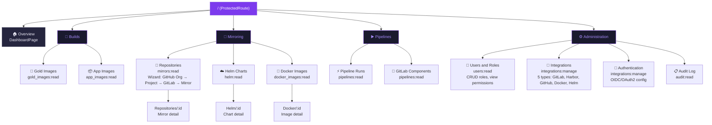

# BigBug — Navigation & Theme Redesign

> Дата: 2026-06-08
> Статус: Proposal (проектирование, не реализация)

## 1. Проблемы текущей навигации

| # | Проблема | Текущее состояние | Решение |
|---|----------|-------------------|---------|
| 1 | Dashboard — непонятное название | Меню: «Дашборд» | → Overview |
| 2 | Projects / Mirrors — неясная связь | Два отдельных пункта, непонятный порядок | → Repositories (единый wizard-based flow) |
| 3 | GitLab Components в Settings | `/settings/pipelines/components` | → Pipelines / Components |
| 4 | Audit Log в Settings | `/settings/audit-log` | → Administration / Audit Log |
| 5 | Settings и Admin размазаны | Settings: Integrations, Auth, Audit, Components. Admin: только Users & Roles | → Объединить в Administration |
| 6 | Integrations сломаны | Пустая страница | → Исправить в Administration / Integrations |
| 7 | Роли не создаются | Нет UI для CRUD ролей и просмотра permissions | → Administration / Users & Roles |
| 8 | Header белый в тёмной теме | `background: '#fff'` жёстко | → Токенизировать |

---

## 2. Новая структура меню (дерево с иконками)

```
BigBug
├── 🏠  Overview                           # бывший Dashboard
│
├── 🔨  Builds
│   ├── 👑  Gold Images                    # /builds/gold
│   └── 📦  App Images                     # /builds/app
│
├── 🔄  Mirroring
│   ├── 📂  Repositories                   # /mirroring/repositories (wizard: GitHub→GitLab)
│   ├── ☁️   Helm Charts                   # /mirroring/helm
│   └── 🐳  Docker Images                  # /mirroring/docker
│
├── ▶️   Pipelines
│   ├── ⚡  Pipeline Runs                   # /pipelines/runs
│   └── 🧩  GitLab Components              # /pipelines/components  ← из Settings
│
└── ⚙️   Administration
    ├── 👥  Users & Roles                  # /admin/users  (CRUD ролей, permissions)
    ├── 🔌  Integrations                   # /admin/integrations  (5 типов)
    ├── 🔐  Authentication                 # /admin/authentication  (OIDC/OAuth2)
    └── 📋  Audit Log                      # /admin/audit-log
```

### Иконки (из @ant-design/icons)

| Пункт меню | Иконка | Комментарий |
|------------|--------|-------------|
| Overview | `HomeOutlined` | Понятнее чем Dashboard |
| Builds (группа) | `BuildOutlined` | Инструменты/сборка |
| Gold Images | `CrownOutlined` | «Золотой» = корона |
| App Images | `AppstoreOutlined` | Приложения |
| Mirroring (группа) | `SyncOutlined` | Синхронизация/зеркалирование |
| Repositories | `GithubOutlined` | GitHub → GitLab flow |
| Helm Charts | `CloudOutlined` | Helm = cloud-native |
| Docker Images | `ContainerOutlined` | Контейнеры |
| Pipelines (группа) | `PlayCircleOutlined` | CI/CD запуск |
| Pipeline Runs | `ThunderboltOutlined` | Быстрое выполнение |
| GitLab Components | `BlockOutlined` | Переиспользуемые блоки |
| Administration (группа) | `SecurityScanOutlined` | Безопасность/управление |
| Users & Roles | `TeamOutlined` | Пользователи и команда |
| Integrations | `ApiOutlined` | API-интеграции |
| Authentication | `SafetyCertificateOutlined` | Сертификаты/безопасность |
| Audit Log | `AuditOutlined` | Аудит |

---

## 3. Таблица маршрутов

| URL Path | Page Component | Menu Group | Permission Required | Notes |
|----------|---------------|------------|---------------------|-------|
| `/` | `pages/Overview/index.tsx` | Overview | `viewers:read` | Бывший Dashboard |
| `/builds/gold` | `pages/Builds/GoldImages/index.tsx` | Builds | `gold_images:read` | |
| `/builds/app` | `pages/Builds/AppImages/index.tsx` | Builds | `app_images:read` | |
| `/mirroring/repositories` | `pages/Mirroring/Repositories/index.tsx` | Mirroring | `mirrors:read` | Unified wizard (Projects+Mirrors) |
| `/mirroring/repositories/:id` | `pages/Mirroring/Repositories/Detail.tsx` | Mirroring | `mirrors:read` | Mirror detail |
| `/mirroring/helm` | `pages/Mirroring/HelmCharts/index.tsx` | Mirroring | `helm:read` | |
| `/mirroring/helm/:id` | `pages/Mirroring/HelmCharts/Detail.tsx` | Mirroring | `helm:read` | |
| `/mirroring/docker` | `pages/Mirroring/DockerImages/index.tsx` | Mirroring | `docker_images:read` | |
| `/mirroring/docker/:id` | `pages/Mirroring/DockerImages/Detail.tsx` | Mirroring | `docker_images:read` | |
| `/pipelines/runs` | `pages/Pipelines/Runs/index.tsx` | Pipelines | `pipelines:read` | Бывший `/pipelines` |
| `/pipelines/components` | `pages/Pipelines/Components/index.tsx` | Pipelines | `pipelines:read` | Из `/settings/pipelines/components` |
| `/admin/users` | `pages/Admin/Users/index.tsx` | Administration | `users:read` | Бывший `/admin` |
| `/admin/integrations` | `pages/Admin/Integrations/index.tsx` | Administration | `integrations:manage` | Из `/settings/integrations` |
| `/admin/authentication` | `pages/Admin/Authentication/index.tsx` | Administration | `integrations:manage` | Из `/settings/authentication` |
| `/admin/audit-log` | `pages/Admin/AuditLog/index.tsx` | Administration | `audit:read` | Из `/settings/audit-log` |
| `/login` | `pages/Login/index.tsx` | — (public) | — | |
| `/sso/callback` | `pages/SsoCallback/index.tsx` | — (public) | — | |

### Страницы, которые будут удалены

| Старый URL | Компонент | Причина |
|-----------|-----------|---------|
| `/projects` | `pages/Projects/` | Вливается в Repositories wizard |
| `/projects/:id` | `pages/Projects/ProjectDetail.tsx` | Вливается в Repositories wizard |
| `/mirrors` | `pages/Mirrors/` | → `/mirroring/repositories` |
| `/mirrors/:id` | `pages/Mirrors/MirrorDetail.tsx` | → `/mirroring/repositories/:id` |
| `/settings/pipelines/components` | `pages/Settings/Pipelines/` | → `/pipelines/components` |
| `/settings/integrations` | `pages/Settings/Integrations/` | → `/admin/integrations` |
| `/settings/authentication` | `pages/Settings/Authentication/` | → `/admin/authentication` |
| `/settings/audit-log` | `pages/Settings/AuditLog/` | → `/admin/audit-log` |
| Весь `/settings/*` | `pages/Settings/` | Группа расформирована |

---

## 4. Mermaid-диаграмма навигации



---

## 5. Цветовая схема

### 5.1 Концепция

**Primary**: Тёмно-фиолетовый/сливовый **#7C3AED** — ассоциация с панцирем жука (BigBug), современный tech-стиль.

**Тёмная тема** — по умолчанию. DevOps-инструменты традиционно тёмные (терминал, IDE, Grafana).

**Светлая тема** — опционально, через переключатель (feature toggle).

### 5.2 Токены тёмной темы (Dark Theme — Default)

```jsonc
// antd ThemeConfig — darkAlgorithm
{
  "algorithm": "darkAlgorithm",

  "token": {
    // ── Primary palette ──────────────────────────────────
    "colorPrimary":         "#7C3AED",   // Plum 600
    "colorPrimaryBg":       "#1A1030",   // Plum 950 (фоновый tint)
    "colorPrimaryBgHover":  "#251845",   // Plum 900
    "colorPrimaryBorder":   "#5B21B6",   // Plum 700
    "colorPrimaryHover":    "#8B5CF6",   // Plum 500
    "colorPrimaryActive":   "#6D28D9",   // Plum 700 (нажатие)
    "colorPrimaryText":     "#A78BFA",   // Plum 400
    "colorPrimaryTextHover":"#C4B5FD",   // Plum 300

    // ── Secondary / Accent ───────────────────────────────
    "colorSecondary":       "#A78BFA",   // Plum 400 (дополнительный акцент)

    // ── Semantic ─────────────────────────────────────────
    "colorSuccess":         "#10B981",   // Emerald 500
    "colorWarning":         "#F59E0B",   // Amber 500
    "colorError":           "#EF4444",   // Red 500
    "colorInfo":            "#3B82F6",   // Blue 500

    // ── Neutral / Surface ────────────────────────────────
    "colorBgBase":          "#0F0F1A",   // Основной фон страницы
    "colorBgContainer":     "#1A1A2E",   // Surface (карточки, Sider)
    "colorBgElevated":      "#25253E",   // Elevated surface (dropdown, modal)
    "colorBgLayout":        "#0A0A14",   // Sider / Layout background

    "colorBorder":          "#2D2D45",   // Тонкие границы
    "colorBorderSecondary": "#1E1E32",   // Вторичные границы

    // ── Text ─────────────────────────────────────────────
    "colorText":            "#F1F0FB",   // Основной текст (почти белый)
    "colorTextSecondary":   "#A0A0B8",   // Вторичный текст
    "colorTextTertiary":    "#6B6B85",   // Третичный текст
    "colorTextQuaternary":  "#484860",   // Placeholder / disabled

    // ── Typography ───────────────────────────────────────
    "fontFamily":           "'Inter', -apple-system, BlinkMacSystemFont, 'Segoe UI', Roboto, sans-serif",
    "fontSize":             14,
    "borderRadius":         6,
    "borderRadiusLG":       8,
    "borderRadiusSM":       4,

    // ── Other ─────────────────────────────────────────────
    "lineHeight":           1.5715,
    "wireframe":            false
  },

  "components": {
    "Menu": {
      // Sider menu overrides
      "darkItemBg":              "#0A0A14",
      "darkItemColor":           "#A0A0B8",
      "darkItemHoverBg":         "rgba(124, 58, 237, 0.12)",
      "darkItemHoverColor":      "#C4B5FD",
      "darkItemSelectedBg":      "rgba(124, 58, 237, 0.20)",
      "darkItemSelectedColor":   "#A78BFA",
      "darkSubMenuItemBg":       "#0A0A14",
      "darkGroupTitleColor":     "#6B6B85",
      "darkItemDisabledColor":   "#484860",
      "itemHeight":              40,
      "itemMarginInline":        8,
      "itemBorderRadius":        6,
      "groupTitleFontSize":      11,
      "groupTitleLineHeight":    1.5
    },

    "Layout": {
      "siderBg":              "#0A0A14",
      "headerBg":             "#1A1A2E",
      "headerColor":          "#F1F0FB",
      "bodyBg":               "#0F0F1A",
      "triggerBg":            "#1A1A2E",
      "triggerColor":         "#A0A0B8"
    },

    "Card": {
      "colorBgContainer":     "#1A1A2E"
    },

    "Table": {
      "headerBg":             "#25253E",
      "rowHoverBg":           "rgba(124, 58, 237, 0.04)",
      "borderColor":          "#2D2D45"
    },

    "Tag": {
      "defaultBg":            "#25253E",
      "defaultColor":         "#A0A0B8"
    },

    "Button": {
      "primaryShadow":        "0 2px 0 rgba(124, 58, 237, 0.15)",
      "dangerShadow":         "0 2px 0 rgba(239, 68, 68, 0.15)"
    }
  }
}
```

### 5.3 Токены светлой темы (Light Theme)

```jsonc
// antd ThemeConfig — defaultAlgorithm
{
  "algorithm": "defaultAlgorithm",

  "token": {
    // ── Primary palette ──────────────────────────────────
    "colorPrimary":         "#7C3AED",   // Тот же plum
    "colorPrimaryBg":       "#F5F3FF",   // Plum 50
    "colorPrimaryBgHover":  "#EDE9FE",   // Plum 100
    "colorPrimaryBorder":   "#C4B5FD",   // Plum 300
    "colorPrimaryHover":    "#6D28D9",   // Plum 700
    "colorPrimaryActive":   "#5B21B6",   // Plum 800
    "colorPrimaryText":     "#6D28D9",   // Plum 700
    "colorPrimaryTextHover":"#5B21B6",   // Plum 800

    // ── Semantic ─────────────────────────────────────────
    "colorSuccess":         "#059669",   // Emerald 600
    "colorWarning":         "#D97706",   // Amber 600
    "colorError":           "#DC2626",   // Red 600
    "colorInfo":            "#2563EB",   // Blue 600

    // ── Neutral / Surface ────────────────────────────────
    "colorBgBase":          "#FAFAFE",
    "colorBgContainer":     "#FFFFFF",
    "colorBgElevated":      "#FFFFFF",
    "colorBgLayout":        "#F3F0F8",   // Чуть фиолетовый оттенок

    "colorBorder":          "#E5E0F0",
    "colorBorderSecondary": "#F0EDF5",

    // ── Text ─────────────────────────────────────────────
    "colorText":            "#1A1A2E",
    "colorTextSecondary":   "#5C5C78",
    "colorTextTertiary":    "#8B8BA0",
    "colorTextQuaternary":  "#B8B8C8",

    // ── Typography ───────────────────────────────────────
    "borderRadius":         6,
    "borderRadiusLG":       8,
    "borderRadiusSM":       4
  },

  "components": {
    "Menu": {
      "itemBg":               "#FFFFFF",
      "itemColor":            "#5C5C78",
      "itemHoverBg":          "#F5F3FF",
      "itemHoverColor":       "#7C3AED",
      "itemSelectedBg":       "#EDE9FE",
      "itemSelectedColor":    "#7C3AED",
      "subMenuItemBg":        "#FFFFFF",
      "groupTitleColor":      "#8B8BA0"
    },

    "Layout": {
      "siderBg":              "#F3F0F8",
      "headerBg":             "#FFFFFF",
      "headerColor":          "#1A1A2E",
      "bodyBg":               "#FAFAFE",
      "triggerBg":            "#F3F0F8",
      "triggerColor":         "#5C5C78"
    },

    "Card": {
      "colorBgContainer":     "#FFFFFF"
    }
  }
}
```

### 5.4 CSS-переменные (кастомные токены вне antd)

Для использования в инлайн-стилях и кастомных компонентах:

```css
:root {
  /* Тёмная тема (default) */
  --bb-bg-primary:      #0F0F1A;
  --bb-bg-surface:      #1A1A2E;
  --bb-bg-elevated:     #25253E;
  --bb-bg-sider:        #0A0A14;
  --bb-border:          #2D2D45;
  --bb-text-primary:    #F1F0FB;
  --bb-text-secondary:  #A0A0B8;
  --bb-brand:           #7C3AED;
  --bb-brand-hover:     #8B5CF6;
  --bb-brand-text:      #A78BFA;
}

[data-theme='light'] {
  --bb-bg-primary:      #FAFAFE;
  --bb-bg-surface:      #FFFFFF;
  --bb-bg-elevated:     #FFFFFF;
  --bb-bg-sider:        #F3F0F8;
  --bb-border:          #E5E0F0;
  --bb-text-primary:    #1A1A2E;
  --bb-text-secondary:  #5C5C78;
  --bb-brand:           #7C3AED;
  --bb-brand-hover:     #6D28D9;
  --bb-brand-text:      #6D28D9;
}
```

### 5.5 Градиент для логотипа/header

```css
/* Рекомендуемый градиент для логотипа BigBug */
background: linear-gradient(135deg, #7C3AED 0%, #A78BFA 50%, #C4B5FD 100%);
-webkit-background-clip: text;
-webkit-text-fill-color: transparent;

/* Альтернативный для Sider header */
background: linear-gradient(135deg, #7C3AED 0%, #5B21B6 100%);
```

---

## 6. План миграции

### 6.1 Этапы миграции

```
Этап 1: Переименование путей (URL redirects)
Этап 2: Реорганизация структуры папок
Этап 3: Обновление Layout (меню, иконки)
Этап 4: Цветовая схема (темизация)
Этап 5: Интеграция PermissionGate на все страницы
```

### 6.2 Этап 1: URL Redirects

Добавить редиректы со старых URL на новые (чтобы не ломать закладки):

| Старый URL | Новый URL | Тип |
|-----------|-----------|-----|
| `/` | `/` | Без изменений (переименование страницы) |
| `/gold-images` | `/builds/gold` | 301 Redirect |
| `/app-images` | `/builds/app` | 301 Redirect |
| `/projects` | `/mirroring/repositories` | 301 Redirect |
| `/projects/:id` | `/mirroring/repositories?project=:id` | Redirect |
| `/mirrors` | `/mirroring/repositories` | 301 Redirect |
| `/mirrors/:id` | `/mirroring/repositories/:id` | 301 Redirect |
| `/helm-charts` | `/mirroring/helm` | 301 Redirect |
| `/helm-charts/:id` | `/mirroring/helm/:id` | 301 Redirect |
| `/docker-images` | `/mirroring/docker` | 301 Redirect |
| `/docker-images/:id` | `/mirroring/docker/:id` | 301 Redirect |
| `/pipelines` | `/pipelines/runs` | 301 Redirect |
| `/settings/pipelines/components` | `/pipelines/components` | 301 Redirect |
| `/admin` | `/admin/users` | 301 Redirect |
| `/settings/integrations` | `/admin/integrations` | 301 Redirect |
| `/settings/authentication` | `/admin/authentication` | 301 Redirect |
| `/settings/audit-log` | `/admin/audit-log` | 301 Redirect |

### 6.3 Этап 2: Реорганизация структуры папок

```
frontend/src/pages/
├── Overview/                    # Бывший Dashboard
│   └── index.tsx
├── Builds/
│   ├── GoldImages/              # Бывший GoldImages
│   │   └── index.tsx
│   └── AppImages/               # Бывший AppImages
│       └── index.tsx
├── Mirroring/
│   ├── Repositories/            # Новый: объединяет Projects + Mirrors
│   │   ├── index.tsx            # Список зеркал + wizard создания
│   │   └── Detail.tsx           # Детали зеркала
│   ├── HelmCharts/              # Бывший HelmCharts
│   │   ├── index.tsx
│   │   └── Detail.tsx
│   └── DockerImages/            # Бывший DockerImages
│       ├── index.tsx
│       └── Detail.tsx
├── Pipelines/
│   ├── Runs/                    # Бывший Pipelines
│   │   └── index.tsx
│   └── Components/              # Бывший Settings/Pipelines
│       └── index.tsx
├── Admin/
│   ├── Users/                   # Бывший Admin (расширен: CRUD ролей, permissions)
│   │   └── index.tsx
│   ├── Integrations/            # Бывший Settings/Integrations
│   │   └── index.tsx
│   ├── Authentication/          # Бывший Settings/Authentication
│   │   └── index.tsx
│   └── AuditLog/                # Бывший Settings/AuditLog
│       └── index.tsx
├── Login/
│   └── index.tsx
└── SsoCallback/
    └── index.tsx
```

### 6.4 Этап 3: Обновление Layout

**Файл**: [`frontend/src/components/Layout/index.tsx`](frontend/src/components/Layout/index.tsx)

Изменения:
1. Замена иконок на новые (см. таблицу иконок в разделе 2)
2. Новые группы меню: Overview, Builds, Mirroring, Pipelines, Administration
3. Sider всегда показывает все группы; visibility регулируется через PermissionGate для конкретных пунктов
4. Administration видна только если есть хотя бы одно permission из: `users:read`, `integrations:manage`, `audit:read`
5. Header использует theme token `colorBgElevated` вместо жёсткого `#fff`
6. Логотип с градиентом (см. раздел 5.5)
7. Добавить `theme` toggle (иконка солнца/луны) в header

### 6.5 Этап 4: Цветовая схема

**Файл**: [`frontend/src/theme.ts`](frontend/src/theme.ts)

Изменения:
1. Заменить `colorPrimary` с `#1890ff` на `#7C3AED`
2. Добавить полный набор токенов из раздела 5.2
3. Добавить `components.Menu`, `components.Layout`, `components.Card`, `components.Table`
4. Создать `lightTheme` объект для светлой темы (раздел 5.3)
5. Создать `ThemeProvider` с контекстом переключения тёмная/светлая
6. Сохранять выбор темы в `localStorage`

### 6.6 Этап 5: PermissionGate на все страницы

Добавить `<PermissionGate>` для каждого route согласно таблице маршрутов:

```tsx
// Пример для /admin/users
<Route
  path="admin/users"
  element={
    <PermissionGate permission="users:read" fallback={<ForbiddenPage />}>
      <AdminUsersPage />
    </PermissionGate>
  }
/>

// Пример для /admin (группа видна если есть хоть одно permission)
<PermissionGate anyOf={["users:read", "integrations:manage", "audit:read"]}>
  {/* Admin menu group */}
</PermissionGate>
```

### 6.7 Что НЕ входит в этот план

- Редизайн wizard для Repositories (отдельная задача — PRD)
- Рефакторинг Integrations page (отдельная задача — исправление пустой страницы)
- Реализация CRUD ролей (отдельная задача — backend уже готов, frontend page расширяется)
- E2E тесты навигации (пишутся после реализации)

---

## 7. Сравнение: было → стало

### Меню

| Было | Стало |
|------|-------|
| Дашборд | Overview |
| Gold образы | Builds / Gold Images |
| App образы | Builds / App Images |
| Проекты | Mirroring / Repositories (wizard) |
| Зеркала | Mirroring / Repositories (wizard) |
| Helm чарты | Mirroring / Helm Charts |
| Docker образы | Mirroring / Docker Images |
| Пайплайны | Pipelines / Pipeline Runs |
| GitLab компоненты (в Settings) | Pipelines / GitLab Components |
| Админка | Administration / Users & Roles |
| Интеграции (в Settings) | Administration / Integrations |
| Аутентификация (в Settings) | Administration / Authentication |
| Аудит (в Settings) | Administration / Audit Log |

### Route paths

| Было | Стало |
|------|-------|
| `/` | `/` |
| `/gold-images` | `/builds/gold` |
| `/app-images` | `/builds/app` |
| `/projects`, `/projects/:id` | `/mirroring/repositories` (merged) |
| `/mirrors`, `/mirrors/:id` | `/mirroring/repositories`, `/mirroring/repositories/:id` |
| `/helm-charts`, `/helm-charts/:id` | `/mirroring/helm`, `/mirroring/helm/:id` |
| `/docker-images`, `/docker-images/:id` | `/mirroring/docker`, `/mirroring/docker/:id` |
| `/pipelines` | `/pipelines/runs` |
| `/settings/pipelines/components` | `/pipelines/components` |
| `/admin` | `/admin/users` |
| `/settings/integrations` | `/admin/integrations` |
| `/settings/authentication` | `/admin/authentication` |
| `/settings/audit-log` | `/admin/audit-log` |

### Цвета

| Элемент | Было | Стало (dark) | Стало (light) |
|---------|------|-------------|---------------|
| Primary | `#1890ff` (синий) | `#7C3AED` (сливовый) | `#7C3AED` (сливовый) |
| Page BG | Ant Design default | `#0F0F1A` | `#FAFAFE` |
| Sider BG | Ant Design dark | `#0A0A14` | `#F3F0F8` |
| Header BG | `#fff` (белый!) | `#1A1A2E` | `#FFFFFF` |
| Card BG | default | `#1A1A2E` | `#FFFFFF` |
| Text | default | `#F1F0FB` / `#A0A0B8` | `#1A1A2E` / `#5C5C78` |

---

## 8. Открытые вопросы

1. **Wizard для Repositories**: нужен ли отдельный PRD для проектирования wizard-интерфейса создания зеркала (GitHub Org → Project → GitLab → Mirror)?
2. **Theme toggle**: где разместить переключатель тёмной/светлой темы — в header рядом с аватаром или в Sider снизу?
3. **Сохранение свёрнутого состояния групп меню**: нужно ли сохранять в localStorage?
4. **Интеграция с Keycloak SSO**: остаётся ли страница Login или полностью переходим на Keycloak login page?

---

## Приложение A: Файлы, затрагиваемые миграцией

### Изменяемые файлы
| Файл | Изменение |
|------|-----------|
| `frontend/src/router/index.tsx` | Новые route paths, redirects, PermissionGate |
| `frontend/src/components/Layout/index.tsx` | Новое меню, иконки, theme toggle |
| `frontend/src/theme.ts` | Полный редизайн токенов |
| `frontend/src/App.tsx` | ThemeProvider обёртка |
| `frontend/src/store/api.ts` | Обновление tagTypes если нужно |

### Перемещаемые файлы (git mv)
| Старый путь | Новый путь |
|------------|------------|
| `pages/Dashboard/index.tsx` | `pages/Overview/index.tsx` |
| `pages/GoldImages/index.tsx` | `pages/Builds/GoldImages/index.tsx` |
| `pages/AppImages/index.tsx` | `pages/Builds/AppImages/index.tsx` |
| `pages/Projects/*` | `pages/Mirroring/Repositories/*` (частично) |
| `pages/Mirrors/*` | `pages/Mirroring/Repositories/*` (частично) |
| `pages/HelmCharts/*` | `pages/Mirroring/HelmCharts/*` |
| `pages/DockerImages/*` | `pages/Mirroring/DockerImages/*` |
| `pages/Pipelines/index.tsx` | `pages/Pipelines/Runs/index.tsx` |
| `pages/Settings/Pipelines/index.tsx` | `pages/Pipelines/Components/index.tsx` |
| `pages/Admin/index.tsx` | `pages/Admin/Users/index.tsx` |
| `pages/Settings/Integrations/index.tsx` | `pages/Admin/Integrations/index.tsx` |
| `pages/Settings/Authentication/index.tsx` | `pages/Admin/Authentication/index.tsx` |
| `pages/Settings/AuditLog/index.tsx` | `pages/Admin/AuditLog/index.tsx` |

### Удаляемые файлы
| Файл | Причина |
|------|---------|
| `pages/Settings/` (вся директория) | Группа Settings расформирована |

## Приложение B: Необходимые permissions для меню

```typescript
// Минимальные permissions для видимости групп меню
const MENU_PERMISSIONS = {
  overview:     'viewers:read',
  builds_gold:  'gold_images:read',
  builds_app:   'app_images:read',
  mirroring_repos: 'mirrors:read',
  mirroring_helm:  'helm:read',
  mirroring_docker:'docker_images:read',
  pipelines_runs:    'pipelines:read',
  pipelines_components:'pipelines:read',  // или 'components:read'
  admin_users:      'users:read',
  admin_integrations:'integrations:manage',
  admin_auth:       'integrations:manage',  // OIDC настройки
  admin_audit:      'audit:read',
} as const;
```
