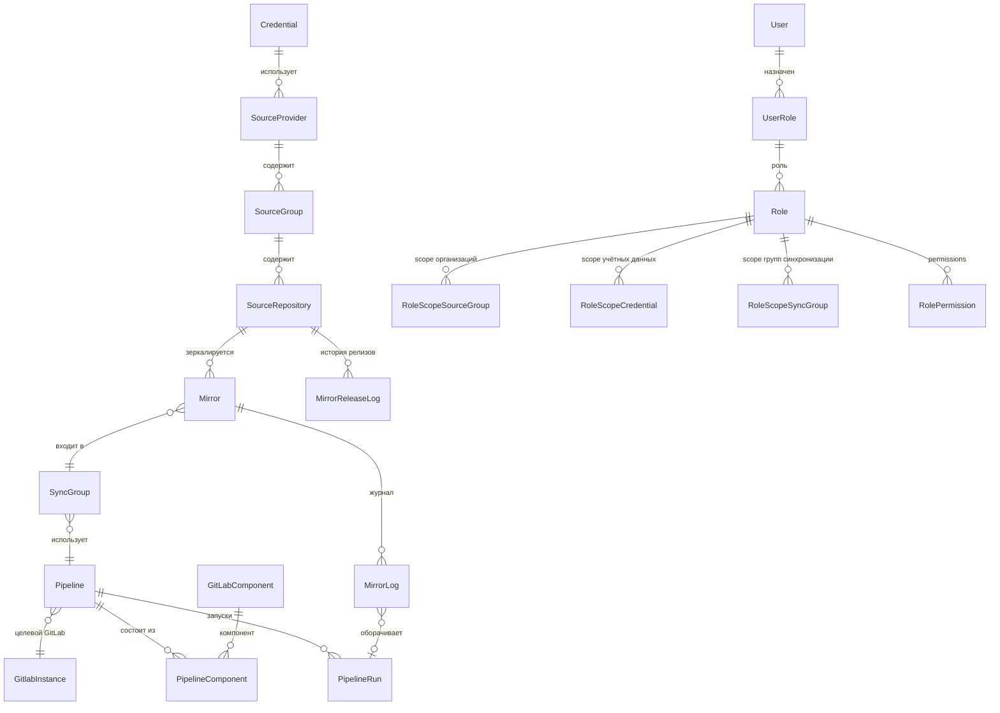

# Git Repository Mirroring v2 — User Stories & User Cases

> **Статус**: Согласовано — 2026-06-13
> **Контекст**: Полный рефакторинг системы зеркалирования git-репозиториев.
> **Текущая версия**: [`plans/features/mirroring.md`](mirroring.md) (только GitHub → GitLab)

---

## Сводка ключевых архитектурных решений

| Аспект | Решение |
|--------|---------|
| **Credentials** | Settings → Integrations, отдельно от Mirroring |
| **Типы источников** | GitHub, GitLab, Generic git. Архитектура под расширение (Bitbucket, Azure DevOps позже) |
| **Аутентификация** | GitHub/GitLab: HTTPS (user/pass) + SSH (key) + token. Generic: HTTPS (user/pass) + SSH (key), без токенов |
| **Механизм зеркалирования** | CI/CD пайплайны (в отдельной инфраструктурной GitLab-группе), BigBug — оркестратор через GitLab API. Цепочка разрешения: Mirror → SyncGroup → Pipeline → GitlabInstance + Components |
| **Pipeline (сущность)** | Самостоятельная сущность: конфигурация CI/CD пайплайна (gitlab_instance_id, ref, default_variables, components M2M). Дефолтный пайплайн для git sync, возможность кастомных пайплайнов. Pipeline имеет запуски (PipelineRun), MirrorLog — обёртка вокруг PipelineRun |
| **Релизы и лицензии** | SourceRepository хранит информацию о релизах (latest_release_tag, latest_release_date), лицензии (license_spdx, license_name) и README. MirrorReleaseLog ведёт историю обнаруженных релизов. Доступен просмотр README через систему (без открытия target-репозитория) |
| **Sync Groups** | Независимые от организаций, many-to-one к зеркалам. Группа по умолчанию — без операций |
| **Целевой GitLab** | Индивидуально на зеркало, массовое назначение через bulk |
| **Обнаружение изменений** | Фоновая проверка организаций, индикаторы новых/archived/удалённых |
| **Приоритет реализации** | GitHub → GitLab → Generic git. Архитектура закладывается под все сразу |
| **Раздел Git Mirroring** | Отдельный top-level раздел в навигации. Текущий раздел «Mirroring» переименован в «Artifacts» (Helm Charts + Docker Images). Pipelines — унифицированный раздел для всех модулей |
| **RBAC** | Scoped access через роли: Source Groups, Credentials, Sync Groups настраиваются администратором для каждой роли |
| **Source URL** | Система хранит веб-URL репозитория (https://github.com/org/repo), а не git-ссылку. Обеспечивает однозначную идентификацию независимо от протокола клонирования |
| **Поиск** | Полнотекстовый поиск по зеркалам: source URL, org/repo name, target GitLab, target path, статус. С учётом RBAC scope |
| **Дубликаты** | Предупреждение (warning), не блокировка. Критерий: source_url + target_gitlab_id + target_path. Пользователь может продолжить создание осознанно |
| **Dashboard** | Отдельная страница сводной статистики: количество зеркал по статусам, график синхронизаций за 7/30/90 дней, топ-5 проблемных зеркал, сводка по Sync Groups. Кликабельные KPI-карточки с переходом к отфильтрованному списку |
| **Отчёты** | Четыре типа: дубликаты, занимаемое место, статусы, синхронизации за период + лицензии. UI + экспорт CSV/JSON. Только для Admin |

---

## User Stories

### US-1: Управление учётными данными источников (Credentials)

**Как** DevOps-инженер, **я хочу** управлять учётными данными для внешних git-источников в разделе **Settings → Integrations**, **чтобы** централизованно контролировать доступы и переиспользовать их при настройке зеркалирования.

**Детали:**
- Один и тот же хостинг может быть добавлен несколько раз (разные токены с разными правами)
- GitHub: HTTPS (user/pass), SSH (key), токен с GitHub-специфичными возможностями
- GitLab: HTTPS (user/pass), SSH (key), токен с GitLab-специфичными возможностями
- Generic git: HTTPS (user/pass) + SSH (key), без токенов
- Тест соединения для каждого credential
- Fernet-шифрование всех секретов

### US-2: Импорт организаций/групп из внешних источников

**Как** DevOps-инженер, **я хочу** импортировать в BigBug организацию/группу из внешнего git-источника, **чтобы** видеть все репозитории этой организации и управлять их зеркалированием.

**Детали:**
- GitHub: организации и пользователи (user as org)
- GitLab: группы и подгруппы (включая self-hosted)
- Generic git: без организационной структуры (репозитории добавляются по одному)
- При импорте подтягивается полный список репозиториев с метаданными: archived, fork, private/public, language, default branch
- Выбор credential для доступа к API источника

### US-3: Массовый выбор репозиториев для зеркалирования

**Как** DevOps-инженер, **я хочу** выбирать репозитории из импортированной организации через таблицу с фильтрами и чекбоксами, **чтобы** быстро настроить зеркалирование для большой организации (100+ репозиториев).

**Детали:**
- Таблица: чекбоксы, имя, archived/fork/private метки, язык, статус зеркалирования
- Фильтры: по имени, статусу (archived/active), языку, видимости (public/private), fork/source
- Select all / Deselect all / постраничный выбор
- При создании зеркал массово указывается: целевой GitLab, namespace, Sync Group, mirrored branch
- Или индивидуально на строку репозитория

### US-4: Группы синхронизации (Sync Groups)

**Как** DevOps-инженер, **я хочу** создавать группы синхронизации с гибкой настройкой, **чтобы** управлять тем, как часто и каким образом синхронизируются и проверяются репозитории, не упираясь в rate limits внешних источников.

**Детали:**
- **Группа по умолчанию** — пустой контейнер, никаких операций. Просто место, куда попадают новые зеркала
- Пользовательские группы могут включать:
  - **Sync-операцию** (CI/CD пайплайн: git clone --mirror + git push) со своим cron-расписанием
  - **Freshness-проверку** (API: сравнение last commit hash/date/author) со своим cron-расписанием
  - Обе операции одновременно (с независимыми расписаниями)
- Concurrency limit для sync (сколько зеркал синхронизировать параллельно)
- Concurrency limit для freshness API-запросов (rate limiting source API)
- Cron-расписания независимы для sync и freshness
- Не обязательно настраивать CI/CD пайплайн при создании Sync Group
- Sync Group не привязана к организации или источнику — независимая сущность
- Каждое зеркало принадлежит ровно одной Sync Group (many-to-one)
- При создании зеркала — назначается в группу по умолчанию, пользователь может изменить

### US-5: Просмотр и мониторинг состояния зеркал

**Как** DevOps-инженер, **я хочу** видеть единую панель состояния всех git-зеркал, **чтобы** быстро диагностировать проблемы и понимать актуальность зеркал.

**Детали:**
- Единая таблица со всеми зеркалами из разных источников
- Фильтры: по источнику, организации, статусу, Sync Group, целевому GitLab
- Статусы: OK, Failed, Warning (stale, diverged, archived source, source missing), In Progress, Pending
- Для каждого зеркала: source repo → target GitLab project, последняя синхронизация, статус, Sync Group
- Возможность ручного запуска синхронизации (индивидуально)

### US-6: Инкрементальное обнаружение новых и удалённых репозиториев

**Как** DevOps-инженер, **я хочу** чтобы BigBug автоматически обнаруживал изменения в импортированных организациях (новые репозитории, удалённые, archived), **чтобы** поддерживать актуальность зеркал без ручного контроля.

**Детали:**
- Периодическая фоновая проверка импортированных организаций
- Новые репозитории: статус «New» / «Pending», визуальный индикатор на организации
- Archived репозитории в источнике: зеркало помечается предупреждением, синхронизация приостанавливается
- Удалённые репозитории в источнике: зеркало помечается «Source missing», синхронизация останавливается
- Возможность быстро добавить новые/удалить осиротевшие зеркала

### US-7: Проверка актуальности зеркал (Freshness Check)

**Как** DevOps-инженер, **я хочу** чтобы система периодически проверяла актуальность кода в зеркалах относительно источника (hash, дата, автор последнего коммита), **чтобы** быстро видеть отстающие зеркала без запуска полной синхронизации.

**Детали:**
- Лёгкая операция: API-запросы к source и target git (без CI/CD пайплайна)
- Сравнивает: last commit hash, дату последнего коммита, автора
- Результат: «Up to date», «Behind: N commits», «Ahead» (если в зеркале есть коммиты, которых нет в источнике), «Unknown» (не удалось проверить)
- Запускается по cron-расписанию Sync Group для всех зеркал группы
- Можно запустить вручную: индивидуально («Check» на зеркале) или массово на всю группу
- Concurrency limit для API-запросов (rate limiting source API)

### US-8: Импорт существующего зеркала (Import Existing Mirror)

**Как** DevOps-инженер, **я хочу** импортировать в BigBug существующее зеркало (когда source-репозиторий уже скопирован в GitLab-проект без участия BigBug), **чтобы** восстановить управление после сбоя системы или при миграции.

**Детали:**
- Поддерживается для всех типов источников: GitHub, GitLab, generic git
- Пользователь указывает: source repository + GitLab target project
- Система верифицирует связь через сравнение commit history (последний общий коммит)
- После успешной верификации создаётся зеркало и сразу запускается freshness check
- Не запускает синхронизацию автоматически (только freshness check)
- Импорт только ручной, по одному зеркалу
- Для generic git source: пользователь также указывает credentials (HTTPS/SSH) для доступа

### US-9: Страница детализации процесса зеркалирования

**Как** DevOps-инженер, **я хочу** видеть детальную страницу каждого зеркала с историей синхронизаций, **чтобы** отслеживать процесс зеркалирования в реальном времени и диагностировать проблемы.

**Детали:**
- **Детальная страница зеркала**: статус, все sync-сессии, все freshness-проверки, таймлайн изменений, логи CI/CD пайплайнов
- Для общей сводки по всем зеркалам — отдельная страница **Dashboard** (см. US-10)

### US-10: Dashboard — сводная панель статистики зеркалирования

**Как** DevOps-инженер/администратор, **я хочу** видеть сводную панель со статистикой по всем зеркалам на отдельной странице, **чтобы** быстро оценивать общее состояние системы зеркалирования, видеть количество проблемных зеркал и понимать тренды без необходимости заходить в таблицу каждого зеркала.

**Детали:**
- Отдельная страница **Dashboard** (`/git-mirroring/dashboard`), первый пункт в разделе Git Mirroring
- **Карточки-счётчики** (KPI):
  - Всего зеркал (Total Mirrors)
  - OK (успешно синхронизированные)
  - Failed (проваленные последние синхронизации)
  - Warning (stale, diverged, archived source, source missing)
  - In Progress (идут прямо сейчас)
  - Pending (ещё не синхронизировались)
- **Карточки кликабельны** — клик по статусу ведёт на страницу Mirrors с предустановленным фильтром по этому статусу
- **График синхронизаций за период** (по умолчанию 7 дней):
  - Столбчатая диаграмма: успешные синхронизации (зелёный) и проваленные (красный) по дням
  - Возможность переключить период: 7 дней / 30 дней / 90 дней
- **Топ-5 проблемных зеркал**:
  - Зеркала с наибольшим количеством failed-синхронизаций за выбранный период
  - Для каждого: source → target, количество failed, дата последнего failed
  - Клик → переход на страницу Mirror Process
- **Сводка по Sync Groups**:
  - Таблица: имя группы, количество зеркал, последняя синхронизация, % успешных за период
- Данные обновляются при загрузке страницы, кнопка «Refresh» для принудительного обновления
- Учитывает RBAC scope оператора (показывает статистику только по доступным зеркалам)

### US-11: Аудит-лог событий зеркалирования

**Как** администратор безопасности, **я хочу** видеть кодифицированный аудит-лог всех пользовательских событий, связанных с зеркалами, **чтобы** отслеживать кто, когда и что делал.

**Детали:**
- Дополнить существующий [`AuditLog`](../../backend/app/models/audit_log.py) новыми кодифицированными событиями
- Кодифицированные события:

| Событие | Описание |
|---------|----------|
| `mirror.created` | Создано новое зеркало (включая bulk) |
| `mirror.updated` | Изменены параметры зеркала |
| `mirror.deleted` | Зеркало удалено (soft delete) |
| `mirror.restored` | Зеркало восстановлено из корзины |
| `mirror.sync.triggered` | Запущена синхронизация (ручная или автоматическая) |
| `mirror.freshness.triggered` | Запущена проверка актуальности |
| `mirror.imported` | Импортировано существующее зеркало |
| `mirror.source_changed` | Переключён source для осиротевшего зеркала |
| `mirror.orphaned` | Зеркало помечено как осиротевшее |
| `mirror.unorphaned` | Зеркало восстановлено из осиротевших |
| `sync_group.created` | Создана Sync Group |
| `sync_group.updated` | Изменены параметры Sync Group |
| `sync_group.deleted` | Удалена Sync Group |
| `source_group.created` | Импортирована организация/группа |
| `source_group.updated` | Обновлена организация/группа |
| `source_group.deleted` | Удалена организация/группа |
| `source_group.refreshed` | Обновлён список репозиториев организации |
| `pipeline.created` | Создана конфигурация Pipeline |
| `pipeline.updated` | Изменена конфигурация Pipeline |
| `pipeline.deleted` | Удалена конфигурация Pipeline |
| `sync_group.pipeline_applied` | Pipeline массово применён к SyncGroup |
| `mirror.release_detected` | Обнаружен новый релиз source-репозитория |
| `report.generated` | Сгенерирован отчёт (тип отчёта, формат, scope) |

- Каждое событие содержит: `user_id`, `username`, `ip_address`, `timestamp`, `resource_type` + `resource_id`, `resource_name`, `details` (JSON с ключевыми полями до/после)
- Для автоматических синхронизаций (по расписанию Sync Group): `username: "system"`, `user_id: null`
- Для удаления: `details` содержат ключевые поля сущности НА МОМЕНТ удаления (source repo name, target GitLab project, status)
- Страница аудита с фильтрацией по событиям и сущностям

### US-12: Отложенное удаление (Soft Delete)

**Как** DevOps-инженер, **я хочу** чтобы удалённые сущности Mirroring не исчезали сразу, а помещались в корзину с возможностью восстановления, **чтобы** избежать необратимых ошибок.

**Детали:**
- Soft delete для всех сущностей Mirroring:
  - Зеркала (mirrors)
  - Sync Groups
  - Source Groups (организации/группы)
  - Organizations
- Глобальный настраиваемый период хранения (по умолчанию 30 дней)
- После удаления — сущность помечается `deleted_at`, исключается из активных списков
- Возможность восстановить в течение периода
- Cleanup job: автоматическое физическое удаление по истечении срока
- В аудит-лог пишется `deleted` и `restored`

### US-13: Проверка и восстановление консистентности (Health Check)

**Как** DevOps-инженер, **я хочу** запускать проверку консистентности данных зеркалирования по требованию, **чтобы** выявлять и исправлять проблемы.

**Детали:**
- Запускается вручную (кнопка «Health Check») на уровне:
  - Системы (все зеркала)
  - Sync Group (зеркала группы)
  - Отдельного зеркала
- Проверяет:
  - Работоспособность credentials для source
  - Существование GitLab target проекта
  - Расхождения commit history (если нет свежей freshness-проверки)
  - Целостность связей (source repo → mirror → sync group)
- Автоматическое восстановление где возможно (обновить статус, пересоздать pipeline)
- Для неавтоматических случаев — Wizard с пошаговыми инструкциями
- Генерирует Health Check Report

### US-14: Управление осиротевшими репозиториями (Orphaned Mirrors)

**Как** DevOps-инженер, **я хочу** специальным образом управлять зеркалами, чей source-репозиторий исчез (удалён, скрыт, переименован), **чтобы** корректно обрабатывать такие ситуации.

**Детали:**
- Ситуации: удаление source, скрытие под приватность, переименование/перенос в другую оргу
- Оператор вручную помечает зеркало специальным флагом (после самостоятельной верификации)
- При пометке:
  - Зеркало автоматически перемещается в специальную Sync Group «Orphaned»
  - Зеркало появляется на отдельной странице «Orphaned Mirrors»
  - GitLab target project автоматически перемещается в специальную GitLab-группу для осиротевших
- Возможность «переключить» осиротевшее зеркало на новый source (если репозиторий переехал в другую оргу/был переименован)
- Возможность восстановить если source снова доступен
- Отдельная страница «Orphaned Mirrors» с фильтрацией и массовыми операциями

### US-15: Обнаружение повреждения целевого репозитория (Target Integrity Check)

**Как** DevOps-инженер, **я хочу** проверять, не был ли target-репозиторий повреждён ручными коммитами, **чтобы** гарантировать что зеркало точно соответствует источнику.

**Детали:**
- Отдельный CI/CD пайплайн (не sync, а audit/comparison)
- Сравнивает commit history source и target глубже чем freshness check
- Обнаруживает: ручные коммиты в target, force push, расхождение веток
- Запускается вручную (кнопка «Verify Integrity» на зеркале)
- Результат: «Clean», «Diverged: N extra commits in target», «Corrupted»
- При «Diverged» — рекомендация пересоздать зеркало (force sync)

---

## User Cases

### UC-1: Первичная настройка зеркалирования для GitHub-организации

1. Админ добавляет GitHub-токен в **Settings → Integrations → GitHub**
2. Переходит в **Git Mirroring → Source Groups**, нажимает «Import Group»
3. Выбирает тип «GitHub», инстанс (credentials), вводит имя организации
4. Система импортирует организацию и все репозитории (метаданные подтягиваются через GitHub API)
5. Админ открывает импортированную организацию, видит таблицу со всеми репозиториями
6. Использует фильтры (например, исключает archived и forks), отмечает чекбоксами нужные
7. Нажимает «Create Mirrors» — открывается форма массового создания
8. Выбирает: целевой GitLab-инстанс, namespace, Sync Group, mirrored branch
9. Система создаёт зеркала и запускает начальную синхронизацию (CI/CD пайплайн импорта)

### UC-2: Добавление новых репозиториев в существующую организацию

1. В организации на GitHub появилось 3 новых репозитория
2. BigBug при фоновой проверке обнаруживает их — организация показывает индикатор «3 new»
3. Админ заходит в **Git Mirroring → Source Groups**, открывает организацию
4. Видит 3 репозитория с плашкой «New» вверху списка
5. Отмечает нужные, нажимает «Create Mirrors»
6. Выбирает Sync Group и целевой GitLab/namespace
7. Система создаёт зеркала, запускает пайплайны импорта

### UC-3: Настройка зеркалирования из self-hosted GitLab

1. Админ добавляет self-hosted GitLab в **Settings → Integrations → GitLab** (URL + токен)
2. Проверяет соединение (test connection)
3. Переходит в **Git Mirroring → Source Groups**, нажимает «Import Group»
4. Выбирает тип «GitLab», инстанс, вводит путь к группе (например, `my-group/subgroup`)
5. Система импортирует группу и все проекты
6. Дальше — как в UC-1, шаги 5-9

### UC-4: Настройка Sync Group для ежечасной синхронизации активных репозиториев

1. Админ заходит в **Git Mirroring → Sync Groups**
2. Видит группу по умолчанию «Default» (без операций)
3. Создаёт новую группу «Production Mirrors»:
   - Sync cron: `0 * * * *`, concurrency = 3
   - Freshness cron: `*/30 * * * *`, concurrency = 10
4. Возвращается в список зеркал, массово выбирает production-репозитории
5. Нажимает «Change Sync Group», выбирает «Production Mirrors»
6. Система обновляет принадлежность зеркал к группе

### UC-5: Диагностика проблем с зеркалами

1. Админ заходит в **Git Mirroring → Mirrors**
2. Видит сводку: 45 OK, 3 Failed, 2 Warning
3. Фильтрует по статусу «Failed» + «Warning»
4. Видит:
   - Зеркало A: «Sync failed — authentication error» → проверяет токен в Integrations
   - Зеркало B: «Source repository archived» → принимает решение оставить или удалить
   - Зеркало C: «Source repository not found» → удаляет зеркало
5. Для зеркала A обновляет токен и запускает «Sync Now» вручную

### UC-6: Подключение generic git-репозитория (одиночного)

1. Админ заходит в **Git Mirroring → Repositories**, нажимает «Create Mirror» (для Generic Git — отдельная форма)
2. Выбирает тип «Generic Git»
3. Вводит: URL репозитория (https://...), HTTPS credentials (user/pass) или SSH key
4. Указывает целевой GitLab, namespace, Sync Group, mirrored branch
5. Система создаёт зеркало и запускает пайплайн импорта (git clone --mirror + git push)

### UC-7: Восстановление зеркала после сбоя системы (Import Existing)

1. Система BigBug была переустановлена, но зеркала в GitLab остались
2. Админ добавляет GitHub-токен в **Settings → Integrations → GitHub**
3. Переходит в **Git Mirroring → Mirrors**, нажимает «Import Existing Mirror»
4. Выбирает тип источника «GitHub», credentials (токен)
5. Вводит URL source-репозитория (`github.com/org/repo`) и URL GitLab-проекта (`gitlab.internal.com/group/mirror-repo`)
6. Система проверяет commit history: находит общий коммит → связь подтверждена
7. Создаётся зеркало, назначается в Sync Group по умолчанию
8. Система запускает freshness check
9. Админ видит зеркало в списке со статусом «Up to date» или «Behind: N commits»

### UC-8: Проверка консистентности после инцидента (Health Check)

1. Админ заходит в **Git Mirroring → Reports** → вкладка «Status Distribution»
2. Нажимает «Run Health Check»
3. Система проверяет все зеркала, выдаёт отчёт:
   - 45 OK, 3 warnings, 2 errors
4. Для warnings (credentials истекают) — wizard предлагает обновить токен
5. Для errors (target project удалён в GitLab) — wizard предлагает пересоздать
6. Админ проходит wizard, исправляет проблемы

### UC-9: Обработка удалённого/перемещённого source-репозитория (Orphaned)

1. Freshness-проверка обнаружила: source repo недоступен (404)
2. Зеркало помечается «Source missing — requires verification»
3. Админ заходит в зеркало, проверяет вручную
4. Выясняет: репозиторий переехал в другую GitHub-организацию
5. Нажимает «Mark as Orphaned», затем «Switch Source»
6. Указывает новый URL репозитория
7. Система верифицирует связь через commit history, обновляет source
8. Зеркало возвращается в активную Sync Group

### UC-10: Обнаружение ручных коммитов в target (Integrity Check)

1. Админ замечает подозрительную активность в GitLab target проекте
2. Заходит в зеркало, нажимает «Verify Target Integrity»
3. Система запускает integrity CI/CD пайплайн
4. Пайплайн обнаруживает: 3 посторонних коммита в target, отсутствующих в source
5. Статус зеркала: «Diverged: 3 extra commits in target»
6. Админ принимает решение: force re-sync (пересоздать зеркало через пайплайн импорта)
7. Запускает пайплайн импорта заново — зеркало восстановлено до состояния source

### UC-11: Использование Dashboard для оценки состояния системы

1. DevOps-инженер заходит в **Git Mirroring → Dashboard**
2. Видит карточки-счётчики: всего 230 зеркал, 198 OK (зелёный), 12 Failed (красный), 15 Warning (жёлтый), 3 In Progress (синий), 2 Pending (серый)
3. Замечает 12 Failed — кликает по красной карточке
4. Система перенаправляет на **Git Mirroring → Mirrors** с предустановленным фильтром «Failed»
5. Оператор видит 12 проблемных зеркал, отсортированных по дате последнего failed
6. Ниже — график синхронизаций за 7 дней: видит, что вчера был всплеск failed (25 штук), сегодня — только 3
7. Понимает, что проблема уже почти решена (коллега починил ночью)
8. Смотрит «Топ-5 проблемных зеркал»: лидирует `github.com/team/old-service` (8 failed за неделю)
9. Кликает по нему → переходит на Mirror Process, видит ошибку аутентификации
10. Идёт в Integrations обновлять токен
11. Возвращается на Dashboard, нажимает Refresh — статистика обновлена
12. Смотрит сводку по Sync Groups: «Production Sync» — 85 зеркал, 98% успешных; «Archive» — 40 зеркал, 100% успешных
13. Переключает график на 30 дней — видит позитивный тренд: количество failed снижается

---

### US-16: Ролевой доступ с ограничением видимости (Scoped RBAC)

**Как** администратор, **я хочу** настраивать для каждой роли не только права действий (permissions), но и scope видимых сущностей (Source Groups, Credentials, Sync Groups), **чтобы** операторы видели и управляли только своими репозиториями и не имели доступа к чужим.

**Детали:**
- Scope — часть роли. Все операторы с одной ролью видят один и тот же набор сущностей
- Администратор настраивает в интерфейсе роли:
  - **Permissions**: `mirrors:read`, `mirrors:write`, `mirrors:sync`, `mirrors:delete`, `sync_groups:read`, `sync_groups:write`, `source_groups:read`, `source_groups:write`, `credentials:read`, `credentials:use`
  - **Scope — Source Groups**: к каким организациям/группам есть доступ (read/write/manage)
  - **Scope — Credentials**: какие учётные данные можно использовать (use)
  - **Scope — Sync Groups**: к каким группам синхронизации есть доступ (read/write/manage)
- Оператор видит только те сущности, которые разрешены его ролью
- Оператор может создавать новые зеркала, но только из доступных Source Groups и с доступными Credentials
- Оператор может создавать свои Sync Groups — они автоматически добавляются в его scope
- Попытка доступа к сущности вне scope → 403 Forbidden
- Все действия вне scope запрещены (просмотр разрешён, управление — нет)

**Субъект аудита**: системные действия (sync по расписанию) логируются с `username: "system"`, ручные — с реальным пользователем

### Новая таблица permissions для зеркалирования

| # | Permission | Назначение | Admin | Operator | Viewer |
|---|-----------|------------|:-----:|:--------:|:------:|
| — | `mirrors:read` | Просмотр зеркал (в своём scope) | ✅ | ✅ | ✅ |
| — | `mirrors:write` | Создание/изменение зеркал (в scope) | ✅ | ✅ | |
| — | `mirrors:delete` | Удаление зеркал (в scope) | ✅ | | |
| — | `mirrors:sync` | Запуск синхронизации (в scope) | ✅ | ✅ | |
| — | `mirrors:import` | Импорт существующих зеркал | ✅ | | |
| — | `mirrors:integrity_check` | Проверка целостности target | ✅ | ✅ | |
| — | `mirrors:manage_orphaned` | Управление осиротевшими | ✅ | ✅ | |
| **NEW** | `source_groups:read` | Просмотр организаций/групп (в scope) | ✅ | ✅ | ✅ |
| **NEW** | `source_groups:write` | Импорт/обновление организаций (в scope) | ✅ | ✅ | |
| **NEW** | `source_groups:delete` | Удаление организаций | ✅ | | |
| **NEW** | `source_groups:refresh` | Обновление списка репозиториев | ✅ | ✅ | |
| **NEW** | `sync_groups:read` | Просмотр Sync Groups (в scope) | ✅ | ✅ | ✅ |
| **NEW** | `sync_groups:write` | Создание/изменение Sync Groups | ✅ | ✅ | |
| **NEW** | `sync_groups:delete` | Удаление Sync Groups | ✅ | | |
| **NEW** | `credentials:read` | Просмотр учётных данных | ✅ | | ✅ |
| **NEW** | `credentials:use` | Использование учётных данных (в scope) | ✅ | ✅ | |

**Примечание**: `credentials:use` — оператор может *использовать* credential для создания зеркала, но не может просматривать/редактировать/удалять его в Integrations. `credentials:read` — viewer может видеть список credentials (но не секреты).

---

### US-17: Поиск по зеркалам

**Как** оператор/администратор, **я хочу** искать зеркала по ключевым параметрам (source URL, название org/repo, целевой GitLab, target path, статус), **чтобы** быстро находить нужное зеркало среди сотен/тысяч.

**Детали:**
- Поиск через search bar на странице зеркал
- Поддержка полнотекстового поиска по:
  - **Source web URL** (например, `https://github.com/org/repo`) — система хранит веб-URL источника, а не git-ссылку (SSH/HTTPS). Это обеспечивает однозначную идентификацию репозитория независимо от протокола клонирования
  - **Source name** (org/repo, например `facebook/react`)
  - **Target GitLab** (имя целевого GitLab-инстанса)
  - **Target path** (namespace/project в целевом GitLab)
  - **Статус зеркала** (OK, Failed, Warning, In Progress, Pending)
- Фильтрация по статусу: чекбоксы/теги статусов (можно выбрать несколько)
- Результаты поиска отображаются в той же таблице зеркал с подсветкой совпадений
- Поиск учитывает scope оператора (только зеркала в доступных Source Groups/Sync Groups)
- История поисковых запросов не сохраняется (stateless)

---

### US-18: Предупреждение о дубликатах при создании зеркала

**Как** оператор/администратор, **я хочу** получать предупреждение при попытке создать зеркало, которое уже существует в системе, **чтобы** избежать случайного дублирования, но иметь возможность создать дубль осознанно (если у меня нет доступа к существующему зеркалу).

**Детали:**
- При создании зеркала (одиночного или bulk) система проверяет: существует ли уже зеркало с тем же source repository (source_url) на тот же target GitLab
- Проверка на дубликат производится **до** фактического создания
- Если дубликат найден — система показывает **warning-уведомление**:
  - «Зеркало для `github.com/org/repo` уже существует (target: `gitlab.internal/namespace/project`, статус: OK)»
  - Пользователь может **продолжить** создание (кнопка «Всё равно создать») или **отменить**
- Дубликат не блокируется, потому что:
  - Пользователь может не иметь доступа к существующему зеркалу (scope-ограничение)
  - Может требоваться зеркало того же source в другой target GitLab (в этом случае дубликатом не считается, проверка идёт на совпадение source_url + target_gitlab + target_path)
- При bulk-создании: список всех потенциальных дубликатов выводится перед подтверждением
- Информация о дубликатах попадает в аудит-лог (событие `mirror.duplicate_warning`)

**Критерии дубликата**: совпадение source_url + target_gitlab_id + target_path. Разные target_path при одном source_url — допустимо (не дубликат).

---

### US-19: Отчёты администратора по зеркалам

**Как** администратор, **я хочу** генерировать отчёты по зеркалам (дубликаты, занимаемое место, статусы, синхронизации за период), **чтобы** контролировать состояние системы, планировать ресурсы и выявлять проблемы.

**Детали:**
- Раздел **Git Mirroring → Reports** (доступен только Admin)
- Четыре типа отчётов:

1. **Отчёт по дубликатам**:
   - Группировка зеркал по совпадающему source_url
   - Для каждой группы: список зеркал (source_url, target GitLab, target path, статус, дата создания, владелец-SyncGroup)
   - Возможность перейти к любому зеркалу из списка
   - Предупреждение: «Обнаружено N групп дубликатов (всего M зеркал)»

2. **Отчёт по занимаемому месту**:
   - Данные запрашиваются через GitLab API для каждого target-проекта (размер репозитория на диске)
   - Таблица: зеркало → source_url → target GitLab → размер (MB/GB) → размер истории (отдельно) → общий размер
   - Агрегация: суммарно по target GitLab, суммарно по Sync Group, общий итог
   - Кэширование: данные обновляются не чаще раза в сутки (или по кнопке «Refresh»)

3. **Отчёт по статусам**:
   - Круговая диаграмма + таблица: OK / Failed / Warning (Stale) / In Progress / Pending
   - Детализация: список зеркал в каждом статусе
   - Тренд: изменение статусов за последние 7/30/90 дней (опционально)

4. **Отчёт по синхронизациям за период**:
   - Выбор периода (сегодня / 7 дней / 30 дней / произвольный диапазон)
   - Таблица: дата, всего синков, успешно, Failed, Stale detected
   - Детализация по Sync Group
   - Топ-10 зеркал по количеству синков / по количеству ошибок

- **Экспорт**: каждый отчёт можно экспортировать в CSV и JSON
- Отчёты формируются на лету (без предварительной генерации)
- Для занимаемого места — асинхронный сбор через GitLab API с индикатором прогресса
- Все отчёты учитывают scope: админ видит всё

---

### Новое permission для отчётов

| — | **NEW** | `reports:read` | Просмотр отчётов по зеркалам | ✅ | | |

---

### US-20: Отслеживание релизов source-репозиториев (Release Tracking)

**Как** DevOps-инженер/менеджер, **я хочу** видеть историю релизов зеркалируемых продуктов и отслеживать появление новых релизов с течением времени, **чтобы** быть в курсе обновлений upstream-проектов и своевременно реагировать на важные изменения.

**Детали:**
- SourceRepository хранит информацию о последнем релизе:
  - `latest_release_tag` — тег последнего известного релиза (например, `v2.5.0`)
  - `latest_release_name` — название релиза (например, `Version 2.5.0 — Performance Improvements`)
  - `latest_release_date` — дата публикации последнего релиза
  - `latest_release_url` — URL на страницу релиза в source (например, `https://github.com/org/repo/releases/tag/v2.5.0`)
- Новая сущность **MirrorReleaseLog** — исторический журнал обнаруженных релизов:
  - `source_repository_id` — ссылка на SourceRepository
  - `tag` — тег релиза
  - `name` — название релиза
  - `description` — описание релиза (первые 2000 символов)
  - `url` — URL на страницу релиза в source
  - `published_at` — дата публикации релиза
  - `detected_at` — дата обнаружения системой
  - `is_prerelease` — флаг пре-релиза
- Механизм обнаружения:
  - При refresh SourceGroup/организации — для каждого SourceRepository опрашивается API источника (GitHub Releases API, GitLab Releases API) на предмет новых релизов
  - При обнаружении нового релиза (тег не совпадает с `latest_release_tag`):
    - Обновляются поля `latest_release_*` в SourceRepository
    - Создаётся запись в MirrorReleaseLog
    - Пишется аудит-событие `mirror.release_detected`
    - Отправляется уведомление (опционально, в будущем)
  - Для generic git — проверка тегов через `git ls-remote --tags` (без метаданных релиза)
- UI: на странице SourceRepository — вкладка «Releases» с хронологической таблицей обнаруженных релизов
- UI: на странице детализации зеркала — блок «Latest Release» с информацией о последнем известном релизе
- Release Tracking не зависит от зеркалирования — работает даже если зеркало ещё не создано (SourceRepository уже загружен)
- Поддержка периодического опроса (в составе SyncGroup или отдельным scheduler'ом)

---

### US-21: Сбор информации о лицензиях и просмотр README

**Как** DevOps-инженер/юрист/менеджер, **я хочу** видеть информацию о лицензиях зеркалируемых проектов, читать README через интерфейс BigBug (не открывая target-репозиторий) и получать отчёт о распределении лицензий, **чтобы** контролировать compliance-риски, оценивать проекты перед использованием и быстро понимать назначение репозитория.

**Детали:**
- SourceRepository хранит:
  - `license_spdx` — SPDX-идентификатор лицензии (например, `MIT`, `Apache-2.0`, `GPL-3.0`) — существующее поле
  - **NEW** `license_name` — человекочитаемое название лицензии (например, `MIT License`, `Apache License 2.0`)
  - **NEW** `readme_html` — HTML-содержимое README (рендерится в UI)
  - **NEW** `readme_fetched_at` — дата последней загрузки README
- Получение данных:
  - **GitHub**: GitHub API — `GET /repos/{owner}/{repo}/license` (license_spdx + license_name), `GET /repos/{owner}/{repo}/readme` (readme_html через GitHub Markdown API)
  - **GitLab**: GitLab API — `GET /projects/{id}` (поле `license`), `GET /projects/{id}/repository/readme` (рендеринг через GitLab Markdown API)
  - **Generic git**: определение лицензии по файлу `LICENSE` в репозитории (эвристика). README из файла `README.md` (сырой markdown, рендерится на фронтенде)
- Обновление данных при refresh SourceGroup и при создании зеркала
- UI: на странице SourceRepository — вкладка «README» с отрендеренным README (HTML)
- UI: на странице детализации зеркала — блок «License» с бейджем лицензии (цветной) и блок «README» (первые ~500 символов + ссылка «Read full README»)

---

### UC-12: Администратор настраивает scoped-роль для команды операторов

1. Админ заходит в **Admin → Roles**
2. Создаёт новую роль «Frontend Team Operator»
3. Выбирает permissions: `mirrors:read`, `mirrors:write`, `mirrors:sync`, `source_groups:read`, `source_groups:refresh`, `sync_groups:read`, `sync_groups:write`, `credentials:use`
4. Настраивает scope:
   - Source Groups: выбирает «github.com/frontend-org» (только эту организацию)
   - Credentials: выбирает GitHub-токен «frontend-readonly»
   - Sync Groups: выбирает «Frontend Mirrors»
5. Назначает роль трём операторам
6. Операторы заходят в **Git Mirroring** — видят только репозитории из frontend-org, только Frontend Mirrors Sync Group, могут использовать только frontend-readonly токен
7. Один из операторов создаёт новую Sync Group «Frontend Urgent» — она автоматически добавляется в scope роли
8. Все операторы с этой ролью теперь видят «Frontend Urgent»
9. Оператор пытается зайти в организацию «backend-org» — получает 403

---

### UC-13: Поиск зеркала по источнику

1. Оператор заходит в **Git Mirroring → Mirrors**
2. В search bar вводит `facebook/react`
3. Система находит 2 зеркала: `github.com/facebook/react` → `gitlab.internal/opensource/react` (OK) и `github.com/facebook/react` → `gitlab.internal/mirrors/react-backup` (Failed)
4. Оператор применяет фильтр по статусу: только Failed
5. Остаётся одно зеркало
6. Оператор кликает на него → переходит на страницу детализации, видит последний failed sync log
7. Оператор нажимает «Trigger Sync» для повторной синхронизации

---

### UC-14: Предупреждение о дубликате при массовом импорте

1. Админ заходит в **Git Mirroring → Groups** → организация `github.com/my-company`
2. Выбирает 50 репозиториев для зеркалирования через чекбоксы
3. Нажимает «Create Mirrors»
4. Система проверяет дубликаты и показывает предупреждение: «3 из 50 репозиториев уже имеют зеркала»
5. Раскрывает список:
   - `github.com/my-company/frontend` → уже зеркалируется в `gitlab.internal/team-a/frontend` (OK) — админ имеет доступ
   - `github.com/my-company/backend` → уже зеркалируется в `gitlab.internal/team-b/backend` (OK) — админ имеет доступ
   - `github.com/my-company/docs` → уже зеркалируется в `gitlab.internal/docs-mirror/docs` (OK) — **нет доступа** (scope-ограничение, админ видит факт существования но без деталей)
6. Админ снимает чекбоксы с `frontend` и `backend`, но оставляет `docs` (нужно отдельное зеркало для его команды)
7. Нажимает «Continue» — создаётся 47 новых зеркал + 1 дубль осознанно
8. В аудит-лог записывается: `mirror.duplicate_warning` для 3 репозиториев, `mirror.created` для 48

---

### UC-15: Администратор генерирует отчёт по занимаемому месту

1. Админ заходит в **Git Mirroring → Reports**
2. Выбирает вкладку «Storage Usage»
3. Нажимает «Refresh» — система начинает асинхронный опрос GitLab API для всех target-проектов
4. Прогресс-бар показывает: «Опрашивается 45 из 230 проектов...»
5. Через ~30 секунд отчёт готов
6. Админ видит:
   - Общий объём: 156 GB (история: 89 GB, код: 67 GB)
   - По target GitLab: `gitlab.internal` — 120 GB, `gitlab-backup.internal` — 36 GB
   - Топ-5 крупнейших зеркал: `github.com/org/monorepo` — 12 GB, ...
   - По Sync Group: «Active Repos» — 45 GB, «Archive» — 67 GB
7. Админ переключается на вкладку «Duplicates»
8. Видит: 7 групп дубликатов, всего 18 зеркал-дублей
9. Раскрывает первую группу: `github.com/org/shared-lib` зеркалируется 3 раза — в разные target GitLab
10. Экспортирует отчёт по дубликатам в CSV для аудита
11. Переключается на вкладку «Sync Stats», выбирает период «30 дней»
12. Видит: всего 12 450 синхронизаций, 11 980 успешных (96.2%), 340 failed, 130 stale detected
13. Экспортирует в JSON для дальнейшего анализа

---

### UC-16: Просмотр релизов зеркалируемого продукта

1. DevOps-инженер заходит в **Git Mirroring → Repositories** → репозиторий `github.com/facebook/react`
2. Переходит на вкладку **«Releases»**
3. Видит хронологическую таблицу релизов:
   - v19.2.0 — «React 19.2 — Concurrent Rendering Improvements» — 2026-05-10
   - v19.1.1 — «React 19.1.1 — Bug Fixes» — 2026-04-22
   - v19.1.0 — «React 19.1 — New Hook API» — 2026-03-15
   - ... (пагинация)
4. Справа от каждого релиза — ссылка «Open on GitHub» (открывает страницу релиза в source)
5. Видит, что последний релиз был 1 месяц назад — проект активно развивается
6. Замечает, что в зеркале используется v18.3.1 (старая LTS-ветка) — оценивает необходимость обновления
7. Переходит на вкладку **«README»**
8. Видит отрендеренный README проекта: описание, примеры использования, список контрибьюторов
9. Прокручивает до секции «License» в README — видит «MIT License»
10. На вкладке **«Info»** также отображается бейдж лицензии «MIT» (зелёный)

---

### Предварительный список сущностей

| Сущность | Описание | Тип |
|----------|----------|-----|
| **Credential** | Учётные данные (находятся в Integrations) | Существующая, расширяется |
| **SourceProvider** | Внешний git-источник (ссылается на Credential) | Новая |
| **SourceGroup** | Организация/группа внутри провайдера | Новая |
| **SourceRepository** | Репозиторий внутри группы (включая релизы, лицензию, README) | Новая |
| **Mirror** | Конфигурация зеркалирования (source → target). НЕ привязан напрямую к GitlabInstance/Components — разрешается через SyncGroup → Pipeline | Новая, заменяет GitlabMirror |
| **SyncGroup** | Группа синхронизации с cron-расписанием, ссылается на Pipeline | Новая |
| **Pipeline** | Конфигурация CI/CD пайплайна: gitlab_instance_id, ref, default_variables, components (M2M). Дефолтный для git sync, возможность кастомных | Новая |
| **PipelineComponent** | M2M связь Pipeline ↔ GitLabComponent с порядком и переопределениями | Новая |
| **PipelineRun** | Запуск пайплайна (существующая сущность, добавляется pipeline_id FK) | Расширяется |
| **MirrorLog** | Обёртка вокруг PipelineRun с зеркало-специфичными метаданными. Для freshness-проверок — pipeline_run_id = NULL | Новая (заменяет SyncLog + FreshnessLog) |
| **MirrorReleaseLog** | Исторический журнал обнаруженных релизов source-репозитория | Новая |
| **GitlabInstance** | Целевой GitLab (уже существует) | Существующая |
| **GitLabComponent** | CI/CD компонент (уже существует) | Существующая |
| **RoleScopeSourceGroup** | Scope: связь роль ↔ SourceGroup | Новая |
| **RoleScopeCredential** | Scope: связь роль ↔ Credential | Новая |
| **RoleScopeSyncGroup** | Scope: связь роль ↔ SyncGroup | Новая |

---

## Этапы реализации

1. **Этап 1: Базовая модель данных + Pipeline**
   - Миграция БД: новые таблицы (SourceProvider, SourceGroup, SourceRepository, Mirror, SyncGroup, Pipeline, PipelineComponent, MirrorLog, MirrorReleaseLog)
   - Базовые модели SQLAlchemy и Pydantic-схемы (CRUD) для всех новых сущностей
   - Модель Pipeline: gitlab_instance_id, ref, default_variables, is_default, components (M2M через PipelineComponent)
   - Модель Mirror: без прямых FK на GitlabInstance/Components. Связь через sync_group.pipeline
   - Модель MirrorLog: обёртка вокруг PipelineRun (pipeline_run_id nullable для freshness)
   - Миграция существующих данных из старых таблиц (GithubOrg → SourceGroup, GithubProject → SourceRepository, GitlabMirror → Mirror)
   - Создание дефолтного Pipeline для git sync (is_default=True) при миграции
   - Удаление старых таблиц после миграции
   - API: CRUD для Pipeline конфигураций (`GET/POST/PATCH/DELETE /api/pipelines/configs`)
   - **Frontend**: Начальная структура роутинга — добавить `<Route path="git-mirroring/*">` в [`frontend/src/router/index.tsx`](frontend/src/router/index.tsx)

2. **Этап 2: GitHub-источник + Базовые страницы Git Mirroring**
   - SourceProvider для GitHub API
   - Импорт организаций (SourceGroup) через GitHub API
   - Получение списка репозиториев (SourceRepository), пагинация и фильтрация
   - При импорте/refresh репозитория — получение через GitHub API:
     - Релизы: `GET /repos/{owner}/{repo}/releases` → обновление latest_release_*, записи в MirrorReleaseLog
     - Лицензия: `GET /repos/{owner}/{repo}/license` → license_spdx + license_name
     - README: `GET /repos/{owner}/{repo}/readme` → readme_html (рендеринг через GitHub Markdown API)
   - Bulk-создание зеркал (выбор через чекбоксы)
   - Проверка дубликатов при создании (source_url + target_gitlab + target_path), warning с возможностью продолжить
   - **Frontend**: Страницы [`GitMirroring/Mirrors/`](frontend/src/pages/GitMirroring/Mirrors/) (таблица, модалки Create/Import), [`GitMirroring/Groups/`](frontend/src/pages/GitMirroring/Groups/) (таблица, Import), [`GitMirroring/Providers/`](frontend/src/pages/GitMirroring/Providers/) (таблица, Create/Edit)
   - **Frontend**: Страница [`GitMirroring/Repositories/Detail.tsx`](frontend/src/pages/GitMirroring/Repositories/Detail.tsx) с табами Info/Releases/README/Mirrors
   - **RTK Query**: endpoints для SourceProvider, SourceGroup, SourceRepository, Mirror (см. секцию 5.8 архитектуры)
   - **TypeScript**: интерфейсы SourceProvider, SourceGroup, SourceRepository, Mirror, MirrorDetail (см. секцию 5.9 архитектуры)

3. **Этап 3: Pipeline Config UI + Sync Groups**
   - **Frontend**: Страница [`Pipelines/Configurations/`](frontend/src/pages/Pipelines/Configurations/) (`/pipelines/configurations`) — таблица, модалка Create/Edit/Duplicate
   - **Frontend**: Страница [`GitMirroring/SyncGroups/`](frontend/src/pages/GitMirroring/SyncGroups/) (`/git-mirroring/sync-groups`) — таблица, модалка Create/Edit
   - CRUD SyncGroup: cron-расписание, concurrency limits, привязка к Pipeline
   - Endpoint `POST /api/sync-groups/{id}/apply-pipeline` — массовое применение Pipeline ко всем зеркалам группы
   - Планировщик (APScheduler): запуск sync/freshness по cron, контроль параллелизма
   - Интеграция с GitLab API: создание/запуск CI/CD пайплайнов через Pipeline конфигурацию, мониторинг статуса
   - MirrorLog: запись результатов sync (обёртка PipelineRun) и freshness (pipeline_run_id = NULL)
   - **RTK Query**: endpoints для PipelineConfig, SyncGroup, MirrorLog

4. **Этап 4: RBAC со scoping**
   - Новые таблицы: RoleScopeSourceGroup, RoleScopeCredential, RoleScopeSyncGroup
   - Расширение RBACService: методы для управления scope
   - Обновление `require_permission()` — проверка scope для операторов
   - **Frontend**: страница настройки scope в **Admin → Roles** (добавить выбор Source Groups, Credentials, Sync Groups)
   - Миграция permissions (добавление новых в БД)

5. **Этап 5: GitLab-источник + Релизы + Лицензии + README**
   - SourceProvider для GitLab API (cloud + self-hosted)
   - Импорт групп/подгрупп как SourceGroup
   - Учёт иерархии групп (путь вида group/subgroup)
   - Получение релизов через GitLab Releases API, лицензий и README через GitLab API
   - **Frontend**: выбор GitLab instance как source в модалках Import Group и Create Mirror

6. **Этап 6: Generic git-источник + базовая эвристика для лицензий/README**
   - SourceProvider для generic git (HTTPS/SSH, без API)
   - Одиночные репозитории без организационной структуры
   - Определение релизов через `git ls-remote --tags`
   - Определение лицензии по файлу `LICENSE` в репозитории (эвристика)
   - README из файла `README.md` (сырой markdown)
   - Импорт существующего зеркала через commit history verification
   - **Frontend**: форма ручного добавления generic репозитория (модалка Create Mirror с типом «Generic Git»)

7. **Этап 7: Страница процесса зеркала + аудит + поиск**
   - Расширение AuditService: 30+ событий зеркалирования (включая pipeline.created/updated/deleted, mirror.release_detected, report.generated)
   - **Frontend**: Страница Mirror Process ([`GitMirroring/Mirrors/Process.tsx`](frontend/src/pages/GitMirroring/Mirrors/Process.tsx)) — `/git-mirroring/mirrors/:id/process` с табами Process/Configuration/Logs
   - **Frontend**: Страница [`GitMirroring/Repositories/`](frontend/src/pages/GitMirroring/Repositories/) (`/git-mirroring/repositories`) — таблица всех SourceRepository с поиском
   - **Frontend**: Обновление бокового меню в [`components/Layout/index.tsx`](frontend/src/components/Layout/index.tsx): добавление `group-git-mirroring`, переименование `group-mirroring` → `group-artifacts`, удаление «Repositories» из Artifacts, добавление «Configurations» в Pipelines
   - System user для автоматических sync-операций
   - Полнотекстовый поиск по зеркалам (search bar + фильтры по статусу) на всех страницах Git Mirroring
   - Поиск по source URL, org/repo name, target GitLab, target path, статусу
   - Подсветка совпадений в результатах

8. **Этап 8: Soft delete, Health Check и Orphaned**
   - Soft delete для Mirror, SourceGroup, SourceRepository, SyncGroup, Pipeline
   - Фоновая задача очистки (30 дней по умолчанию)
   - Механизм health check (on demand): pipeline + API проверки
   - Мастер восстановления (wizard) для ручных кейсов
   - **Frontend**: Страница [`GitMirroring/Orphaned/`](frontend/src/pages/GitMirroring/Orphaned/) (`/git-mirroring/orphaned`) — таблица, поиск, модалка Re-link
   - Target integrity check: CI/CD пайплайн для обнаружения посторонних коммитов

9. **Этап 9: Отчёты и финализация**
   - **Frontend**: Страница [`GitMirroring/Reports/`](frontend/src/pages/GitMirroring/Reports/) (`/git-mirroring/reports`, только Admin) с 5 под-табами
   - Отчёт по дубликатам: группировка по source_url, детализация по каждому зеркалу
   - Отчёт по занимаемому месту: опрос GitLab API, кэширование, агрегация, прогресс-бар
   - Отчёт по статусам: круговая диаграмма + таблица + тренд за период
   - Отчёт по синхронизациям за период: по дням, по Sync Group, топ-10
   - Bulk-операции в UI (массовое назначение SyncGroup, смена target GitLab, массовое применение Pipeline)
   - **Frontend**: Финальная актуализация роутинга — удаление старых маршрутов `mirroring/repositories`, `mirroring/mirrors`, добавление редиректов со старых URL на новые
   - Интеграционное тестирование (backend + frontend)
   - Документация и финальная миграция

---

## Связанные файлы

### Текущая реализация (подлежит рефакторингу/замене)

**Backend — модели:**
- [`backend/app/models/gitlab_mirror.py`](../../backend/app/models/gitlab_mirror.py) — текущая модель зеркала (заменить на Mirror)
- [`backend/app/models/github_project.py`](../../backend/app/models/github_project.py) — текущая модель репозитория (заменить на SourceRepository)
- [`backend/app/models/github_org.py`](../../backend/app/models/github_org.py) — текущая модель организации (заменить на SourceGroup)
- [`backend/app/models/github_instance.py`](../../backend/app/models/github_instance.py) — GitHub credentials (расширить до Credential)
- [`backend/app/models/gitlab_instance.py`](../../backend/app/models/gitlab_instance.py) — GitLab instance (расширить)

**Backend — схемы:**
- [`backend/app/schemas/mirror.py`](../../backend/app/schemas/mirror.py) — схемы зеркал (заменить)
- [`backend/app/schemas/project.py`](../../backend/app/schemas/project.py) — схемы проектов (заменить)
- [`backend/app/schemas/integrations.py`](../../backend/app/schemas/integrations.py) — схемы интеграций (расширить для Credential)

**Backend — API:**
- [`backend/app/api/mirrors.py`](../../backend/app/api/mirrors.py) — API зеркал (заменить)
- [`backend/app/api/projects.py`](../../backend/app/api/projects.py) — API проектов (заменить)
- [`backend/app/api/integrations/github.py`](../../backend/app/api/integrations/github.py) — GitHub integration API (расширить)
- [`backend/app/api/integrations/gitlab.py`](../../backend/app/api/integrations/gitlab.py) — GitLab integration API (расширить)

**Backend — сервисы:**
- [`backend/app/services/github.py`](../../backend/app/services/github.py) — GitHub сервис (рефакторинг в SourceProvider)
- [`backend/app/services/gitlab.py`](../../backend/app/services/gitlab.py) — GitLab сервис (рефакторинг в SourceProvider)
- [`backend/app/services/integrations.py`](../../backend/app/services/integrations.py) — сервис интеграций (расширить для Credential)

**Backend — RBAC и аудит:**
- [`backend/app/core/rbac.py`](../../backend/app/core/rbac.py) — RBAC зависимости (расширить scope-проверками)
- [`backend/app/services/rbac_service.py`](../../backend/app/services/rbac_service.py) — RBAC сервис (добавить scope-методы)
- [`backend/app/models/role.py`](../../backend/app/models/role.py) — модель ролей (добавить scope-relations)
- [`backend/app/models/permission.py`](../../backend/app/models/permission.py) — модель permissions (добавить новые)
- [`backend/app/services/audit.py`](../../backend/app/services/audit.py) — аудит (добавить 20+ событий зеркалирования)
- [`backend/app/models/audit_log.py`](../../backend/app/models/audit_log.py) — модель аудита (добавить system user)
- [`plans/architecture/permissions.md`](../../plans/architecture/permissions.md) — индекс permissions (обновить)

**Frontend — страницы (замена):**
- [`frontend/src/pages/Mirrors/index.tsx`](../../frontend/src/pages/Mirrors/index.tsx) — текущая страница зеркал (заменить на `GitMirroring/Mirrors/`)
- [`frontend/src/pages/Projects/index.tsx`](../../frontend/src/pages/Projects/index.tsx) — текущая страница проектов (заменить на `GitMirroring/Repositories/`)
- [`frontend/src/pages/Settings/Integrations/Github.tsx`](../../frontend/src/pages/Settings/Integrations/Github.tsx) — GitHub интеграция (рефакторинг)
- [`frontend/src/pages/Settings/Integrations/Gitlab.tsx`](../../frontend/src/pages/Settings/Integrations/Gitlab.tsx) — GitLab интеграция (рефакторинг)
- [`frontend/src/pages/Settings/Integrations/index.tsx`](../../frontend/src/pages/Settings/Integrations/index.tsx) — Integrations (расширить Credential)

**Frontend — новые страницы Git Mirroring:**
- `frontend/src/pages/GitMirroring/Mirrors/index.tsx` — страница списка зеркал (`/git-mirroring/mirrors`)
- `frontend/src/pages/GitMirroring/Mirrors/Process.tsx` — страница процесса зеркала (`/git-mirroring/mirrors/:id/process`) с 3 табами
- `frontend/src/pages/GitMirroring/Mirrors/CreateMirrorModal.tsx` — модалка создания/редактирования зеркала
- `frontend/src/pages/GitMirroring/Mirrors/ImportMirrorModal.tsx` — модалка импорта существующего зеркала
- `frontend/src/pages/GitMirroring/Repositories/index.tsx` — страница списка source-репозиториев (`/git-mirroring/repositories`)
- `frontend/src/pages/GitMirroring/Repositories/Detail.tsx` — страница детализации репозитория (`/git-mirroring/repositories/:id`) с 4 табами
- `frontend/src/pages/GitMirroring/Providers/index.tsx` — страница провайдеров (`/git-mirroring/providers`)
- `frontend/src/pages/GitMirroring/Providers/ProviderModal.tsx` — модалка создания/редактирования провайдера
- `frontend/src/pages/GitMirroring/Groups/index.tsx` — страница source groups (`/git-mirroring/groups`)
- `frontend/src/pages/GitMirroring/Groups/ImportGroupModal.tsx` — модалка импорта группы
- `frontend/src/pages/GitMirroring/SyncGroups/index.tsx` — страница sync groups (`/git-mirroring/sync-groups`)
- `frontend/src/pages/GitMirroring/SyncGroups/SyncGroupModal.tsx` — модалка создания/редактирования sync group
- `frontend/src/pages/GitMirroring/Orphaned/index.tsx` — страница осиротевших зеркал (`/git-mirroring/orphaned`)
- `frontend/src/pages/GitMirroring/Orphaned/RelinkModal.tsx` — модалка переназначения source
- `frontend/src/pages/GitMirroring/Reports/index.tsx` — страница отчётов (`/git-mirroring/reports`) с 5 под-табами

**Frontend — новые страницы Pipelines:**
- `frontend/src/pages/Pipelines/Configurations/index.tsx` — страница конфигураций пайплайнов (`/pipelines/configurations`)
- `frontend/src/pages/Pipelines/Configurations/PipelineModal.tsx` — модалка создания/редактирования/клонирования

**Frontend — инфраструктура:**
- [`frontend/src/types/index.ts`](../../frontend/src/types/index.ts) — TypeScript типы (добавить ~25 новых интерфейсов, пометить старые `@deprecated`)
- [`frontend/src/store/api.ts`](../../frontend/src/store/api.ts) — RTK Query endpoints (добавить ~35 новых endpoints + 8 tagTypes)
- [`frontend/src/router/index.tsx`](../../frontend/src/router/index.tsx) — роутинг (добавить `git-mirroring/*`, `pipelines/configurations`, редиректы со старых URL)
- [`frontend/src/components/Layout/index.tsx`](../../frontend/src/components/Layout/index.tsx) — боковое меню (новая группа `group-git-mirroring`, переименование `group-mirroring` → `group-artifacts`, удаление Repositories из Artifacts, добавление Configurations в Pipelines)
- [`frontend/src/hooks/usePermissions.ts`](../../frontend/src/hooks/usePermissions.ts) — хук permissions (расширить)

**Документация:**
- [`plans/features/mirroring.md`](mirroring.md) — текущая документация (архивировать)
