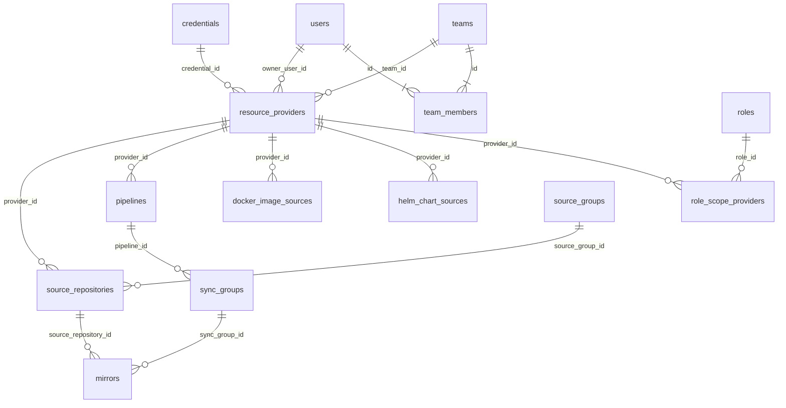
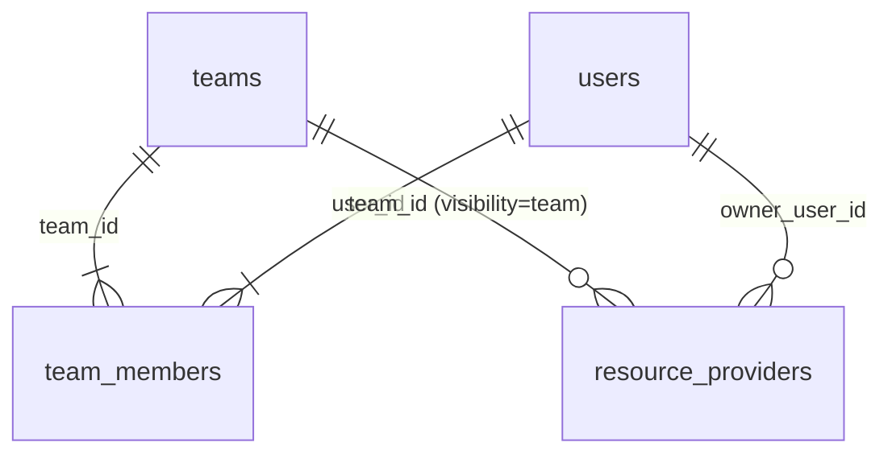

# Рефакторинг: унифицированная система провайдеров ресурсов (Providers V3)

> Статус: проект (architect mode). Дата: 2026-08-14. **Ревизия 3 (2026-08-14):** дополнен разделом 12 «Модель команд и шаринг провайдеров» (таблицы `teams`/`team_members`, enum `visibility`, API команд и шаринга, фронтенд, тесты, миграция); блоки, изменённые/добавленные в ревизии 3, помечены `[Р3]`. **Ревизия 2 (2026-08-14):** дополнен разделом 11 по 7 замечаниям заказчика; блоки, изменённые/добавленные в ревизии 2, помечены `[Р2]`.
> Связанные: [`plans/features/integrations.md`](integrations.md), [`plans/features/auth-rbac.md`](auth-rbac.md), [`plans/architecture/permissions.md`](../architecture/permissions.md).

## 0. Проблема

Текущее состояние (подтверждено кодом):

| Проблема | Где |
|---|---|
| 5 копипастных таблиц-инстансов с секретами в каждой | [`gitlab_instances`](../../backend/app/models/gitlab_instance.py), [`github_instances`](../../backend/app/models/github_instance.py), [`harbor_instances`](../../backend/app/models/harbor_instance.py), [`docker_registry_instances`](../../backend/app/models/docker_registry_instance.py), [`helm_repository_instances`](../../backend/app/models/helm_repository_instance.py) |
| Параллельная V2-система `source_providers` только для git-зеркалирования | [`source_provider.py`](../../backend/app/models/source_provider.py) |
| Секреты дублируются: `Credential.encrypted_secret` vs `*.token/password` | см. модели инстансов |
| 5 почти идентичных пар роутер+сервис | [`api/integrations/`](../../backend/app/api/integrations/), [`services/integrations.py`](../../backend/app/services/integrations.py) (970 строк) |
| Seed данных в миграциях (3 builtin-провайдера, Default pipeline/sync group) | `20260614_2253`, `20260613_1307` |
| RBAC: `credentials:read/use` не проверяются; 4 legacy-права в БД; scope только на 3 ресурса; нет owner-модели | [`rbac.py`](../../backend/app/core/rbac.py), [`role_scope.py`](../../backend/app/models/role_scope.py) |
| Legacy-модели | `github_orgs`, `github_projects`, `docker_image_sources.registry_instance_id`, `helm_chart_sources` (без связи с инстансом) |

## 1. Целевая модель данных

### 1.1. Ключевые решения

1. **Одна таблица `resource_providers`** вместо 5 инстанс-таблиц + `source_providers`. Специфика подтипа — в колонке `config JSONB`, валидируемой JSON-схемой из реестра подтипов в коде. Это убирает копипасту таблиц/роутеров/сервисов и даёт категорию/направление как поля, а не как отдельные таблицы.
2. **Реестр подтипов в коде** (`app/services/providers/registry.py`), не в БД: декларативное описание полей, типов credentials, действий, правил категорий. Фронтенд получает метаданные через API `/api/providers/types` (раздел 3). Таблица интеграций (раздел 2) — материализация реестра.
3. **Все секреты — только в `credentials`** (Fernet, уже реализовано). У `resource_providers` — `credential_id FK`. Колонки `token`/`password` в инстанс-таблицах уходят вместе с ними.
4. **Категории** — enum `ProviderCategory` (`system`/`public`/`private`), **направление** — enum `ProviderDirection` (`external`/`internal`), **домен** — enum `ProviderDomain` (`git`/`docker`/`helm`), **подтип** — enum `ProviderSubtype` (`github`, `gitlab`, `generic_git`, `docker_hub`, `quay`, `gcr`, `ecr`, `acr`, `ghcr`, `harbor`, `generic_registry`, `helm_repo`).
5. **Owner-модель**: `owner_user_id` (NULL для system/public). Private-провайдер виден владельцу и ролям с соответствующим permission (раздел 6).
6. **[Р3] `category` vs `visibility` — две независимые оси**: `category` отвечает на вопрос «кто владеет/для чего предназначен» (`system`/`public`/`private`, без изменений против ревизии 2), `visibility` — «кто видит» (`owner`/`team`/`public`). Шаринг провайдера команде — это смена `visibility` на `team` + проставление `team_id`, категория при этом не меняется. Обоснование и матрица — раздел 12.

### 1.2. Enums

```python
class ProviderDomain(StrEnum):
    git = "git"
    docker = "docker"
    helm = "helm"

class ProviderSubtype(StrEnum):
    github = "github"
    gitlab = "gitlab"
    generic_git = "generic_git"
    docker_hub = "docker_hub"
    quay = "quay"
    gcr = "gcr"
    ecr = "ecr"
    acr = "acr"
    ghcr = "ghcr"
    harbor = "harbor"
    generic_registry = "generic_registry"
    helm_repo = "helm_repo"

class ProviderCategory(StrEnum):
    system = "system"      # для нужд платформы (GitLab для пайплайнов)
    public = "public"      # анонимный доступ для всех (GitHub public, DockerHub pull)
    private = "private"    # конкретного пользователя

class ProviderDirection(StrEnum):
    external = "external"  # источник данных (откуда выгружаем)
    internal = "internal"  # целевой ресурс (куда выгружаем)

class ProviderVisibility(StrEnum):  # [Р3] кто видит провайдер; ортогональна category
    owner = "owner"    # только владелец (или admin/read_all)
    team = "team"      # владелец + члены команды team_id
    public = "public"  # все аутентифицированные пользователи

class ProviderCapability(StrEnum):  # действия, поддерживаемые подтипом
    list_groups = "list_groups"            # git: orgs/groups
    list_repositories = "list_repositories" # git
    get_commit = "get_commit"              # git
    trigger_pipeline = "trigger_pipeline"  # gitlab internal
    list_projects = "list_projects"        # harbor/docker internal
    list_repositories_docker = "list_repositories"  # docker: репозитории/теги
    list_charts = "list_charts"            # helm
    test_connection = "test_connection"    # все
```

### 1.3. Таблица `resource_providers`

| Поле | Тип | NULL | Описание |
|---|---|---|---|
| `id` | Integer PK | — | |
| `domain` | Enum(ProviderDomain) | NO | git / docker / helm |
| `subtype` | Enum(ProviderSubtype) | NO | github / gitlab / … / helm_repo |
| `category` | Enum(ProviderCategory) | NO | system / public / private |
| `visibility` | Enum(ProviderVisibility), default `owner` | NO | [Р3] owner / team / public — кто видит (см. 12.1.3); детерминирована категорией: system→owner, public→public |
| `direction` | Enum(ProviderDirection) | NO | external / internal |
| `name` | String(255) | NO | уникальный ключ сидов (slug) |
| `label` | String(255) | NO | отображаемое имя |
| `description` | Text | YES | |
| `base_url` | String(500) | YES | api/registry url (для generic — обязателен, валидация в реестре) |
| `config` | JSONB | NO, default `{}` | специфика подтипа (см. 1.5) |
| `credential_id` | FK → credentials.id, ON DELETE SET NULL | YES | NULL для public/анонимных |
| `owner_user_id` | FK → users.id, ON DELETE CASCADE | YES | обязателен при category=private |
| `team_id` | FK → teams.id, ON DELETE SET NULL | YES | [Р3] обязателен при visibility=team; шаринг = проставить team_id (см. 12.1.3) |
| `is_active` | Boolean | NO, default true | |
| `is_default` | Boolean | NO, default false | дефолт в рамках (domain, subtype, category, direction); partial unique index |
| `is_protected` | Boolean | NO, default false | system/builtin: запрет удаления |
| `verify_ssl` | Boolean | NO, default true | |
| `priority` | Integer | NO, default 0 | автоподбор при нескольких match (docker) |
| `status_flag` / `status_text` | Integer / String(500) | NO / YES | 0-4 как везде |
| `last_checked_at` | DateTime(tz) | YES | |
| `is_deleted` / `deleted_at` | Boolean / DateTime | — | soft delete |
| `created_at` / `updated_at` | DateTime(tz) | — | |

**Индексы/констрейнты**:
- `uq_resource_providers_name` UNIQUE(name) WHERE is_deleted=false
- `ix_resource_providers_domain_subtype` (domain, subtype)
- `ix_resource_providers_category` (category)
- `ix_resource_providers_owner` (owner_user_id)
- `ix_resource_providers_team` (team_id) — [Р3]
- `uq_default_per_scope` UNIQUE(domain, subtype, category, direction) WHERE is_default=true AND is_deleted=false
- CHECK: category='private' → owner_user_id IS NOT NULL
- [Р3] CHECK: visibility='team' → team_id IS NOT NULL AND category='private'
- [Р3] CHECK: visibility='team' → owner_user_id IS NOT NULL (владелец team-провайдера — физическое лицо, команда не «владеет»)

**Именованная группа таблиц** (единый «домен» в БД): `resource_providers`, `role_scope_providers` (6.3). Все остальные группы потребители, не владельцы.

### 1.4. Связь с существующими ресурсами (перелинковка FK)

| Таблица | Было | Станет |
|---|---|---|
| `source_repositories` | `source_provider_id → source_providers.id` | `provider_id → resource_providers.id` (ON DELETE SET NULL) |
| `pipelines` | `gitlab_instance_id → gitlab_instances.id` | `provider_id → resource_providers.id` (ON DELETE SET NULL); провайдер = gitlab, category=system, direction=internal |
| `docker_image_sources` | `registry_instance_id → docker_registry_instances.id` | `provider_id → resource_providers.id`; для target-registry добавить `target_provider_id → resource_providers.id` (сейчас строка `target_registry_url` без связи) |
| `helm_chart_sources` | связи нет | `provider_id → resource_providers.id` (domain=helm, direction=external) |
| `source_groups` | без FK (связь через source_repositories) | без изменений |
| `mirrors` / `sync_groups` | через SyncGroup → Pipeline → GitlabInstance | путь сохраняется: SyncGroup → Pipeline → resource_providers |



### 1.5. `config JSONB` — специфика подтипов (канонические ключи)

| Подтип | Ключи config |
|---|---|
| `gitlab` | `api_version` (v4), `default_group_id`, `group_visibility`, `mirror_visibility`, `default_branch` |
| `github` | `api_url` (default https://api.github.com), `org_blacklist` |
| `generic_git` | `clone_protocol` (https/ssh), `discovery_mode` (none/manual) |
| `docker_hub` | `namespace`, `arch_filter` [] |
| `quay`/`gcr`/`ecr`/`acr`/`ghcr` | `region` (ecr/gcr), `subscription` (acr), `org` (ghcr/quay), `arch_filter` [] |
| `harbor` | `default_project`, `robot_prefix`, `projects_allowlist` [] |
| `generic_registry` | `api_style` (registry_v2/harbor_v2), `auth_flow` (basic/none) |
| `helm_repo` | `index_path` (default /index.yaml), `chart_allowlist` [] |

Валидация: JSON Schema per-subtype в реестре; Pydantic-модель `ProviderConfigIn` с `model_validator`, выбирающим схему по subtype. Неизвестные ключи отклоняются (`extra="forbid"`).

### 1.6. Удаляемые таблицы (одной чистящей миграцией, фаза 7)

| Таблица | Причина |
|---|---|
| `source_providers` | поглощена `resource_providers` |
| `gitlab_instances` | поглощена (category=system/internal или private/external) |
| `github_instances` | поглощена (private/external) |
| `harbor_instances` | поглощена (system/internal) |
| `docker_registry_instances` | поглощена (`RegistryType`→direction, `RegistryProvider`→subtype) |
| `helm_repository_instances` | поглощена |
| `github_orgs`, `github_projects` | legacy, V2 заменил |

## 2. Таблица всех интеграций и их опций (главный артефакт)

Направление: **ext** = external/source, **int** = internal/target. Категория указана для типового использования; `gitlab` и `harbor` могут существовать в нескольких категориях (это разные записи).

| Интеграция | Домен | Подтип | Категория | Направление | Обязательные поля | Опциональные поля | Credentials | Действия | Кастомизация (уникальное) |
|---|---|---|---|---|---|---|---|---|---|
| GitHub (аноним) | git | `github` | public | ext | `name`, `label` | `config.api_url` | anonymous | test, list_groups, list_repositories, get_commit | public-лимиты rate-limit, только публичные репо |
| GitHub (токен) | git | `github` | private | ext | `name`, `label`, credential | `config.api_url`, `config.org_blacklist` | github_token | test, list_groups, list_repositories, get_commit | приватные org-репо, higher rate-limit |
| GitLab (аноним) | git | `gitlab` | public | ext | `name`, `label` | — | anonymous | test, list_groups, list_repositories | только публичные проекты |
| GitLab (внешний) | git | `gitlab` | private | ext | `name`, `label`, `base_url`, credential | `verify_ssl`, `config.default_group_id` | gitlab_token | test, list_groups, list_repositories, get_commit | self-hosted URL, group visibility |
| GitLab платформенный | git | `gitlab` | **system** | **int** | `name`, `label`, `base_url`, credential | `verify_ssl`, `config.default_group_id`, `config.mirror_visibility`, `config.default_branch` | gitlab_token | test, **trigger_pipeline**, list_groups, list_repositories | единственный, кому разрешено trigger_pipeline; питает pipelines/sync_groups/mirrors |
| Generic Git | git | `generic_git` | private | ext | `name`, `label`, `base_url` | `config.clone_protocol`, `config.discovery_mode`, credential | https_basic / ssh_key / anonymous | test, list_repositories (manual), get_commit | нет API-дискавери; clone по https/ssh |
| Docker Hub | docker | `docker_hub` | public / private | ext | `name`, `label` | `config.namespace`, `config.arch_filter`, credential | https_basic / anonymous | test, list_repositories | namespace-фильтр, анонимный pull |
| Quay | docker | `quay` | public / private | ext | `name`, `label` | `config.org`, `config.arch_filter`, credential | https_basic / anonymous | test, list_repositories | org-неймспейс |
| GCR | docker | `gcr` | private | ext | `name`, `label`, `base_url` | `config.region`, credential | https_basic (json-key) | test, list_repositories | json-key auth, регион |
| ECR | docker | `ecr` | private | ext | `name`, `label`, `base_url` | `config.region`, credential | https_basic (aws-key) | test, list_repositories | aws-регион, registry id в URL |
| ACR | docker | `acr` | private | ext | `name`, `label`, `base_url` | `config.subscription`, credential | https_basic | test, list_repositories | azure subscription |
| GHCR | docker | `ghcr` | public / private | ext | `name`, `label` | `config.org`, credential | github_token / anonymous | test, list_repositories | привязка к GitHub-токену |
| Harbor (внутренний) | docker | `harbor` | **system** | **int** | `name`, `label`, `base_url`, credential | `verify_ssl`, `config.default_project`, `config.robot_prefix`, `config.projects_allowlist` | https_basic | test, list_projects, list_repositories | default project, robot-аккаунты, сканирование |
| Harbor (внешний) | docker | `harbor` | private | ext | `name`, `label`, `base_url`, credential | `verify_ssl` | https_basic | test, list_projects, list_repositories | — |
| Generic Registry | docker | `generic_registry` | private | ext / int | `name`, `label`, `base_url` | `config.api_style`, `config.auth_flow`, `verify_ssl`, credential | https_basic / anonymous | test, list_repositories | registry_v2 vs harbor_v2 API |
| Helm Repository | helm | `helm_repo` | public | ext | `name`, `label`, `base_url` | credential, `verify_ssl`, `config.index_path`, `config.chart_allowlist` | https_basic / anonymous | test, list_charts, index | index.yaml-путь, allowlist чартов |
| Helm Repository (приватный) | helm | `helm_repo` | private | ext | `name`, `label`, `base_url`, credential | `verify_ssl`, `config.index_path` | https_basic | test, list_charts, index | basic-auth на repo URL |

Примечания:
- **Внутренний Helm**: чарты складываются в GitLab-проект зеркалирования (как сейчас `helm_chart_sources.gitlab_project_id`), отдельный internal-провайдер helm не нужен — используется system GitLab.
- `docker_registry_instances.RegistryType(internal/external)` и `RegistryProvider` напрямую маппятся в `direction` и `subtype` при data-миграции.

## 3. API-дизайн (backend)

Единый роутер [`app/api/providers.py`](../../backend/app/api/providers.py) (новый), префикс `/api/providers`. Заменяет `api/integrations/*` (5 роутеров) и git-часть providers из `mirroring.py`.

### 3.1. Эндпоинты

| Метод | Путь | Permission | Описание |
|---|---|---|---|
| GET | `/api/providers/types` | любой аутентифицированный | метаданные реестра подтипов (поля, схемa, действия, допустимые категории/credentials) — для генерации форм на фронтенде |
| GET | `/api/providers?domain=&subtype=&category=&direction=&visibility=&team_id=&owner=me` | `providers:read` | список; private отфильтрованы по владельцу (владелец видит свои, admin/`providers:read_all` — все); [Р3] + свои team-shared (JOIN через team_members, см. 12.2.4) |
| GET | `/api/providers/{id}` | `providers:read` + owner-check | карточка |
| POST | `/api/providers` | `providers:write` (private), `providers_system:write` (system) | создание; category из body; для private `owner_user_id=current_user` |
| PATCH | `/api/providers/{id}` | как POST + owner-check | изменение; system-поля — только `providers_system:write` |
| DELETE | `/api/providers/{id}` | `providers:delete` / `providers_system:write` | soft delete; `is_protected` — отказ 409 |
| POST | `/api/providers/{id}/test` | `providers:write` + owner-check | test_connection → status_flag/text, last_checked_at |
| POST | `/api/providers/{id}/actions/{action}` | `providers:use` + owner-check | доменные действия из `ProviderCapability` (list_groups, list_repositories, list_projects, list_charts, get_commit, trigger_pipeline) |
| GET | `/api/providers/{id}/usage` | `providers:read` + owner-check | где используется (pipelines, source_repositories, docker/helm sources) — защита от «удаляю, а оно живо» |
| POST | `/api/providers/{id}/share` | `providers:share` + owner-check | [Р3] шаринг команде: `visibility=team` + `team_id`; см. 12.3 |
| POST | `/api/providers/{id}/unshare` | `providers:share` + owner-check | [Р3] снять шаринг: `visibility=owner`, `team_id=NULL`; см. 12.3 |

> [Р3] Полный API команд (`/api/teams*`), изменения `POST/PATCH /api/providers` (поля `visibility`/`team_id` в Create/Update) и матрица прав — раздел 12.3.

Перенос из `mirroring.py` (остаётся там только зеркалирование, провайдерная часть уходит):

| Было в `/api/mirroring/providers` | Станет |
|---|---|
| GET list, POST, PATCH, DELETE | `/api/providers` (domain=git) |
| POST `/test` | `/api/providers/{id}/test` |
| POST `/refresh` (группы/репо) | `/api/providers/{id}/actions/list_groups`, `.../list_repositories` |

### 3.2. Сервисный слой

- [`app/services/providers/registry.py`](../../backend/app/services/providers/registry.py) — `PROVIDER_TYPES: dict[ProviderSubtype, ProviderTypeSpec]` (поля, JSON-schema, capability, допустимые credential-типы, допустимые категории).
- [`app/services/providers/service.py`](../../backend/app/services/providers/service.py) — единый `ProviderService` (CRUD, test, dispatch действий, матрица доступа по категории).
- [`app/services/providers/clients/`](../../backend/app/services/providers/clients/) — тонкие HTTP-клиенты per-domain: `git_github.py`, `git_gitlab.py`, `git_generic.py`, `docker_registry.py` (v2 API общий + хелперы per-subtype), `docker_harbor.py`, `helm_repo.py`. Реиспользуют код из [`services/source_providers/`](../../backend/app/services/source_providers/) и [`services/integrations.py`](../../backend/app/services/integrations.py) (httpx-логика test_connection).
- `source_provider.py` (фабрика `create_source_provider`) делегирует в registry: git-провайдер для зеркалирования теперь строится из `resource_providers` (category public/private, direction external).

### 3.3. Схемы (Pydantic, [`app/schemas/provider.py`](../../backend/app/schemas/provider.py))

`ProviderTypeOut` (реестр), `ProviderCreate` (domain/subtype/category/direction/name/label/base_url/config/credential_id), `ProviderUpdate` (все optional), `ProviderOut` (секреты никогда; `has_credential: bool`), `ProviderTestResult`, `ProviderActionIn/Out`. Проверка: subtype+category+direction допустимы по реестру; credential_type совместим с подтипом.

## 4. Фронтенд-дизайн

### 4.1. Новая структура

| Было | Станет |
|---|---|
| `Settings/Integrations/*` (5 табов-компонентов: Gitlab/Github/Harbor/DockerRegistry/HelmRepository) | [`Settings/Providers/index.tsx`](../../frontend/src/pages/Settings/Providers/index.tsx) — единая таблица с фильтрами domain/category/direction + модалка `ProviderModal` (форма генерируется из `/api/providers/types`) |
| `GitMirroring/Providers` (git source providers) | перенаправление на Settings/Providers (domain=git, direction=external); выбор провайдера в ImportGroupModal/AddRepositoryModal берётся из общего стора |
| `Admin/Integrations` (credentials) | остаётся (управление credentials), переименовать таб в «Credentials» |
| — | `Settings/Providers/MyProviders.tsx` — вкладка «Мои провайдеры» для пользователей без `providers:write`, но с `providers_own:write` |

### 4.2. Store (RTK Query)

[`frontend/src/store/api/providers.ts`](../../frontend/src/store/api/providers.ts) (новый, tag `Provider`): `getProviderTypes`, `getProviders` (с фильтрами), `getProvider`, `createProvider`, `updateProvider`, `deleteProvider`, `testProvider`, `runProviderAction`, `getProviderUsage`. Удалить: `store/api/integrations.ts`, git-часть `store/api/git-mirroring/providers.ts`, `mirrors-legacy.ts`, `projects-legacy.ts`.

### 4.3. UI-правила по категориям

- **system**: бейдж «System», редактирование только при `providers_system:write`, удаление заблокировано (`is_protected`).
- **public**: бейдж «Public», создание/редакт — `providers:write`, credential не обязателен.
- **private**: бейдж «Private» + владелец; обычный пользователь видит только свои в «Мои провайдеры»; admin видит все.
- Табы доменов (Git/Docker/Helm) → фильтр, не отдельные страницы; колонки: label, subtype, category, direction, is_default, status (StatusChip), credential (есть/нет), owner.

## 5. Скрипт сидирования

### 5.1. Расположение и запуск

- [`backend/scripts/seed_providers.py`](../../backend/scripts/seed_providers.py) — standalone, рядом с [`docker/seed_admin.py`](../../backend/docker/seed_admin.py); использует `app.database` + модели, запускается после `alembic upgrade head`.
- Вызов: [`backend/docker/entrypoint.sh`](../../backend/docker/entrypoint.sh) — после миграций, до старта gunicorn: `python -m scripts.seed_providers`.
- Идемпотентность: upsert по `name` (UNIQUE). Exists + не `is_deleted` → сверить label/is_default, обновить при расхождении (сохраняя пользовательские правки config? нет — seed перезаписывает только seeded-поля, помеченные `is_protected`); отсутствует → INSERT. Повторный запуск безопасен (нет дублей).
- Явно НЕ в alembic: миграции только DDL + data-перенос существующих записей (фаза 3). Из миграций `20260614_2253` (3 builtin) и `20260613_1307` (Default pipeline/sync group) сиды не переносятся в новые миграции — их создаёт скрипт.

### 5.2. Дефолтные провайдеры (создаются скриптом)

| name | domain | subtype | category | direction | base_url | credential |
|---|---|---|---|---|---|---|
| `github-anonymous` | git | github | public | external | https://api.github.com | — |
| `gitlab-anonymous` | git | gitlab | public | external | https://gitlab.com | — |
| `generic-anonymous` | git | generic_git | public | external | NULL | — |
| `dockerhub-anonymous` | docker | docker_hub | public | external | https://registry-1.docker.io | — |

Все `is_protected=true`, `is_default=true` в своей зоне. System-провайдеры (GitLab платформы, Harbor) скриптом НЕ создаются — они настраиваются админом вручную (содержат секреты и URL окружения), скрипт только создаёт публичные заготовки. `--dry-run` флаг для отображения плана изменений.

## 6. Ролевая модель

### 6.1. Новые permissions (seed через `seed_admin.py`, как сейчас)

| Permission | Admin | Operator | Viewer | Что проверяет |
|---|:--:|:--:|:--:|---|
| `providers:read` | ✅ | ✅ | ✅ | list/get public+system (+ private свои) |
| `providers:write` | ✅ | ✅ | | create/update/test public+свои private |
| `providers:delete` | ✅ | | | delete public+свои private |
| `providers:use` | ✅ | ✅ | | доменные действия (list_repositories и т.д.) |
| `providers:read_all` | ✅ | | | видеть все private всех пользователей |
| `providers_system:write` | ✅ | | | create/update/delete system-категории |
| `teams:read` | ✅ | ✅ | ✅ | [Р3] список своих команд + карточка |
| `teams:write` | ✅ | | | [Р3] создание/изменение/удаление команд (админ) |
| `teams:manage_members` | ✅ | | | [Р3] добавление/удаление участников (лид — только своей команды, через scope) |
| `providers:share` | ✅ | ✅ | | [Р3] share/unshare своих провайдеров команде |

> [Р3] Распределение по ролям (`seed_admin.py`): `teams:*` и `providers:share` назначаются Admin; `teams:read` — также Operator/Viewer (видеть свои команды); лид команды получает права через членство + scope-проверку, а не через роль (12.2.3). Матрица видимости — 12.2.

### 6.2. Удаляемые permissions (чистящая миграция фазы 5 + правка seed_admin.py)

| Permission | Судьба |
|---|---|
| `credentials:read` | **начать реально проверять** в `credentials.py` (list/get) — противоречие «назначено, но не проверяется» устраняется проверкой, не удалением |
| `credentials:use` | удалить: использование credentials — внутренняя логика провайдеров; пользователь не «использует» credential напрямую |
| `integrations:read` | удалить: заменён `providers:read` |
| `integrations:write` | удалить: заменён `providers:write` + `providers_system:write` |
| `integrations:manage` (legacy в БД) | удалить из БД |
| `docker_registry:manage` (legacy) | удалить |
| `helm_repository:manage` (legacy) | удалить |
| `pipelines:manage` (legacy) | удалить |

`credentials.py` после рефакторинга: чтение → `credentials:read`, запись/тест → `credentials:write` (новое permission, замена `integrations:write` в этом роутере).

### 6.3. Scope

Новая таблица `role_scope_providers` (role_id, provider_id, PK составной, CASCADE) — паттерн существующих [`role_scope_*`](../../backend/app/models/role_scope.py). Назначение: роль получает доступ к конкретному private-провайдеру другого пользователя без `read_all`. `require_scope_permission(permission, "provider", id)` в actions/test. Существующие 3 scope-таблицы не меняются; `role_scope_credentials` сохраняется.

### 6.4. Owner-модель (минимальная)

Правила доступа в `ProviderService`, без новых таблиц:
1. `category=system` → мутации только `providers_system:write`; чтение `providers:read`.
2. `category=public` → стандартные `providers:*`.
3. `category=private` → владелец (`owner_user_id == current_user.id`) с `providers_own`-правилами: `providers:read` достаточно для своих; мутации — `providers:write`; admin с `providers:read_all` видит все, мутации чужих private — только admin-роль.
4. Потребители (source_groups/sync_groups) продолжают использовать provider, если он активен и не удалён; при удалении private-провайдера с зависимостями — 409 со списком usage.

## 7. Стратегия миграции и замены кода

Принцип: каждая фаза — деплойспособна; старое и новое работают параллельно до переключения.

| Фаза | Содержание | Файлы |
|---|---|---|
| **0. Скрипт сидов** | `scripts/seed_providers.py` + вызов в entrypoint.sh | новые файлы, изменений логики нет |
| **0T. [Р3] Команды (teams)** | `models/team.py`, `models/team_member.py`, миграция DDL `teams`/`team_members` + `visibility`/`team_id` на `resource_providers`; `schemas/team.py`; `services/team.py`; `api/teams.py`; расширение `ProviderService` (матрица 12.2); `providers:share`, `teams:*` в seed_admin.py; фронтенд `store/api/teams.ts`, `pages/Settings/Teams/`, ShareProviderModal; тесты этапов 23–36 (12.5). Подфазы: 0T-DDL → 0T-API → 0T-FE | преимущественно новые файлы; подробнее — раздел 12 |
| **1. Модель + сервисы** | `models/resource_provider.py` (+enums), миграция DDL `resource_providers`, `role_scope_providers`; `schemas/provider.py`; `services/providers/` (registry, service, clients) | только новые файлы |
| **2. Новый API** | `api/providers.py`, регистрация в `main.py`; тесты | новый роутер параллельно старым |
| **3. Data-миграция** | alembic: 5 инстанс-таблиц + source_providers → resource_providers (маппинг RegistryType→direction, RegistryProvider→subtype; токены инстансов → новые Credential + credential_id); перелинковка FK (pipelines, source_repositories, docker_image_sources, helm_chart_sources.provider_id) | одна data-миграция с downgrade |
| **4. Переключение потребителей** | `create_source_provider` читает resource_providers; `PipelineService`/`pipeline.py` на `provider_id`; `docker.py`/`helm.py` на provider_id; рефакторинг `mirroring.py`: провайдерная часть удалена, бизнес-логика спущена в сервисы (цель <500 строк) | `services/source_provider.py`, `services/source_providers/`, `services/pipeline.py`, `services/mirror.py`, `api/mirroring.py` |
| **5. RBAC** | новые permissions в seed_admin.py; чистящая миграция удаляет legacy (`integrations:*`, `docker_registry:manage`, `helm_repository:manage`, `pipelines:manage`, `credentials:use`); `credentials.py` → `credentials:read/write`; scope-проверки | `core/rbac.py` (без изменений API зависимостей), `docker/seed_admin.py`, миграция |
| **6. Фронтенд** | `store/api/providers.ts`; `Settings/Providers`; переделка GitMirroring-модалок; удаление `integrations.ts`, legacy-сторов, страниц Mirrors/Projects; `usePermissions` + `PermissionGate` на новые права | frontend/src |
| **7. Выпил** | миграция DROP: source_providers, gitlab_instances, github_instances, harbor_instances, docker_registry_instances, helm_repository_instances, github_orgs, github_projects; удалить `api/integrations/` (старые эндпоинты до этого момента держим для отката, после переключения фронтенда — 2 релиза → 410), `services/integrations.py`, legacy-модели | финальная чистка |

Обратная совместимость: фазы 2–4 старые эндпоинты живут (читают старые таблицы; после фазы 3 — через прослойку-читалку resource_providers, чтобы не было двойной записи). Фронтенд переключается одним релизом (фаза 6). Откат: downgrade data-миграции фазы 3 восстанавливает старые таблицы из ресурсной (кроме секретов инстансов — они восстановимы из Credential, созданных при переносе).

## 8. План интеграционных тестов

Матрица: для каждого типа провайдера из раздела 2 — CRUD + специфика. Раскладка: unit — [`backend/tests/unit/`](../../backend/tests/), e2e — [`backend/tests/e2e/test_providers.py`](../../backend/tests/e2e/test_providers.py) (расширение [`test_integrations.py`](../../backend/tests/e2e/test_integrations.py)).

| Тест-файл | Тип | Сценарии |
|---|---|---|
| `test_provider_registry.py` | все | реестр полон (все subtype имеют spec); schema-валидация config per-subtype (валид/невалид/лишние ключи); capability-матрица |
| `test_providers_crud.py` | все | create/read/update/soft-delete; уникальность name; partial-unique is_default; CHECK owner при private; 409 при удалении is_protected; 409 при удалении с usage |
| `test_providers_categories.py` | все | изоляция private (чужой не виден без read_all); system-мутации только providers_system:write; public доступен viewer на чтение |
| `test_provider_git_github.py` | git/github | test_connection (httpx mock, anon/token); list_groups/list_repositories; get_commit; лимиты anon |
| `test_provider_git_gitlab.py` | git/gitlab | test_connection; list_groups/list_repositories; trigger_pipeline только у system/internal; generic-git clone_url |
| `test_provider_git_generic.py` | git/generic_git | https_basic/ssh_key credential; discovery_mode manual |
| `test_provider_docker.py` | docker/all | registry_v2 list_repositories для docker_hub/quay/ghcr (mock v2 API); gcr/ecr/acr config-валидация (region/subscription); priority-автоподбор; direction internal/external |
| `test_provider_docker_harbor.py` | docker/harbor | list_projects; default_project; robot_prefix |
| `test_provider_helm.py` | helm/helm_repo | test_connection по index.yaml; list_charts; chart_allowlist |
| `test_providers_migration.py` | миграция | data-миграция фазы 3: все 5 таблиц переносятся без потерь; FK-перелинковка; downgrade; идемпотентность повторного запуска |
| `test_seed_providers.py` | сид | идемпотентность (2 запуска → 0 дублей); обновление seeded-полей; --dry-run; дефолтные 4 записи корректны |
| `test_rbac_providers.py` | RBAC | матрица permissions×категорий; scope role_scope_providers; удалённые legacy-права отсутствуют в БД после миграции |
| Frontend | — | `Providers.test.tsx` (фильтры, формы из /types, категории); `MyProviders.test.tsx`; обновить `GitMirroringProviders`/`Integrations.test.tsx` |

> [Р2] Актуализировано в ревизии 2: судьба существующих тестов — раздел 11.6 (Integrations/GitMirroringProviders удаляются, а не обновляются); полный TDD-порядок написания новых тестов — раздел 11.7.

## 9. Документация

| Файл | Изменение |
|---|---|
| [`plans/architecture/permissions.md`](../architecture/permissions.md) | +6 новых `providers:*`/`providers_system:*`, `credentials:write`; удалить `integrations:read/write`, `credentials:use`, секцию legacy (включая legacy-права — теперь физически удалены); обновить распределение ролей |
| [`plans/features/integrations.md`](integrations.md) | переписать под resource_providers: модель, реестр, API, категории; таблицу интеграций (раздел 2) — сюда |
| [`plans/features/auth-rbac.md`](auth-rbac.md) | owner-модель, scope-providers, новая permission-матрица; [Р3] + модель команд, `teams:*`, `providers:share`, team-scope |
| [`plans/architecture/permissions.md`](../architecture/permissions.md) | [Р3] +`teams:read/write/manage_members`, `providers:share` в сводную таблицу и распределение ролей (помимо уже запланированного в разделе 9 обновления `providers:*`) |
| [`plans/features/git-mirroring-v2.md`](git-mirroring-v2.md) | замена source_providers → resource_providers в потоках дискавери |
| [`AGENTS.md`](../../AGENTS.md) | «Common file references»: + registry/service/`api/providers.py`; убрать `api/integrations/` после фазы 7 |
| [`CHANGELOG.md`](../../CHANGELOG.md) | запись по фазам 0–7 |

## 10. Риски

| Риск | Митигация |
|---|---|
| Data-миграция фазы 3 с секретами | токены инстансов → Credential через существующий Fernet-хелпер; e2e-тест миграции на сид-данных; backup перед прогоном |
| `trigger_pipeline` случайно доступен не-system | capability проверяется в реестре + тест `test_provider_git_gitlab.py` |
| Фронтенд-переключение (фаза 6) одним релизом | старые эндпоинты живут 2 релиза (410 после), e2e на новой сторе |
| Partial-unique is_default на PostgreSQL | уже используемый паттерн Pipeline (postgresql_where), подтверждён кодом |
| [Р2] Миграция секретов: расшифровка никогда не материализуется в открытом виде | перенос ciphertext as-is (11.1.3); fallback «try-decrypt → encrypt» для до-фернетовских строк; e2e-тест миграции сравнивает байты шифротекста |

## 11. [Р2] Доработка по 7 замечаниям заказчика (ревизия 2)

> Пункты `11.1`–`11.7` соответствуют замечаниям заказчика 1–7. Разделы 0–10 остаются в силе; при противоречии приоритет у настоящего раздела. Сверено с кодом на 2026-08-14.

### 11.1. [Р2.1] Безопасность секретов

#### 11.1.1. Единственное место хранения

Все секреты любого типа — API-токены (GitHub/GitLab), пары username/password (Harbor, Docker registry, Helm repo), Docker registry credentials, Helm-credentials, приватные SSH-ключи — хранятся **только** в `credentials.encrypted_secret` (Text) в Fernet-шифротексте. Реализация шифрования — [`backend/app/core/secrets.py`](../../backend/app/core/secrets.py): `SecretCipher` (Fernet, AES-128-CBC + HMAC-SHA256), `encrypt_secret()`/`decrypt_secret()`, отказ старта при незаданном ключе.

**Уточнение по имени ключа** (расхождение с формулировкой заказчика): переменная окружения называется `ENCRYPTION_KEY` (не `FERNET_KEY`) — см. `settings.encryption_key` в [`secrets.py`](../../backend/app/core/secrets.py). Переименование не делаем; в ops-runbook и `.env.example` дублируем комментарий «Fernet key, генерация: `python -c "from cryptography.fernet import Fernet; print(Fernet.generate_key().decode())"`».

**Владение ключом**: `ENCRYPTION_KEY` живёт только в env backend-контейнера (docker-compose / секреты окружения), никогда — в образе, репозитории или БД. Доступ к host с env = доступ к секретам; ротация ключа на текущем этапе не поддерживается — задел оставлен в docstring `secrets.py` (переход на `MultiFernet` + one-off решифровка).

#### 11.1.2. Запрет секретов в `resource_providers.config`

`config JSONB` — только неконфиденциальные параметры. Три уровня защиты:

1. **JSON Schema per-subtype с `extra="forbid"`** (раздел 1.5): любой ключ вне канонического списка подтипа уже отклоняется 422. Это основная защита — секрет «не пройдёт», потому что его ключа нет в схеме.
2. **Deny-list по именам ключей** (defense-in-depth, на случай будущих правок схем) в `model_validator` Pydantic-схемы `ProviderConfigIn`: ключ (в lower-case) отвергается, если он входит в `{token, password, secret, key, auth, private_key, credential}` **или** заканчивается на `_token`, `_password`, `_secret`, `_key`, `_credentials`. Суффиксные правила не конфликтуют с каноническими ключами (`auth_flow`, `clone_protocol`, `index_path`, `chart_allowlist`, `api_style` — не матчатся).
3. **Реестр подтипов** не декларирует ни одного секретного поля: в `ProviderTypeSpec.config_fields` секретных полей нет by-design; фронтенд-форма генерируется только из реестра, поэтому поле для ввода секрета в config в UI физически отсутствует.

Секрет при создании/редактировании провайдера передаётся **только** через назначение `credential_id` (существующий credentials-флоу), либо через отдельную модалку создания credential.

#### 11.1.3. Порядок переноса секретов при data-миграции (фаза 3)

Важный факт, подтверждённый кодом: legacy-инстанс-таблицы **уже хранят Fernet-шифротекст** (комментарии моделей: «Fernet-encrypted at rest» — [`gitlab_instance.py`](../../backend/app/models/gitlab_instance.py), [`docker_registry_instance.py`](../../backend/app/models/docker_registry_instance.py), аналогично harbor/github/helm). Шифрование выполнялось сервисным слоем при записи.

Поэтому порядок переноса — **копирование шифротекста как есть, без расшифровки**:

```mermaid
flowchart TD
    A[Строка legacy-инстанса с token/password] --> B{Значение не пустое?}
    B -- Нет --> C[provider.credential_id = NULL]
    B -- Да --> D[try: decrypt_secret ciphertext]
    D -- OK, это Fernet --> E[Credentials.encrypted_secret = ciphertext AS-IS]
    D -- SecretEncryptionError, до-фернетовский plaintext --> F[encrypted_secret = encrypt_secret plaintext]
    E --> G[Credentials: name=migrated-TABLE-name, тип по домену]
    F --> G
    G --> H[resource_providers.credential_id = FK]
    H --> I[Старая колонка больше не читается]
```



Правила:
- Для каждой строки инстанса с непустым секретом создаётся `Credential(name="migrated-{table}-{instance.name}", credential_type=…, provider=…, username=<из docker_registry_instances.username>, encrypted_secret=<шифротекст>)`; провайдер получает `credential_id`.
- Fallback «try-decrypt → encrypt» обрабатывает исторические строки, записанные до внедрения Fernet: если `decrypt_secret` падает (`SecretEncryptionError`) — значение считаем открытым текстом и шифруем `encrypt_secret`. Открытый текст существует только в памяти процесса миграции, не логируется.
- Маппинг типов: `gitlab_instances.token` → `gitlab_token`; `github_instances.token` → `github_token`; `harbor_instances.password` → `https_basic`; `docker_registry_instances.username/password` → `https_basic`; `helm_repository_instances.password` → `https_basic`; `source_providers` уже ссылаются на `credentials` — FK переносится без дублирования (существующий credential переиспользуется).
- Тест миграции (этап 14 в 11.7) сравнивает **байты шифротекста** старой колонки и `credentials.encrypted_secret` — расшифровка в тесте не выполняется, кроме одного кейса fallback.

#### 11.1.4. Секреты никогда не покидают backend

- **Out-схемы**: `ProviderOut` содержит `has_credential: bool` и `credential_id`, но не секрет; `CredentialOut` не содержит `encrypted_secret` (только `ssh_public_key` — публичная часть). Инвариант закреплён тестом (этап 9 в 11.7): сериализация ответов всех `/api/providers*` и `/api/credentials*` эндпоинтов не содержит значений, равных тестовому секрету.
- **Обновление секрета**: PATCH провайдера не принимает секретных полей (deny-list 11.1.2); смена секрета = операция над credential.
- **Маскирование в логах**: конвенция для `services/providers/clients/*` и логов миграции — никогда не логировать значение секрета/Authorization-заголовка; при ошибке test_connection логируется статус и URL без заголовков. Проверяется тестом: текст ошибки/лога при 401 не содержит тестовый токен.
- **`ssh_key`**: приватный ключ шифруется и хранится в `credentials.encrypted_secret` (решение — да, храним); публичная часть — в нешифрованном `credentials.ssh_public_key` (публична по определению). Существующая модель [`credential.py`](../../backend/app/models/credential.py) уже так устроена — изменений схемы не нужно.

### 11.2. [Р2.2] `created_at` / `updated_at` / `deleted_at`

#### 11.2.1. Конвенция

- Тип: `DateTime(timezone=True)` (= PostgreSQL `timestamptz`), **везде UTC**; заполнение — Python-side: `default=lambda: datetime.now(UTC)` и `updated_at … onupdate=lambda: datetime.now(UTC)`. Выбран ORM-уровень (а не `server_default=func.now()`/триггеры), потому что это единственный паттерн, уже используемый во всём кодеплое ([`user.py`](../../backend/app/models/user.py), [`pipeline.py`](../../backend/app/models/pipeline.py), [`credential.py`](../../backend/app/models/credential.py) и др.) — ноль расхождений.
- Именование: `created_at`, `updated_at`, `deleted_at` (snake_case, суффикс `_at`); soft delete — пара `is_deleted: Boolean default false` + `deleted_at: nullable`.
- `updated_at` обновляется **при каждом изменении строки** (`onupdate` срабатывает на любой UPDATE, меняющий поля).

#### 11.2.2. Новые таблицы ревизии

| Таблица | created_at | updated_at | deleted_at | Комментарий |
|---|---|---|---|---|
| `resource_providers` | ✅ | ✅ | ✅ (+`is_deleted`) | уже заложено в 1.3; подтверждено |
| `role_scope_providers` | ✅ | — осознанно | — | link-таблица по паттерну существующих `role_scope_*` (все 3 тоже без `updated_at`): строка иммутабельна, любое изменение = delete+insert; `updated_at` вводил бы ложную семантику |
| `provider_credentials` | — | — | — | **не создаётся** (не нужна): секреты в `credentials`, связь — `resource_providers.credential_id` |

#### 11.2.3. Аудит legacy-моделей: у кого только `created_at`

Проверено по всем файлам [`backend/app/models/`](../../backend/app/models/) на 2026-08-14:

| Модель | Сейчас | Решение при рефакторинге |
|---|---|---|
| `role` | только `created_at` | **добавить `updated_at`** (роль редактируется) — миграция фазы 5 |
| `gitlab_component` | есть `updated_at`, но `DateTime` **без** timezone | **исправить на `DateTime(timezone=True)`** (баг конвенции) — попутная миграция фазы 1 |
| `audit_log`, `mirror_log`, `build_log`, `docker_sync_log`, `helm_sync_log` | только `created_at` | оставить: append-only журналы, строка никогда не меняется |
| `pipeline_run` | только `created_at` (+`started_at`/`finished_at`) | оставить: append-only, статусные переходы отражаются полями `*_at` |
| `image_version`, `docker_image_tag`, `helm_chart_version`, `github_release` | только `created_at` (+`built_at`/`published_at`) | оставить: иммутабельные записи о версиях внешних артефактов |
| `role_scope_source_groups/credentials/sync_groups` | только `created_at` | оставить (см. 11.2.2 про link-таблицы) |

Все модели, создаваемые/перерабатываемые в V3 (`resource_providers`), получают полный набор `created_at`+`updated_at`+`deleted_at`+`is_deleted`. Требование «обязательны оба поля» распространяется на все **будущие** справочно-редактируемые таблицы; изъятия — только append-only журналы и link-таблицы (фиксируются в ревью модели).

### 11.3. [Р2.3] Явное отделение системных интеграций

#### 11.3.1. Семантика `category=system`

- `system` — провайдеры, обслуживающие **саму платформу** (GitLab для pipelines/зеркалирования, Harbor как целевой registry), в отличие от `public` (анонимный доступ для всех) и `private` (личный провайдер пользователя).
- При `category=system` сервис **принудительно** ставит `is_protected=true` при создании (нельзя создать «незащищённый» system), а `direction` ограничен реестром: например, `gitlab` допускается как `system/internal` и `private/external`, но не `system/external`.
- **Уточнение к 1.3/5.2** (разграничение механизмов защиты): `is_protected=true` автоматически у **всех** записей с `category=system` и у сидов seed-скрипта; семантика — запрет DELETE (409). Редактирование system-полей — отдельный механизм: только `providers_system:write`. Удаление system-провайдера невозможно, пока есть usage (409 со списком); «снять system» (понизить категорию) — не поддерживается, т.к. ломает потребителей.

#### 11.3.2. RBAC-матрица для system

| Операция | Permission | Роль |
|---|---|---|
| Читать system-провайдеры | `providers:read` | Admin, Operator, Viewer — **[Р3] актуализация:** строка изменена в ревизии 3: system-провайдеры скрыты от обычных пользователей (требование заказчика); читать system могут только Admin (`providers:read_all`) и обладатели `providers_system:write`; эталон — матрица 12.2.1 |
| Создавать category=system | `providers_system:write` | только Admin |
| Редактировать system-провайдер | `providers_system:write` | только Admin |
| Удалять system-провайдер | `providers_system:write` (но фактически 409 из-за `is_protected`) | — |
| `providers:write` на system-объекте | **отказ 403** | Operator не может |

Проверки в `ProviderService`: мутация branch — если `provider.category == system` (или `data.category == system` при создании) → требуется `providers_system:write`, обычного `providers:write` недостаточно. Матрица закреплена тестом (этап 11 в 11.7).

#### 11.3.3. UI-отличия system-провайдеров

- Отдельная вкладка **«System»** на `/settings/providers` (фильтр `category=system`); для пользователей без `providers_system:write` — только чтение.
- Бейдж **«System»** (серый/фиолетовый Tag) в колонке Category; всплывающая подсказка «Обслуживает платформу; управление — только администратор».
- Кнопка **«Удалить» отсутствует** (не disabled, а скрыта — защита от «серых» кликов); «Редактировать» показывается только при `providers_system:write`.
- В модалке редактирования system — неклонируемое предупреждение: `<Alert type="warning" title="Редактируется системный провайдер" showIcon />` (проп `title`, НЕ deprecated `message`).

#### 11.3.4. Связь с внутренними ресурсами

- `pipelines.provider_id` → обязательно `resource_providers` с `subtype=gitlab, category=system, direction=internal` (валидация в `PipelineService` при создании/обновлении; закреплено тестом, этап 15).
- `docker_image_sources.target_provider_id` → `subtype in (harbor, generic_registry), direction=internal` (обычно system-Harbor).
- Data-миграция фазы 3: существующий `gitlab_instances.is_default`-инстанс → `system/internal/is_protected`; `harbor_instances` → `system/internal`; `docker_registry_instances.registry_type=INTERNAL` → `direction=internal` (категория: `system`, если используется как target в docker_image_sources, иначе `private`).

### 11.4. [Р2.4] Поддержка OCI registry — терминология и решения

#### 11.4.1. Терминология

«Docker registry» и «OCI registry» — **один и тот же механизм**: OCI Distribution Specification — стандартизированная эволюция Docker Registry HTTP API V2; Docker Hub, Quay, GCR, ECR, ACR, GHCR, Harbor — реализации OCI-совместимых registry. Поэтому:

- **`domain=docker` покрывает все OCI-registry**. Отдельный `domain=oci` не вводится.
- Поддерживаемые OCI-артефакты через этот домен: **images** (основной сценарий), **Helm charts как OCI-артефакты** и **cosign-подписи** — как manifest'ы в реестре (они индексируются тем же Registry V2 API; подписи уже отображаются фронтендом через `SignatureBadge`).

#### 11.4.2. Подтипы: список не расширяется

Отдельный `subtype=oci` **не вводим**: subtype — «известная реализация со специфичной конфигурацией» (auth-флоу, лимиты, регион), а OCI-совместимость — свойство, а не реализация. Любой OCI-реестр без «брендового» подтипа — это `generic_registry` (`config.api_style=registry_v2`). Итоговый список: `docker_hub, quay, gcr, ecr, acr, ghcr, harbor, generic_registry` — без изменений против 1.2.

#### 11.4.3. Флаг `oci_compliant` — в реестре, не в пользовательском config

`oci_compliant: bool` — атрибут `ProviderTypeSpec` в [`registry.py`](../../backend/app/services/providers/registry.py) (true для всех docker-подтипов), экспонируется через `GET /api/providers/types`. Это **метаданные реестра**, а не пользовательское поле: в `config JSONB` не сохраняется, фронтенд показывает значок «OCI» рядом с подтипом. Так исключён мусорный флаг в данных и рассинхрон с реальностью.

#### 11.4.4. Helm: классический репозиторий vs OCI

| Механизм | Представление в V3 |
|---|---|
| Классический Helm repository (`index.yaml` по HTTP, chartmuseum/монорепо чартов) | `domain=helm`, `subtype=helm_repo` (раздел 2) — дискавери по index.yaml, `list_charts`, allowlist |
| Helm-чарты как OCI-артефакты (`helm pull oci://…`) | обслуживаются `domain=docker` (например, `harbor`/`generic_registry` с `oci_compliant=true`): тот же V2 API, артефакт имеет media-type Helm chart |
| Внутренний Helm BigBug | без изменений: чарты складываются в GitLab-проект зеркалирования через system-GitLab (примечание к разделу 2) |

**Non-goal V3**: отдельный индексинг Helm-OCI-чартов (чарт-специфичная навигация по OCI-реестру) не входит; при потребности — расширение клиента `docker_registry.py` media-type-фильтром (потолок зафиксирован, апгрейд-путь — `list_charts` capability для docker-подтипов).

### 11.5. [Р2.5] Фронтенд — детализация

#### 11.5.1. Навигация и роутинг ([`frontend/src/router/index.tsx`](../../frontend/src/router/index.tsx))

| Действие | Маршрут | Gate (PermissionGate) | Комментарий |
|---|---|---|---|
| **NEW** | `/settings/providers` | `providers:read` | единая страница провайдеров в пользовательском Layout (не в admin): private-провайдеры — личные, admin-панель не нужна |
| **NEW** | query-фильтры | — | `?domain=git|docker|helm&category=&direction=&owner=me&subtype=` — синхронизация с табами |
| **REDIRECT** | `/settings/integrations` | — | → `/settings/providers` (сейчас ведёт на `/admin/integrations`) |
| **REDIRECT** | `/git-mirroring/providers` | — | → `/settings/providers?domain=git&direction=external` (страница GitMirroring/Providers удаляется) |
| **RENAME** | `/admin/integrations` → `/admin/credentials` | `credentials:read` | страница Admin/Integrations переделывается в credentials-менеджмент; старый путь — redirect 2 релиза |
| **UPDATE** | `/admin/roles`, `/admin/roles/:roleId` | `roles:read` | без новых маршрутов; RoleModal получает scope-таб «Providers» и новые permissions |

Меню: в пользовательском Layout — раздел Settings → пункт **«Providers»**; в AdminLayout — пункт **«Integrations»** переименовывается в **«Credentials»**.

#### 11.5.2. Страницы: create / delete / rework

| Страница | Действие |
|---|---|
| `pages/Settings/Providers/` (index, MyProviders) | **создать** |
| `pages/Settings/Integrations/*` (index, Gitlab, Github, Harbor, DockerRegistry, HelmRepository, common.ts) | **удалить** |
| `pages/GitMirroring/Providers/` | **удалить** (замена — redirect + фильтр domain=git) |
| `pages/Admin/Integrations/` → `pages/Admin/Credentials/` | **переделать**: чистый credentials-менеджмент (CRUD credentials, test, назначение на провайдеров) |
| `pages/Admin/Roles/RoleModal` | **переделать**: scope-таб «Providers» (role_scope_providers), группы прав «Providers» (6) и «Credentials» (read/write) |
| legacy `Mirrors/`, `Projects/` | **удалить**, если ещё существуют к фазе 6 (в текущем роутере уже только redirects — redirects сохраняются) |

#### 11.5.3. Табы страницы `/settings/providers`

| Таб | Фильтр | Видимость |
|---|---|---|
| «Все» | без фильтра (public + system + свои private) | все с `providers:read` |
| «Git» / «Docker» / «Helm» | `domain=…` | все с `providers:read` |
| «Мои провайдеры» | `owner=me` + `category=private` | все с `providers:read` (личная зона) |
| «System» | `category=system` | все с `providers:read` (read-only без `providers_system:write`) |

Таб = фильтр одного грида (не отдельные страницы). Над таблицей — строка фильтров: Select domain → зависимый Select subtype (опции из `/api/providers/types`), Select category, Select direction, Input поиск по label/name, Switch «Только активные».

#### 11.5.4. Таблица (Ant Design Table)

| Колонка | Рендер | Сортировка |
|---|---|---|
| Label | label + name (slug серым, subtitle) | ✅ |
| Домен | Tag (Git/Docker/Helm) | ✅ |
| Subtype | Tag (+ значок «OCI» для docker-подтипов) | ✅ |
| Категория | Badge: System / Public / Private | ✅ |
| Направление | External (↘ источник) / Internal (↗ цель) | ✅ |
| Статус | `StatusChip` (status_flag 0–4) | ✅ |
| Default | Toggle/звёздочка (клик = PATCH is_default; виден при `providers:write`) | — |
| Credential | иконка-ключ (есть/нет); клик → CredentialAssignModal | — |
| Владелец | username или «—» | ✅ |
| Действия | кнопки 11.5.6 | — |

Пагинация серверная (`page`/`page_size`, total из API); фильтры и табы синхронизированы с query-string (шаринг ссылок).

#### 11.5.5. Формы и модальные окна

| Модалка | Содержание |
|---|---|
| **ProviderFormModal** (создание/редактирование) | Секция 1: выбор subtype — карточчная сетка из `/api/providers/types`, сгруппированная по domain (иконка, label, описание, capabilities). Секция 2: базовые поля — label (name-slug генерируется автоматически), description, base_url (показывается если `spec.requires_base_url`). Секция 3: динамические поля config из `spec.config_fields` (типы string/int/bool/list/select; клиентская валидация по JSON-schema из типов; секретные поля отсутствуют by-design — 11.1.2). Секция 4: category (public/private; вариант system — только при `providers_system:write`) и direction (допустимые из spec). Секция 5: credential — Select из `/api/credentials` с фильтром по `spec.allowed_credential_types` + ссылка «Создать credential» (вложенная CredentialModal — та же, что в Admin/Credentials). Секция 6 (advanced): verify_ssl, priority. |
| **TestConnectionModal** | Результат: `StatusChip` + `status_text` + `last_checked_at`; кнопка «Повторить»; после успеха — инвалидация строки в сторе. |
| **DeleteProviderModal** | GET `/usage` перед открытием: если usage непуст — Table зависимостей (тип ресурса, имя, ссылка) + `<Alert type="warning" title="Провайдер используется" showIcon />`, кнопка «Удалить» disabled. Если пуст — подтверждение c вводом имени провайдера (type-to-confirm) для system/public. |
| **CredentialAssignModal** | Таблица существующих credentials (тип, статус, дата) с фильтром по совместимости + вкладка «Новый»: поля по credential_type (token / username+password / SSH: приватный ключ + публичный). |
| **SetDefault** | без модалки — Toggle в таблице; сервер атомарно снимает прежний default той же зоны (partial unique, 1.3). |

#### 11.5.6. Кнопки

| Кнопка | Где | Permission | Поведение |
|---|---|---|---|
| «+ Создать провайдера» | тулбар | `providers:write` (или `providers_system:write` для system) | открывает ProviderFormModal |
| «Обновить» | тулбар | `providers:read` | refetch списка |
| «Тест» | строка | `providers:use` | TestConnectionModal |
| «Редактировать» | строка | `providers:write` (владелец) / `providers_system:write` (system) | ProviderFormModal в режиме edit |
| «Удалить» | строка | `providers:delete` | **скрыта** для `is_protected`/system без `providers_system:write`; иначе DeleteProviderModal |
| «Использование» | строка | `providers:read` | модалка/панель usage |
| «Сохранить» / «Отмена» | формы | — | submit/closed |
| «Повторить» / «Закрыть» | тест | — | повторный POST /test |
| «Назначить credential» | строка (иконка ключа) | `providers:write` | CredentialAssignModal |

#### 11.5.7. Оповещения

- `message.success` (antd API): «Провайдер создан», «Изменения сохранены», «Подключение успешно», «Провайдер удалён», «Credential назначен», «Назначен по умолчанию».
- `message.error` (antd API): текст `detail` из ответа API (409 usage/protected, 403, 422 валидация).
- `<Alert>` — **только с пропом `title`** (правило `.roo/rules/antd-alert-no-message.md`; проп `message` запрещён): warning «Провайдер используется» (delete-модалка); warning «Редактируется системный провайдер» (форма); error-banner «Не удалось загрузить типы провайдеров» (падение `/providers/types`).
- Подтверждения: type-to-confirm при удалении public/system (11.5.5); удаление своих private — обычный Confirm.

#### 11.5.8. Стор (RTK Query)

**Новый** [`frontend/src/store/api/providers.ts`](../../frontend/src/store/api/providers.ts): `tagTypes: ['Provider', 'ProviderType']`.

| Endpoint | Метод/URL | Теги |
|---|---|---|
| `getProviderTypes` | GET `/providers/types` | provides: ProviderType |
| `getProviders` | GET `/providers` (params: domain, subtype, category, direction, owner, page, page_size) | provides: Provider[] |
| `getProvider` | GET `/providers/{id}` | provides: Provider (id) |
| `createProvider` | POST `/providers` | invalidates: Provider[] |
| `updateProvider` | PATCH `/providers/{id}` | invalidates: Provider (id), Provider[] |
| `deleteProvider` | DELETE `/providers/{id}` | invalidates: Provider[] |
| `testProvider` | POST `/providers/{id}/test` | invalidates: Provider (id) |
| `runProviderAction` | POST `/providers/{id}/actions/{action}` | — (пейложенный результат) |
| `getProviderUsage` | GET `/providers/{id}/usage` | — (по запросу) |

**Удаляемые сторы**: `store/api/integrations.ts` (целиком), `store/api/git-mirroring/providers.ts` (git-провайдерная часть; mirrors/groups/repositories/sync-groups остаются), `store/api/mirrors-legacy.ts`, `store/api/projects-legacy.ts`.

**[`types/index.ts`](../../frontend/src/types/index.ts)**: + `ResourceProvider`, `ProviderTypeSpec`, `ProviderConfigField`, `ProviderCategory`/`ProviderDirection`/`ProviderSubtype` (union), `ProviderUsage`, `ProviderTestResult`; − `SourceProvider`, инстанс-типы из integrations (GitlabIntegration и т.п.).

#### 11.5.9. Permissions на фронтенде

`usePermissions`/`PermissionGate` кода не меняют (универсальные строки); меняются **строки прав** в местах использования:

| Строка | Где используется |
|---|---|
| `providers:read` | gate роута `/settings/providers`; вкладки |
| `providers:write` | кнопки «Создать», «Редактировать», «Сохранить», default-toggle, credential-назначение |
| `providers:delete` | кнопка «Удалить» |
| `providers:use` | кнопка «Тест», доменные действия |
| `providers:read_all` | показ чужих private (админ-режим списка) |
| `providers_system:write` | создание/редактирование system, вариант category=system в форме |
| `credentials:read` / `credentials:write` | gate `/admin/credentials`, CredentialModal, Select в ProviderFormModal |

`RoleModal`: UI-группы «Providers» (6 прав) и «Credentials» (2 права) — лейблы для редактора ролей.

### 11.6. [Р2.6] Тесты: удалить / переписать / сохранить

Формат: файл → вердикт → причина/замена. Сверено с фактическим содержимым тестов.

#### Backend unit ([`backend/tests/unit/`](../../backend/tests/unit/))

| Файл | Вердикт | Причина / замена |
|---|---|---|
| `test_integrations.py` (50 тестов, 5 сервисов инстансов) | **удалить полностью** | сервисы `*InstanceService` удаляются (фаза 7); замена — `test_provider_service_crud.py` |
| `test_gitlab_instance_model.py` | **удалить полностью** | модель `GitlabInstance` удаляется |
| `test_source_provider_model.py` | **удалить полностью** | модель `SourceProvider` удаляется; замена — `test_resource_provider_model.py` |
| `test_source_provider_schema.py` | **удалить полностью** | замена — `test_provider_schema.py` |
| `test_source_provider_dispatcher.py` | **удалить полностью** | фабрика `create_source_provider`/dispatcher заменяются реестром; замена — `test_provider_registry.py` |
| `test_source_provider_service.py` (GitHubSourceProvider) | **переписать** → `test_provider_git_github.py` | класс переносится в `services/providers/clients/git_github.py` почти без изменений — тест переносится с новой точкой входа |
| `test_source_provider_gitlab.py` | **переписать** → `test_provider_git_gitlab.py` | аналогично, `clients/git_gitlab.py` |
| `test_source_provider_generic_git.py` | **переписать** → `test_provider_git_generic.py` | аналогично, `clients/git_generic.py` |
| `test_migration_v2.py` | **сохранить с изменениями** | из `V2_TABLES` убрать `source_providers` (после фазы 7); остальные 13 таблиц — регрессия структуры |
| `test_role_scope_model.py` | **сохранить с изменениями** | + класс `RoleScopeProvider` (создание, каскады) |
| `test_rbac_scope.py` | **сохранить с изменениями** | + scope-кейсы `role_scope_providers`; фикстуры `SourceProvider` → `ResourceProvider` |
| `test_pipeline_service.py`, `test_mirror_service.py`, `test_component_run.py`, `test_sync_group_service.py`, `test_health_check.py`, `test_audit_mirroring.py`, `test_integrity_check.py`, `test_orphaned.py`, `test_reports.py`, `test_cleanup.py`, `test_release_service.py`, `test_soft_delete.py` | **сохранить с изменениями** | сид-фикстуры: `SourceProvider` → `ResourceProvider`, `GitlabInstance` → `ResourceProvider(gitlab, system, internal)` (фаза 4) |
| `test_harbor_scan_service.py` | **сохранить с изменениями** | `HarborInstance` → `ResourceProvider(harbor)` |
| `test_secrets.py`, `test_credential_model.py`, `test_credential_schema.py` | **сохранить, расширить** | базис шифрования не меняется; +кейсы 11.1 (этап 9) |

#### Backend e2e ([`backend/tests/e2e/`](../../backend/tests/e2e/))

| Файл | Вердикт | Причина / замена |
|---|---|---|
| `test_integrations.py` (35 тестов, 5×7 эндпоинтов `/api/integrations/*`) | **удалить полностью** | роутеры `api/integrations/*` удаляются; замена — `test_providers.py` (этап 13) |
| `test_projects.py` | **удалить полностью** (фаза 7) | построен на `github_projects`; `api/projects.py` — legacy (фронт давно редиректит); удалить вместе с таблицей |
| `test_pipelines.py`, `test_docker_api.py`, `test_helm_api.py` | **сохранить с изменениями** | эндпоинты прежние, но фикстуры/поля меняются (`pipeline.provider_id` вместо `gitlab_instance_id` — фаза 4) |

#### Frontend ([`frontend/src/tests/`](../../frontend/src/tests/))

| Файл | Вердикт | Причина / замена |
|---|---|---|
| `integrations/Integrations.test.tsx` | **удалить полностью** | страницы `Settings/Integrations/*` нет; замена — `Providers.test.tsx` |
| `integrations/GitMirroringProviders.test.tsx` | **удалить полностью** | страница удаляется (redirect); сценарий покрыт `Providers.test.tsx` (таб Git, direction=external) |
| `integrations/Admin.test.tsx` | **сохранить с изменениями** | таб «Integrations» → «Credentials» (`/admin/credentials`) |
| `integrations/AdminRoles.test.tsx` | **сохранить с изменениями** | + scope-таб «Providers», группы прав «Providers»/«Credentials» |
| `integrations/NavigationMenu.test.tsx` | **сохранить с изменениями** | новые пункты меню/редиректы (11.5.1) |
| `integrations/GitMirroringAddRepositoryModal.test.tsx` | **сохранить с изменениями** | выбор провайдера теперь из общего стора `providers` |
| `integrations/Layout.test.tsx` | **сохранить** (проверить) | возможно, не затронут |

### 11.7. [Р2.7] TDD-план: порядок написания тестов

Принцип: **сначала падающий тест → минимальная реализация → рефакторинг**. Этапы привязаны к фазам 0–7 (раздел 7); в каждой фазе ветка остаётся зелёной (старые тесты из 11.6 правятся в той же фазе, что и прод-код). Файлы путей — относительно `backend/` и `frontend/`.

#### Backend (фазы 1–5, 7)

| № | Файл | Что проверяется | Какой код «заставляет написать» |
|---|---|---|---|
| 1 | `tests/unit/test_resource_provider_model.py` | enums (значения домена/подтипа/категории/направления); defaults (`is_active`, `is_default`, `priority`, `verify_ssl`, `config={}`); `created_at`/`updated_at` автозаполнение и `updated_at` растёт при UPDATE (двойной flush); soft-delete поля; repr | `models/resource_provider.py` + миграция DDL фазы 1 |
| 2 | `tests/unit/test_resource_provider_constraints.py` | CHECK `category=private → owner_user_id NOT NULL`; partial unique `name` (WHERE is_deleted=false); partial unique `is_default` per (domain, subtype, category, direction) | индексы/констрейнты в модели и миграции |
| 3 | `tests/unit/test_provider_schema.py` | `ProviderCreate/Update`: config с неизвестным ключом → 422; deny-list секретных ключей (`token`, `password`, `secret`, `*_key`, …) → 422; выбор JSON-схемы по subtype; `ProviderOut` не содержит секретных полей, `has_credential: bool` | `schemas/provider.py` (валидатор deny-list, динамическая схема) |
| 4 | `tests/unit/test_provider_registry.py` | каждый subtype имеет полный spec; spec согласован с enums; capability-матрица (`trigger_pipeline` только gitlab+system/internal); allowed_categories; `oci_compliant=true` для всех docker-подтипов | `services/providers/registry.py` |
| 5 | `tests/unit/test_provider_service_crud.py` | CRUD; дубль name → 409; переключение `is_default` снимает прежний; `is_protected` → DELETE 409; usage → DELETE 409 со списком; private виден только владельцу/`read_all`; `category=system` мутации требуют `providers_system:write` | `services/providers/service.py` |
| 6 | `tests/unit/test_provider_clients_git.py` | github/gitlab/generic: test_connection, list_groups/list_repositories, get_commit (httpx-mock); anonymous-режим; credential расшифровывается из `encrypted_secret`; тексты ошибок не содержат секрет | `services/providers/clients/git_*.py` |
| 7 | `tests/unit/test_provider_clients_docker.py` | registry v2: `/v2/_catalog`, `/v2/<name>/tags/list` (mock) для docker_hub/quay/ghcr/generic; gcr/ecr/acr — валидация config (region/subscription); harbor list_projects; priority-автоподбор; direction internal/external | `services/providers/clients/docker_*.py` |
| 8 | `tests/unit/test_provider_clients_helm.py` | fetch/parse index.yaml; `chart_allowlist`; basic-auth на repo URL | `services/providers/clients/helm_repo.py` |
| 9 | `tests/unit/test_provider_security.py` | Fernet roundtrip миграционного хелпера (ciphertext as-is, fallback plaintext→encrypt); сквозное: ответы `/api/providers*`, `/api/credentials*` не содержат тестовый секрет; ssh private key шифруется, public — нет; логи/ошибки без секрета | сервис+схемы (сквозная гарантия 11.1) |
| 10 | `tests/unit/test_seed_providers.py` | `--dry-run` ничего не пишет; двойной запуск → 0 дублей; 4 записи (раздел 5.2) корректны; `is_protected=true`; system не создаётся скриптом | `scripts/seed_providers.py` (фаза 0) |
| 11 | `tests/unit/test_rbac_providers.py` | матрица 6 permissions × категории (11.3.2); `role_scope_providers` даёт доступ к чужому private; после чистящей миграции legacy-права отсутствуют | wiring `rbac.py` + `docker/seed_admin.py` (фаза 5) |
| 12 | `tests/unit/test_role_scope_model.py` (расширение) | `RoleScopeProvider`: создание, CASCADE по роли и провайдеру | `models/role_scope.py` + миграция |
| 13 | `tests/e2e/test_providers.py` | GET `/types` 200; CRUD 200/201/409/403/422; `owner=me` фильтр; DELETE protected 409; `/usage`; viewer без write → 403 | `api/providers.py` + регистрация в `main.py` (фаза 2) |
| 14 | `tests/unit/test_providers_migration.py` | data-миграция: 5 инстанс-таблиц + source_providers переносятся без потерь; секреты: байты шифротекста совпадают (без расшифровки), fallback-кейс шифрует plaintext; FK-перелинковка (pipelines, source_repositories, docker_image_sources, helm_chart_sources); downgrade; идемпотентность повторного прогона | alembic data-миграция фазы 3 |
| 15 | `test_pipeline_service.py` (расширение) | `pipeline.provider_id` валиден только для gitlab/system/internal; `docker_image_sources.target_provider_id` — internal | фаза 4 (переключение потребителей) |

#### Frontend (фаза 6)

| № | Файл | Что проверяется | Какой код «заставляет написать» |
|---|---|---|---|
| 16 | `src/tests/unit/providersStore.test.ts` | endpoints: URL, методы, теги invalidation (create/update/delete → Provider[]) | `store/api/providers.ts` |
| 17 | `src/tests/integrations/Providers.test.tsx` | таблица с моками RTK Query; табы/фильтры (domain/category/direction) меняют запрос; бейджи System/Public/Private; кнопки видны по моку `usePermissions`; `message.success` после создания; `<Alert title=…>` для system-предупреждения (не `message`-проп) | `pages/Settings/Providers/` |
| 18 | `src/tests/integrations/ProviderFormModal.test.tsx` | динамические поля из мока `/providers/types`; выбор subtype → состав полей; Select credential фильтруется по типу; секретные ключи в config отклоняются клиентски; submit вызывает mutation | компонент модалки |
| 19 | `src/tests/integrations/DeleteProviderModal.test.tsx` | usage непуст → кнопка disabled + Alert; пуст → type-to-confirm; скрыта для protected | модалка удаления |
| 20 | `src/tests/integrations/AdminCredentials.test.tsx` | CRUD credentials, тест, gate `credentials:read` | `pages/Admin/Credentials/` |
| 21 | `src/tests/integrations/AdminRoles.test.tsx` (расширение) | scope-таб «Providers»; группы «Providers» (6 прав) и «Credentials» | `RoleModal` |
| 22 | `src/tests/integrations/NavigationMenu.test.tsx` (расширение) | пункты «Providers»/«Credentials»; редиректы `/settings/integrations`, `/git-mirroring/providers`, `/admin/integrations` | `router/index.tsx` + меню |

Сквозной порядок: этапы 1–4 (фаза 1) → 5–9 (фазы 1–2) → 13 (фаза 2) → 14 (фаза 3) → 15 + правки фикстур 11.6 (фаза 4) → 11–12 (фаза 5) → 16–22 + удаления 11.6 (фаза 6) → 10 (фаза 0, выполняется фактически первой — сид не зависит от остального) → финальные удаления тестов-инстансов (фаза 7). [Р3] Этапы 23–36 (команды/шаринг, фаза 0T) — раздел 12.5; их можно выполнять как продолжение списка после этапа 22, вставки в существующий порядок не требуются (фаза 0T автономна: зависит только от фаз 1–2 по моделям/API провайдеров).

## 12. [Р3] Модель команд и шаринг провайдеров

> Требования заказчика (ревизия 3): видимость провайдеров (свои private + private команды + public для пользователя; всё — для админа), шаринг провайдера команде, создание группового провайдера сразу, команды с лидом, приглашение участников лидом. Сверено с [`rbac.py`](../../backend/app/core/rbac.py), [`rbac_service.py`](../../backend/app/services/rbac_service.py), [`role_scope.py`](../../backend/app/models/role_scope.py) на 2026-08-14.

### 12.1. [Р3] Модель данных команд

#### 12.1.1. Таблица `teams`

| Поле | Тип | NULL | Описание |
|---|---|---|---|
| `id` | Integer PK | — | |
| `name` | String(255) | NO | уникальное имя (partial unique WHERE deleted_at IS NULL) |
| `description` | Text | YES | |
| `owner_user_id` | FK → users.id, ON DELETE RESTRICT | NO | лид/owner команды; RESTRICT — нельзя удалить пользователя-лида, пока он ведёт команду (сначала передать лидство/удалить команду) |
| `created_at` / `updated_at` | DateTime(tz) | — | конвенция 11.2 |
| `deleted_at` / `is_deleted` | DateTime(tz) / Boolean | — | soft delete |

Индексы: `uq_teams_name` UNIQUE(name) WHERE is_deleted=false; `ix_teams_owner` (owner_user_id).

#### 12.1.2. Таблица `team_members`

| Поле | Тип | NULL | Описание |
|---|---|---|---|
| `team_id` | FK → teams.id, ON DELETE CASCADE | NO | PK(часть) |
| `user_id` | FK → users.id, ON DELETE CASCADE | NO | PK(часть) |
| `role` | Enum(TeamRole): `lead`/`member` | NO | членство лида дублируется строкой с role=lead (инвариант ниже) |
| `joined_at` | DateTime(tz) | NO | default now |
| `created_at` / `updated_at` | DateTime(tz) | — | `updated_at` — смена role (lead↔member при передаче лидства) |

Констрейнты: PK(team_id, user_id); `ix_team_members_user` (user_id) — обратный запрос «команды пользователя»; CHECK: role='lead' → user_id соответствует teams.owner_user_id не проверяется СУБД (кросс-таблица) — инвариант держит сервис (12.1.4).

> Лид = `teams.owner_user_id`, но его членство — **обязательная строка** в `team_members` с `role=lead`: единый JOIN «провайдеры команды видны членам» без UNION с owner. Это осознанное дублирование, инвариант enforcing-ся сервисом и тестом (этап 25).

#### 12.1.3. Связь провайдера с командой: выбор варианта

**Вариант A (выбран)**: колонки `visibility` (enum `owner`/`team`/`public`, default `owner`) + `team_id` (nullable FK) прямо на `resource_providers`.

**Вариант B (отклонён)**: отдельная таблица `provider_shares` (provider_id, team_id).

Обоснование выбора A:

1. **Шаринг и «создать сразу групповой» — одна и та же операция над одной сущностью** (требование заказчика): и `POST /providers` с `visibility=team&team_id=…`, и `POST /providers/{id}/share` сводятся к присвоению двух полей. Вариант B породил бы два пути записи одного состояния (создать с шером / пошарить потом) и риск рассинхрона «строка в providers есть, а в shares нет».
2. **Провайдер шарится ровно одной команде** — m:n не требуется (заказчик не просил мульти-шаринг; `provider_shares` оправдана только для него). Потолок зафиксирован: если понадобится шарить нескольким командам — миграция колонки в link-таблицу, апгрейд-путь прямой.
3. **Один source of truth**: `visibility` читается без JOIN к shares; список «провайдеры команды» — один индекс `ix_resource_providers_team`.
4. **Матрица доступа проще**: guard `visibility == 'team' and team_id in user_teams` вместо `EXISTS(SELECT FROM provider_shares …)`.

`category` **не расширяется** значением `team`: категории остаются `system`/`public`/`private` (раздел 1) — team-провайдер это `category=private` (у него есть физический владелец-пользователь и персональный credential) + `visibility=team`. Смешение осей в одном enum сломало бы уже зафиксированные правила (CHECK owner при private, `uq_default_per_scope` на category, системные category=system → visibility=owner детерминировано).

Семантика `visibility` (детерминирована категорией, повторять в API не нужно, но хранится явно — проще фильтры/инварианты):

| category | допустимый visibility | комментарий |
|---|---|---|
| `system` | `owner` (только) | системные видят admin + `providers:read` в админ-контексте; обычному пользователю НЕ видны (требование заказчика) |
| `public` | `public` (только) | видны всем аутентифицированным |
| `private` | `owner` / `team` / `public` | `owner` — дефолт; `team` — шаринг; `public` — «личный, но показать всем» (повышение видимости без смены категории) |

CHECK-констрейнты в 1.3 (добавлены): `visibility='team' → team_id IS NOT NULL AND category='private'`; `visibility='team' → owner_user_id IS NOT NULL`.

#### 12.1.4. Инварианты (держит `TeamService` + `ProviderService`, закреплены тестами)

1. У каждой команды ровно одна строка `team_members` с `role=lead`, и её `user_id == teams.owner_user_id`.
2. `visibility=team` ⇒ провайдер имеет и `team_id`, и `owner_user_id` (владелец-пользователь).
3. При soft-delete команды: её team-провайдеры автоматически `visibility=owner, team_id=NULL` (расшаривание отзывается, провайдеры не теряются — остаются у владельцев) — та же транзакция.
4. При исключении пользователя из команды его **чужие** team-провайдеры перестают быть ему видны (JOIN-семантика), его собственный team-провайдер остаётся у него как `visibility=team` без команды → сервис принудительно сбрасывает в `owner` (guard при удалении членства).



### 12.2. [Р3] Матрица видимости и RBAC

#### 12.2.1. Матрица «кто что видит» (операция read)

Строки — субъекты, столбцы — провайдеры. R = видит, — = не видит (404/скрыт из списка).

| Субъект \ Провайдер | system | public | private-owner (свой) | private-team (своей команды) | private-other (чужой) |
|---|---|---|---|---|---|
| Обычный пользователь (viewer/operator) | **—** | R | R | R | — |
| Участник команды (member) | — | R | R | R | — |
| Лид команды (lead) | — | R | R | R | — |
| Владелец провайдера | — | R | R | R (если в команде) | — |
| Роль с `providers:read_all` | R | R | R | R | R |
| Admin | R | R | R | R | R |

Примечания: (a) system невидим обычным пользователям — **изменение против 11.3.2** («читать system → providers:read») по прямому требованию заказчика Р3; из ответа `/api/providers` system-строки отдаются только при `providers_system:write` или явном `category=system`-запросе с `providers:read_all`. (b) Чужой team-провайдер виден только участникам той же команды. (c) `role_scope_providers` (6.3) по-прежнему выдаёт точечный доступ к чужому private поверх матрицы.

#### 12.2.2. Матрица «кто что делает» (мутации)

| Операция | Владелец | Участник команды | Лид команды | Admin | Посторонний |
|---|---|---|---|---|---|
| create (private, visibility=owner) | ✅ `providers:write` | ✅ | ✅ | ✅ | — (нет права) |
| create (сразу team: visibility=team+team_id) | ✅ `providers:write` + членство в team_id | — | ✅ (в свою команду) | ✅ | — |
| create (public) | ✅ `providers:write` | — | — | ✅ | — |
| create (system) | — | — | — | ✅ `providers_system:write` | — |
| edit (private-owner свой) | ✅ `providers:write` | — | — | ✅ | — |
| edit (private-team чужой) | ✅ только владелец | — | — | ✅ | — |
| delete | ✅ `providers:delete` (владелец) | — | — | ✅ | — |
| share (→team) | ✅ `providers:share` + владелец + член команды-цели | — | — | ✅ | — |
| unshare | ✅ `providers:share` + владелец | — | — | ✅ | — |
| use/actions/test | ✅ `providers:use` + visibility-строка 12.2.1 (владелец ИЛИ участник команды) | ✅ для team-провайдеров своей команды | ✅ | ✅ | — |

Ключевое правило: **мутации team-провайдера — только у владельца и админа**; членство в команде даёт read + use (consumption), но не редактирование. Это простое правило (владелец один, отвечает за credential) — расширение «редакт лида» отложено (потолок: добавить `providers:write`-branch при `role=lead` в `ProviderService.assert_can_modify`).

#### 12.2.3. Новые permissions и правила лида

| Permission | Admin | Operator | Viewer | Проверяет |
|---|:--:|:--:|:--:|---|
| `teams:read` | ✅ | ✅ | ✅ | GET /api/teams (свои), GET /api/teams/{id} (свои или admin) |
| `teams:write` | ✅ | | | POST/PATCH/DELETE /api/teams — только admin |
| `teams:manage_members` | ✅ | | | POST/DELETE members — admin (любая команда) или лид (scope) |
| `providers:share` | ✅ | ✅ | | POST share/unshare — владелец провайдера |

Лид **не получает** отдельной роли в RBAC: его права — производные от (a) membership-строки `team_members.role=lead` и (b) scope-проверки. Механизм:

- `require_scope_permission("teams:manage_members", "team")` — существующая фабрика ([`rbac.py:130`](../../backend/app/core/rbac.py)); `check_scope_access` в [`rbac_service.py:510`](../../backend/app/services/rbac_service.py) расширяется: в `get_user_effective_scope` добавляется ключ `team_ids` = {id команд, где user — участник} для обычных пользователей, `None` для admin (всё по существующему паттерну `source_group_ids`/`credential_ids`/`sync_group_ids`).
- Дополнительно сервис проверяет `role='lead'` для мутаций членов (участник видит команду, но не управляет ею).
- Новая scope-таблица `role_scope_teams` **не создаётся**: membership в `team_members` уже и есть «scope на team» для каждого участника — отдельная link-таблица ролей дублировала бы её (YAGNI). Расширение — именно в `get_user_effective_scope` (вычисляемое множество, не таблица).

#### 12.2.4. Как пользователь видит team-провайдеры (SQL-семантика списка)

`GET /api/providers` (фильтр видимости, `ProviderService.list_visible`):

```
WHERE (visibility = 'public')
   OR (owner_user_id = :me AND category = 'private')
   OR (visibility = 'team' AND team_id IN (SELECT team_id FROM team_members WHERE user_id = :me))
   -- admin / providers:read_all: без фильтра (всё)
   -- system: только при явном category=system + (read_all | providers_system:write)
```

JOIN-путь «приватные провайдеры команды»: `team_members (user_id=me) → resource_providers.team_id` — покрывается индексом `ix_resource_providers_team` + `ix_team_members_user`. `use`/`test`/`actions` для team-провайдера: тот же предикат + `providers:use`.

### 12.3. [Р3] API-дизайн: команды и шаринг

Новый роутер [`app/api/teams.py`](../../backend/app/api/teams.py), префикс `/api/teams`.

| Метод | Путь | Permission + scope | Описание |
|---|---|---|---|
| GET | `/api/teams` | `teams:read` | свои команды (членство); при `providers:read_all`/admin — все (параметр `all=true` для явности) |
| POST | `/api/teams` | `teams:write` (admin) | создание; body: name, description, owner_user_id (лид); сервис сразу пишет member-строку lead (инвариант 12.1.4-1) |
| GET | `/api/teams/{id}` | `teams:read` + membership-scope | карточка (name, описание, лид, счётчики) |
| PATCH | `/api/teams/{id}` | `teams:write` (admin); смена owner — admin | переименование, описание, передача лидства (транзакционно: teams.owner_user_id + member.role lead↔member) |
| DELETE | `/api/teams/{id}` | `teams:write` (admin) | soft delete + расшаривание team-провайдеров (12.1.4-3) |
| GET | `/api/teams/{id}/members` | `teams:read` + membership-scope | список участников (user, role, joined_at) |
| POST | `/api/teams/{id}/members` | `require_scope_permission("teams:manage_members", "team")` + lead-check | «приглашение»: body {user_id}; лид — только своей команды; дубликат членства → 409 |
| DELETE | `/api/teams/{id}/members/{user_id}` | scope + lead-check | исключение; нельзя исключить лида (400 → сначала передать лидство); самовиход (user_id=me) разрешён любому участнику |
| GET | `/api/teams/{id}/providers` | `teams:read` + membership-scope | team-провайдеры команды (тот же предикат 12.2.4) |

Изменения в `/api/providers` (роутер [`app/api/providers.py`](../../backend/app/api/providers.py)):

| Метод | Путь | Permission | Описание |
|---|---|---|---|
| POST | `/api/providers` | `providers:write` (+`providers_system:write` для system) | [Р3] body дополняется `visibility` (default `owner`) и `team_id` (обязателен при visibility=team; проверка: owner = current_user И member team_id — иначе 422) |
| PATCH | `/api/providers/{id}` | как раньше + owner-check | [Р3] смена visibility/team_id напрямую разрешена владельцу с `providers:share` (альтернативный путь к /share); те же CHECK-правила |
| POST | `/api/providers/{id}/share` | `providers:share` + owner-check | body {team_id}; атомарно: visibility=team, team_id=…; провайдер уже team → 409; не владелец → 403 |
| POST | `/api/providers/{id}/unshare` | `providers:share` + owner-check | без body; visibility=owner, team_id=NULL; не team → 409 |

Схемы ([`app/schemas/team.py`](../../backend/app/schemas/team.py) новый): `TeamCreate` (name, description, owner_user_id), `TeamUpdate` (все optional), `TeamOut` (id, name, description, owner, members_count, my_role), `TeamMemberAdd` (user_id), `TeamMemberOut` (user_id, username, role, joined_at). [`app/schemas/provider.py`](../../backend/app/schemas/provider.py): `ProviderCreate/Update` + `visibility`, `team_id`; `ProviderOut` + `visibility`, `team_id`, `team_name`. Валидация: `visibility=team` ⇒ `team_id` присутствует и current_user ∈ team (422).

### 12.4. [Р3] Фронтенд-дизайн

#### 12.4.1. Страницы и роутинг

| Маршрут | Страница | Gate | Содержание |
|---|---|---|---|
| `/admin/teams` | `pages/Admin/Teams/` (новая) | `teams:write` | CRUD всех команд: таблица (имя, лид, кол-во участников, created_at, действия), создание/редакт (TeamModal: name, description, Select лида из `/api/admin/users`), удаление (Confirm + предупреждение об auto-unshare) |
| `/admin/teams/:teamId` | `pages/Admin/Teams/TeamDetail/` | `teams:write` | карточка: описание, смена лида, таблица участников (пользователь, роль, joined_at, действия: исключить), таб «Провайдеры» (team-провайдеры команды) |
| `/settings/teams` | `pages/Settings/Teams/` (новая) | `teams:read` | «Мои команды»: карточки/таблица команд, где пользователь участник; если он лид — панель управления (приглашение, исключение) — те же компоненты, что в Admin/TeamDetail, но gate по `my_role=lead` |
| `/settings/providers` | расширение | `providers:read` | колонка «Видимость», кнопка «Поделиться», поле в форме |

Решение: **одна кодовая база компонентов** (`TeamMembersTable`, `TeamForm`) для админа и лида — различие только набором действий, определяемым `my_role` + permissions, а не дублированием страниц.

#### 12.4.2. Шаринг в UI провайдеров

- **ProviderFormModal** (11.5.5): новая секция «Доступ» — Radio visibility: «Только я» (owner) / «Команда» (team) / «Все пользователи» (public, только если category=private и есть `providers:share`); при «Команда» — Select команды (опции из `GET /api/teams` — свои команды; создание сразу-группового провайдера = эта же пара полей в submit).
- **Таблица провайдеров** (11.5.4): колонка «Видимость» — Tag: «Private» / «Team · <имя команды>» / «Public»; в действиях строки — кнопка «Поделиться» (иконка share) при `providers:share` + owner, видна если visibility != team (или «Управлять» при team).
- **ShareProviderModal** (новая): Select команды (свои), предупреждение `<Alert type="info" title="Провайдер станет виден всем участникам команды" showIcon />` (проп `title`, не `message`), submit → `POST /providers/{id}/share`. Unshare — Confirm с текстом «Провайдер снова станет личным».
- Для team-провайдеров чужого владельца: read-only-строка (кнопки мутаций скрыты), Tag «Team».

#### 12.4.3. Store и permissions-строки

[`store/api/teams.ts`](../../frontend/src/store/api/teams.ts) (новый, тег `Team`): `getTeams`, `createTeam`, `updateTeam`, `deleteTeam`, `getTeamMembers`, `addTeamMember`, `removeTeamMember`, `getTeamProviders`. [`store/api/providers.ts`](../../frontend/src/store/api/providers.ts): + `shareProvider`, `unshareProvider` (invalidates: Provider (id), Provider[]).

Новые permission-строки для `PermissionGate`/`usePermissions`: `teams:read`, `teams:write`, `teams:manage_members`, `providers:share`. Меню: AdminLayout → пункт «Teams» (gate `teams:write`); Settings → пункт «Teams» (gate `teams:read`). `types/index.ts`: + `Team`, `TeamMember`, `TeamRole`, `ProviderVisibility`.

### 12.5. [Р3] Тесты (TDD, продолжение 11.7 — этапы 23–36)

| № | Файл | Что проверяется | Какой код «заставляет написать» |
|---|---|---|---|
| 23 | `tests/unit/test_team_model.py` | модели teams/team_members: defaults, timestamps (11.2), soft-delete поля, PK(team_id,user_id), repr; инвариант lead-строки на уровне сервиса | `models/team.py`, `models/team_member.py` + миграция 0T-DDL |
| 24 | `tests/unit/test_team_schema.py` | TeamCreate/Update/Out валидация; TeamMemberAdd; ProviderCreate с visibility/team_id: team без team_id → 422; visibility=public для system → 422 | `schemas/team.py`, расширение `schemas/provider.py` |
| 25 | `tests/unit/test_team_service.py` | создание команды пишет member-строку lead (инвариант); PATCH owner атомарно меняет role lead↔member; DELETE команды → soft delete + team-провайдеры становятся owner/team_id=NULL; исключение участника с его team-провайдером → сброс в owner; дубль членства 409; исключение лида 400 | `services/team.py` |
| 26 | `tests/unit/test_rbac_teams.py` | `get_user_effective_scope` возвращает `team_ids` (участие), None для admin; `check_scope_access("team", id)`; member ≠ lead для manage_members (403) | расширение `rbac_service.py` (12.2.3) |
| 27 | `tests/unit/test_providers_visibility.py` | матрица 12.2.1: owner видит свой private; member видит team-провайдер; посторонний НЕ видит (404/отсутствие в списке); system скрыт от обычного, виден admin/read_all; visibility=public private-категории виден всем; предикат 12.2.4 (SQL) | `ProviderService.list_visible` + guards |
| 28 | `tests/unit/test_providers_share.py` | share: владелец+`providers:share`+член команды-цели → 200 (visibility=team, team_id); не-владелец 403; не-член команды 422; повторный share 409; unshare → owner/team_id=NULL; unshare не-team 409; share чужого private c read_all (не admin) → 403 | share/unshare в `ProviderService` |
| 29 | `tests/unit/test_providers_create_team.py` | POST providers с visibility=team+team_id сразу: 201, оба поля; без членства 422; CHECK-констрейнты (visibility=team без team_id — IntegrityError) | Create-путь + миграция |
| 30 | `tests/e2e/test_teams.py` | CRUD /api/teams 200/201/403/404; admin видит все, пользователь — свои; приглашение лидом 201, участником 403, admin 201; исключение; самовиход; GET members; GET /api/teams/{id}/providers | `api/teams.py` + регистрация в `main.py` (фаза 0T-API) |
| 31 | `tests/e2e/test_providers.py` (расширение) | e2e-сквозная матрицы видимости (3 пользователя, 2 команды, изоляция команд: провайдер команды A не виден члену команды B); POST/PATCH с visibility; share/unshare e2e | полный стек фазы 0T |
| 32 | `src/tests/unit/teamsStore.test.ts` | endpoints/теги нового стора + share/unshare в providers-сторе | `store/api/teams.ts`, расширение providers.ts |
| 33 | `src/tests/integrations/AdminTeams.test.tsx` | таблица команд, TeamModal (создание, выбор лида), gate `teams:write`; удаление с предупреждением | `pages/Admin/Teams/` |
| 34 | `src/tests/integrations/SettingsTeams.test.tsx` | «Мои команды»; лид видит панель управления и приглашает; обычный участник — read-only | `pages/Settings/Teams/` |
| 35 | `src/tests/integrations/ShareProviderModal.test.tsx` | Select команды, submit → mutation, Alert с `title` (не `message`-проп); кнопка «Поделиться» видна по permission+owner; колонка «Видимость» с Tag | ShareProviderModal + расширение таблицы |
| 36 | `src/tests/integrations/Providers.test.tsx` (расширение) | ProviderFormModal: секция «Доступ» (radio visibility + Select команды), submit с team_id; team-провайдеры в таблице с Tag «Team» | расширение ProviderFormModal/таблицы |

Затронутые существующие тесты/фикстуры: `test_rbac_scope.py` (+ team_ids в effective scope), `test_rbac_providers.py` (матрица 11.3.2 корректируется: system больше не виден обычным с `providers:read` — прямое противоречие фиксируем эталоном 12.2.1), `test_role_scope_model.py` (без изменений — role_scope_teams не вводится), сид-фикстуры e2e (`conftest.py`: + фабрики team/team_member), `NavigationMenu.test.tsx` (+ пункты Teams), `AdminRoles.test.tsx` (+ группа прав «Teams»/«Sharing»).

Сквозной порядок внутри фазы 0T: 23 → 24 → 26 → 25 → 27 → 29 → 28 → 30 → 31 (backend) → 32 → 33 → 34 → 35 → 36 (frontend); фаза 0T встраивается после фазы 2 (нужны `resource_providers` и `/api/providers`).

### 12.6. [Р3] Миграция данных

Data-миграция фазы 0T-DDL (отдельная alembic-ревизия, выполняется после фазы 1/3 — на уже заполненной `resource_providers`):

1. **DDL**: таблицы `teams`, `team_members`; колонки `resource_providers.visibility` (NOT NULL, server_default 'owner') и `team_id` (nullable FK); индексы/CHECK из 12.1.
2. **Backfill `visibility`** (одним UPDATE по category):

| Источник (category) | visibility | team_id |
|---|---|---|
| `system` | `owner` | NULL |
| `public` | `public` | NULL |
| `private` (все, из инстанс-таблиц и source_providers) | `owner` | NULL |

   То есть **все существующие провайдеры мигрируют в `visibility=owner`** (private — личные, публичные builtin — public), team-видимости до ручного шаринга нет — новых сущностей «команда» в БД на момент миграции не существует, history не выдумываем. Правило согласовано с фазой 3 (11.3.4): builtin-анонимные → category=public → visibility=public; всё, что имеет owner — private/owner.
3. **Обратная миграция (downgrade)**: DROP колонок visibility/team_id и таблиц team_members/teams (после предупреждения в docstring: team-шаринги теряются; команды удалить нельзя без потери — downgrade только для dev-окружений).
4. `seed_admin.py`: + `teams:read` (A/O/V), `teams:write` (A), `teams:manage_members` (A), `providers:share` (A/O); чистящих удалений нет (права новые).
5. Обновление [`plans/architecture/permissions.md`](../architecture/permissions.md) — см. раздел 9 (Р3-строка).
