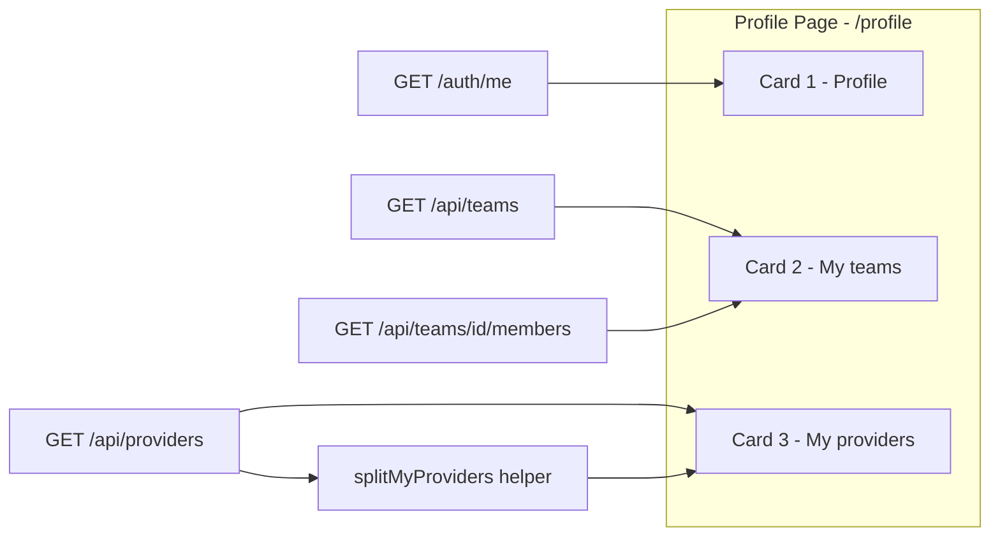

# Личный кабинет пользователя (User Profile)

> Статус: проект (design doc). Реализация не начата.
> Источник требования: «Страница Teams для пользователей не нужна — нужна страница профиля пользователя. Спроектируй личный кабинет пользователя.»
> Состав подтверждён пользователем: Профиль (имя, email, username, роли) · Мои команды (состав + моя роль) · Мои провайдеры (owner + team-shared).

---

## 1. Обзор и цели

### Что это

Единая страница `/profile` — личный кабинет аутентифицированного пользователя, заменяющая пользовательскую страницу [`frontend/src/pages/Settings/Teams/index.tsx`](../../frontend/src/pages/Settings/Teams/index.tsx) («My teams», роут `/settings/teams`). Страница отвечает на три вопроса пользователя:

1. **Кто я в системе** — username, имя, email, роли (read-only, источник — Keycloak/SSO).
2. **В каких командах я состою** — состав каждой команды и моя роль (Lead/Member).
3. **Какие провайдеры мне доступны** — принадлежащие мне (owner) и расшаренные на мои команды.

### Зачем

- Сейчас у пользователя нет «своей» страницы: dropdown у аватара содержит только Sign Out ([`frontend/src/components/Layout/index.tsx:171-178`](../../frontend/src/components/Layout/index.tsx)).
- Страница `/settings/teams` — read-only таблица без состава команд; пользователь просил заменить её полноценным кабинетом.
- «My providers» сейчас не существует вовсе: пользователь не может увидеть, какие провайдеры он owns / на какие команды ему расшарены (страница [`frontend/src/pages/Settings/Providers/index.tsx`](../../frontend/src/pages/Settings/Providers/index.tsx) показывает общий scoped-список без группировки).

### Непроблемы (YAGNI)

- Управление командами остаётся в админке (`/admin/teams`); lead-функционал (invite/remove) уже покрыт страницей [`frontend/src/pages/Admin/Teams/TeamDetail.tsx`](../../frontend/src/pages/Admin/Teams/TeamDetail.tsx) — в кабинете только просмотр.
- Редактирование профиля НЕ предусмотрено: имя/email управляются в Keycloak (SSO) или админом (`UserUpdate` в [`backend/app/schemas/auth.py:53-56`](../../backend/app/schemas/auth.py) разрешает менять email/roles только администратору). Кабинет — read-only.

---

## 2. Структура личного кабинета

Страница — вертикальный стек из трёх Card (без вкладок: контента мало, вкладки добавляют клики). Сверху — карточка профиля, ниже — команды и провайдеры.



### 2.1 Card «Profile»

| Поле | Источник | Тип отображения |
|---|---|---|
| Аватар | первая буква `username` | `Avatar` (как в header, [`frontend/src/components/Layout/index.tsx:263-265`](../../frontend/src/components/Layout/index.tsx)) |
| Имя | `full_name` (новое поле, см. §7) с fallback `username` | `Typography.Title` |
| Username | `username` | `Typography.Text code` |
| Email | `email` | `Typography.Text` + иконка copy (опционально) |
| Роли | `roles: string[]` | `Tag` c цветовой картой (переиспользовать `roleColorMap` из Layout, строки 180-184) |
| Статус | `is_active` | `Badge` status success/default |

Источник данных — Redux `state.auth.user` ([`frontend/src/store/authSlice.ts:23-29`](../../frontend/src/store/authSlice.ts), `AuthUser`), который заполняется при логине через `GET /auth/me` ([`frontend/src/pages/SsoCallback/index.tsx:44-56`](../../frontend/src/pages/SsoCallback/index.tsx)). Дополнительно — лёгкая догрузка `useGetMeQuery()` для актуализации (например, после смены ролей админом).

**Read-only.** Никаких форм. Подпись под карточкой: «Profile data is managed via SSO / by administrators».

### 2.2 Card «My teams»

Таблица команд из `useGetTeamsQuery()` (без `all` — сервер сам ограничивает членством, см. §3). Расширяемая строка (Table `expandable`) подгружает состав.

Колонки:

| Колонка | Поле | UI |
|---|---|---|
| Name | `name` | `Typography.Text strong` |
| Description | `description` | вторичный текст |
| Lead | `owner.username` | текст |
| My role | `my_role` | `Tag` gold=Lead / default=Member (переиспользовать рендер из [`frontend/src/pages/Settings/Teams/index.tsx:31-36`](../../frontend/src/pages/Settings/Teams/index.tsx)) |
| Members | `members_count` | число |

Expand (по клику) → `useGetTeamMembersQuery(teamId)` → список: username, роль (Tag), `joined_at` (дата). Ленивая загрузка только при первом expand (RTK Query кэширует по `teamId`).

Empty state: `Empty` «You are not a member of any team» (текст уже есть в текущей странице).

### 2.3 Card «My providers»

Один `useGetProvidersQuery()` (без параметров — серверный scoping уже включает: public + мои private + team-shared моих команд, [`backend/app/services/providers/service.py:148-165`](../../backend/app/services/providers/service.py)). Разделение на «мои» и «расшаренные» — на клиенте (helper, см. §3.3), без второго запроса.

Колонки:

| Колонка | Поле | UI |
|---|---|---|
| Name | `label` (fallback `name`) | `Typography.Text strong` |
| Type | `domain` + `subtype` | `Tag` |
| Access | вычисляется | `Tag` «Owned» (blue) / `Shared: {team_name}` (cyan) |
| Status | `status_flag`, `status_text` | переиспользовать [`frontend/src/components/StatusChip.tsx`](../../frontend/src/components/StatusChip.tsx) |
| Actions | — | `Button` link «Manage» → `/settings/providers` (вся edit/share/delete-механика остаётся на существующей странице) |

Фильтр сверху таблицы: `Segmented` [`All` | `Owned` | `Shared with teams`] — чисто клиентский фильтр по тому же массиву.

Empty states: «You don't own any providers» / «No providers are shared with your teams».

---

## 3. Данные и API-контракты

### 3.1 Профиль — `GET /api/auth/me` (существует)

[`backend/app/api/auth.py:124-132`](../../backend/app/api/auth.py):

```json
{
  "id": 1,
  "username": "jdoe",
  "email": "jdoe@example.com",
  "is_active": true,
  "roles": ["operator"]
}
```

**Гэп:** поля `name`/`full_name` нет ни в ответе, ни в модели [`backend/app/models/user.py:9-30`](../../backend/app/models/user.py) (только `username`, `email`, `keycloak_sub`). Требуемое пользователем «имя» → добавить `full_name` (§7.1). Роли уже отдаются (`roles: [r.name for r in current_user.roles]`) — расширять `/auth/me` ролями не нужно.

Frontend: `useGetMeQuery()` ([`frontend/src/store/api/auth.ts:22-27`](../../frontend/src/store/api/auth.ts)) уже существует.

### 3.2 Мои команды — `GET /api/teams` + `GET /api/teams/{id}/members` (существуют)

`GET /api/teams` без `?all=true` ([`backend/app/api/teams.py:76-88`](../../backend/app/api/teams.py)): для не-админа сервис возвращает только команды членства ([`backend/app/services/team.py:155-162`](../../backend/app/services/team.py)). Ответ `TeamOut` ([`backend/app/schemas/team.py:44-52`](../../backend/app/schemas/team.py)):

```json
{
  "id": 3,
  "name": "platform",
  "description": "Platform team",
  "owner": { "id": 1, "username": "admin" },
  "members_count": 4,
  "my_role": "member"
}
```

⚠️ **Нюанс для админов:** `_is_admin` в `list_teams` возвращает админу ВСЕ команды, даже где он не член. Для «моих» команд фильтровать на клиенте: `teams.filter(t => t.my_role !== null)` — `my_role` не-null только у членов ([`backend/app/services/team.py:164-179`](../../backend/app/services/team.py): `member is None → my_role None`).

Состав: `GET /api/teams/{team_id}/members` ([`backend/app/api/teams.py:157-179`](../../backend/app/api/teams.py)), permission `teams:read` + scope membership — доступно каждому члену. Ответ `TeamMemberOut` ([`backend/app/schemas/team.py:61-67`](../../backend/app/schemas/team.py)): `{user_id, username, role, joined_at}`.

Frontend: `useGetTeamsQuery`, `useGetTeamMembersQuery` ([`frontend/src/store/api/teams.ts:19-22,35-38`](../../frontend/src/store/api/teams.ts)) уже существуют. **Новый backend-эндпоинт `GET /teams/mine` НЕ нужен.**

### 3.3 Мои провайдеры — `GET /api/providers` (существует)

`GET /api/providers` ([`backend/app/api/providers.py:94-132`](../../backend/app/api/providers.py)), permission `providers:read`. Scoping в сервисе ([`backend/app/services/providers/service.py:148-165`](../../backend/app/services/providers/service.py)): не-админ видит `visibility=public` ∪ `owner_user_id = me` ∪ (`visibility=team` ∧ `team_id ∈ моих команд`); держатель `providers:read_all` видит всё.

Ответ `ResourceProvider` (frontend-тип [`frontend/src/types/index.ts:617-644`](../../frontend/src/types/index.ts)) содержит всё нужное: `owner_user_id`, `visibility`, `team_id`, `team_name`, `status_flag`.

Клиентский helper `splitMyProviders.ts` (новый, `frontend/src/pages/Profile/`):

```ts
export function splitMyProviders(
  providers: ResourceProvider[],
  userId: number | undefined,
  myTeamIds: Set<number>
): { owned: ResourceProvider[]; shared: ResourceProvider[] } {
  const owned = providers.filter((p) => userId != null && p.owner_user_id === userId);
  const shared = providers.filter(
    (p) => p.visibility === 'team' && p.team_id != null && myTeamIds.has(p.team_id)
  );
  return { owned, shared };
}
```

Вызов: `myTeamIds` = `new Set(teams.filter(t => t.my_role !== null).map(t => t.id))` (защита от админ-«все команды», см. §3.2). `owner=me` query-параметр ([`backend/app/api/providers.py:128`](../../backend/app/api/providers.py)) не используем — один запрос покрывает оба списка. **Новый backend-эндпоинт не нужен.**

### 3.4 Сводка по разделам

| Раздел | Запрос | Loading | Error | Empty |
|---|---|---|---|---|
| Profile | Redux `auth.user` + `useGetMeQuery` | `Spin` центр карточки | `Alert type=error title=Failed to load profile` | невозможен (user всегда есть в Layout) |
| My teams | `useGetTeamsQuery()` | `Spin` | `Alert title=Failed to load teams` | `Empty` «You are not a member of any team» |
| Team members | `useGetTeamMembersQuery(teamId)` при expand | `Spin` в expanded row | `Alert` внутри expanded row | `Empty` |
| My providers | `useGetProvidersQuery()` | `Spin` | `Alert title=Failed to load providers` | `Empty` по веткам Owned / Shared |

⚠️ Ant Design 6: у `Alert` использовать проп **`title`**, не `message` (правило проекта; текущая Teams-страница уже корректна).

---

## 4. UI/UX

### Layout

- Отдельный роут **`/profile`** внутри основного `Layout` (НЕ в Settings): личный кабинет — не настройка, вход из аватара. `ProtectedRoute` уже обеспечен обёрткой ([`frontend/src/router/index.tsx:97-104`](../../frontend/src/router/index.tsx)).
- `Content` страницы: `Flex vertical gap={16}` (паттерн текущей Teams-страницы, строки 40-48).
- Заголовок: `Typography.Title level={4}` «My Profile» + вторичный текст.
- Отзывчивость: `Row/Col` (profile-карточка: аватар+имя слева, Descriptions справа; `xs=24 lg=12`); таблицы — `scroll={{ x: 640 }}`; Sider уже коллапсируется на `breakpoint="lg"`.

### Компоненты Ant Design 6

`Card`, `Descriptions` (profile), `Table` (+`expandable` для команд), `Tag`, `Avatar`, `Badge`, `Segmented` (фильтр провайдеров), `Empty`, `Spin`, `Alert`, `Typography`, `Space`, `Button type=link`.

### Навигация из кабинета

- «Manage» у провайдера → `/settings/providers` (существующая страница).
- Lead может управлять составом → ссылка-подсказка «Leads can manage members in the Admin Panel» (текст уже используется в текущей странице, строка 46-47), видимая только при `hasPermission('teams:write')`.

---

## 5. Маршрутизация и права

### Новый маршрут

```tsx
// frontend/src/router/index.tsx — внутри <Route path="/" element={<ProtectedRoute><Layout/>...}>
<Route path="profile" element={<ProfilePage />} />
```

**Без `PermissionGate`**: кабинет доступен каждому аутентифицированному пользователю; гейтинг всех данных уже выполнен на backend per-request (`teams:read` у A/O/V, `providers:read` у A/O/V — [`plans/architecture/permissions.md:59,62`](../architecture/permissions.md)). Внутри карточек — мягкая защита через `PermissionGate fallback=<Empty>` для устойчивости к ролям без этих прав (будущие роли).

### Судьба `/settings/teams`

Заменяется редиректом (паттерн уже используется в роутере, например строки 365-378):

```tsx
<Route path="settings/teams" element={<Navigate to="/profile" replace />} />
```

- Удалить импорт `SettingsTeams` ([`frontend/src/router/index.tsx:26`](../../frontend/src/router/index.tsx)) и маршрут строки 389-396.
- Удалить файл [`frontend/src/pages/Settings/Teams/index.tsx`](../../frontend/src/pages/Settings/Teams/index.tsx).
- Админские `/admin/teams`, `/admin/teams/:teamId` (строки 460-475) не трогаются.

### Права: изменений нет

Новые permissions не вводятся. Обновить только строку 59 в [`plans/architecture/permissions.md`](../architecture/permissions.md): привязка `teams:read` к UI `/settings/teams` → `/profile` (раздел My teams).

---

## 6. Изменения в навигации

[`frontend/src/components/Layout/index.tsx`](../../frontend/src/components/Layout/index.tsx):

1. **Dropdown аватара** (строки 171-178) — добавить пункт первым, над Sign Out:

```tsx
const userMenuItems: MenuProps['items'] = [
  { key: 'profile', icon: <UserOutlined />, label: 'My Profile',
    onClick: () => navigate('/profile') },
  { key: 'logout', icon: <LogoutOutlined />, label: 'Sign Out', onClick: handleLogout },
];
```

2. **Sidebar**: убрать пункт Teams из группы Settings (строка 104: `{ key: '/settings/teams', ... label: 'Teams' }`). Пункт Providers остаётся. `TeamOutlined` import удалить, если больше не используется.

3. `computeSelectedKey` (строки 49-67) уже вернёт `/profile` для одноуровневого пути — правок не требует.

4. AdminLayout не меняем: из админки пользователь возвращается в основной интерфейс.

---

## 7. Бэкенд-гэпы

### 7.1 Добавить `full_name` пользователю (единственное обязательное изменение)

Требование пользователя явно содержит «имя (name)»; в модели его нет. План:

| # | Файл | Изменение |
|---|---|---|
| 1 | (миграция не требуется) | `full_name` уже входит в [`initial_schema`](../../backend/alembic/versions/20260816_1159_37590bb4a2ec_initial_schema.py) (колонка `users.full_name VARCHAR(255) NULL` создаётся при сбросе схемы) |
| 2 | [`backend/app/models/user.py`](../../backend/app/models/user.py) | `full_name = Column(String(255), nullable=True)` |
| 3 | [`backend/app/schemas/auth.py:36-43`](../../backend/app/schemas/auth.py) | `UserOut.full_name: str \| None = None` (backward-compatible) |
| 4 | [`backend/app/api/auth.py:124-132`](../../backend/app/api/auth.py) | `get_me` передаёт `full_name=current_user.full_name` |
| 5 | [`backend/app/services/oidc.py:313-320`](../../backend/app/services/oidc.py) | claims: `full_name = payload.get("name")` (стандартный OIDC-claim Keycloak); `_create_user` (строки 335-338) и `_update_user` (353-357) сохраняют/обновляют |

Fallback на фронтенде: `full_name ?? username` — страница работает и до заполнения поля у существующих пользователей (колонка nullable, миграция безопасна).

### 7.2 Что НЕ нужно (обоснование)

- `GET /teams/mine` — `GET /api/teams` уже scoped по членству ([`backend/app/services/team.py:155-162`](../../backend/app/services/team.py)) + `my_role` в ответе.
- Расширение `/auth/me` ролями — роли уже есть ([`backend/app/api/auth.py:131`](../../backend/app/api/auth.py)).
- Эндпоинт «мои провайдеры» — `GET /api/providers` уже отдаёт public+own+team-shared в одном ответе; фильтрация тривиальна на клиенте.
- `PATCH /auth/me` — редактирование профиля вне scope (SSO-модель).

---

## 8. План реализации (для junior-разработчика)

Шаги выполняются последовательно; каждый шаг заканчивается прогоном соответствующих проверок.

### Шаг 1. Backend: `full_name`
- [ ] 1.1 Создать миграцию: `cd backend && alembic revision -m "add_user_full_name"`; в файле — `op.add_column('users', sa.Column('full_name', sa.String(255), nullable=True))` и обратный downgrade.
- [ ] 1.2 Добавить колонку в [`backend/app/models/user.py`](../../backend/app/models/user.py).
- [ ] 1.3 Добавить поле в `UserOut` ([`backend/app/schemas/auth.py`](../../backend/app/schemas/auth.py)) и в `get_me` ([`backend/app/api/auth.py:124-132`](../../backend/app/api/auth.py)).
- [ ] 1.4 Замаппить OIDC-claim `name` в [`backend/app/services/oidc.py`](../../backend/app/services/oidc.py) (`_parse_claims`, `_create_user`, `_update_user`).
- [ ] 1.5 Тест: `backend/tests/unit/test_auth_me.py` (новый) — `get_me` возвращает `full_name`; oidc-маппинг сохраняет `name`.
- [ ] 1.6 Прогон: `./backend/scripts/test-unit.sh -v` и `./backend/scripts/lint.sh`.

### Шаг 2. Frontend: типы и helper
- [ ] 2.1 [`frontend/src/types/index.ts:145-151`](../../frontend/src/types/index.ts): добавить `full_name?: string | null` в `User`; добавить `full_name?: string | null` в `AuthUser` ([`frontend/src/store/authSlice.ts:23-29`](../../frontend/src/store/authSlice.ts)) и в ответ `getMe` ([`frontend/src/store/api/auth.ts:22-27`](../../frontend/src/store/api/auth.ts)).
- [ ] 2.2 Создать `frontend/src/pages/Profile/splitMyProviders.ts` (сигнатура в §3.3) + unit-тест `frontend/src/tests/unit/splitMyProviders.test.ts` (кейсы: owned, team-shared, админ-команда без членства исключается, public-чужой не попадает никуда).
- [ ] 2.3 Прогон: `./frontend/scripts/test.sh --unit` и `./frontend/scripts/type-check.sh`.

### Шаг 3. Страница Profile
- [ ] 3.1 Создать `frontend/src/pages/Profile/index.tsx`: три Card (§2), данные из `useAppSelector(auth.user)` + `useGetMeQuery` + `useGetTeamsQuery` + `useGetProvidersQuery`.
- [ ] 3.2 Вынести `frontend/src/pages/Profile/MyTeamsCard.tsx` (таблица + expandable members) и `frontend/src/pages/Profile/MyProvidersCard.tsx` (таблица + Segmented-фильтр + StatusChip).
- [ ] 3.3 Роль-теги: `roleColorMap` вынести из Layout в общий хелпер или продублировать локально (меньше диффа — продублировать).
- [ ] 3.4 Все `Alert` — только с пропом `title`.

### Шаг 4. Роутер и навигация
- [ ] 4.1 [`frontend/src/router/index.tsx`](../../frontend/src/router/index.tsx): импорт `ProfilePage`; добавить `<Route path="profile" .../>`; заменить блок строк 389-396 на redirect; удалить импорт `SettingsTeams` (строка 26).
- [ ] 4.2 Удалить `frontend/src/pages/Settings/Teams/index.tsx`.
- [ ] 4.3 [`frontend/src/components/Layout/index.tsx`](../../frontend/src/components/Layout/index.tsx): пункт «My Profile» в dropdown (§6.1); удалить Teams из sidebar (строка 104).
- [ ] 4.4 Обновить строку 59 в [`plans/architecture/permissions.md`](../architecture/permissions.md) (`teams:read` → UI `/profile`).

### Шаг 5. Тесты frontend
- [ ] 5.1 `frontend/src/tests/integrations/Profile.test.tsx` (новый, по паттерну `Providers.test.tsx`): рендер username/email/full_name/ролей; таблица команд c my_role; expand подгружает members (мок `getTeamMembers`); провайдеры делятся Owned/Shared; Segmented-фильтр; empty states; Alert при ошибке (с `title`).
- [ ] 5.2 Обновить `frontend/src/tests/integrations/NavigationMenu.test.tsx`: в sidebar НЕТ пункта Teams; dropdown содержит My Profile (если dropdown покрыт тестом — иначе добавить).
- [ ] 5.3 Полный прогон: `./frontend/scripts/test.sh`, `./frontend/scripts/lint.sh`, `./frontend/scripts/type-check.sh`.

### Файлы (полный список)

| Файл | Действие |
|---|---|
| `backend/alembic/versions/*_add_user_full_name.py` | создать |
| [`backend/app/models/user.py`](../../backend/app/models/user.py) | +`full_name` |
| [`backend/app/schemas/auth.py`](../../backend/app/schemas/auth.py) | +`UserOut.full_name` |
| [`backend/app/api/auth.py`](../../backend/app/api/auth.py) | `get_me` отдаёт `full_name` |
| [`backend/app/services/oidc.py`](../../backend/app/services/oidc.py) | claim `name` → `full_name` |
| `backend/tests/unit/test_auth_me.py` | создать |
| [`frontend/src/types/index.ts`](../../frontend/src/types/index.ts) | +`User.full_name` |
| [`frontend/src/store/authSlice.ts`](../../frontend/src/store/authSlice.ts) | +`AuthUser.full_name` |
| [`frontend/src/store/api/auth.ts`](../../frontend/src/store/api/auth.ts) | +поле в ответе `getMe` |
| `frontend/src/pages/Profile/index.tsx` | создать |
| `frontend/src/pages/Profile/MyTeamsCard.tsx` | создать |
| `frontend/src/pages/Profile/MyProvidersCard.tsx` | создать |
| `frontend/src/pages/Profile/splitMyProviders.ts` | создать |
| `frontend/src/pages/Settings/Teams/index.tsx` | удалить |
| [`frontend/src/router/index.tsx`](../../frontend/src/router/index.tsx) | `/profile` + redirect |
| [`frontend/src/components/Layout/index.tsx`](../../frontend/src/components/Layout/index.tsx) | dropdown + sidebar |
| `frontend/src/tests/unit/splitMyProviders.test.ts` | создать |
| `frontend/src/tests/integrations/Profile.test.tsx` | создать |
| `frontend/src/tests/integrations/NavigationMenu.test.tsx` | обновить |
| [`plans/architecture/permissions.md`](../architecture/permissions.md) | строка 59 |

---

## 9. Тестирование

### Backend (unit, только для Шага 1)

- `test_auth_me.py`: `/auth/me` (через `async_client` fixture) возвращает `full_name` (значение и `null`-fallback).
- OIDC: `_parse_claims` с `{"name": "John Doe"}` → `full_name="John Doe"`; `_update_user` обновляет.
- Прогон: `./backend/scripts/test-unit.sh -v`.

### Frontend

- **Unit** `splitMyProviders.test.ts`: чистая функция — 4 кейса (см. 2.2), включая админский (команда с `my_role=null` не даёт shared-провайдеры).
- **Integration** `Profile.test.tsx`: store + RTK Query моки (паттерн [`frontend/src/tests/integrations/Providers.test.tsx`](../../frontend/src/tests/integrations/Providers.test.tsx)); сценарии §5.1.
- **Integration** `NavigationMenu.test.tsx`: sidebar без Teams, dropdown с My Profile.
- Прогоны: `./frontend/scripts/test.sh`, `--unit`, `--integrations`, `type-check.sh`, `lint.sh`.

### Ручная проверка (минимум)

1. SSO-логин → аватар → My Profile: имя из Keycloak подтянулось.
2. Не-член ни одной команды → empty state; член двух команд → роли Lead/Member, expand показывает состав.
3. Владелец приватного провайдера → ветка Owned; член команды с shared-провайдером → ветка Shared; Manage-линк ведёт на `/settings/providers`.
4. Старая закладка `/settings/teams` → редирект на `/profile`.
5. Пользователь без провайдеров и команд → оба empty states, страница не падает.

---

## 10. Открытые вопросы / риски

| # | Вопрос/риск | Решение в проекте |
|---|---|---|
| 1 | **«Имя» ≠ username**: в БД поля нет. | Добавляем `full_name` через миграцию + OIDC `name` (§7.1); fallback `username`. Если пользователь передумает — шаг 1 выпадает, остальное не меняется. |
| 2 | **Админ видит все команды** в `GET /api/teams` (service `_is_admin`). | Клиентский фильтр `my_role !== null` (§3.2) — уже учтён в helper и тестах. |
| 3 | **Админ (`providers:read_all`) видит чужие private** в `GET /api/providers`. | Фильтр `owner_user_id === me` корректен; чужие private не попадают в «My providers». |
| 4 | **Public-провайдеры с owner** попадут в ветку Owned создателя. | Ожидаемое поведение (он owner); при желании сузить — фильтр `visibility === 'owner'` (решение при ревью). |
| 5 | **Закладки/линки на `/settings/teams`**. | Redirect сохраняем бессрочно (паттерн роутера). |
| 6 | **`owner=me` параметр остаётся неиспользуемым** этой страницей. | Не трогаем — используется/доступен другим вызовам API. |
| 7 | **Keycloak не отдаёт claim `name`** (не настроен mapper). | Поле nullable + fallback username; настройка маппера — инфраструктурная задача вне кода (отметить в PR). |
| 8 | **Dropdown покрыт тестами?** NavigationMenu-тест фокусируется на sidebar. | В 5.2 проверить фактическое покрытие и дополнить только при необходимости. |
