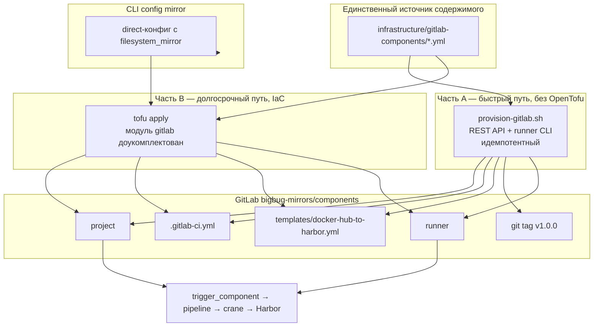

# Спецификация: infrastructure-слой для GitLab CI/CD Components (Docker Hub → Harbor)

Статус: спроектировано (architect), к реализации в code-режиме.
Дата: 2026-08-17. Связанный спек: [`plans/docker-import-fix-spec.md`](docker-import-fix-spec.md).

Контекст: backend-запуск компонента id=11 падает с `404 Project Not Found` для
`bigbug-mirrors/components`. Debug-агент локализовал: (1) `tofu init` блокируется
гео-фильтром Cloudflare на `registry.opentofu.org` (403, cf-ray DME), (2) terraform-модуль
gitlab не содержит ресурсов `project`/`repository_file`/`runner`.

---

## Архитектурное решение (главное)

Два **независимых** provisioning-пути к одному итоговому состоянию, один источник содержимого:



- **Часть A** — точка входа `make infra-provision-gitlab`: скрипт через GitLab REST API +
  `docker exec ... gitlab-runner register`. Разблокирует пайплайн сегодня, OpenTofu не нужен.
- **Часть B** — тот же целевой state декларативно (`tofu apply`), когда init/apply доступен.
  Конфигурация частей A и B описывает **одно и то же** целевое состояние; допустимо и
  A-сначала-B-потом (import/absent-толерантность, см. ниже), и наоборот.
- **Часть C** — `tofu init` без внешнего registry: провайдеры уже лежат в
  [`infrastructure/terraform/.terraform/providers/`](../infrastructure/terraform/.terraform/providers/)
  в валидной filesystem-mirror раскладке (`registry.opentofu.org/<ns>/<type>/<ver>/linux_amd64/…`).

### Дополнительные root-cause, найденные при проектировании (обязательны к устранению)

1. **`@1.0.0` резолвится только через git-тег** репозитория. Компоненты с версией
   `<host>/<group>/<project>/<path>@<version>` требуют существования тега `v1.0.0`
   (GitLab нормализует `1.0.0` → `v1.0.0` при создании тега, но при include тег должен
   существовать в refs). Ни скрипт, ни terraform сегодня тег не создают → после заливки
   файлов include всё равно упал бы с `404 Component Not Found`. Скрипт создаёт тег
   `v1.0.0` через Repository Files API с `start_branch` (первый commit) → отдельный commit
   для тега (обязательное требование GitLab API) → `POST /projects/:id/repository/tags`.
2. **Шаблон читает shell-переменные, а не `$[[ inputs.* ]]`** —
   [`docker-hub-to-harbor-template.yml`](../infrastructure/gitlab-components/docker-hub-to-harbor-template.yml:65)
   использует `$target_registry`, `$tags` и т.д. Это **не баг, а контракт**: значения
   приходят как **pipeline variables** от [`trigger_component()`](../backend/app/services/pipeline/_runs.py:397)
   (`{"key": k, "value": str(v)}` → переменные окружения job). Поэтому:
   - `.gitlab-ci.yml` передаёт только **required** inputs (`target_registry`, `target_repo`)
     с dev-значениями по умолчанию (иначе lint `include:component` упадёт на missing input);
   - опциональные inputs НЕ передаются в `include:` — их значения приживляются backend-ом
     как CI-variables при `POST /pipelines` и перекрывают дефолты из `spec.inputs`.
3. **Job-контейнеры docker-executor'а не в compose-сети** `bigbug-network`. Раннер
   запускает jobs через `/var/run/docker.sock` (docker-in-docker по сокету), и по умолчанию
   резолвит `gitlab.local`/`harbor.local` через публичный DNS → clone и crane упадут.
   Лечение: `--docker-extra-hosts gitlab.local:host-gateway,harbor.local:host-gateway`
   (`host-gateway` поддерживается Docker 20.10+; маппит на IP хоста, где опубликованы
   `localhost:8080` и kind-NodePort `harbor.local:443`).
   **Примечание:** с extra_hosts на сокете `CI_SERVER_URL` остаётся `http://gitlab.local:8080`
   (hostname контейнера GitLab), поэтому clone из job идёт через `gitlab.local:8080` →
   хост → проброшенный порт 8080. Работает.
4. **Регистрационный токен и new-runner flow**: в свежих GitLab CE (16.0+)
   registration token (`Z43cnDHEzxYEboHzsatU`) ещё работает, но в 17.x+ могут быть
   ограничения. Скрипт обязан поддержать **fallback на authentication token flow**:
   создать runner через `POST /api/v4/user/runners` (требует GitLab 16.0+) → получить
   `token` → `gitlab-runner register --token <runner-auth-token>` (без `--registration-token`).
   Основной путь — registration token из env (дан debug-агентом), но env-переменная
   обязательна, хардкод запрещён.

---

## Часть A. `infrastructure/provision-gitlab.sh` — минимальный путь без OpenTofu

Паттерн: [`infrastructure/harbor/deploy.sh`](../infrastructure/harbor/deploy.sh)
(`set -euo pipefail`, `readonly SCRIPT_DIR`, `log/log_warn/log_error`, цветной вывод,
проверка зависимостей) + env-подход [`init.sh`](../infrastructure/init.sh) (source
`infrastructure/.env`, дефолты `${VAR:-default}`).

### A.1 Переменные окружения (добавить в [`infrastructure/.env.example`](../infrastructure/.env.example))

```bash
# GitLab (существующие)
GITLAB_URL=http://localhost:8080              # уже используется как дефолт в скрипте
GITLAB_TOKEN=glpat-...                        # уже в .env; root PAT со scope api

# Новые для provision-gitlab.sh
GITLAB_RUNNER_REGISTRATION_TOKEN=             # из Admin → CI/CD → Runners (Z43cnDHEzxYEboHzsatU)
GITLAB_RUNNER_AUTH_TOKEN=                     # опционально: если registration-token flow отключён
GITLAB_RUNNER_CONTAINER=bigbug-gitlab-runner  # container_name из docker-compose.yml
GITLAB_RUNNER_TAG_LIST=bigbug,docker
GITLAB_COMPONENTS_GROUP=bigbug-mirrors        # существующая группа (id=3)
GITLAB_COMPONENTS_PROJECT=components
GITLAB_COMPONENTS_DEFAULT_BRANCH=main
GITLAB_HARBOR_HOST=harbor.local               # для --docker-extra-hosts
```

Скрипт: `source .env` с fallback на дефолты; валидация `GITLAB_TOKEN` непустой.
`.env` в `.rooignore`/`.gitignore` уже исключён — секреты не утекут.

### A.2 Скелет скрипта (функции, порядок)

```
check_dependencies      # curl, jq, docker; (git НЕ нужен — всё через REST API)
gitlab_api              # curl -sf -H "PRIVATE-TOKEN: $GITLAB_TOKEN" "$GITLAB_URL/api/v4$1"
ensure_group            # idempotent
ensure_project          # idempotent — ядро
ensure_repository_file  # idempotent helper (create/update) — ядро
ensure_default_branch   # тонкость первого коммита (см. ниже)
ensure_tag              # v1.0.0 для include @1.0.0
ensure_runner           # регистрация, идемпотентная по имени
verify                  # отчет о состоянии (используется и в Части D)
```

### A.3 Точные REST-вызовы

**1) Группа (id=3 уже есть — только проверка, создание как fallback):**

```
GET  /api/v4/groups/bigbug-mirrors
  200 → ok, запомнить id
  404 → POST /api/v4/groups  {"name":"bigbug-mirrors","path":"bigbug-mirrors",
                              "visibility":"private"}
```

**2) Проект `bigbug-mirrors/components`:**

```
GET  /api/v4/projects/bigbug-mirrors%2Fcomponents
  200 → ok
  404 → POST /api/v4/projects
        {
          "name": "components",
          "path": "components",
          "namespace_id": <group_id>,
          "visibility": "private",
          "initialize_with_readme": true,      ← создаёт первый commit + default branch
          "default_branch": "main"
        }
```

`initialize_with_readme=true` — простейший способ получить непустой repo с веткой `main`
без git CLI. (Альтернатива, если хотите первый commit = `.gitlab-ci.yml`: создать проект
пустым и залить `.gitlab-ci.yml` с `"start_branch":"main","no_commit":"false"` без
`branch` — GitLab создаст ветку с этим единственным файлом. Оба варианта рабочие;
рекомендуем README-путь как более очевидный.)

**3) Заливка файлов (helper `ensure_repository_file <file_path> <local_source> <encoding>`):**

Сначала прочитать содержимое локальных файлов из
[`infrastructure/gitlab-components/`](../infrastructure/gitlab-components/):

- `.gitlab-ci.yml` — генерируется скриптом (см. A.4), кодируется `base64 -w0`
- `templates/docker-hub-to-harbor.yml` — копия
  [`docker-hub-to-harbor-template.yml`](../infrastructure/gitlab-components/docker-hub-to-harbor-template.yml)
  как есть (template уже содержит и `spec:`-часть, и `---`-разделитель с job — это
  валидный формат компонентного файла)

```
GET  /api/v4/projects/:id/repository/files/<url-encoded-path>?ref=main
  404 → CREATE:
        POST /api/v4/projects/:id/repository/files/<url-encoded-path>
        {
          "branch": "main",
          "content": "<base64>",
          "commit_message": "Add <path> (provision-gitlab)",
          "encoding": "base64"
        }
  200 → сравнить blob_sha (response: file.last_commit_id / sha) или просто
        content_sha256: если differs →
        PUT  /api/v4/projects/:id/repository/files/<url-encoded-path>
        { "branch":"main","content":"<base64>","commit_message":"Update <path>","encoding":"base64" }
```

Прагматика идемпотентности: сравнение по `content` в GET (base64-decode → diff с локальным
файлом) → update только при расхождении. Это даёт безопасный повторный запуск без
мусорных коммитов.

**4) Тег `v1.0.0` (обязателен для `include: component: ...@1.0.0`):**

```
GET  /api/v4/projects/:id/repository/tags/v1.0.0
  200 → ok
  404 → POST /api/v4/projects/:id/repository/tags
        { "tag_name": "v1.0.0", "ref": "main", "message": "Components v1.0.0" }
```

GitLab требует, чтобы ref тега отличался от уже протегированного коммита при
последующих изменениях; при повторных запусках скрипта, если файлы обновились, а тег
`v1.0.0` существует и указывает на старый коммит — **не двигать тег автоматически**
(мутация опубликованной версии — ручное решение), но напечатать `log_warn` с подсказкой
`gitlab api push tag --force` / UI. `ponytail:` тег фиксирован на моменте создания;
обновление версии компонента = новый тег v1.0.1 (ручной процесс, потолок осознан).

**5) Регистрация runner:**

Idempotency-ключ — **описание раннера** (`description = bigbug-docker-runner`), т.к.
runner token после регистрации уникален и в config.toml раннера не сравнить с API-токеном напрямую.

```
GET /api/v4/runners/all?type=instance_type&per_page=100   (или без type — все)
  → если есть runner с description == "bigbug-docker-runner" и status=online → skip
  → иначе register (CLI, см. A.5)
```

### A.4 `.gitlab-ci.yml` — точное содержимое (генерирует скрипт)

```yaml
# Provisioned by infrastructure/provision-gitlab.sh — do not edit manually.
include:
  - component: $CI_SERVER_FQDN/bigbug-mirrors/components/docker-hub-to-harbor@1.0.0
    inputs:
      target_registry: harbor.local:443     # dev-default; перекрывается CI-переменной
      target_repo: bigbug/nginx             # dev-default; перекрывается CI-переменной

stages: [sync]   # component-джоба объявляет stage: sync
```

Обоснование каждой строки:
- `$CI_SERVER_FQDN` — стандартный способ адресации «того же» GitLab (в компонентах
  hostname должен совпадать с `gitlab.local`). Резолвится в `gitlab.local` (hostname
  контейнера из [`docker-compose.yml:95`](../infrastructure/docker-compose.yml)).
- `inputs:` содержат только required-поля. Опциональные (`source_image`, `tags`,
  `target_user`, `target_password`, `insecure`) — НЕ перечислять: их значения приходят
  из pipeline variables (контракт шаблона — bare `$var`, см. «Архитектурное решение» п.2).
- **Механика перекрытия:** inputs подставляются в YAML **при создании** пайплайна
  (compile-time), а variables — это env job (runtime). Шаблон читает `$target_registry`:
  в окружении job будет значение CI-переменной `target_registry` от backend (если
  передана), а не input-дефолт. Отсюда: backend обязан передавать полный набор значений
  в `inputs` при `POST /api/components/11/run` (это уже делает
  [`trigger_component()`](../backend/app/services/pipeline/_runs.py:397) — все ключи
  payload идут в variables). Ничего в backend менять не нужно.
- `stages: [sync]` — иначе pipeline упадёт «unknown stage sync» (у компонента stage
  объявлен, но в потребительском `.gitlab-ci.yml` должен существовать).

**Секреты не в файле**: `target_password` приходит переменной от backend (из encrypted
credentials) и виден только в env конкретного job — в репозитории plaintext-секретов нет.

### A.5 Регистрация runner (CLI в контейнере)

Раннер-контейнер `bigbug-gitlab-runner` (volume `gitlab_runner_config:/etc/gitlab-runner`,
docker.sock проброшен) запущен, но `config.toml` пуст. Регистрация **на хосте** через
docker exec (контейнер — правильное место: config persistится в volume, runner binary
внутри образа):

```bash
docker exec "${GITLAB_RUNNER_CONTAINER}" gitlab-runner register --non-interactive \
  --url "http://gitlab.local:8080" \
  --registration-token "${GITLAB_RUNNER_REGISTRATION_TOKEN}" \
  --executor docker \
  --docker-image "gcr.io/go-containerregistry/crane:debug" \
  --docker-volumes /var/run/docker.sock:/var/run/docker.sock \
  --docker-extra-hosts "gitlab.local:host-gateway,harbor.local:host-gateway" \
  --docker-pull-policy "if-not-present" \
  --description "bigbug-docker-runner" \
  --tag-list "${GITLAB_RUNNER_TAG_LIST:-bigbug,docker}" \
  --run-untagged \
  --locked="false"
```

Разбор флагов:
- `--url http://gitlab.local:8080` — раннер-контейнер в `bigbug-network`, резолвит
  `gitlab.local` через docker DNS (alias контейнера gitlab) — правильно.
- `--docker-image gcr.io/go-containerregistry/crane:debug` — совпадает с
  [`image:` в job](../infrastructure/gitlab-components/docker-hub-to-harbor-template.yml:61);
  это default, job-образ задаёт свой `image:` всё равно. Важно: crane:debug содержит
  shell (busybox sh) — `image: crane` без `:debug` не имеет shell и скрипт job умрёт.
- `--docker-volumes /var/run/docker.sock` — задан в ТЗ; для crane-job не требуется
  (crane работает через registry API, не через docker daemon), но сокет оставляем под
  будущие build-jobs (docker build). `ponytail:` сокет = root-equivalent на хосте;
  потолок для dev-стенда, прод-раннеры — без сокета.
- `--docker-extra-hosts ...:host-gateway` — критично (root-cause №3): job-контейнеры
  должны резолвить `gitlab.local` (clone) и `harbor.local` (crane push).
- `--run-untagged` — компонентный job не имеет `tags:` (в шаблоне отсутствует) — без
  этого раннер с тегами его не возьмёт.
- `--locked="false"` — проект не привязан жёстко (instance runner для простоты).

Fallback (GitLab 17.x, если registration token отклонён):
```bash
RUNNER_TOKEN=$(curl -sf -H "PRIVATE-TOKEN: ${GITLAB_TOKEN}" \
  -X POST "${GITLAB_URL}/api/v4/user/runners" \
  -H "Content-Type: application/json" \
  -d '{"runner_type":"instance","description":"bigbug-docker-runner","tag_list":"bigbug,docker"}' \
  | jq -r .token)
docker exec "${GITLAB_RUNNER_CONTAINER}" gitlab-runner register --non-interactive \
  --url "http://gitlab.local:8080" --token "${RUNNER_TOKEN}" ... # остальные флаги те же, БЕЗ --registration-token
```
Выбор пути: если `GITLAB_RUNNER_AUTH_TOKEN`/успешный `POST /user/runners` → token-flow,
иначе registration-token-flow.

После register: `docker exec … gitlab-runner restart` (или verify-подтянет), config
persistится в volume `gitlab_runner_config` → перезапуск контейнера регистрацию сохраняет.

### A.6 Идемпотентность (сводка)

| Шаг | Check-before-create | Мутация при повторе |
|---|---|---|
| group | `GET /groups/bigbug-mirrors` | нет |
| project | `GET /projects/bigbug-mirrors%2Fcomponents` | нет |
| files | `GET /repository/files/:path?ref=main` + content diff | update только при diff |
| tag v1.0.0 | `GET /repository/tags/v1.0.0` | нет (warn при отставании) |
| runner | `GET /runners/all` по description | нет |

Скрипт всегда завершает `verify`-секцией (см. Часть D) и `exit 1` при любом провале —
`make infra-provision-gitlab` не даст ложнопозитивного успеха.

### A.7 Makefile

```makefile
.PHONY: infra-provision-gitlab
infra-provision-gitlab: ## Provision GitLab components project + runner (без OpenTofu)
	bash ./infrastructure/provision-gitlab.sh
```

---

## Часть B. Доукомплектование terraform-модуля gitlab

Целевой state идентичен Части A. Новые файлы в
[`infrastructure/terraform/modules/gitlab/`](../infrastructure/terraform/modules/gitlab/):

### B.1 `projects.tf` (новый)

```hcl
resource "gitlab_project" "components" {
  name             = "components"
  path             = var.components_project_path          # "components"
  namespace_id     = gitlab_group.mirrors.id
  description      = "BigBug CI/CD components (docker-hub-to-harbor etc.)"
  visibility_level = "private"
  default_branch   = var.components_default_branch        # "main"

  # Автосоздание README не поддержано провайдером напрямую —
  # инициализация репо делается первым gitlab_repository_file (см. initialize_with_readme-заметку).
}
```

### B.2 `repository_files.tf` (новый)

```hcl
resource "gitlab_repository_file" "ci_yml" {
  project        = gitlab_project.components.id
  file_path      = ".gitlab-ci.yml"
  branch         = var.components_default_branch
  content        = base64encode(templatefile("${path.module}/templates/gitlab-ci.yml.tftpl", {
                    components_fqdn = var.components_fqdn   # gitlab.local
                  }))
  commit_message = "Provision .gitlab-ci.yml"
  # provider gitlabhq ~>17.0: атрибут start_branch на create — создаёт ветку, если её нет
}

resource "gitlab_repository_file" "docker_hub_to_harbor" {
  project        = gitlab_project.components.id
  file_path      = "templates/docker-hub-to-harbor.yml"
  branch         = var.components_default_branch
  content        = base64encode(file("${path.module}/../../gitlab-components/docker-hub-to-harbor-template.yml"))
  commit_message = "Provision docker-hub-to-harbor component"
}

# Тег v1.0.0 — провайдер gitlabhq не имеет resource gitlab_tag;
# минимальный вариант: null_resource + local-exec через curl (token уже в provider config)
resource "null_resource" "components_tag" {
  depends_on = [gitlab_repository_file.ci_yml, gitlab_repository_file.docker_hub_to_harbor]

  provisioner "local-exec" {
    environment = { GITLAB_TOKEN = var.gitlab_token, GITLAB_URL = var.gitlab_url }
    command = <<-EOT
      pid="${gitlab_project.components.id}"
      code=$(curl -s -o /dev/null -w '%{http_code}' -H "PRIVATE-TOKEN: $GITLAB_TOKEN" \
        "$GITLAB_URL/api/v4/projects/$pid/repository/tags/v1.0.0")
      [ "$code" = "200" ] || curl -sf -X POST -H "PRIVATE-TOKEN: $GITLAB_TOKEN" \
        "$GITLAB_URL/api/v4/projects/$pid/repository/tags" \
        -d "tag_name=v1.0.0" -d "ref=${var.components_default_branch}"
    EOT
  }
  # триггер на изменение содержимого файлов, чтобы new-коммит не остался без тега:
  triggers = { files = "${gitlab_repository_file.ci_yml.id}|${gitlab_repository_file.docker_hub_to_harbor.id}" }
}
```

`path.module/../../gitlab-components/…` — относительный путь от модуля к общему
источнику содержимого (единственный source of truth, как в Части A). Альтернатива для
чистоты — дублировать шаблоны в `modules/gitlab/files/`, но это создаёт второй источник;
rejected (DRY).

`.gitlab-ci.yml` в terraform-пути — через `templatefile`-заготовку
`modules/gitlab/templates/gitlab-ci.yml.tftpl` с тем же содержимым, что генерирует
скрипт (fqdn параметризован).

**Caveat провайдера:** `gitlab_repository_file` при повторном apply не обновляет
существующий файл (ресурс не поддерживает update in-place через API
`PUT /repository/files`) — при дрейфе контента нужно `terraform state rm` +
пересоздание. Отметить комментарием в файле. Для dev-окружения приемлемо;
идемпотентный reconcile остаётся на стороне скрипта Части A.

### B.3 `runners.tf` (новый)

Ресурса `gitlab_runner` в провайдере gitlabhq **нет** (только data-source). Варианты:

**Выбранный: `null_resource` + local-exec через docker exec** (раннер в контейнере,
tofu на хосте; регистрация должна упасть в volume контейнера, иначе config.toml
окажется на хосте и потеряется):

```hcl
resource "null_resource" "runner_register" {
  depends_on = [gitlab_project.components]

  triggers = { runner_desc = var.runner_description }

  provisioner "local-exec" {
    environment = {
      RUNNER_CONTAINER = var.runner_container
      REG_TOKEN        = var.gitlab_runner_registration_token
      GL_URL           = replace(var.gitlab_url, "localhost", "gitlab.local") # из контейнера — по docker DNS
    }
    command = <<-EOT
      docker exec "$RUNNER_CONTAINER" gitlab-runner register --non-interactive \
        --url "$GL_URL" \
        --registration-token "$REG_TOKEN" \
        --executor docker \
        --docker-image gcr.io/go-containerregistry/crane:debug \
        --docker-volumes /var/run/docker.sock:/var/run/docker.sock \
        --docker-extra-hosts "gitlab.local:host-gateway,harbor.local:host-gateway" \
        --description "${var.runner_description}" \
        --tag-list "${var.runner_tag_list}" --run-untagged
    EOT
  }
}
```

Идемпотентность local-exec: перед register проверять `GET /api/v4/runners/all`
(`environment` + curl-гвард, как в B.2) — не регистрировать второй раз.
`destroy`-provisioner НЕ добавляем: раннер живёт в volume контейнера, tofu не владеет
им полноценно (осознанное упрощение; при `tofu destroy` раннер снимается вручную в UI).

### B.4 Переменные — [`modules/gitlab/variables.tf`](../infrastructure/terraform/modules/gitlab/variables.tf) (добавить)

```hcl
variable "components_project_path"   { default = "components" }
variable "components_default_branch" { default = "main" }
variable "components_fqdn"           { default = "gitlab.local" }   # для CI_SERVER_FQDN-адресации
variable "gitlab_runner_registration_token" { sensitive = true }    # из Admin → CI/CD → Runners
variable "runner_container"          { default = "bigbug-gitlab-runner" }
variable "runner_description"        { default = "bigbug-docker-runner" }
variable "runner_tag_list"           { default = "bigbug,docker" }
```

### B.5 Root-слой — [`main.tf`](../infrastructure/terraform/main.tf) + [`variables.tf`](../infrastructure/terraform/variables.tf)

- `module "gitlab"` block: пробросить новые переменные (+ `depends_on` не нужен —
  всё внутри модуля).
- Root `variables.tf`: те же имена, дефолты как в B.4, `gitlab_runner_registration_token`
  `sensitive = true` без дефолта.
- [`terraform.tfvars.example`](../infrastructure/terraform/terraform.tfvars.example):
  секция GitLab + `gitlab_runner_registration_token = "CHANGE-ME-runner-registration-token"`.
- [`init.sh`](../infrastructure/init.sh) шаг 7 (PAT): по аналогии можно вбивать
  registration token в tfvars, но НЕ обязательно — Часть B независима от A.
- `outputs.tf` (root): `output "components_project_id" { value = module.gitlab.components_project_id }`
  и `output "components_project_web_url"`. В module `outputs.tf` — соответствующие значения.

### B.6 Взаимодействие A ↔ B (import/absent-толерантность)

Разрешён сценарий: скрипт (A) уже создал проект → позже запускают `tofu apply` (B).
Без import tofu попытается создать проект заново и получит `name already taken` **или**
создаст параллельный state. Правило для code-режима: **документировать** в README
модуля: «если состояние уже создано скриптом A, выполните
`tofu import gitlab_project.components <project-id>` (+ repository_file imports:
`tofu import gitlab_repository_file.ci_yml '<project-id>:.gitlab-ci.yml:main'`)».
Авто-детект в скрипте не нужен (YAGNI) — manual runbook-строка в README.

---

## Часть C. Обход OpenTofu 403 (устойчивость init)

Провайдеры уже в кэше: `gitlabhq/gitlab 17.11.0`, `goharbor/harbor 3.12.0`,
`mrparkers/keycloak 4.5.0` — linux_amd64, в раскладке
`registry.opentofu.org/<ns>/<name>/<version>/linux_amd64/<binary>` — это **валидная
filesystem mirror**-структура.

### C.1 Рекомендуемая конфигурация: direct-конфиг с filesystem_mirror

Новый файл [`infrastructure/terraform/tofu.tfrc`](../infrastructure/terraform/tofu.tfrc)
(коммитится — секретов нет):

```hcl
provider_installation {
  filesystem_mirror {
    path    = "/home/vnosov/Projects/BigBug/infrastructure/terraform/.terraform/providers"
    include = ["registry.opentofu.org/*/*", "registry.terraform.io/*/*"]
  }
  direct {
    exclude = ["registry.opentofu.org/*/*", "registry.terraform.io/*/*"]
  }
}
```

- `filesystem_mirror` обслуживает ВСЕ провайдеры из локального кэша;
- `direct { exclude ... }` отключает сетевой discovery полностью → 403 невозможен;
- path: абсолютный (в CLI config `~` и vars не раскрываются надёжно; для
  переносимости можно генерировать скриптом — см. ниже). Проблема абсолютного пути:
  машина-зависимость. Решение: **обёртка** — маленький скрипт
  `infrastructure/terraform/tofu.sh` (`export TF_CLI_CONFIG_FILE="$PWD/tofu.tfrc.generated"`,
  где генератор подставляет `$PWD/.terraform/providers`), а [`init.sh`](../infrastructure/init.sh)
  шаг 8 вызывает `"${TF_DIR}/tofu.sh" init/apply` вместо голого `tofu`.
  В репозиторий коммитим только генератор (5 строк sed/heredoc), не сгенерированный файл.
  `ponytail:` обёртка — минимальный механизм; когда блокировка уйдёт, TF_CLI_CONFIG_FILE
  просто не экспортируется (env unset) и всё работает через direct.

### C.2 Альтернативы (оценка)

| Вариант | Плюсы | Минусы | Вердикт |
|---|---|---|---|
| `TF_CLI_CONFIG_FILE` + filesystem_mirror (C.1) | 0 сети, использует готовый кэш, работает и для `init`, и для будущих `tofu init -upgrade` (нет — upgrade потребует сети, честно задокументировать) | absolute path / нужен генератор | **рекомендуется** |
| `tofu init -plugin-dir .terraform/providers` | разовый флаг | plugin-dir ≠ mirror: требует плоской структуры или работает нестабильно с registry-раскладкой; надо помнить флаг каждый раз; lock-файл может дрейфовать | fallback для разового запуска |
| network mirror на `registry.terraform.io` | «настоящий» registry | **тот же класс риска**: HashiCorp registry тоже гео-фильтрует (debug: 404 на доступном хосте — уже деградация); плюс маппинг имён opentofu↔terraform-registry источников неполный (keycloak/goharbor есть в обоих, но source-строки в required_providers — opentofu) | rejected |
| свой network-mirror (например, зеркала в RU: tfmirror и т.п.) | автономность | новый внешний endpoint доверия; требует аудита | rejected для dev |
| `vendor/`-каталог + `dev_overrides` | для провайдер-разработки | не для этого кейса | rejected |

### C.3 Риски и фикс-прагматика

- **`tofu init` с mirror-конфигом всё равно пишет lock-файл** — ок, версии уже
  зафиксированы (`~> 17.0` и т.п. резолвятся к закешированным 17.11.0/3.12.0/4.5.0;
  если constraint не совпадёт с кэшем — честная ошибка «no matching provider», это
  правильное поведение, а не 403).
- **Обновление провайдеров** (`tofu init -upgrade`) под блокировкой невозможно —
  осознанный потолок; документировать в README terraform: «обновление провайдеров
  требует сети: временно `unset TF_CLI_CONFIG_FILE` + VPN/зеркало».
- registry.terraform.io как mirror-цель — не нужен вовсе: весь required_providers —
  `registry.opentofu.org`. Exclude-строка для terraform.io — страховка.
- Если однажды кэш очистится (`make infra-clean` не трогает `.terraform`, но ручной
  `rm -rf` возможен) — генератор tofu.sh проверяет существование каталога и при
  отсутствии печатает инструкцию восстановления (скачать провайдеры с любой
  доступной машины / `tofu providers mirror`).

---

## Часть D. Валидация и тесты

### D.1 Verify-режим скрипта (встроен в конец `provision-gitlab.sh`, + `--verify-only`)

Полная последовательность green-критериев:

```
1. GET /api/v4/projects/bigbug-mirrors%2Fcomponents            → 200
2. GET .../repository/files/.gitlab-ci.yml?ref=main            → 200, content содержит "component:"
3. GET .../repository/files/templates%2Fdocker-hub-to-harbor.yml?ref=main → 200
4. GET .../repository/tags/v1.0.0                              → 200
5. GET /api/v4/runners/all                                     → ≥1 runner, status=online
6. docker exec bigbug-gitlab-runner gitlab-runner list         → содержит bigbug-docker-runner
7. GET /api/v4/projects/:id/pipelines?per_page=1               → (информационно) last pipeline
```

Каждая проверка — `pass/fail` c выходным кодом; итог: `exit 0` только если все green.

### D.2 E2E-валидация успешного запуска (ручная, после фикса — чек-лист)

```bash
# 1. Триггер от backend (создаёт pipeline с variables)
curl -X POST http://localhost:8000/api/components/11/run -H "Authorization: Bearer $TOKEN" \
  -d '{"inputs":{"source_image":"library/nginx","target_registry":"harbor.local:443",
        "target_repo":"bigbug/nginx","tags":"1.31.3","target_user":"robot$bigbug+...",
        "target_password":"...","insecure":"true"}}'
# 2. Pipeline создан: GET /api/v4/projects/bigbug-mirrors%2Fcomponents/pipelines → status != pending forever
# 3. Job: GET .../pipelines/:id/jobs → job docker-hub-to-harbor → status success
# 4. Образ: curl -k https://harbor.local/api/v2.0/projects/bigbug/repositories/nginx/artifacts
#    (или UI Harbor → project bigbug → repo nginx → tag 1.31.3)
# 5. Backend: GET /api/pipeline-runs/<id> → status_flag=0 (success), web_url заполнен
```

### D.3 Нужен ли автотест? — Обоснование

**Автоматический e2e-тест на этом уровне НЕ нужен.** Аргументы:

1. Этот слой — инфраструктурный provisioning (внешние системы: живой GitLab+runner+
   Harbor+kind+docker). Каждый прогон: минуты на пайплайн, зависимость от внешних
   registry (pull crane:debug, pull nginx) — флейки и гео-блокировки делают такой тест
   хрупким и медленным.
2. Тестируемая логика скрипта — идемпотентность REST-вызовов; юнит-тестами bash не
   покрывается разумно, а контракты (URL/поля) фиксируются verify-чеклистом D.1,
   который и есть исполняемая спецификация.
3. Существующий e2e [`backend/tests/e2e/test_docker_import_flow.py`](../backend/tests/e2e/test_docker_import_flow.py)
   уже покрывает backend-часть (trigger → status mapping) с моками GitLab; дублировать
   его против живого GitLab = не цена/качество.

**Что остаётся автоматическим:**
- `provision-gitlab.sh --verify-only` — runnable check идемпотентного состояния
  (удовлетворяет правилу «non-trivial logic leaves one runnable check»);
- повторный запуск скрипта подряд (`run → run`) в ручном смоук-режиме подтверждает
  отсутствие мутаций (лог «skip» на каждом шаге);
- shellcheck в CI для скрипта (быстрая страховка синтаксиса).

**Ручная валидация после реализации** (чек-лист для code-режима, по D.1+D.2):
первый прогон `make infra-provision-gitlab` → verify green → `POST /api/components/11/run`
→ pipeline success → тег в Harbor.

---

## Итоговый план для code-режима (порядок)

**Приоритет 1 — минимальный путь (разблокирует пайплайн сегодня):**
1. [`infrastructure/.env.example`](../infrastructure/.env.example) — новые переменные (A.1).
2. [`infrastructure/provision-gitlab.sh`](../infrastructure/provision-gitlab.sh) — полный скрипт (A.2–A.6), с `--verify-only`.
3. [`Makefile`](../Makefile) — target `infra-provision-gitlab` (A.7).
4. Ручной смоук: запуск + повторный запуск (идемпотентность) + D.2 e2e-чеклист.

**Приоритет 2 — устойчивость OpenTofu (не блокирует, но делает init.sh рабочим):**
5. [`infrastructure/terraform/tofu.sh`](../infrastructure/terraform/tofu.sh) — генератор CLI-config + обёртка (C.1).
6. [`infrastructure/init.sh`](../infrastructure/init.sh) — вызов обёртки в шаге 8; README-заметка об upgrade-потолке.

**Приоритет 3 — долгосрочный IaC (после того как A подтверждён):**
7. [`modules/gitlab/projects.tf`](../infrastructure/terraform/modules/gitlab/projects.tf), `repository_files.tf`, `runners.tf`, `templates/gitlab-ci.yml.tftpl` (B.1–B.3).
8. Переменные модуля + root (B.4–B.5), outputs, [`terraform.tfvars.example`](../infrastructure/terraform/terraform.tfvars.example).
9. README модуля: import-runbook для сосуществования со скриптом A (B.6).

Оценка усилий не приводится (по правилам проекта). Пункты 1–4 не зависят от 5–9;
пункт 5 не зависит от 7–9. После 7–9 путь A остаётся рабочим fast-path'ом (dev),
путь B — каноничным (CI/воспроизводимость).
