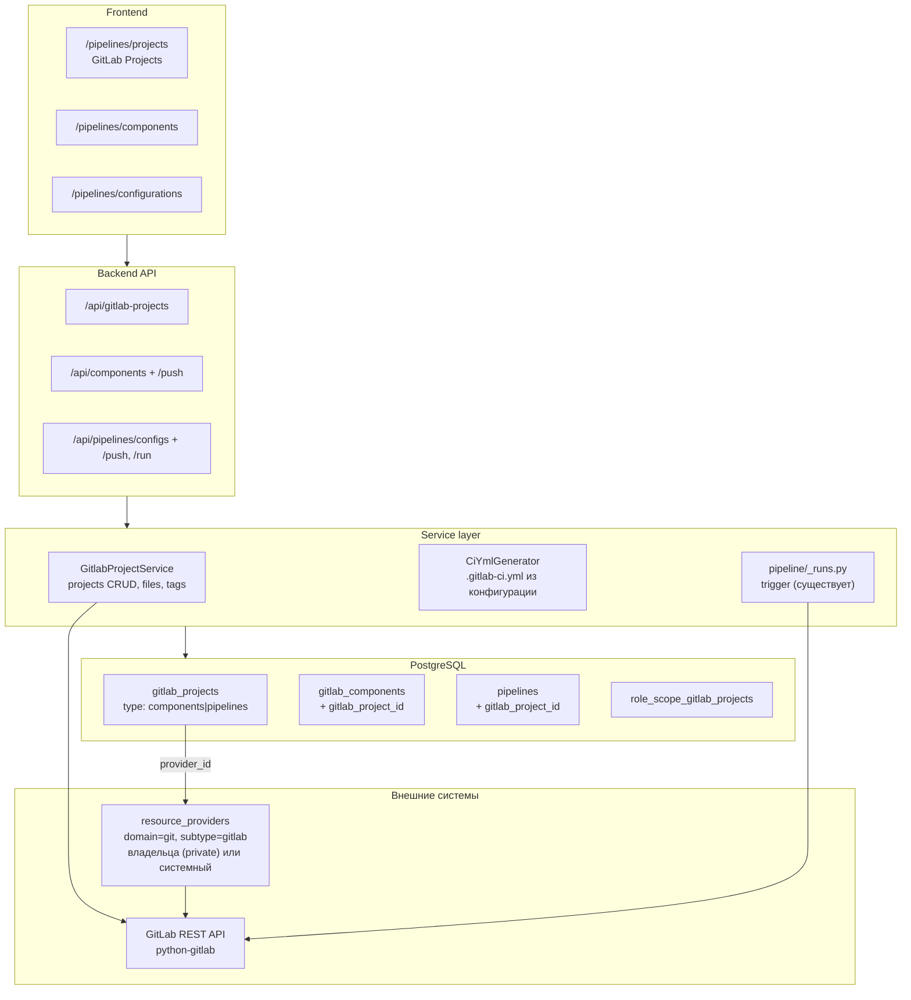

# Спецификация: Управление GitLab-проектами через приложение (components | pipelines)

Статус: спроектировано (architect), к реализации в code-режиме.
Дата: 2026-08-20. Заменяет подход из [`plans/gitlab-components-provisioning-spec.md`](gitlab-components-provisioning-spec.md).

---

## 1. Проблема

### 1.1 Что сделано сейчас («костыль»)

Docker-импорт из Docker Hub в Harbor работает через GitLab CI-компонент `docker-hub-to-harbor`. Чтобы этот компонент существовал в GitLab, предыдущая реализация предусматривала **два инфраструктурных пути вне приложения**:

| Путь | Механизм | Файлы |
|---|---|---|
| A (fast-path) | bash-скрипт `provision-gitlab.sh`: curl + jq против GitLab REST API, `docker exec gitlab-runner register`, генерация `.gitlab-ci.yml` heredoc'ом | [`infrastructure/provision-gitlab.sh`](../infrastructure/provision-gitlab.sh), env в [`infrastructure/.env.example`](../infrastructure/.env.example) |
| B (IaC) | OpenTofu-модуль gitlab: `gitlab_project` + `gitlab_repository_file` + `null_resource` c `local-exec` (теми же curl/docker exec) | [`infrastructure/terraform/modules/gitlab/`](../infrastructure/terraform/modules/gitlab/) |

Единственный источник содержимого компонентов — файлы на диске репозитория: [`infrastructure/gitlab-components/*.yml`](../infrastructure/gitlab-components/) (6 шаблонов: docker-hub-to-harbor, gold-image, app-image, mirror, docker-sync, helm-sync).

Само приложение при этом:
- хранит в БД только «регистрацию ссылки»: [`GitLabComponent`](../backend/app/models/gitlab_component.py) (name, project_path, component_path, version) — без содержимого и без связи с конкретным GitLab-проектом как сущностью;
- умеет только **триггерить** пайплайн: [`trigger_component()`](../backend/app/services/pipeline/_runs.py:378) через python-gitlab `POST /projects/:id/pipelines`;
- жёстко требует, чтобы компонент/пайплайн ссылались на **системный** GitLab: [`_get_pipeline_provider_or_404()`](../backend/app/services/pipeline/_clients.py:43) допускает только `subtype=gitlab, category=system, direction=internal`. То же правило зашито в [`CAPABILITY_RESTRICTIONS`](../backend/app/services/providers/registry.py:83) (`trigger_pipeline` → только `(system, internal)`);
- не имеет сущности «GitLab-проект», CRUD для неё, ни RBAC-разделения между компонентными и пайплайнными проектами.

### 1.2 Почему это плохо

1. **Профиль доступа не соответствует продукту.** BigBug — centralized DevOps платформа, но создание CI-сущностей требует shell-доступа к хосту, root PAT в env и знания двух параллельных provisioning-путей (скрипт ↔ tofu), которые ещё и конфликтуют по state (import-runbook в спеке B.6).
2. **Одноразовость.** Скрипт создавал один захардкоженный проект `bigbug-mirrors/components`. Второй проект компонентов, проект под пайплайны, другого пользователя, на другом GitLab — всё это за пределами модели.
3. **Нет multi-tenancy.** Сценарий пользователя: «один человек через свой git-провайдер ведёт проект компонентов; другой через своего — проекты пайплайнов» — в текущей RBAC не выражается вовсе: есть только глобальные `pipelines:read/write/delete`, никак не привязанные к владельцу или провайдеру.
4. **Хрупкость IaC-обвязки.** `tofu init` блокируется гео-фильтром Cloudflare (403 на registry.opentofu.org) — уже потребовал filesystem-mirror костыль (Часть C старой спеки). `null_resource` + `local-exec` — это тот же bash, только хуже: без идемпотентности и со state-дрейфом.
5. **Содержимое компонентов не версионируется в БД.** «Заливка компонента» = коммит файла в git-репозиторий платформы + перезапуск скрипта.

### 1.3 Цель

Всё управление GitLab-проектами, их содержимым и пайплайнами — через API самого приложения (python-gitlab → GitLab REST API). Никаких bash-скриптов и Terraform в provisioning-пути. Библиотека шаблонов компонент переносится из файловой системы в управление через UI/API.

---

## 2. Целевая архитектура

### 2.1 Обзор



### 2.2 Ключевые решения

1. **Единая сущность `gitlab_projects` с типом** (`components` | `pipelines`). Не две таблицы: тип отличается только семантикой использования и RBAC-гейтами, структура (namespace, path, файлы, теги) идентична. Разделение прав — через `project_type` в проверках доступа + отдельные permission-пространства (`components:*`, `pipelines:*`), а не через схему данных.

2. **Проект привязан к git-провайдеру владельца.** `gitlab_projects.provider_id → resource_providers.id` (subtype=gitlab). Провайдер может быть:
   - `category=system, direction=internal` — платформенный GitLab (текущий сценарий Docker-импорта);
   - `category=private, direction=external` — личный GitLab-аккаунт/инстанс пользователя (новый сценарий из ТЗ).
   Кредиты и base_url берутся из провайдера — секреты не дублируются.

3. **Владельческая модель доступа копирует провайдерную** (проверено паттерном [`ProviderService._ensure_can_read/_ensure_can_mutate`](../backend/app/services/providers/service.py:71)): owner видит/меняет своё; admin (`gitlab_projects:read_all`) — всё; team-shared — члены команды; плюс role-scope для кастомных ролей (новая таблица `role_scope_gitlab_projects`).

4. **Ограничение «только system/internal» для триггера снимается и заменяется валидацией связки.** [`_get_pipeline_provider_or_404()`](../backend/app/services/pipeline/_clients.py:43) больше не требует `category=system` — вместо этого пайплайн триггерится в **его собственном** `gitlab_project` (провайдер проекта пайплайна). Это и есть «пользователь через своего git-провайдера создаёт проекты для пайплайнов». Capability `trigger_pipeline` в реестре провайдеров сохраняется как есть (dispatch-путь не используется триггером).

5. **Компоненты и пайплайны «живут» в проектах.** `gitlab_components.gitlab_project_id` и `pipelines.gitlab_project_id` — FK с `SET NULL` для обратной совместимости. `provider_id` у обеих сущностей вычисляется из проекта (при создании через новый API — проставляется сервисом; прямой input сохраняется для legacy).

6. **Генерация `.gitlab-ci.yml` — серверная.** Для проекта-пайплайна содержимое генерируется из конфигурации Pipeline (include компонентов + inputs, по механике из старой спеки A.4: `$CI_SERVER_FQDN/<component-project-full-path>/<component>@<version>`) и заливается Repository Files API. Ручной YAML-режим — тоже поддержан (raw content).

7. **Техническое ограничение GitLab Components фиксируется в валидации:** `include: component:` резолвится по `$CI_SERVER_FQDN` — **проект пайплайна и проект компонента, который он включает, должны быть на одном GitLab-хосте** (совпадение `base_url` провайдеров с точностью до host). При сборке конфигурации из компонентов разных хостов — `422` с понятным сообщением. Кросс-хостовое переиспользование = пуш компонента в целевой GitLab (см. §10, Q1).

### 2.3 Что НЕ меняется

- [`trigger_component()`](../backend/app/services/pipeline/_runs.py:378) / webhooks / статусы PipelineRun — контракт сохраняется, меняется только источник провайдера.
- Таблица/роутер `sync_groups` не трогаются.
- Runner-регистрация остаётся инфраструктурной (docker-compose + разовая команда из [`infrastructure/README.md`](../infrastructure/README.md)): раннер — instance-level ресурс контейнера, не проектный. Из приложения — только документация.

---

## 3. Модель данных

### 3.1 Новая таблица `gitlab_projects`

Новый файл [`backend/app/models/gitlab_project.py`](../backend/app/models/gitlab_project.py):

```python
class GitlabProjectType(enum.StrEnum):
    components = "components"
    pipelines = "pipelines"

class ProjectVisibility(enum.StrEnum):   # переиспользовать семантику провайдеров
    owner = "owner"
    team = "team"
    public = "public"

class GitlabProject(Base):
    __tablename__ = "gitlab_projects"

    id = Column(Integer, primary_key=True, index=True)
    name = Column(String(255), nullable=False)             # display name в GitLab
    path = Column(String(255), nullable=False)             # slug проекта
    namespace_path = Column(String(500), nullable=False)   # группа/namespace ("bigbug-mirrors" или username)
    full_path = Column(String(512), nullable=False)        # "namespace/path" — уникален в рамках провайдера

    project_type = Column(
        SAEnum(GitlabProjectType, name="gitlab_project_type_enum"),
        nullable=False, index=True,
    )
    visibility = Column(
        SAEnum(ProjectVisibility, name="gitlab_project_visibility_enum"),
        nullable=False, default=ProjectVisibility.owner,
    )

    # Git-провайдер владельца: subtype=gitlab, category ∈ {system, private}
    provider_id = Column(
        Integer, ForeignKey("resource_providers.id", ondelete="RESTRICT"),
        nullable=False, index=True,
    )
    external_id = Column(String(64), nullable=True, index=True)  # GitLab numeric id (string — консистентно с mirror.target_project_id)
    web_url = Column(String(500), nullable=True)
    default_branch = Column(String(255), nullable=False, default="main")
    gitlab_visibility = Column(String(32), nullable=True)  # private/internal/public в GitLab

    description = Column(Text, nullable=True)
    owner_user_id = Column(Integer, ForeignKey("users.id", ondelete="CASCADE"), nullable=True, index=True)
    team_id = Column(Integer, ForeignKey("teams.id", ondelete="SET NULL"), nullable=True)

    # 0=OK, 1=Failed, 2=Warning, 3=In Progress, 4=Pending
    status_flag = Column(Integer, nullable=False, default=0)
    status_text = Column(String(500), nullable=True)
    last_synced_at = Column(DateTime(timezone=True), nullable=True)

    is_deleted = Column(Boolean, default=False, nullable=False, index=True)
    deleted_at = Column(DateTime(timezone=True), nullable=True)
    created_at = Column(DateTime(timezone=True), default=lambda: datetime.now(UTC))
    updated_at = Column(DateTime(timezone=True), default=lambda: datetime.now(UTC),
                        onupdate=lambda: datetime.now(UTC))

    provider = relationship("ResourceProvider", foreign_keys=[provider_id])
    owner = relationship("User", foreign_keys=[owner_user_id])
    team = relationship("Team", foreign_keys=[team_id])
    components = relationship("GitLabComponent", back_populates="gitlab_project")
    pipelines = relationship("Pipeline", back_populates="gitlab_project")
    role_scopes = relationship("RoleScopeGitlabProject", back_populates="project",
                               cascade="all, delete-orphan")
```

Индексы/констрейнты:

```python
__table_args__ = (
    # один full_path на один GitLab-инстанс (провайдер); допустимы same-path
    # на разных инстансах/аккаунтах одного GitLab-хоста — уникальность по (provider_id, full_path)
    Index("uq_gitlab_projects_provider_path", "provider_id", "full_path", unique=True,
          postgresql_where=text("is_deleted = false"),
          sqlite_where=text("is_deleted = false")),
    Index("ix_gitlab_projects_type", "project_type"),
    Index("ix_gitlab_projects_owner", "owner_user_id"),
    Index("ix_gitlab_projects_team", "team_id"),
    CheckConstraint("visibility != 'team' OR team_id IS NOT NULL",
                    name="ck_gitlab_projects_team_visibility"),
)
```

Обоснование `ondelete="RESTRICT"` на provider_id: провайдер, на который ссылаются проекты, не должен молча отваливаться — [`ProviderService.get_usage()`](../backend/app/services/providers/service.py:435) расширяется проверкой `gitlab_projects`, и удаление провайдера с проектами блокируется (409), как уже сделано для pipelines/docker sources.

### 3.2 Изменения существующих таблиц

**[`gitlab_components`](../backend/app/models/gitlab_component.py)** — добавить:

```python
gitlab_project_id = Column(
    Integer, ForeignKey("gitlab_projects.id", ondelete="SET NULL"),
    nullable=True, index=True,
)
gitlab_project = relationship("GitlabProject", back_populates="components")
```

`project_path` сохраняется (denormalized display + источник для include-строки; при привязке к проекту = `full_path` проекта). `provider_id` остаётся: для компонентов, привязанных к проекту, обязан совпадать с провайдером проекта (инвариант сервиса).

**[`pipelines`](../backend/app/models/pipeline.py)** — добавить:

```python
gitlab_project_id = Column(
    Integer, ForeignKey("gitlab_projects.id", ondelete="SET NULL"),
    nullable=True, index=True,
)
gitlab_project = relationship("GitlabProject", back_populates="pipelines")
```

Семантика: конфигурация Pipeline «привязана» к конкретному проекту-пайплайну, в который будет заливаться сгенерированный `.gitlab-ci.yml` и в котором триггерятся раны. `provider_id` остаётся (nullable) — вычисляется из проекта; для legacy-конфигов без проекта работает как сейчас.

**`role_scope_gitlab_projects`** — новая scope-таблица (файл [`backend/app/models/role_scope.py`](../backend/app/models/role_scope.py), по образцу [`RoleScopeProvider`](../backend/app/models/role_scope.py:89)):

```python
class RoleScopeGitlabProject(Base):
    __tablename__ = "role_scope_gitlab_projects"
    role_id = Column(Integer, ForeignKey("roles.id", ondelete="CASCADE"), primary_key=True)
    gitlab_project_id = Column(Integer, ForeignKey("gitlab_projects.id", ondelete="CASCADE"), primary_key=True)
    created_at = Column(DateTime(timezone=True), default=lambda: datetime.now(UTC))
    role = relationship("Role", back_populates="gitlab_project_scopes")
    project = relationship("GitlabProject", back_populates="role_scopes")
```

В [`Role`](../backend/app/models/role.py) добавить `gitlab_project_scopes` relationship; в [`RBACService.get_user_effective_scope()`](../backend/app/services/rbac_service.py:540) — сбор `gitlab_project_ids`; в [`check_scope_access()`](../backend/app/services/rbac_service.py:592) тип `"gitlab_project"` начнёт работать автоматически (ключ уже формируется по имени).

### 3.3 Статусы (unified flags 0–4)

| flag | Смысл для gitlab_project |
|---|---|
| 0 | OK — метаданные синхронизированы, последний API-вызов успешен |
| 1 | Failed — последний sync/мутация упали (status_text = причина) |
| 2 | Warning — проект существует, но метаданные stale (`last_synced_at` > 24h) или GitLab-статус `archived` |
| 3 | In Progress — идёт создание/заливка файлов (для будущей асинхронности; в v1 мутации синхронны, флаг ставится короткоживуще) |
| 4 | Pending — строка создана локально, GitLab-вызов ещё не делался (кейс «создать запись → импорт существующего») |

---

## 4. RBAC

### 4.1 Новые permissions

| Permission | Семантика | Admin | Operator | Viewer |
|---|---|:--:|:--:|:--:|
| `gitlab_projects:read` | list/get; свои private + team + public | ✅ | ✅ | ✅ |
| `gitlab_projects:write` | создание проектов (обоих типов), обновление, заливка файлов, теги, sync | ✅ | ✅ | |
| `gitlab_projects:delete` | soft delete + удаление в GitLab (`hard=true`) | ✅ | | |
| `gitlab_projects:read_all` | видеть и менять чужие private-проекты (админ-маркер, аналог `providers:read_all`) | ✅ | | |
| `components:read` | list/get компонентов | ✅ | ✅ | ✅ |
| `components:write` | создание/изменение регистрации компонента | ✅ | ✅ | |
| `components:delete` | удаление регистрации | ✅ | | |
| `components:push` | заливка/обновление содержимого компонента в GitLab-проект (files+tag) | ✅ | ✅ | |

Итого +8 прав. Существующие `pipelines:read/write/delete` сохраняются для конфигураций/ранов; отдельный `pipelines:trigger` не вводится — триггер остаётся `pipelines:write` (YAGNI: сегодня нет сценария «может триггерить, но не может создать конфиг»).

### 4.2 Разделение «владелец компонентов» vs «владелец пайплайнов»

Разделение достигается комбинацией двух механизмов (по аналогии с провайдерной моделью доступа):

**а) Право на тип проекта.** В `GitlabProjectService` при создании/мутировании проекта проверяется пара (`project_type`, permission):

```python
REQUIRED_WRITE = {
    GitlabProjectType.components: "components:push",      # создание/пуш в компонентный проект
    GitlabProjectType.pipelines: "pipelines:write",       # создание/пуш в пайплайн-проект
}
```

Т.е. роль «компонентный разработчик» = `gitlab_projects:read` + `components:*` (включая `components:push`) — она **не может** создать/менять `pipelines`-проект: `gitlab_projects:write` само по себе не даёт мутаций, гейт дополнительно требует право типа. Роль «пайплайн-инженер» = `gitlab_projects:read` + `pipelines:write` — не может пушить содержимое в компонентные проекты (`components:push` отсутствует).

**б) Владение строкой.** Даже с правами типа пользователь мутирует только **свои** проекты (owner_user_id = user.id) либо team-shared (членство в team_id), либо всё — при `gitlab_projects:read_all`. Сценарий ТЗ «пользователь через свой git-провайдер» реализуется тем, что создаваемый проект привязывается к провайдеру, где этот пользователь — owner ([`ProviderService`](../backend/app/services/providers/service.py:71) уже гарантирует, что private-провайдер виден только владельцу — значит и его проекты по умолчанию изолированы).

**в) Scope для кастомных ролей.** `require_scope_permission("gitlab_projects:write", "gitlab_project")` — гранулярный доступ к конкретным проектам через `role_scope_gitlab_projects` (для команд «компоненты только для проекта X»).

### 4.3 Матрица доступа (сводно)

| Операция | Permission | Дополнительно |
|---|---|---|
| `GET /api/gitlab-projects` | `gitlab_projects:read` | фильтрация: свои + team + public (+ все при read_all) |
| `POST /api/gitlab-projects` | `gitlab_projects:write` | + право типа (`components:push` \| `pipelines:write`); provider: private-свой или system (system — через `providers_system:write`, как у провайдеров) |
| `PATCH /{id}` | `gitlab_projects:write` | + право типа + owner/team/read_all |
| `DELETE /{id}` | `gitlab_projects:delete` | + owner/read_all; hard-удаление в GitLab — то же |
| `POST /{id}/files`, `/{id}/tags`, `/{id}/sync` | `gitlab_projects:write` | + право типа + owner/team/read_all |
| `POST /api/components` | `components:write` | проект: type=components + доступ к проекту |
| `POST /api/components/{id}/push` | `components:push` | доступ к проекту компонента |
| `POST /api/components/{id}/run` | `pipelines:write` | (триггер — пайплайнная операция; как сейчас) |
| `POST /api/pipelines/configs` | `pipelines:write` | проект: type=pipelines + доступ |
| `POST /api/pipelines/configs/{id}/push` | `pipelines:write` | доступ к проекту пайплайна |
| `POST /api/pipelines` (trigger) | `pipelines:write` | раны видимы всем с `pipelines:read` (как сейчас) |

### 4.4 Обновление индекса прав

[`plans/architecture/permissions.md`](architecture/permissions.md) дополняется секцией «Спроектированные права (gitlab-project-management)» — 8 новых permissions со статусом «спроектировано, не сидится» до момента реализации (чтобы не ломать «единственный источник истины» о текущем состоянии БД). Сделано в рамках этой задачи, см. §11.

---

## 5. API

REST-конвенции проекта ([AGENTS.md](../AGENTS.md)): list/detail/create/patch/delete + `POST /resource/{id}/action`.

### 5.1 `/api/gitlab-projects` (новый роутер [`backend/app/api/gitlab_projects.py`](../backend/app/api/gitlab_projects.py))

| Метод | Path | Назначение |
|---|---|---|
| GET | `/` | Список с фильтрами: `project_type`, `provider_id`, `owner=me`, `search` |
| GET | `/{id}` | Детали (+ компоненты/пайплайны проекта через selectinload) |
| POST | `/` | Создать проект **в GitLab через API** (см. схему ниже) |
| PATCH | `/{id}` | Обновление (локальные поля + зеркалирование в GitLab: name/description/visibility) |
| DELETE | `/{id}?hard=false` | Soft delete локально; `hard=true` — ещё и `DELETE /projects/:id` в GitLab |
| POST | `/{id}/sync` | Ресинк метаданных из GitLab (external_id, web_url, default_branch, archived→Warning) |
| POST | `/{id}/import` | Зарегистрировать **существующий** в GitLab проект (по full_path): GET → локальная строка без мутаций в GitLab |
| GET | `/{id}/files?ref=main&path=` | Дерево/содержимое файлов (Repository Files/Tree API) |
| POST | `/{id}/files` | Залить/обновить файл: `{file_path, content, branch?, commit_message, encoding?}` (create-or-update, как в старом скрипте A.3 п.3) |
| DELETE | `/{id}/files` | Удалить файл (commit через API) |
| GET | `/{id}/tags` | Список тегов |
| POST | `/{id}/tags` | Создать тег `{tag_name, ref?, message?}` — версии компонентов |
| POST | `/{id}/share` / `/{id}/unshare` | Team-шаринг (по образцу провайдеров) |

**POST / (create)** — тело:

```json
{
  "name": "components",
  "path": "components",
  "namespace_path": "bigbug-mirrors",
  "project_type": "components",
  "provider_id": 7,
  "gitlab_visibility": "private",
  "default_branch": "main",
  "description": "...",
  "visibility": "owner",
  "team_id": null,
  "initialize_with_readme": true
}
```

Сервис: `gl.projects.create({name, path, namespace_id, visibility, default_branch, initialize_with_readme})` (namespace резолвится по `namespace_path` через `gl.groups.list(search=...)` / `gl.users.list()` для personal namespace; если группа не существует и у токена есть права — опционально создать через `gl.groups.create`, флаг `create_namespace=false` по умолчанию). Ответ — `GitlabProjectOut` с заполненными external_id/web_url.

**Schemas** — новый файл [`backend/app/schemas/gitlab_project.py`](../backend/app/schemas/gitlab_project.py): `GitlabProjectCreate/Update/Out`, `GitlabProjectFileIn/Out`, `GitlabProjectTagIn/Out`, `GitlabProjectSyncResult`.

### 5.2 `/api/components` (расширение [`backend/app/api/components.py`](../backend/app/api/components.py))

| Метод | Path | Новое |
|---|---|---|
| POST | `/` | + `gitlab_project_id`; `provider_id`/`project_path` вычисляются из проекта (input опционален для legacy) |
| GET | `/` | фильтр `?gitlab_project_id=` |
| POST | `/{id}/push` | **Заливка компонента**: `{content, file_path?, commit_message?, tag_name?}` — см. §6.3 |
| POST | `/{id}/pull` | Вытянуть текущее содержимое из GitLab (GET file) — для редактирования в UI |

### 5.3 `/api/pipelines/configs` (расширение) + trigger

| Метод | Path | Новое |
|---|---|---|
| POST | `/configs` | + `gitlab_project_id` |
| POST | `/configs/{id}/push-ci` | Сгенерировать `.gitlab-ci.yml` из конфигурации (include компонентов) и залить в проект пайплайна; тело `{commit_message?, extra_yaml?}` |
| POST | `/configs/{id}/run` | Новый удобный эндпоинт: trigger в связанном проекте (ref из конфига, variables из default_variables) — или переиспользовать существующий `POST /api/pipelines` c `gitlab_project_id`-путём |

`POST /api/pipelines` (trigger, существующий): при передаче `gitlab_project_id` вместо `gitlab_project_id: int` (числовой GitLab id) — расширить `PipelineRunCreate` полем `config_id` **или** `gitlab_project_full` — детали в §6.4.

### 5.4 Ошибки

Доменные ошибки — `DomainError` из сервиса (маппинг в роутере как в [`providers.py:50`](../backend/app/api/providers.py:50)):
- 400 — невалидный namespace/path;
- 403 — RBAC (нет права типа / не owner);
- 404 — проект/файл не найден (локально или в GitLab);
- 409 — `full_path` уже занят на провайдере / проект удалён;
- 422 — компонентные include с другого хоста; provider не gitlab;
- 502 — GitLab недоступен (маппинг `gitlab.GitlabError` по паттерну [`_client_error`](../backend/app/services/providers/service.py:506): 401 → «провайдер анонимный/токен невалиден», 403 → «токену не хватает прав», прочее → 502).

---

## 6. Сервисный слой

### 6.1 Клиент python-gitlab

Фундамент уже есть: [`_get_provider_gitlab_client()`](../backend/app/services/pipeline/_clients.py:25) строит `gitlab.Gitlab` из провайдера (токен из credential + Fernet, verify_ssl). Изменения:

1. Переезд в общедоступный модуль: вынести в `backend/app/services/gitlab_projects/_clients.py` (или `services/gitlab_client.py`) и реэкспортить из [`pipeline/_clients.py`](../backend/app/services/pipeline/_clients.py), чтобы не дублировать.
2. `_get_pipeline_provider_or_404()` — убрать требование `category=system/direction=internal`; оставить только `subtype=gitlab` + не удалён. Старое правило заменяется инвариантом «провайдер рана = провайдер gitlab-проекта пайплайна».
3. Добавить таймауты/ретраи не нужно — python-gitlab дефолты достаточны для dev-стенда (`ponytail:` при прод-нагрузке — обёртка с retry).

### 6.2 `GitlabProjectService` (новый файл [`backend/app/services/gitlab_projects/__init__.py`](../backend/app/services/gitlab_projects/__init__.py) + модули)

Разбивка по файлам (по образцу пакета `pipeline/`):

- `_service.py` — CRUD + доступ:
  - `list_projects(user, filters)` / `get_project(id, user)` — доступ по §4.3;
  - `create_project(user, data)` — провайдер → валидация subtype/gitlab/доступ к провайдеру → `gl.projects.create` → локальная строка (status 0) → audit `gitlab_project.created`;
  - `update_project(id, user, data)` — локальные поля сразу; GitLab-поля (name/description/visibility) — `project.save()`;
  - `delete_project(id, user, hard)` — soft локально; hard → `project.delete()` в GitLab; запрет при живых ссылках (компоненты/пайплайны с `gitlab_project_id` и не deleted — иначе dangling include);
  - `import_project(user, provider_id, full_path, project_type)` — `gl.projects.get(full_path)` → строка со status 0;
  - `sync_project(id, user)` — обновление external_id/web_url/default_branch/gitlab_visibility; archived → status 2.
- `_files.py` — файлы и теги:
  - `list_tree(project, ref, path)`;
  - `upsert_file(project, file_path, content, branch, commit_message)` — check-by-content (GET file → сравнить blob) → create/update; идемпотентно, как A.3 п.3 старой спеки;
  - `delete_file(...)`;
  - `list_tags(project)` / `create_tag(project, tag_name, ref, message)` — `POST /projects/:id/repository/tags`; повторное создание существующего тега → 409 (не двигаем опубликованные версии — правило старой спеки A.3 п.4 сохраняется).
- `_share.py` — team-шаринг (транскрипция `share_provider`/`unshare_provider` из [`ProviderService`](../backend/app/services/providers/service.py:366)).

Аудит: все мутации через `AuditService.log_event` (`gitlab_project.created/updated/deleted/imported/file.pushed/tag.created/...`) — по паттерну [`pipelines.py:120`](../backend/app/api/pipelines.py:120).

### 6.3 `ComponentService`-расширение (в [`pipeline/_components.py`](../backend/app/services/pipeline/_components.py))

`push_component(db, component_id, user, content, file_path=None, commit_message=None, tag_name=None)`:

1. Доступ: `components:push` + доступ к `gitlab_project` (type=components).
2. `file_path = file_path or f"templates/{component.component_path}"` (`.yml` уже в path).
3. `upsert_file(project, file_path, content, ...)` — commit в default branch.
4. Если `tag_name` (напр. `v1.2.0`): `create_tag` на HEAD; обновить `component.version = "1.2.0"` (без `v`).
5. Компонент без проекта → 422 «привяжите компонент к gitlab-проекту».

`pull_component(db, component_id, user)` — GET file по `file_path` + ref из `version` (или default branch) → содержимое для UI-редактора.

### 6.4 Генерация `.gitlab-ci.yml` и trigger (в [`pipeline/_configs.py`](../backend/app/services/pipeline/_configs.py) + [`_runs.py`](../backend/app/services/pipeline/_runs.py))

`push_pipeline_ci(db, pipeline_id, user, extra_yaml=None, commit_message=None)`:

1. Доступ: `pipelines:write` + доступ к проекту пайплайна.
2. Собрать include-список из `pipeline.components` (order):
   - host-проверка: `component.provider.base_url` host == `project.provider.base_url` host (нормализация через `urlparse().hostname`); нарушение → 422 со списком конфликтующих компонентов;
   - строка: `component: $CI_SERVER_FQDN/<component.project_path>/<component.component_path>@<component.version>`;
   - inputs: **только required** (из `inputs_schema` без default) — по выводу старой спеки A.4: значения опциональных inputs приходят runtime-переменными триггера.
3. Собрать YAML: `include:` + `stages:` (union stage'ов из шаблонов — извлекаются из `content` компонентов по регэкспу `^\s{2}stage:\s*(\S+)`; `ponytail:` регэксп, а не YAML-парсер — stage-строка в компонентах плоская) + `extra_yaml` (raw-блок от пользователя, если задан).
4. `upsert_file(project, ".gitlab-ci.yml", yaml, branch=default_branch, commit_message=...)`.

`trigger_pipeline(...)` (существующая): при `config_id`/проекте — брать провайдер **проекта** вместо переданного `provider_id`; `gitlab_project_id` в ране = `project.external_id`. Контракт ответа PipelineRunOut не меняется.

### 6.5 Пресеты компонентов (бывшая файловая библиотека)

6 шаблонов из [`infrastructure/gitlab-components/`](../infrastructure/gitlab-components/) становятся **API-доступными пресетами**: `backend/app/services/gitlab_projects/presets.py` — dict `{key: {name, description, content}}` (содержимое — те же YAML, вшитые в код как константы; файлы из репозитория удаляются). Эндпоинт `GET /api/components/presets` отдаёт список (key, name, description, inputs_schema) для UI-селекта «создать из пресета». Это сохраняет библиотеку BigBug без bash-заливки и без чтения файлов с диска в рантайме.

---

## 7. Frontend

### 7.1 Маршруты и страницы

| Route | Страница | PermissionGate | Содержимое |
|---|---|---|---|
| `/pipelines/projects` | `pages/Pipelines/Projects/index.tsx` (новая) | `gitlab_projects:read` | Таблица проектов: name, type (Tag: components/pipelines), провайдер, web_url, status (StatusChip), owner. Фильтры: type, provider, «my». Кнопка Create + Import |
| `/pipelines/projects/:id` | `pages/Pipelines/Projects/Detail.tsx` (новая) | `gitlab_projects:read` | Табы: Overview (метаданные, Sync), Files (дерево + просмотр/редактирование .yml с заливкой — `gitlab_projects:write`+тип), Tags (создание версии), Linked (компоненты или пайплайны проекта) |
| `/pipelines/components` (существует) | обновить `pages/Settings/Pipelines/index.tsx` | `pipelines:read` → `components:read` | + колонка/фильтр проекта; модал создания: выбор проекта (type=components) или legacy-поля; редактор содержимого + кнопки Pull/Push (`components:push`); селект пресета |
| `/pipelines/configurations` (существует) | обновить `pages/Pipelines/Configurations/` | без изменений | + выбор проекта пайплайна в PipelineModal; кнопка «Push .gitlab-ci.yml» (`pipelines:write`) с превью сгенерированного YAML |

Create-модал проекта: селект git-провайдера (свои private + system, из `useGetProvidersQuery({domain:'git', subtype:'gitlab'})`), namespace_path, name/path, type, gitlab_visibility, «initialize with README».

### 7.2 RTK Query

Новый файл [`frontend/src/store/api/gitlab-projects.ts`](../frontend/src/store/api/gitlab-projects.ts):

```typescript
export const gitlabProjectsApi = api.injectEndpoints({
  endpoints: (builder) => ({
    getGitlabProjects: builder.query<GitlabProject[], GitlabProjectsFilters | void>({
      query: (f) => ({ url: '/gitlab-projects', params: f }),
      providesTags: ['GitlabProject'],
    }),
    getGitlabProject: builder.query<GitlabProject, number>({ ... providesTags: [{type:'GitlabProject', id:'LIST'}] }),
    createGitlabProject: builder.mutation<GitlabProject, GitlabProjectCreate>({ ... invalidatesTags: ['GitlabProject'] }),
    updateGitlabProject: builder.mutation<...>,
    deleteGitlabProject: builder.mutation<void, { id: number; hard?: boolean }>({ ... }),
    syncGitlabProject: builder.mutation<GitlabProject, number>({ ... url: `/gitlab-projects/${id}/sync` }),
    importGitlabProject: builder.mutation<...>,
    getProjectFiles: builder.query<ProjectFile[], { id: number; ref?: string; path?: string }>,
    pushProjectFile: builder.mutation<...>,
    getProjectTags: builder.query<...>,
    createProjectTag: builder.mutation<...>,
    shareGitlabProject / unshareGitlabProject: builder.mutation<...>,
  }),
});
```

Теги: `GitlabProject` (+ per-id). Расширения [`components.ts`](../frontend/src/store/api/components.ts): `pushComponent`, `pullComponent`, `getComponentPresets`; [`pipeline-configs.ts`](../frontend/src/store/api/pipeline-configs.ts): `pushPipelineCi`, `runPipelineConfig`.

Типы — в [`frontend/src/types/index.ts`](../frontend/src/types/index.ts): `GitlabProject`, `GitlabProjectType = 'components'|'pipelines'`, `GitlabProjectCreate/Update`, `ProjectFile`, `ProjectTag`, `ComponentPreset`.

### 7.3 Навигация

В [`Layout`](../frontend/src/components/Layout/index.tsx) пункт Pipelines получает под-пункты (или дропдаун): Runs, Components, Configurations, **Projects**. Проверки видимости — через `usePermissions()` по правам соответствующих разделов.

### 7.4 Правила UI

- Ant Design `Alert` — только `title`, не `message` (правило [`antd-alert-no-message`](../.roo/rules/antd-alert-no-message.md)).
- StatusChip для status_flag; PermissionGate на все мутации.
- YAML-редактор — `Input.TextArea` (monospace) с валидацией на клиенте опциональна (YAML-парсер не тащим; сервер вернёт ошибку GitLab).

---

## 8. План миграций (Alembic)

Цепочка после `seed_initial_data` (см. [`plans/development/database.md`](development/database.md)):

1. `YYYYMMDD_HHMM_<hash>_add_gitlab_projects.py`:
   - enum `gitlab_project_type_enum`, таблица `gitlab_projects` со всеми индексами/констрейнтами;
   - enum `gitlab_project_visibility_enum`;
   - таблица `role_scope_gitlab_projects`.
2. `YYYYMMDD_HHMM_<hash>_link_components_pipelines_to_gitlab_projects.py`:
   - `gitlab_components.gitlab_project_id` FK (`SET NULL`) + индекс;
   - `pipelines.gitlab_project_id` FK (`SET NULL`) + индекс.
3. `YYYYMMDD_HHMM_<hash>_seed_gitlab_project_permissions.py`:
   - insert 8 permissions (`gitlab_projects:read/write/delete/read_all`, `components:read/write/delete/push`);
   - role_permissions: admin — все 8; operator — `gitlab_projects:read/write`, `components:read/write/push`; viewer — `gitlab_projects:read`, `components:read`;
   - синхронно обновить декларативные списки в [`backend/docker/seed_admin.py`](../backend/docker/seed_admin.py) (источник-декларация, см. permissions.md примечание).

Backfill-миграция данных не требуется: существующие компоненты/пайплайны остаются с NULL `gitlab_project_id` (legacy-режим). Опционально после деплоя — импорт существующего `bigbug-mirrors/components` через `POST /api/gitlab-projects/import` и ручная привязка компонента id=11 (в скрипте развертывания не нуждается).

**Инфраструктурная чистка (выполнена ✅):** удалены [`infrastructure/provision-gitlab.sh`](../infrastructure/provision-gitlab.sh), Makefile-target `infra-provision-gitlab` и provisioning-переменные из [`infrastructure/.env.example`](../infrastructure/.env.example). Terraform-ресурсы projects/files/tags в модуле gitlab **не потребовалось удалять** — они так и не были реализованы (модуль gitlab содержит только базовую настройку: groups/users/memberships/tokens). YAML-шаблоны из [`infrastructure/gitlab-components/`](../infrastructure/gitlab-components/) сохранены как примеры в [`infrastructure/gitlab-components/examples/`](../infrastructure/gitlab-components/examples/) (см. README там же), рабочие пресеты — в [`backend/app/services/gitlab_projects/presets.py`](../backend/app/services/gitlab_projects/presets.py).

---

## 9. План тестирования

### 9.1 Backend unit (`make test-unit-backend`)

Новый `tests/unit/test_gitlab_project_service.py` (python-gitlab мокается monkeypatch'ем фабрики клиента):
- create: happy path → gl.projects.create вызван с namespace_id; неймспейс-резолв group/user; 400 при невалидном path; 409 duplicate full_path;
- доступ: не-owner без read_all → 403; team-member → ok; право типа (components-проект без `components:push` → 403; pipelines-проект без `pipelines:write` → 403);
- delete: soft/hard; hard при живых компонентах → 409;
- import: существующий/404;
- sync: archived → status 2.

Новый `tests/unit/test_gitlab_project_files.py`:
- `upsert_file` идемпотентность: одинаковый content → нет второго коммита; разный → update;
- `create_tag`: повтор → 409; tag → component.version без «v».

Новый `tests/unit/test_pipeline_ci_generator.py`:
- include-строки из конфига (порядок, version);
- host-mismatch → 422 с именами компонентов;
- stages union из содержимого;
- extra_yaml конкатенация.

Расширение `tests/unit/test_components_service.py`:
- `push_component`: file_path по умолчанию, тег, компонент без проекта → 422;
- `pull_component`.

### 9.2 Backend e2e (`make test-e2e-backend`, dev-стек)

Новый `tests/e2e/test_gitlab_projects_flow.py` (GitLab мокируется на httpx-уровне, как в существующих e2e):
- создать провайдер gitlab (system) → создать проект components → залить файл → тег → создать компонент с привязкой → push → создать pipelines-проект → конфигурация с компонентом → push-ci → trigger → PipelineRun in_progress;
- RBAC-кейсы: пользователь B (без прав на компоненты A) получает 403 на push в проект A.

### 9.3 Frontend

- `src/tests/integrations/PipelinesProjects.test.tsx`: список с фильтрами, create-модал (выбор провайдера), error-Alert (title);
- `src/tests/integrations/PipelinesProjectsDetail.test.tsx`: табы Files/Tags, push за PermissionGate;
- расширение `src/tests/unit/` для Components-страницы: пресеты, push/pull кнопки;
- RTK Query теги/инвалидация — через integrations (мок handlers).

### 9.4 Ручной чек-лист (после реализации)

```
1. POST /api/gitlab-projects (components, провайдер пользователя A) → 201, web_url
2. POST /api/components {gitlab_project_id} → push с пресетом docker-hub-to-harbor → тег v1.0.0
3. POST /api/gitlab-projects (pipelines, провайдер пользователя B) → 201
4. POST /api/pipelines/configs {components=[1], gitlab_project_id=2} → push-ci → GET files/.gitlab-ci.yml содержит include
5. POST триггер → pipeline success (при живом раннере) → образ в Harbor
6. Пользователь A пытается push в проект B → 403
```

---

## 10. Открытые вопросы

1. **Кросс-хостовое переиспользование компонентов.** GitLab Components резолвятся по FQDN: пайплайн-проект на GitLab X не может include компонент с GitLab Y. Предложенное решение — валидация same-host при push-ci (§6.4) + при необходимости ручной «re-push компонента в другой GitLab» (создание зеркала компонента). Требует подтверждения: достаточно ли same-host правила, или нужен автоматический fan-out компонента на несколько GitLab? (Не входит в v1.)
2. **Создание namespace (групп) из приложения.** `create_namespace=false` по умолчанию; флаг в POST / — создавать группу, если нет? Это добавляет групповой CRUD в скоуп. Предложение: v1 — только существующие namespace.
3. **`pipelines:read` vs `components:read` в существующем UI.** Страница `/pipelines/components` сейчас гейтится `pipelines:read`. Переключение на `components:read` меняет видимость для существующих ролей — migrировать гейт вместе с сидом (в одной волне) или оставить двойной гейт (`hasAnyPermission`)? Предложение: мигрировать сразу, сид в той же миграции №3.
4. **Асинхронность мутаций.** Заливка файлов/создание проекта — синхронные HTTP-вызовы в v1 (dev-стенд, latency малая). Потолок зафиксирован status_flag=3; апгрейд — фоновые задачи (arq/celery, см. нерешённый вопрос в [`decisions.md`](architecture/decisions.md)). Подтвердить приемлемость синхронности.
5. **Импорт легаси `bigbug-mirrors/components`.** Разово через import-эндпоинт + PATCH компонента id=11, или добавить в [`scripts/seed_providers.py`](../backend/scripts/seed_providers.py) best-effort блок? Предложение: руками через API (одна операция, не автоматизируем).
6. **`projects:read` (GithubProject) — конфликт нейминга.** Существующее право `projects:*` относится к GitHub-проектам; новые права названы `gitlab_projects:*` во избежание коллизии. Ок ли, или переименовать легаси в `github_projects:*` в отдельной волне?
7. **Типы project_type = только 2?** Планируются ли иные типы (напр. `mirror-targets` для зеркал GitHub→GitLab)? Enum расширяем миграцией; v1 — два значения из ТЗ.
8. **Инфраструктурная чистка (решено, выполнено).** Удалены `provision-gitlab.sh`, Makefile-target `infra-provision-gitlab` и provisioning-переменные из `infrastructure/.env.example`; YAML-шаблоны сохранены как примеры в `infrastructure/gitlab-components/examples/`, рабочие пресеты — в `backend/app/services/gitlab_projects/presets.py`. Terraform-ресурсы projects/files/tags не удалялись (не были реализованы); Terraform остаётся только для базовой настройки GitLab (groups/users/projects/tokens/memberships) + Harbor + Keycloak. Регистрация runner остаётся разовой инфраструктурной операцией (см. §2.3).

## 11. Сопутствующие артефакты

- Дополнен индекс прав: [`plans/architecture/permissions.md`](architecture/permissions.md) — секция «Спроектированные права» (8 позиций, статус до реализации).
- Риски: (а) ослабление system-only триггера требует аккуратного e2e на существующих ранных (легаси-раны с provider_id system продолжают работать — источник провайдера не меняется при отсутствии проекта); (б) host-нормализация `localhost:8080` vs `gitlab.local` — провайдеры могут хранить оба варианта base_url одного инстанса; в §6.4 сравнение по hostname решает порт-часть, но alias-хосты — открытый риск (см. Q1); (в) генерация stages регэкспом — потолок отмечен `ponytail:`.
