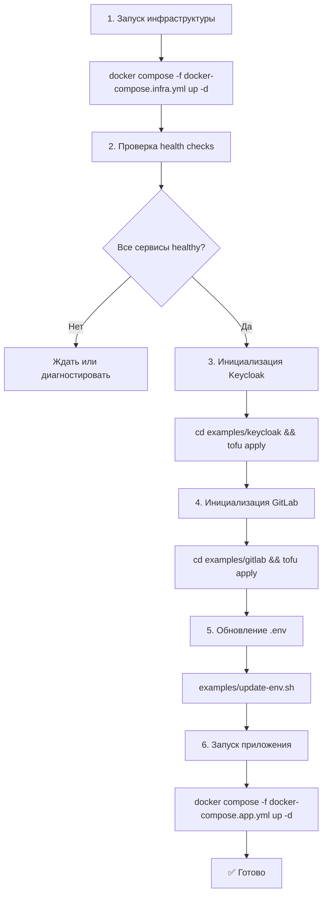

# Реорганизация инициализации инфраструктуры BigBug

> Архитектурный план перехода на OpenTofu/Terraform для управления инфраструктурой

**Дата:** 2026-06-05  
**Статус:** Архитектурное проектирование  
**Автор:** BigBug Team

## 📋 Обзор

### Проблема

Текущая инициализация Keycloak через bash-скрипт в docker-compose имеет критические недостатки:

1. **Хрупкость**: скрипт [`keycloak/init-keycloak.sh`](../keycloak/init-keycloak.sh) зависит от наличия `curl` в образе Keycloak, который может отсутствовать в будущих версиях
2. **Неидемпотентность**: логика проверки существования ресурсов реализована вручную через grep/awk
3. **Отсутствие state management**: невозможно отследить, что было создано и изменено
4. **Масштабируемость**: добавление GitLab потребует аналогичного скрипта с теми же проблемами
5. **Отсутствие drift detection**: невозможно определить расхождения между желаемым и фактическим состоянием

### Решение

Переход на **OpenTofu** (open-source форк Terraform) для декларативного управления инфраструктурой:

- ✅ Идемпотентность из коробки
- ✅ State management
- ✅ Drift detection
- ✅ Провайдеры для Keycloak и GitLab
- ✅ Унифицированный подход к инициализации всех сервисов

## 🎯 Цели проекта

1. **Удалить устаревшую инициализацию**: профиль `keycloak-init` из docker-compose, скрипт [`init-keycloak.sh`](../keycloak/init-keycloak.sh)
2. **Реорганизовать структуру**: создать единую папку `examples/` для всех примеров инициализации
3. **Создать OpenTofu конфигурации**: для Keycloak и GitLab с полной конфигурацией
4. **Разделить docker-compose**: отделить инфраструктуру от приложения
5. **Автоматизация**: скрипты для полной инициализации окружения

## 🏗️ Архитектурные решения

### 1. Структура проекта

```
BigBug/
├── examples/                           # Примеры инициализации инфраструктуры
│   ├── README.md                       # Общая документация по инициализации
│   ├── init.sh                         # Мастер-скрипт полной инициализации
│   ├── update-env.sh                   # Обновление .env из OpenTofu outputs
│   │
│   ├── harbor/                         # Перемещено из корня
│   │   ├── deploy.sh
│   │   ├── teardown.sh
│   │   ├── test-push.sh
│   │   ├── kind-config.yaml
│   │   ├── harbor-values.yaml
│   │   └── README.md
│   │
│   ├── keycloak/                       # OpenTofu конфигурация Keycloak
│   │   ├── main.tf                     # Provider configuration
│   │   ├── realm.tf                    # Realm "bigbug"
│   │   ├── clients.tf                  # Clients (backend + frontend)
│   │   ├── roles.tf                    # Realm roles
│   │   ├── users.tf                    # Test users
│   │   ├── variables.tf                # Input variables
│   │   ├── outputs.tf                  # Exported values
│   │   ├── terraform.tfvars.example    # Example values
│   │   ├── .gitignore                  # Ignore .tfstate, .tfvars
│   │   └── README.md                   # Keycloak setup instructions
│   │
│   └── gitlab/                         # OpenTofu конфигурация GitLab
│       ├── main.tf                     # Provider configuration
│       ├── groups.tf                   # Groups for mirrors
│       ├── users.tf                    # Additional users (optional)
│       ├── tokens.tf                   # Personal access tokens
│       ├── variables.tf                # Input variables
│       ├── outputs.tf                  # Exported tokens
│       ├── terraform.tfvars.example    # Example values
│       ├── .gitignore                  # Ignore .tfstate, .tfvars
│       └── README.md                   # GitLab setup instructions
│
├── docker-compose.infra.yml            # Infrastructure services
├── docker-compose.app.yml              # Application services
├── docker-compose.yml                  # Deprecated → link to new files
├── .env.example                        # Updated with new structure
└── README.md                           # Updated quick start
```

### 2. Разделение docker-compose

**Принятое решение**: Раздельные compose файлы

#### [`docker-compose.infra.yml`](../docker-compose.infra.yml)

Инфраструктурные сервисы, которые редко перезапускаются:

```yaml
services:
  postgres-backend:    # БД приложения
  postgres-keycloak:   # БД Keycloak
  redis:               # Кэш
  keycloak:            # SSO provider
  gitlab:              # CI/CD platform
  gitlab-runner:       # Pipeline executor
```

**Запуск**: `docker compose -f docker-compose.infra.yml up -d`

#### [`docker-compose.app.yml`](../docker-compose.app.yml)

Сервисы приложения, которые пересобираются и перезапускаются часто:

```yaml
services:
  backend:   # FastAPI app
  frontend:  # React SPA

# Зависимости от сервисов из infra через external networks
networks:
  default:
    name: bigbug-network
    external: true
```

**Запуск**: `docker compose -f docker-compose.app.yml up -d`

#### Обоснование разделения

| Критерий | Оценка | Обоснование |
|----------|--------|-------------|
| **Безопасность** | ✅ Высокая | Случайный `docker compose down` не удалит БД |
| **Скорость CI/CD** | ✅ Высокая | Инфраструктура остаётся, пересобирается только app |
| **Тестирование** | ✅ Высокая | Можно поднять инфраструктуру один раз для тестов |
| **Сложность** | ⚠️ Средняя | Нужно помнить про два файла |
| **Изоляция** | ✅ Высокая | Чёткое разделение ответственности |

**Альтернатива**: профили в одном compose

```yaml
services:
  keycloak:
    profiles: ["infra"]
  backend:
    profiles: ["app"]
```

**Минусы**:
- ❌ Сложнее использовать в CI/CD
- ❌ Риск случайно удалить всё при `docker compose down`
- ❌ Менее явное разделение

### 3. OpenTofu конфигурации

#### Keycloak ([`examples/keycloak/`](../examples/keycloak/))

**Провайдер**: `mrparkers/keycloak` v4.x

**Ресурсы**:
- `keycloak_realm.bigbug` — realm "bigbug"
- `keycloak_openid_client.backend` — confidential client для backend
- `keycloak_openid_client.frontend` — public client с PKCE S256
- `keycloak_role.admin` — realm role "admin"
- `keycloak_role.operator` — realm role "operator"
- `keycloak_role.viewer` — realm role "viewer"
- `keycloak_user.test_admin` — тестовый пользователь bigbug/bigbug
- `keycloak_user_roles.test_admin_roles` — назначение роли admin

**Входные переменные**:
```hcl
variable "keycloak_url" {
  description = "Keycloak server URL"
  type        = string
  default     = "http://localhost:8180"
}

variable "keycloak_admin_username" {
  description = "Keycloak admin username"
  type        = string
  default     = "admin"
  sensitive   = true
}

variable "keycloak_admin_password" {
  description = "Keycloak admin password"
  type        = string
  sensitive   = true
}

variable "realm_name" {
  description = "Keycloak realm name"
  type        = string
  default     = "bigbug"
}

variable "backend_client_id" {
  description = "Backend client ID"
  type        = string
  default     = "bigbug-backend"
}

variable "backend_client_secret" {
  description = "Backend client secret"
  type        = string
  sensitive   = true
}

variable "frontend_client_id" {
  description = "Frontend client ID"
  type        = string
  default     = "bigbug-frontend"
}

variable "frontend_redirect_uris" {
  description = "Frontend valid redirect URIs"
  type        = list(string)
  default     = ["http://localhost:5173/*"]
}

variable "test_user_username" {
  description = "Test user username"
  type        = string
  default     = "bigbug"
}

variable "test_user_password" {
  description = "Test user password"
  type        = string
  sensitive   = true
}

variable "test_user_email" {
  description = "Test user email"
  type        = string
  default     = "bigbug@example.com"
}
```

**Выходные данные**:
```hcl
output "realm_id" {
  description = "Realm ID"
  value       = keycloak_realm.bigbug.id
}

output "backend_client_id" {
  description = "Backend client ID"
  value       = keycloak_openid_client.backend.client_id
}

output "frontend_client_id" {
  description = "Frontend client ID"
  value       = keycloak_openid_client.frontend.client_id
}

output "test_user_username" {
  description = "Test user username"
  value       = keycloak_user.test_admin.username
}

output "realm_url" {
  description = "Realm URL"
  value       = "${var.keycloak_url}/realms/${var.realm_name}"
}
```

#### GitLab ([`examples/gitlab/`](../examples/gitlab/))

**Провайдер**: `gitlabhq/gitlab` v17.x

**Ресурсы**:
- `gitlab_group.mirrors` — группа "bigbug-mirrors" для зеркал
- `gitlab_personal_access_token.backend` — PAT для backend с правами api, read_repository, write_repository
- `gitlab_project_hook.mirror_webhook` (опционально) — webhook для уведомлений backend

**Входные переменные**:
```hcl
variable "gitlab_url" {
  description = "GitLab instance URL"
  type        = string
  default     = "http://localhost:8080"
}

variable "gitlab_token" {
  description = "GitLab root token for initial setup"
  type        = string
  sensitive   = true
}

variable "mirrors_group_name" {
  description = "Group name for mirrors"
  type        = string
  default     = "bigbug-mirrors"
}

variable "backend_token_name" {
  description = "Name for backend PAT"
  type        = string
  default     = "bigbug-backend-token"
}

variable "backend_token_scopes" {
  description = "Scopes for backend PAT"
  type        = list(string)
  default     = ["api", "read_repository", "write_repository"]
}
```

**Выходные данные**:
```hcl
output "mirrors_group_id" {
  description = "Mirrors group ID"
  value       = gitlab_group.mirrors.id
}

output "backend_token" {
  description = "Backend personal access token"
  value       = gitlab_personal_access_token.backend.token
  sensitive   = true
}
```

### 4. Порядок инициализации



#### Скрипт [`examples/init.sh`](../examples/init.sh)

```bash
#!/usr/bin/env bash
#
# Полная инициализация окружения BigBug
#

set -euo pipefail

SCRIPT_DIR="$(cd "$(dirname "${BASH_SOURCE[0]}")" && pwd)"
PROJECT_ROOT="$(cd "${SCRIPT_DIR}/.." && pwd)"

log() {
    printf '[%s] %s\n' "$(date +'%Y-%m-%d %H:%M:%S')" "$*" >&2
}

wait_for_service() {
    local service="$1"
    local url="$2"
    local max_wait="${3:-120}"
    
    log "Waiting for ${service} at ${url}..."
    local elapsed=0
    while (( elapsed < max_wait )); do
        if curl -fsS -o /dev/null "${url}"; then
            log "${service} is ready (${elapsed}s)"
            return 0
        fi
        sleep 3
        elapsed=$((elapsed + 3))
    done
    
    log "ERROR: ${service} not ready after ${max_wait}s"
    return 1
}

# 1. Проверка зависимостей
log "Checking dependencies..."
for cmd in docker tofu curl jq; do
    if ! command -v "${cmd}" &>/dev/null; then
        log "ERROR: ${cmd} not found. Please install it."
        exit 1
    fi
done

# 2. Проверка .env
if [[ ! -f "${PROJECT_ROOT}/.env" ]]; then
    log "ERROR: .env not found. Copy from .env.example and configure it."
    exit 1
fi

# 3. Запуск инфраструктуры
log "Starting infrastructure services..."
cd "${PROJECT_ROOT}"
docker compose -f docker-compose.infra.yml up -d

# 4. Ожидание готовности
wait_for_service "Keycloak" "http://localhost:8180/realms/master"
wait_for_service "GitLab" "http://localhost:8080/-/health"
wait_for_service "PostgreSQL (backend)" "http://localhost:5432" || true
wait_for_service "Redis" "http://localhost:6379" || true

# 5. Инициализация Keycloak
log "Initializing Keycloak with OpenTofu..."
cd "${SCRIPT_DIR}/keycloak"
if [[ ! -f terraform.tfvars ]]; then
    log "Creating terraform.tfvars from .env..."
    cat > terraform.tfvars <<EOF
keycloak_url            = "http://localhost:8180"
keycloak_admin_username = "admin"
keycloak_admin_password = "admin"
realm_name              = "bigbug"
backend_client_id       = "bigbug-backend"
backend_client_secret   = "bigbug-backend-secret"
frontend_client_id      = "bigbug-frontend"
test_user_username      = "bigbug"
test_user_password      = "bigbug"
EOF
fi

tofu init
tofu apply -auto-approve

# 6. Инициализация GitLab
log "Initializing GitLab with OpenTofu..."
cd "${SCRIPT_DIR}/gitlab"
if [[ ! -f terraform.tfvars ]]; then
    log "ERROR: gitlab/terraform.tfvars not found. Create it with GITLAB_TOKEN."
    exit 1
fi

tofu init
tofu apply -auto-approve

# 7. Обновление .env
log "Updating .env with OpenTofu outputs..."
"${SCRIPT_DIR}/update-env.sh"

# 8. Запуск приложения
log "Starting application services..."
cd "${PROJECT_ROOT}"
docker compose -f docker-compose.app.yml up -d

log "✅ Initialization complete!"
log ""
log "Services:"
log "  Frontend:  http://localhost:5173"
log "  Backend:   http://localhost:8000"
log "  Keycloak:  http://localhost:8180"
log "  GitLab:    http://localhost:8080"
log ""
log "Login: bigbug / bigbug"
```

#### Скрипт [`examples/update-env.sh`](../examples/update-env.sh)

```bash
#!/usr/bin/env bash
#
# Обновление .env файла с outputs из OpenTofu
#

set -euo pipefail

SCRIPT_DIR="$(cd "$(dirname "${BASH_SOURCE[0]}")" && pwd)"
PROJECT_ROOT="$(cd "${SCRIPT_DIR}/.." && pwd)"
ENV_FILE="${PROJECT_ROOT}/.env"

log() {
    printf '[%s] %s\n' "$(date +'%Y-%m-%d %H:%M:%S')" "$*" >&2
}

update_env_var() {
    local key="$1"
    local value="$2"
    local file="${3:-$ENV_FILE}"
    
    if grep -q "^${key}=" "${file}"; then
        # Update existing
        sed -i "s|^${key}=.*|${key}=${value}|" "${file}"
        log "Updated ${key}"
    else
        # Append new
        echo "${key}=${value}" >> "${file}"
        log "Added ${key}"
    fi
}

# GitLab token from OpenTofu output
log "Extracting GitLab token..."
cd "${SCRIPT_DIR}/gitlab"
GITLAB_TOKEN=$(tofu output -raw backend_token 2>/dev/null || echo "")

if [[ -n "${GITLAB_TOKEN}" ]]; then
    update_env_var "GITLAB_TOKEN" "${GITLAB_TOKEN}"
else
    log "WARNING: Could not extract GITLAB_TOKEN"
fi

log "✅ .env updated"
```

## 🔒 Безопасность

### Управление секретами

1. **`.tfvars` файлы в `.gitignore`**: никогда не коммитить terraform.tfvars с реальными секретами
2. **Sensitive outputs**: OpenTofu скрывает sensitive значения в логах
3. **State файлы**: хранить локально или в encrypted remote backend (S3 + DynamoDB lock)
4. **Environment variables**: использовать `TF_VAR_*` для CI/CD

### `.gitignore` для OpenTofu папок

```gitignore
# OpenTofu / Terraform
*.tfstate
*.tfstate.*
*.tfvars
!*.tfvars.example
.terraform/
.terraform.lock.hcl
crash.log
override.tf
override.tf.json
```

## 📝 Обновление документации

### [`README.md`](../README.md)

```markdown
## 🚀 Quick Start

### Prerequisites

- [Docker](https://docs.docker.com/engine/install/) 24+
- [OpenTofu](https://opentofu.org/docs/intro/install/) 1.6+ или [Terraform](https://www.terraform.io/downloads) 1.5+

### Setup

\`\`\`bash
# 1. Clone repository
git clone https://github.com/user/BigBug.git
cd BigBug

# 2. Configure environment
cp .env.example .env
# Edit .env — set ENCRYPTION_KEY, secrets, etc.

# 3. Full initialization (infra + app)
./examples/init.sh

# Or manual step-by-step:

# 3a. Start infrastructure
docker compose -f docker-compose.infra.yml up -d

# 3b. Wait for readiness (check health)
docker compose -f docker-compose.infra.yml ps

# 3c. Initialize Keycloak
cd examples/keycloak
tofu init
tofu apply

# 3d. Initialize GitLab
cd ../gitlab
cp terraform.tfvars.example terraform.tfvars
# Edit terraform.tfvars with GITLAB_TOKEN
tofu init
tofu apply

# 3e. Update .env with outputs
cd ../..
./examples/update-env.sh

# 3f. Start application
docker compose -f docker-compose.app.yml up -d

# 4. Access UI
open http://localhost:5173
# Login: bigbug / bigbug
\`\`\`
```

### [`examples/README.md`](../examples/README.md)

Создать полную документацию по инициализации с примерами для каждого сервиса.

## 🚧 Риски и митигация

| Риск | Вероятность | Влияние | Митигация |
|------|-------------|---------|-----------|
| OpenTofu провайдеры устарели | Низкая | Средняя | Использовать активно поддерживаемые провайдеры (mrparkers/keycloak, gitlabhq/gitlab) |
| Сложность для новых разработчиков | Средняя | Средняя | Подробная документация + скрипт `init.sh` для автоматизации |
| Потеря state файла | Низкая | Высокая | Документировать backup state, рассмотреть remote backend для production |
| Drift в ручных изменениях | Средняя | Средняя | Регулярный `tofu plan` для detection, документировать workflow |
| Incompatibility с Terraform | Низкая | Низкая | OpenTofu совместим с Terraform 1.5, можно использовать любой |

## ✅ План реализации

### Фаза 1: Подготовка структуры

- [ ] Создать `examples/` папку
- [ ] Переместить `harbor/` → `examples/harbor/`
- [ ] Создать структуру `examples/keycloak/`
- [ ] Создать структуру `examples/gitlab/`
- [ ] Добавить `.gitignore` в OpenTofu папки

### Фаза 2: OpenTofu конфигурации

- [ ] Написать [`examples/keycloak/main.tf`](../examples/keycloak/main.tf)
- [ ] Написать [`examples/keycloak/realm.tf`](../examples/keycloak/realm.tf)
- [ ] Написать [`examples/keycloak/clients.tf`](../examples/keycloak/clients.tf)
- [ ] Написать [`examples/keycloak/roles.tf`](../examples/keycloak/roles.tf)
- [ ] Написать [`examples/keycloak/users.tf`](../examples/keycloak/users.tf)
- [ ] Написать [`examples/keycloak/variables.tf`](../examples/keycloak/variables.tf)
- [ ] Написать [`examples/keycloak/outputs.tf`](../examples/keycloak/outputs.tf)
- [ ] Написать [`examples/gitlab/main.tf`](../examples/gitlab/main.tf)
- [ ] Написать [`examples/gitlab/groups.tf`](../examples/gitlab/groups.tf)
- [ ] Написать [`examples/gitlab/tokens.tf`](../examples/gitlab/tokens.tf)
- [ ] Написать [`examples/gitlab/variables.tf`](../examples/gitlab/variables.tf)
- [ ] Написать [`examples/gitlab/outputs.tf`](../examples/gitlab/outputs.tf)

### Фаза 3: Docker Compose разделение

- [ ] Создать [`docker-compose.infra.yml`](../docker-compose.infra.yml)
- [ ] Создать [`docker-compose.app.yml`](../docker-compose.app.yml)
- [ ] Обновить [`docker-compose.yml`](../docker-compose.yml) с deprecation notice

### Фаза 4: Автоматизация

- [ ] Написать [`examples/init.sh`](../examples/init.sh)
- [ ] Написать [`examples/update-env.sh`](../examples/update-env.sh)
- [ ] Сделать скрипты исполняемыми

### Фаза 5: Документация

- [ ] Создать [`examples/README.md`](../examples/README.md)
- [ ] Создать [`examples/keycloak/README.md`](../examples/keycloak/README.md)
- [ ] Создать [`examples/gitlab/README.md`](../examples/gitlab/README.md)
- [ ] Обновить [`README.md`](../README.md) с новым Quick Start
- [ ] Обновить [`.env.example`](../.env.example)

### Фаза 6: Удаление старого кода

- [ ] Удалить профиль `keycloak-init` из docker-compose
- [ ] Удалить папку [`keycloak/`](../keycloak/)
- [ ] Обновить [`CHANGELOG.md`](../CHANGELOG.md)

### Фаза 7: Тестирование

- [ ] Тест полной инициализации с нуля
- [ ] Тест повторного применения (idempotency)
- [ ] Тест обновления конфигурации
- [ ] Тест `tofu destroy` и повторного создания

## 📊 Метрики успеха

| Метрика | Текущее | Целевое |
|---------|---------|---------|
| Время инициализации | ~5 минут (ручные шаги) | ~3 минуты (автоматизация) |
| Количество ручных команд | ~10 команд | 1 команда (`./examples/init.sh`) |
| Идемпотентность | ❌ Нет гарантий | ✅ Гарантировано OpenTofu |
| Drift detection | ❌ Невозможно | ✅ `tofu plan` |
| Расширяемость | ⚠️ Новый bash скрипт на сервис | ✅ Новая папка с .tf файлами |

## 🔗 Ссылки

- [OpenTofu Documentation](https://opentofu.org/docs/)
- [Keycloak Terraform Provider](https://registry.terraform.io/providers/mrparkers/keycloak/latest/docs)
- [GitLab Terraform Provider](https://registry.terraform.io/providers/gitlabhq/gitlab/latest/docs)
- [Terraform Best Practices](https://www.terraform-best-practices.com/)

## 📅 Timeline

| Фаза | Длительность | Ответственный |
|------|--------------|---------------|
| Архитектурное проектирование | 1 день | Architect mode |
| Реализация | 2-3 дня | Code mode |
| Тестирование | 1 день | Debug mode |
| Документация | 1 день | Code mode |
| **Итого** | **5-6 дней** | Team |

---

**Next steps**: После одобрения плана переключиться в Code mode для реализации.
